# 一、小妖

## 1.1 狼斥候

> 尔小狼，肝胆忠。求道切，赤炯炯。
>
> 劳以生，枉受穷。难自料，大梦空。

狼群中有只小妖，天性要强，终日只想赶紧得道，奈何他修炼不久，道行浅薄，无法修习族中深奥的法门，他便万分着急。

这日，小狼照例巡山，凑巧得了坛好酒，打山门过时，正巧撞见了守山的牯护院。那护院向来馋酒，便向小狼讨要。小狼心念一动，当下开了酒坛，与那护院对饮起来，趁机向护院讨教修炼秘法。因吃了这酒，牯护院不得不传授几招。小狼听罢很是欢喜，回家急急修炼起来。

两个月后，小狼深觉牯护院所教助益甚少，便想放弃，忽想起那日以酒偷师，又翻出个小金佛寻至蛇巡司处。那巡司爱财，收下金佛后也不得已教了小狼几招。小狼归家，又照蛇巡司所言修炼起来。一个月后，他仍觉助益甚微，再次依葫芦画瓢，带上好物件去拜访别的妖怪。

时间一久，山里大大小小的妖魔俱被他拜访了个遍，他也听来了不少秘法。今日照着这个练，明日照着那个练，修行却毫无进展，连本族的刀法都使不好。终于，有个好心的老狼打算指点他一二，他却用听来的妙诀把老狼反驳到哑口无言。此后，族中再也无人愿意教他了。

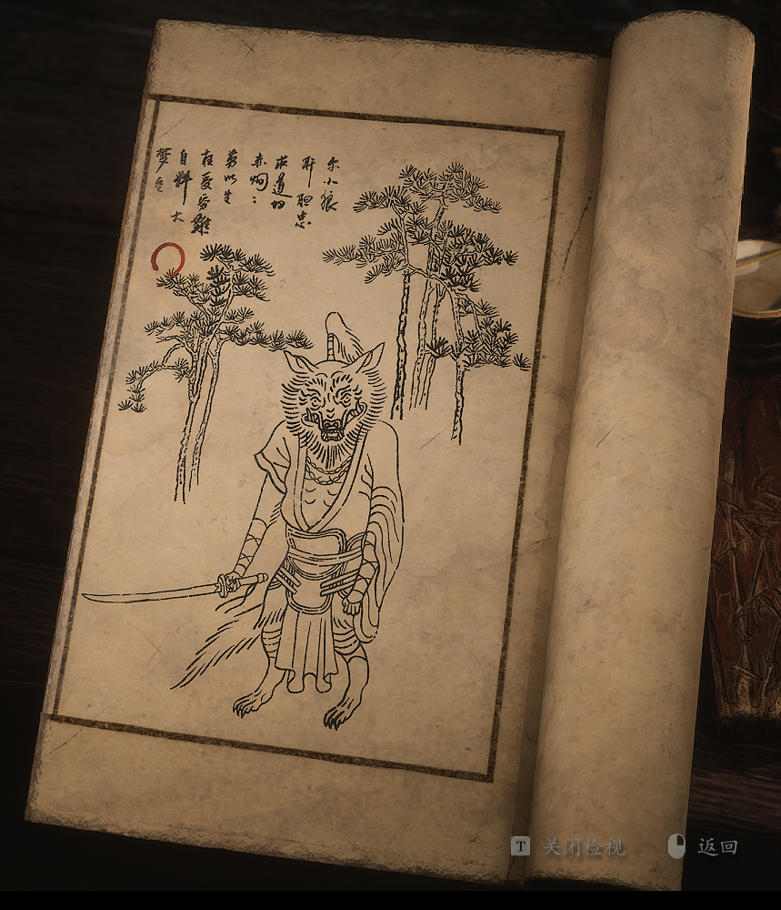

## 1.2 狼剑客

> 辁才(读音为‌**quán cái**‌，意思是小才；浅薄之才)无大义，泥滑着白衣。
>
> 度势站而起，鸡犬升云梯。

巡山的白袍狼从过山者身上缴获了一柄宝剑。那剑，鞘缀宝石，锋刃雪亮，一看就十分贵重。白袍狼很是喜爱，便将这剑插在腰间，耍了好些威风。时至上缴贡品之日，白袍狼故意将剑藏了起来，其他小妖得知后，劝道：“你不将好东西呈给大王，日后如何得他赏识，难道想巡一辈子山不成？”

白袍狼笑道：“大王如何少得了宝贝，这剑我们看着稀奇，他才看不上眼哩。倒是你们，成日送些破铜烂铁，还想凭此博得大王青睐，这才是痴人说梦。”

大家听罢，不以为意，只觉是他偷奸耍滑的托词，依旧勤勤恳恳。反观那白袍狼，每日有桃就吃，有酒就喝，好物件尽数留下自己受用。众人总道他必有受罚的一日，翘首以待。

这日，黑风大王在山中开了个道场讲经，说的是渡劫长生，起死复活。护法们散下符纸，大王让众人吃入肚里，其后开始诵经祈福。个把时辰后，大王问及是否有人感觉效验，众人你看我，我看你，唯有白袍狼率先起立，其后才有小妖陆续站起。次日，护法们传令，说大将白袍狼提拔成了校卫小统领。私下里，众妖百思不得其解，究竟是何原因，这白袍狼非但没遭贬斥，反而得到了升迁？

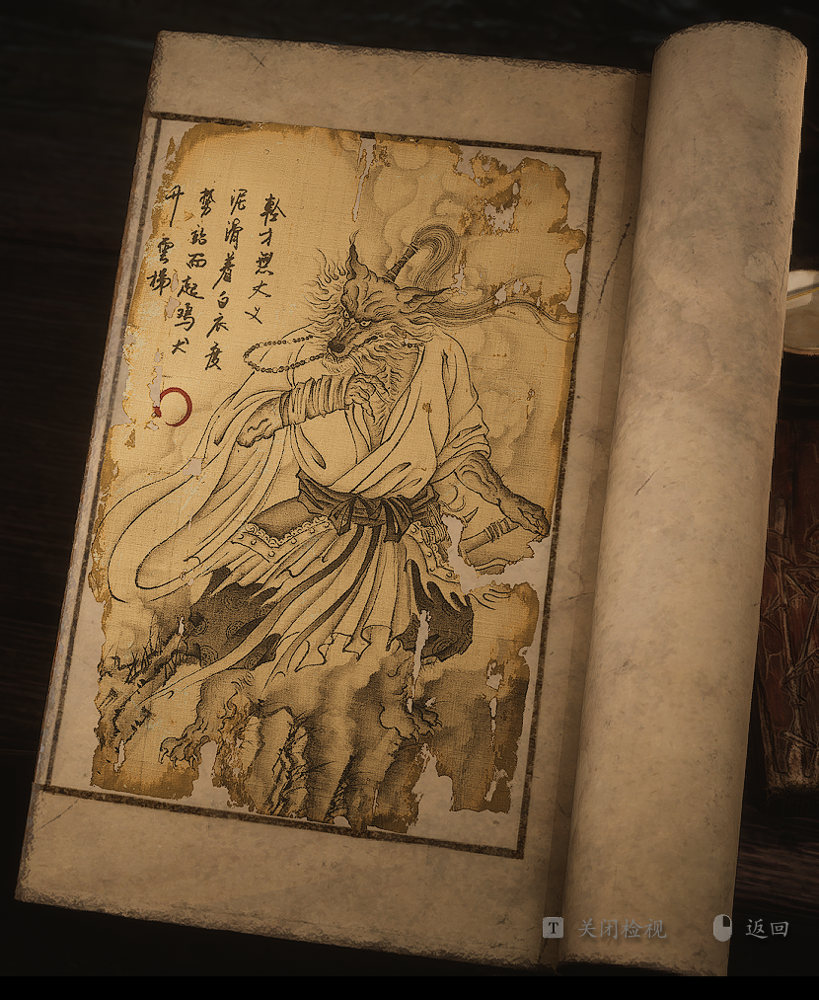

## 1.3 狼校卫

> 日日巡山岗，碌碌磨刀光。
>
> 匆匆千里外，夜夜尽望乡。

自黑熊精从南海归来，他总说得授菩萨秘法，学会了渡劫修行、起死复生的法门，许多妖魔听此传闻，便纷纷投来黑风山，跟在他门下修炼。却说新来的小妖，难免要从最下等的活儿干起，但为了得到大王赏识，他们都十分卖命。

这些妖魔中有只狼妖，最是勤劳肯干，他常常天不大亮就起床巡山，夜深时分还额外做活，但凡收得好物件，总是最先上贡。他成日忙碌，连结交同伴的时间也没有，大家对他也无甚印象，连名字都叫不出来。

兄长见他这般努力却毫无升迁迹象，便尽出积蓄，为他在黑风大王的道场，买了个听经的坐席。他坐在道场中，却不住叹息：自投来黑风山，家里已耗尽盘缠，兄长还浪费这种闲钱，好生可惜，若是给我换面盾该多好，指不定等我有了新换的刀，便可立下大功。

正思忖，就有身着黄袍的护法们向他散下些符纸来。那大王先命众人将符纸吃入肚里，再率众盘腿打坐，一起大声诵经，足足念了个把时辰才停下。大王提及有成效者可起立示意时，就见前方有一白袍狼率先站起，它满头大汗，喜不自胜，自称周身发热，此刻心明眼亮。

那狼妖暗想：众人挤在一室，如何不汗流浃背？诵经许久，如何不胸怀敞亮？

他疑惑不解，自己身后的青牛精也站了起来。其后，更多的妖，随着他俩陆陆续续起立。看大家如此，那狼妖犹豫着如何作为，好在大王挥挥手，众人又全坐下了。

其后，不少小妖被分赏了宝物，青牛精得到了金丹，白袍狼当上了外山的小统领。而那狼妖还是拿着旧盾破刀，勤勤恳恳地巡山，至今仍未得提拔哩。

## 1.4 狼力士

> 天不管，地不收，逍遥自在荡悠悠。
>
> 醉里还有乾坤大，醒来愁事一笔勾。

巡山的小妖们很少有机会参加洞内的宴饮，美酒佳肴都得靠自己寻，他们便经常化成人形，跑去镇上骗吃骗喝。一来二去，镇上的百姓发现了识破他们的方法，小妖们常常还未吃饱就被拿住，还得挨顿臭打，大家就渐渐不敢再去镇上了。

却说这群小妖中有只嗜酒的狼妖，这日他躺在树下躲懒，朦胧间，瞧见个身披鹤氅的老狼。

那老狼问道：“你不巡山，躺着怎的？” 狼妖道：“我想去镇上喝酒，但化形总被认出来，现在只能去梦里解馋了。” 老狼听后哈哈大笑，附耳密言道：“你寻到祠堂去，只需躲在帷幔中，将贡上的酒全喝掉即可。” 言罢，老狼身影一晃，杳然无踪也。

那狼妖半信半疑，但仍想尝试一番，急忙化形寻到镇上祠堂。他见里头果然挂着幢幢帷幔，遮蔽着一尊圣像，不知贡的是哪路神仙。贡桌上摆满珍馐美味，其中有几坛好酒。那狼妖依照老狼的话，悄悄钻入帷幔中，偷来酒坛豪饮而尽。几坛下肚，他打起酒嗝来，帷幔外的听到声响全都围拢过来。

那狼妖被困在帷幔中，进退不得。忽而，有人道：“我家贡的酒被喝掉了哩， 必定是神仙显灵！” 此话一出， 帷幔外来山呼海啸般的祈求声，纷纷念叨着神仙庇佑之类的话。

自那以后，十里八乡的人都来此处祈福，狼妖有了喝不尽的美酒。他终日痛饮，慢慢觉得这酒也不那么好喝了。而那些间或凄苦绝望、贪婪阴损的祈愿，让对此无能为力的他更加消沉。

这日，他只觉那贡酒味如苦水，再也无法忍耐，冲出帷幔，高高举起贡桌上的酒坛，在众人的惊叫声中将它砸了个稀碎。手起坛落，他猛然惊醒。原来他还躺在大树下，周围没有祠堂，没有香火，没有人群，他赶紧长吁一口气，拾起身边的长斧，急忙巡山去了。

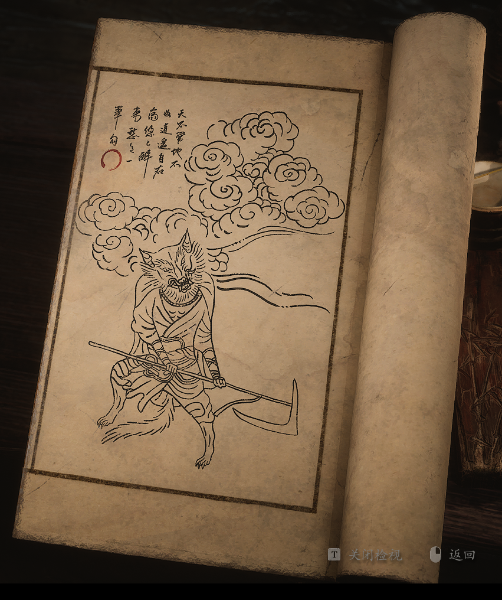

## 1.5 狼弓手

> 大狼胆儿小，弯弓躲岗哨。
>
> 百步穿杨柳，不进反作逃。

适逢母难日，黑风大王在禅院设宴，群妖皆至。席间，大王于崖边树梢上挂一彩头，言中者可得金丹作赏。众妖听后跃跃欲试，可惜崖边风大，许多人试了，都无中者。

席中有一老狼，非常善射。他为人谨慎，行事低调，不爱出风头，正窝在角落自饮自乐。几个好事的妖怪邀他一试，他都淡然拒绝了。可大家一再起哄，他无可奈何，只得去应付一下。

他年老干瘦，走路慢慢悠悠，许多小妖见后，都嘲笑他自不量力。老狼并不生气，只是怡然自得地搭弓，一箭即中，众妖哗然。

老狼得了赏赐，大家羡慕不已，纷纷来敬酒。有个喝醉的小妖叹道：“还是大王爽快，听闻凌虚子虽会炼丹，却不曾如此分赏手下，未免太小气了些。” 老狼听后，面色一沉，起身告辞了。一老妖提醒道：“他乃黑风山旧人，你怎可当面议论他从前的主人公？现下你闯祸了。”

小妖不以为然。翌日，老狼以金丹贵重为由，将其退回。众妖又劝小妖道歉讨饶，他依然不听。数日后，小妖外出，被数记暗箭射中，箭穿心，真个是连金丹也救不活了。

## 1.6 狼侍卫

> 长斧拄作拐，庞眉双鬓飞。
>
> 莫道桑榆晚，少学老始威。

昔年，狼侍卫们曾是老凌虚子的贴身随从。他们使得一手极好的长柄斧，在群妖中素负盛名。

自黑风大王从南海归来，重建山场，他便收留了许多从狮驼国流浪而来的狼妖。这让黑风山本处的狼妖们多有不服，黑熊精便许诺以救活老凌虚子为补偿，众狼妖只好暗自忍耐下来。未料，老凌虚子苏醒不过几日，就失了踪迹，再也无人见过他。黑熊精得知此事后，却并未追查，反让那狮驼国来的苍狼精，顶替了老凌虚子的坐席，并赐名为灵虚子。

此举激起了狼妖们的满腔义愤，接二连三发起了多次聚众声讨。不料，狼侍卫们却在黑熊精的授意下，将出头闹事的小妖们悉数拿了。灵虚子对着这些小妖凶性大发，要吞吃了他们。幸得刀狼教头广智急急赶来，这才护住了同类性命。

此后，在灵虚子的安排下，每队巡山的小妖们都以狼侍卫为伍长，小妖们自此再也不敢反抗灵虚子。

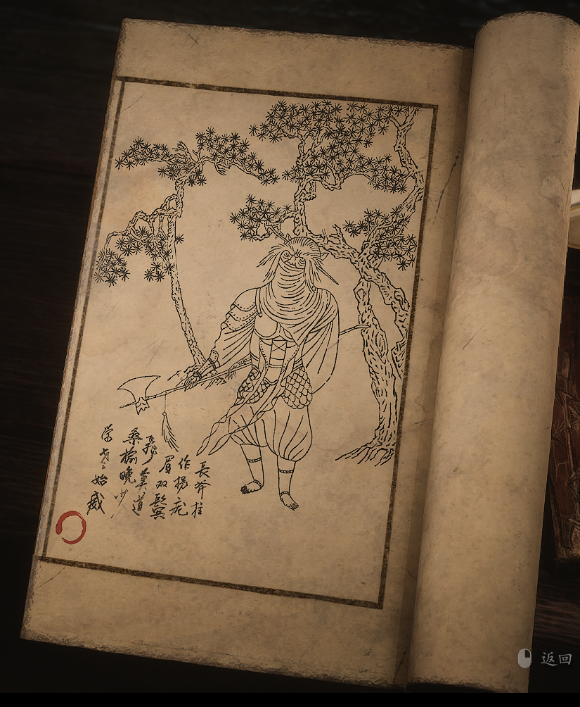

## 1.7 狼刺客

> 本性如山水，善意似草木。
>
> 草木生又灭， 山水岿而坚。

旧时，有只小狼随大苍狼学习捕猎，他聪明勤勉，却总也捉不到食物。这日，大苍狼下令让小狼独自觅食，否则就得挨饿。小狼返回山场，潜在暗处，不久就逮到了只兔子。不想，那小狼并未立刻扑食，反倒小翼翼地收敛着气力，帮兔子舔伤止血。

兔子见状，挣扎着逃脱了，小狼又疾奔去追。兔子慌不择路，跌入塘中，他扑腾着想游回岸上，却被追来的小狼一爪摁回水中。须臾，眼瞧兔子就要溺死，小狼又急急将其捞起，不断轻蹭他的脑袋，帮他缓过气来。兔子醒转，正不明所以，暗处忽传来大苍狼的呼嚎，小狼张皇失措，伸爪按住兔子，可用力太甚，只听咔嚓一响，抬爪再看，兔子已七窍喷红，死透了。

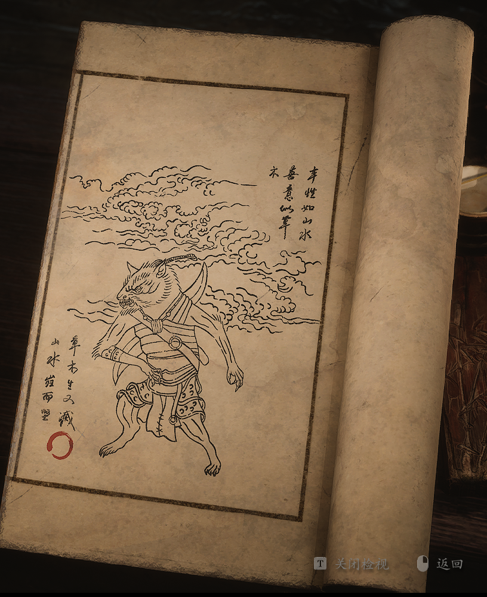

## 1.8 小呱呱

> 眼瞪爱取闹，耳鸣性聒噪。
>
> 形秽躯肉腥，夭亡作炭爆。

昔日，有两只青蛙一起在沼泽里修炼。小青蛙经常被别人欺负，大青蛙总替他出头。一来二去，他们很快就成了好友。一日，波里个浪想在青蛙中挑一只做妖校，大家都想争取这个机会。一番比较下来，强壮的大青蛙，和机警的小青蛙成了最终的候选者。众青蛙虽不服气，但都不敢声张。

这日，大、小青蛙负责执守波里个浪的洞府，有个琥珀杯无故碎了，查不出何人所为。众青蛙不依不饶，聒聒噪噪，非要他俩负责。大青蛙争吵不过，便与他们打了起来，众青蛙就说他是恼羞成怒，肯定是他打碎的。小青蛙站在一旁，缄口不言，大青蛙就责怪他不为自已辩解，进而怀疑起小青蛙。

小青蛙犹豫片刻，承认琥珀杯正是自己打碎的。众青蛙却不买账，说他们一个蓄意胡为，一个玩忽职守，都要偿命。小青蛙越听越急，忍不住和他们吵了起来。他们吵得越越来越大声，肚子鼓得越来越高，忽然，有几个的肚皮被撑破，炸裂开来。血肉溅了众妖满头满脸，最后没一个干净的。

## 1.9 鸦香客

> 卦知天下事，终难善其身。
>
> 以为安稳处，因缘乱纷纷。

相传，庙宇之中群聚的乌鸦，因终日听经闻法，能生灵性，可卜吉凶。于是，有些自称鸦香客的卦师，爱在寺庙门前支摊，以乌鸦叼签来卖卦。他们的卦摊上总点着象征寺庙的檀香，说自己的乌鸦正是庙中通灵的老鸦。

有位鸦香客，他的乌鸦是自幼驯养的，能用特制的卦签与之交流。每日，他令乌鸦飞到城中各处窥看人们生活，待香客来求签时，便借助卦签向鸦群们打探消息。他将这些消息，混着自己对人事的了解真假参半，罗织预言，倒也颇能唬人。

一日，有位官员以重金求卦，鸦香客言他官运亨通，必能位极人臣。未料，官员当年非但未升，反降了一级。官员怒不可遏，率家丁前来问罪。鸦香客又以乌鸦窥看的消息解释，说是官员没花足够的钱修缮祠堂，糊弄而过。官员竞深信其能，将鸦香客引荐给了同僚们。

鸦香客凭此攒下了许多钱财，可他知悉了官员们太多秘辛，深恐自己性命难保，遂决定换个谋生之法。这日，他欲将乌鸦们悉数驱散，而乌鸦们却不肯离去。鸦香客便对乌鸦使尽各种手段，欲除之而后快。乌鸦们忍无可忍，奋起而攻之，将其啄食而亡。

其后，乌鸦们变化身形，穿上卖卦人的衣服，也称自己鸦香客，持着香炉，在庙宇四周继续叼签卖卦，装神弄鬼，哄骗世人。

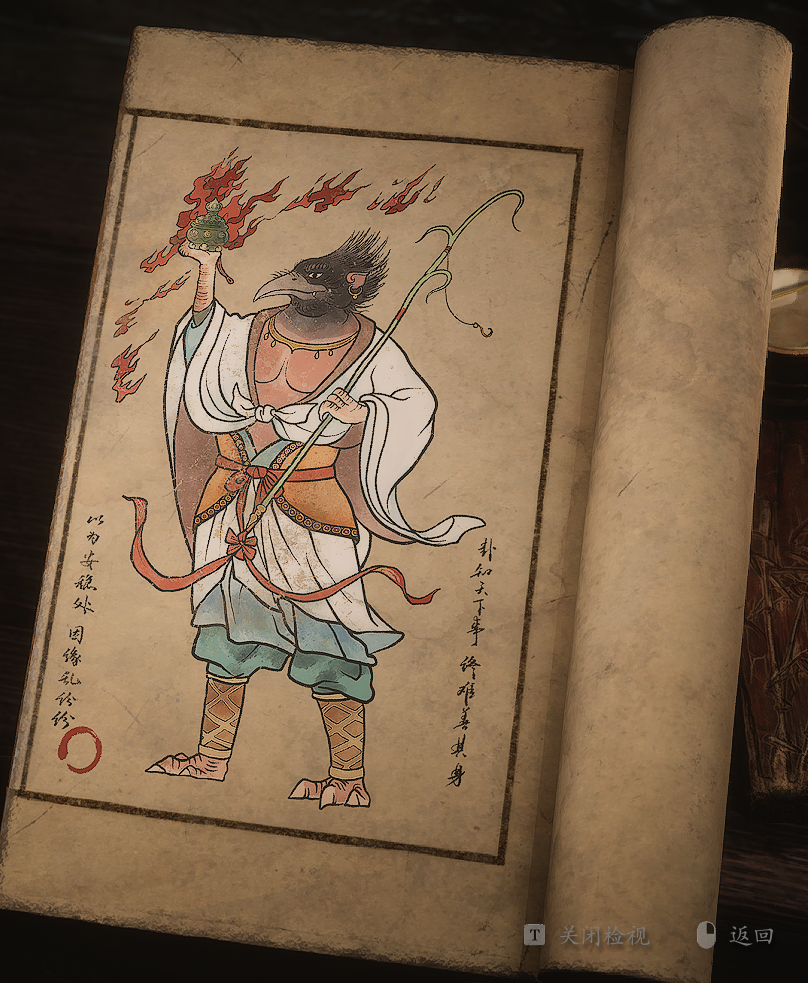

## 1.10 山匪头子

> 浮生多困窘，劫尘皆寒穷。
>
> 夙仇报不平，殊途道相同。

昔年，镇上有个青年乃是武行教头之子。因父亲嗜酒，醉后误事，进了大牢，只剩他与母亲相依为命。眼看家道日益艰难，为了养家糊口，青年什么活计都肯做。村人知道后，都称赞他侍奉寡母，是个孝子。

适逢荒年，母子二人去投奔亲戚，不想半路上却杀出一伙山匪。这些人鹰视狼顾脸上带疤，手舞大刀叉叉比划，不言其他，只管要钱。他们哪里有钱，只好磕头求饶。山匪哪里肯放，只管打杀。青年以为活不成了，便抢下大刀，眼一闭，心一横，竟斩了母亲向贼寇投诚。至此，他也落草，当起了山匪。事情传出去，人们又都骂他苟且偷生，是个孽子。

几年过后，神秘的事情发生了，那伙山匪竟一夜之间被灭口。有人说，是来了个好汉除暴安良，替天行道。也有人说，是山里又生了妖怪，害了贼人的性命，报应不爽。大家争来吵去没个定论，慢慢就将此事抛到了脑后。直到这天，有人满身是血地从山里逃回来，说遇见一个高壮匪徒，非人非妖，持一口大刀拦路劫道，面相倒有几分像那孽子，嘴里却说要帮世人解脱。

## 1.11 骨嶙峋

> 黄土黄土，尘泥销骨。枉死秀士，其心何苦。
>
> 乘风岚兮，施于中谷。覆载灵蕴，化生异物。

翠屏村有个青年，父母早亡，贫苦无依，乡邻都欺负他。

这日，村中猎户在山里发现个怪洞，不知深浅，时时传出怪响，非常骇人。乡勇们不敢擅入，便把青年搡了进去。因那洞中无光，青年看不明道路，脚下踩空，从个断崖跌落，发出几声惨叫。众人听见那叫喊，以为洞里果真藏着厉害的妖魔，竟撇下青年，全都逃走了。

青年坐在崖底哀哀地大哭，忽而听见些骨头折断之声，竈竈宰(zào zǎi)宰，接连不停地响起。青年吓得赶紧闭嘴，却听黑暗里传来一道足音，不断向自己靠近。青年心下惊惧，大喝道：“你别过来！我无父无母，命苦肉酸，吃我无益。” 不想，他一语道完，那足音真就停下了。

久之，青年对峙着黑暗，饿得头晕眼花，绝望道：“没人会来搭救我，你快吃掉我吧，让我死得痛快些。” 待他说完，足音果真又响了起来，慢慢靠向青年。青年自认必死无疑，万念俱灰，不想却是团布料抚到他的脸上。他伸手去拉，发现是支衣袖，便赶紧拽住。那衣袖拉着青年站起，带着他在黑暗中摸索前行，良久，终于找到了洞口。待天光照见眼前，青年才发现自己竟是被一条骷髅蛇怪引着，立时张皇无措。那怪见状，脖子倏然伸长，长颈横扫，将他抛出洞外。后来，青年被路过的商队救起，跟着他们离开了村庄，生活也越来越好。

俗语谓：祸兮福之所倚，福兮祸之所存。虽然不能尽信，但世事发展到极点总会带来变化，变化就会带来机遇，走过最低谷，就是通达的道路。

## 1.12 蛇巡司

> 起蛰看天时，草里难寻迹。
>
> 身细吞巨象，伤人药无医。

哈必国有个小城，依山而建，因丰草长林，蛇虫极多，累得城中也蛇患不断。

却说这城里住着个捕蛇人，手艺精妙，替城中百姓杀过许多蛇。他虽因此挣了不少银钱，但从不显摆，反而常常施粥打醮，替城中百姓祈福。大家都敬重他是个好汉，县令便特地嘉奖了他一套宅子，让他全家搬来城内居住。

这日，有个衣衫褴褛的疯和尚来他家化缘，捕蛇人的妻子便送了疯和尚衣裳和饭食。那和尚犹嫌不够，还要讨酒来喝。大家都骂他不知自重，嚷嚷不停。恰巧此时捕蛇人回家，他止住众人的叫骂，让妻子给和尚送来一葫芦酒。

和尚很感动，劝诚道：“你家中有蛇妖作祟，若置之不理，你一家老小都得死。”

捕蛇人不以为意，只道他是疯言疯语，赶紧打发他走了。可捕蛇人的妻子对和尚的话十分在意，她多次规劝丈夫寻一寻家中的蛇妖，但捕蛇人都不予以理会。妇人只好又找来了疯和尚，替家中降妖。那和尚果然十分厉害，用生肉和铁钩，在捕蛇人家中钓出了条巨蛇。那蛇立起有一人多高，显然早已修成了气候。

和尚指着蛇道：“它已化出四足，口涎有剧毒，只要碰上一点就能将人毒死。” 言罢，他便替妇人将蛇妖斩除了。说来也怪，自疯和尚将那蛇妖除去后，城中再也没闹过蛇患。

## 1.13 小菌君

> 山家微雨后，生机恰自来。
>
> 陋室以德馨，山精亦感怀。

乌斯藏地界内，有户人家，男人死得早，留下孤儿寡母艰难度日。寡妇常去村口卖烧饼贴补家用，女孩便拾柴推磨，烧水做饭，为母分忧。

连日雨水多，柴房年久失修，梁柱朽坏，屋顶塌将下来。女孩拾柴回家，发现塌下的屋顶上，长着一株晶莹的野菌。它色彩斑斓，伞盖好似一个小碗，新鲜的水滴在期间滚动，闪闪放光，好生可爱。女孩不忍心采摘，就用茅草小心将它掩起，让它好好继续生长。

女孩活计多，没时间玩耍，就常常跑去柴房将心事都说与野菌，好似把它当成了密友。

寡妇积劳成疾，急需药钱，娘儿俩商量一番，决意卖掉房舍。比邻而居的人家，原与寡妇的亡夫关系要好，如今发家致富，正想买下隔壁的房舍。

可这家人十分小气，便想趁着寡妇重病，把价钱压下来。他们捏造各种谣言，唬走那些有意出钱的人，欺负孤儿寡母无依无靠。

女孩十分着急，经常躲在柴房里哭泣。野菌将她的委屈全瞧在了眼里。

翌日，邻家就发生了怪事，他们的房舍一夜之间生出了许多菌菇。邻家命仆从强行采摘，众人这才发现，主屋的房梁上，竟有个一尺来高的大蘑菇，青不青，黄不黄，颜色奇诡。

大家拿着长柄镰刀要铲除那蘑菇，却见它往空中一耸，打开渔网般的伞盖，飘在空中。他将身一抖，扑在邻家男主人身上，将他一下砸死。空中又散出许多菌丝飞射到众人的身。上，将他们打倒在地。

其后，菌菇们爬出地面变成了许多精怪，帮着母女俩搬箱提笼离开了村里，往山中而去，谁也不知道他们去了哪里。

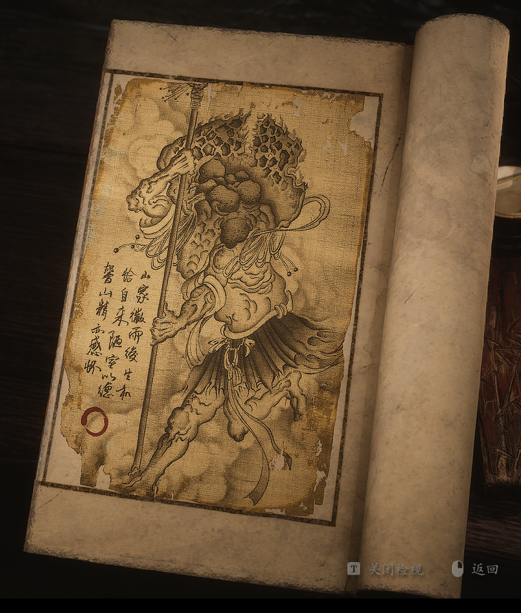

## 1.14 小人参精

> 灵苗赋异禀，自启出泥土。
>
> 须髯作手足，根身分肩股。
>
> 安神强精魄，滋养入虚补。
>
> 准采三两根，贪多必受苦。

古籍载，长服人参可延年益寿，所以世人多爱吃人参，尤其是老参。有学者不以为然，认为人参半毒半补，只因生来便是人形，才被如此青睐。但无论如何，采参为生者，始终大有人在。

深谷之中的人参小辈，尤其害怕听到一种足音。这声音乃是采参人特制的山履，踏在老林子落满厚厚积叶泥石上时，发出的甚为恶心可怖的脚步声。声音每每响起，小人参的兄弟姐妹们就会逐个消失。独剩他们，总因个头太小而躲过一劫。可即便如此，大部分的梢头仍被拴了一段红绳。采参人要压住它们，指不定哪日长成后，再来挖走。

不觉时光飞逝，这日，又有熟悉的足音响起，掐指细算，大概是前人的曾孙辈了吧。那脚步轻快匆忙，想是已然瞧见了熟悉的红绳。可真是晦气！采参人摸到的这截红绳，竟拴于一副骸骨之上。他正要骂两声，背后却有泥土声响。只见一个巨大的精怪掘地而出，吓得他拔腿就跑，边跑还不忘大喊：“吃人啦!妖怪吃人啦！”

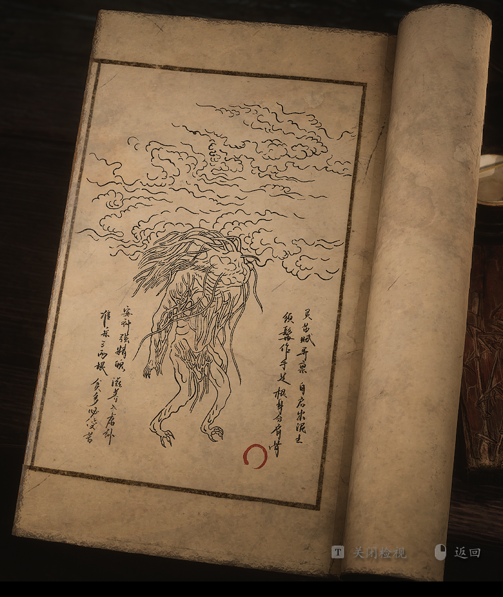

## 1.15 鼠弩手

> 劲旅弩雕龙，声裂响惊鸿。
>
> 出征见善射，定计知能功。

平定蝜蠍时，斯哈哩国曾组建过一支四羽军。他们都是优秀的弩手，用的是连发数箭的龙骨连弩，和扎穿铁板的四羽大笥。弩手们拿到兵器时非常振奋，认为平日苦练的技艺加上如此利器，两相加持，必可一战告捷。

是夜，众人围坐，讨论制敌战术。老练者道：“射其眼，目不能视，那虫就打人不着了。” 年轻者道：“射其心，断气绝脉，直取大虫性命。” 勇猛者道：“射其腿，无法行动，只能原地等死。” 争执许久，众人都无法说服彼此，最后决定各凭已见，战场上一绝胜负。

次日大战，四羽军整齐列队，一声令下，箭落如雨。可惜大家各自瞄准，未有一支箭能与另一支射准同一位置。那蝜蠟虫甲极厚，一阵箭雨未伤他分毫，只如挠挠痒般，众将士大败而归。

咦，虽说志不同己，不必强合，但一己之力终有限度。天下大事，心齐则无有不胜，心散则自取其败也。

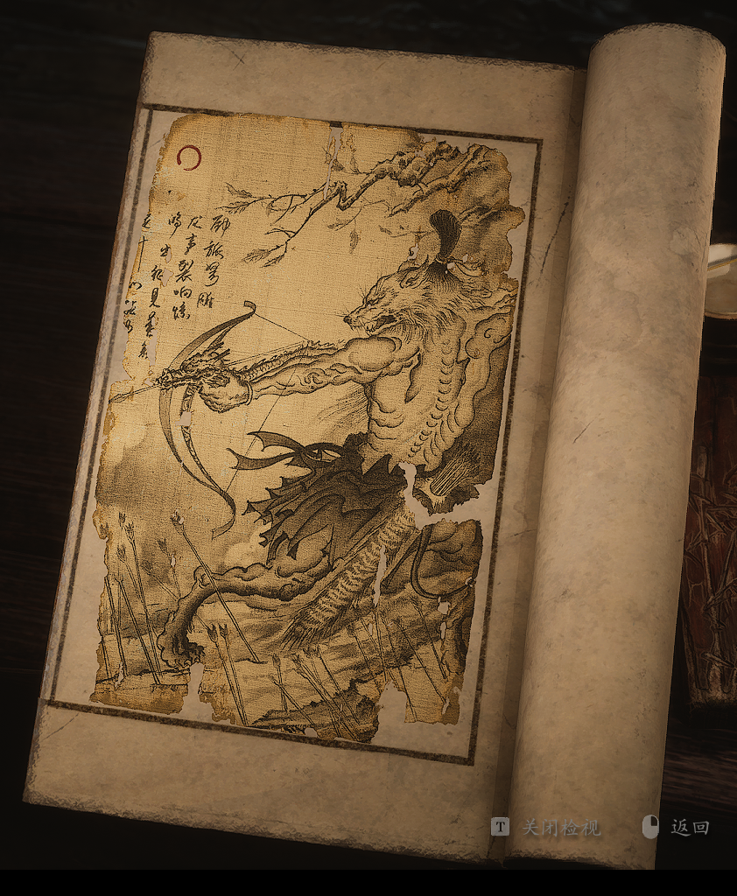

## 1.16 鼠校卫

> 金戈配甲衣，飘带随缨旗。
>
> 胡笳叠战鼓，盾牌增胆气。

沙门村中有个寡妇，其夫为虎先锋所啖，尸骨无存，仅遗一面沙王盾，是昔日国王所赐。所幸，寡妇平安诞下一窝遗腹子，家中尚未断根。孩子们逐渐长大，寡妇便指着盾牌道：“你们若日后不能屠虎，就不是我家中儿郎。” 于是，孩子们天天跟着沙二郎勤奋习武，期望能早日杀掉虎先锋替父报仇。

诸多孩子中，独独有个身体怯弱，不擅习武，整日只爱捣腾些文墨，寡妇便时时逼迫打骂他。他也曾试过几次，奈何手上无力，腿下无肌，一招半式练上月余，也毫无进展。连沙二郎都劝他换门生路，于是他就更不愿习武了。

眼看家中的兄弟们，各个都当上了校卫，着红甲，持金盾，只有他，毫无着落，母亲打骂得更勤了。一次，妇人出口失了分寸，骂道：“你便葬身虎腹，也强似在家做个废物。” 他不堪激迫，偷拿了亡父的盾牌，提了杆尖枪要去送死。那虎先锋才出了两招，就将其掀翻在地张开血口，要拿小鼠妖充饥。

恰在此时，远处飞来几块砖石，打在那老虎的头上。虎先锋一个怔愣，便觉爪下一松，有好几只老鼠，拉着他的“口粮”逃跑了。虎先锋正欲去追，却见平日从不走出沙岗的鼠校卫们，挺着长枪，举起盾阵，一副鱼死网破的架势，竟放这群老鼠走了。

后来，那小鼠妖的确换了门生路，它跟着鼠弩手们学起了射箭。许是它头脑好，弩射得极准，还凭此救过兄弟们的性命，也算是报恩了。

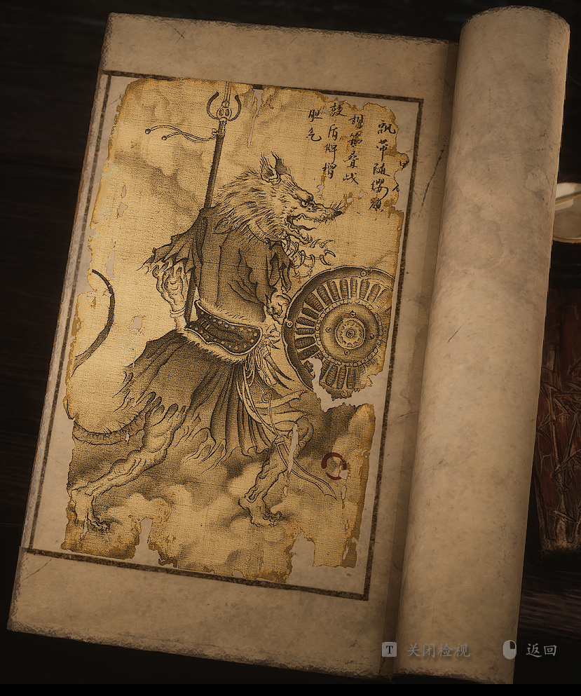

## 1.17 鼠司空

> 袖占避血光，塞听躲灾殃。
>
> 甘尽尤未晓，硕鼠满盈仓。

斯哈哩国更名元年，国王颁布“敬鼠令”，举国上下，以“鼠”为天佑之物，不可扑杀，违者监押，国王亲审。此令一出，方圆百里的鼠妖，俱往流沙国迁徙。其时，百姓与群妖混住，多有不谐之事，但惧怕国王法令，只得暗自忍耐。是时，翰林院学士们发起联名上书，谏言国王修改法令，将鼠妖迁居城西南角安置，让百姓能够得享太平。

翰林院有一老学究，深谙占卜之道，在百臣联名上书之日，就前程袖占一课，卦象极凶，便悄声告知自己两名年轻的下属，今日非黄道吉日，不宜上书，让他们随自己一同告病回家。 年轻子弟不以为意，正是热血沸腾之时，慷慨而去。

待老学究刚刚步出皇庭，就见御林军围了大殿，里头喊声无数，料是一片血雨腥风。老学究只是颤悠悠地捂住双耳，缓缓朝家而去。其后三天，王不早朝，群官调职，他抬封司空，位及一品，风光无两。又过了几年，日他面观铜镜，只见鼻子变得又长又尖，其旁生着粗而韧的须子。后来他连镜子也不照了，但他明白，自己和剩下的人一样，都顶着一张老鼠的脸庞。

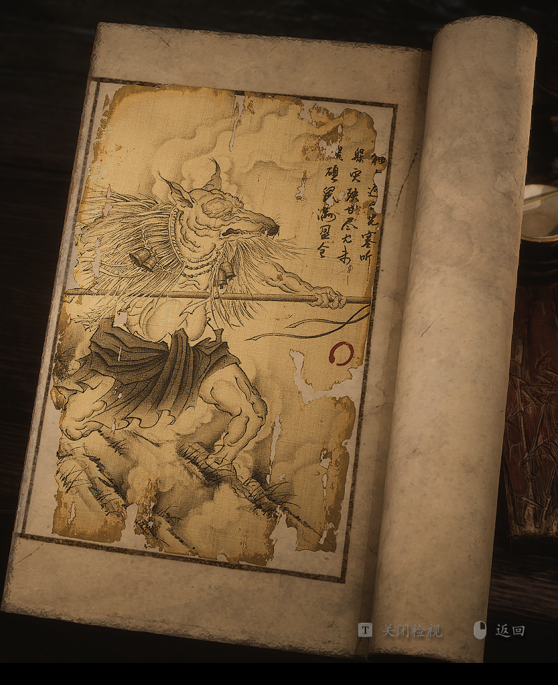

## 1.18 鼠都尉

> 相貌生得怪，肩顶俩脑袋。
>
> 君恩如可报，心思终不改。

朱紫国有个妇人，诞下个双头孩儿，举城惊骇。

众人皆叹妇人与孩子命途多舛，预言这孩子必是难以养活。不想这孩子出了周岁，非但未死，反比平常孩童健壮安康。众人又叹，这孩子虽能养大，但必是个傻子。可孩子长大，脑袋很是灵光，因有双头，反比常人多出一番奇思妙想。

两次落空，众人很不开心，他们又说，这孩子不祥，日后必有大灾祸.....翻来覆去，流言从不断绝，双头少年索性离开了故乡。又过了十几年，一日，有身负石雕佛头的虫妖，袭击了斯哈哩国的边城，国王派大军抵御，却屡战屡败。军心霎时乱作一团，不少人生了撤退之
心。唯有军中身材高大的双头怪人请求领一队精兵，突袭妖怪。

是日，他在阵上命精兵一字排开，妖怪来袭，便将煤灰撒在它身上，其后以烈酒喷出火柱，引爆煤灰。那虫妖怕火，经此一战，急忙潜回沙海中去了。

见这招能暂时击退虫妖，沙国王大感欣慰，封了双头怪人当了都尉。得知他的孩子也是双头，便让他家世袭都尉一职，鼓励都来投军，壮大军队。真不知听闻这等消息，他家乡的村民会如何作想。

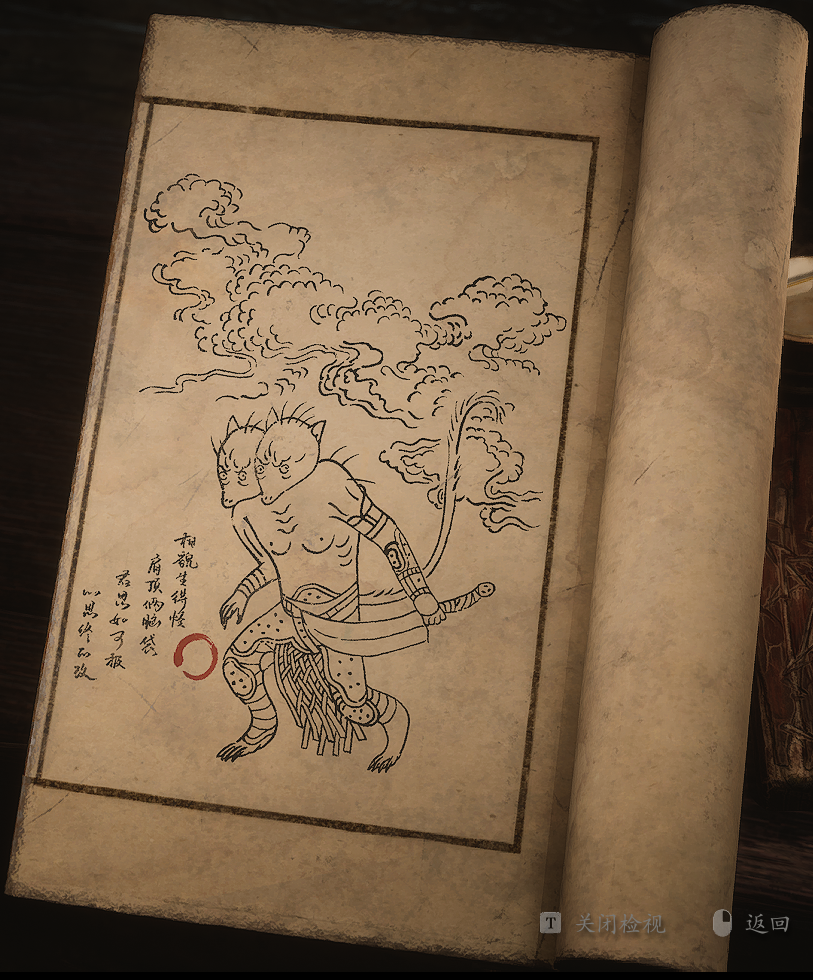

## 1.19 鼠禁卫

> 阴胜失元阳，赤锦镰钩亮。
>
> 一朝祸心起，人言亦杀场。

自黄风大圣入谷闭关，他便将积蓄的家当全都交给亲信们看守。这日，库房里丢失了一只紫金铜炉，原也不是大事，但这些年库房已丢失了大半物件，流言蜚语越传越凶，大家都说是总管库房的鼠妖监守自盗，把座金山都要搬空了。

事情沸沸扬扬传到了鼠禁卫的耳朵里，他们身着红袍，是黄风大圣的专属暗卫。他们原是想着找总管分一杯羹，不想鼠总管大觉屈辱，一脖子吊死在了牢里。

众妖听说鼠总管死了，便又流传起鼠禁卫冤枉好人，屈打成招的闲言碎语。鼠禁卫们百口莫辩，只得仔细调查，自证清白，好在他们在鼠总管徒弟的窝里找到了紫金铜炉，众妖得到风讯，又开始骂小鼠妖，见利忘义，贪财害命。

小鼠妖被禁卫们收押，他却说出了更多的故事，原来紫金铜炉是狸侍长偷去，孝敬虎先锋了，他得知鼠总管被冤枉，才冒着风险偷回来的。鼠禁卫详查，果如其言，一时称赞声又盖过了谩骂。可没过两天，不知谁又说起，那偷东西的狸侍长有个老母，不知犯了什么罪过，被虎先锋关在卧虎寺的地牢中，狸侍长是为了用铜炉救母，这才做了错事，众妖又议论不绝。

咦，事情的真相究竟如何？人们往往背地里做一件事，却坦然地将其说成另一件事。这或许是因为从不同的角度来辩解，事情总能说出不同的真相。而当某种真相被置于大众眼里时，往往是因为有人不愿让他们看到更多的真相。

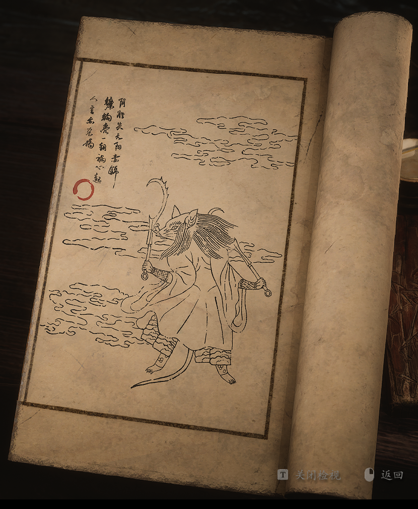

## 1.20 石磷磷

> 奇人赐道行，石头作伴当。
>
> 磐磐性烈刚，招之把命丧。

从前有个爱捏酸的文人，非常中意自己收藏的镇纸，每当家中会客，必要拿出来显摆。客人们都说，这镇纸石材普通，着实看不出有什么稀奇。文人听后，只好讲出了一段奇特的往事。

文人年轻时酷爱游历。一次他赶路十分辛苦，便寻了块大石靠着休息，不觉就睡了过去。酣睡间，他忽觉石头动了动，于是赶紧睁开眼。只见那石头上坑坑洼洼现出许多骷髅，而后奋力站了起来，石下生出双腿，和活人无甚差别。 他心中骇然，知道此石不善，便拼命逃走。不知跑了多远，来到一个荒僻山谷，远远瞧见有个干瘦和尚，正盘腿于层岩之上打坐。文人大感诡异，转身又想跑，可身后的石精却追了上来。眼看就要遭殃，那和尚端坐的岩石竟站了起来，比之追来的石精还多出两条手臂，哐哐几下，便将前者砸得稀烂。这镇纸，正是它们打架时留下的残块。

客人们听后纷纷大笑，嘲弄文人以梦为真，杜撰了个故事唬人。文人很不服气，但被笑久了，他也开始怀疑起真假，渐渐地便不爱看那镇纸了。又过了一段时间，他将镇纸束之高阁，再也没拿出来过。

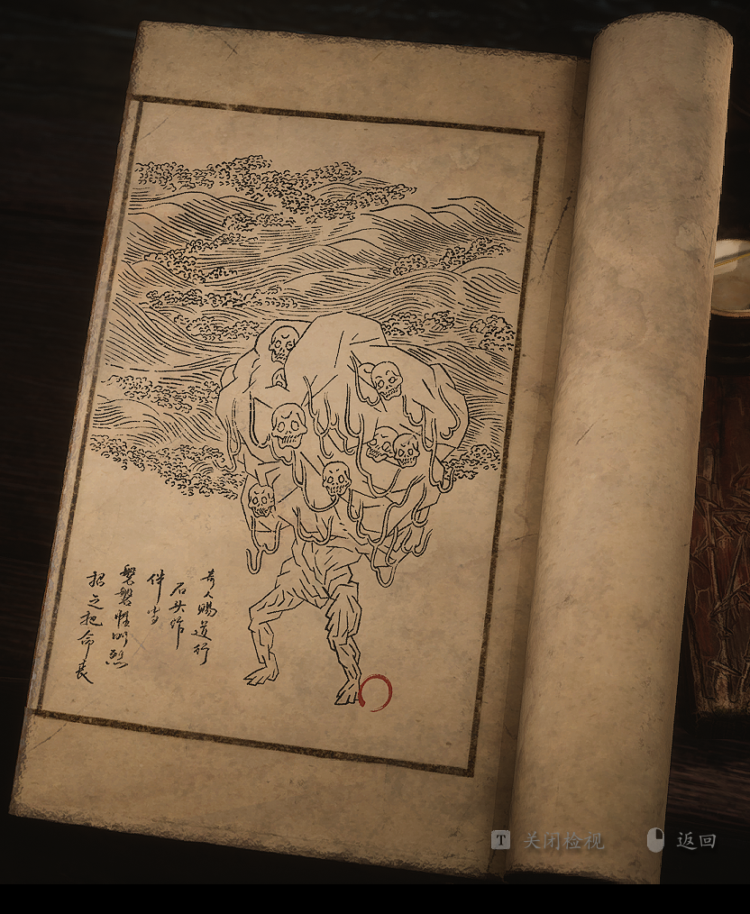

## 1.21 石苍苍

> 躯壳土高积，内藏雪晶莹。
>
> 仙材与善人，天道甚分明。

哈吣国的国王垂垂老矣，他很害怕自己寿数无多，便急着四处寻找延寿的仙方。

一日，有个方士告诉国王，长期服用石英可以长生不老。国王知道后立刻贴出榜文，命人四处寻找石英。不少采石人为了获得重赏，深入黄风岭的荒漠，他们在那里见到了一种石精，在他巨大的脑袋里，露出了晶莹的白矿，正是石英。

国王得知消息，即刻命太子带着军队去开采。不想，当大军来到山中，只觉黄风迷道，尘云变幻。而那些石精们更是危险谗狡，它们时常埋伏在土中，当有人靠近，就成群窜出来，左右夹击。大军尚未开采到石英，已经损兵折将。太子派人送千里急信到都城，向父王阐述此行的凶险，以及将士们所受的磨难，希望父王收回成命，可老国王却下旨，让他们继续开采。

当太子九死一生，带着足量的石英返回国都，随他出行的大军也已伤亡过半。是夜，太子乘着将石英送往老国王的寝殿之机，发动了兵变，老国王抱着心心念念的长寿秘药，被儿子刺死在了龙床之上。

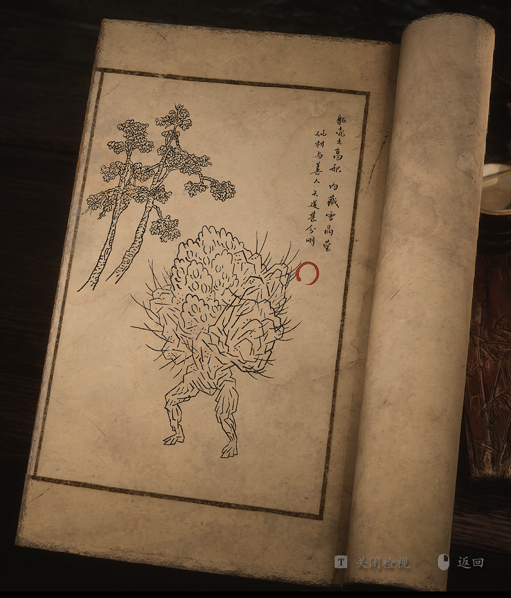

## 1.22 石双双

> 机敏更奇强，玲珑体轻量。
>
> 素艳非浊骨，傲如青女霜。

石母乃是由青石英修成的一个女体，在得到石之精魄前，她并非如今这般模样。

她的青石英有吸收月华的能力，经过长久的凝炼，她比其他石精先一步得道，封做了山神。

却说，自那佛头石怪出现后，石精们一番商量，想将石怪赶出山间，便来请山神一同作战。石母并未答应，若是她的石英被打碎了可怎生是好？直至那日，她眼见众石精要落败，终是忍耐不住要入场相帮。她见石苍苍曾将身上的石英，向箭一般喷出去偷袭那石怪，虽是心下舍不得，也效仿去做了。

竭尽全力，他们仍被打得节节败退。石母身上的青石英也被一拳打碎，她坐倒在地十分难过。斯时，黄毛貂鼠领群妖前来相助。那貂鼠见石母这般萎顿，道：“碎了的注定回不来了，若还放走了那石怪，岂非更亏？” 听罢此言，石母愤而站起，终是协助貂鼠一众将那佛头石怪制服，黄毛貂鼠将石之精魄赠给她作为补偿。

其后，石母因那精魄有了大神通，身体变得不善行走，她就用青石英仿照自己当年的模样，化生出了石双双，让她们替自己观察山里的情况。她或是为了再看看自己， 昔年的模样罢。

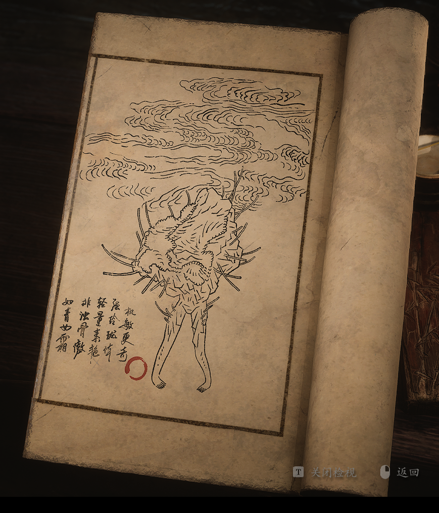

## 1.23 骨灵精

> 白骨遗荒岗，皮肉俱枯桑。
>
> 游魂忘姓氏，何处是吾乡？

黄风岭大风不止，朝夕吹刮，坟冢被神风摧毁，尸骨裸露在外，此乃常事。

这日，有个外来的商人，身负要事，急需穿过山岭。乡民们都说岭中妖魔横行，凶险万分，没人愿意给他带路。商人只好独自过山，才走了半日，就精疲力竭，颓丧地坐在道旁歇脚。

他发现周围的枯草中掩着一副尸骸，身躯残破不堪。商人触景伤情，叹道：“你为何死在这里，是被盗匪所杀吗？还是和我一样，活不下去，所以自我了断了？你现在曝尸荒野，家人若知道，一定很难过罢。” 说完，商人解下包袱，边哭边掘土，想将尸骸掩埋。

正忙间，那尸骸倏忽坐起，唬得商人跌在地上，连连后爬。那尸骸用双手撑地，挪移到商人跟前，将商人的包袱递了过来。商人捡起包袱，赶紧走了。可那尸骸却一直不远不近地跟着，二人走了许久，倒也相安无事。商人渐渐放下戒备，他见尸骸皮肉枯桑，心生怜悯，便将内衫褪下，给尸骸披上，帮他遮蔽遮蔽风沙。

此后，他们结伴而行，每每有怪声响起，尸骸就牵着商人躲到石后。商人偷眼去看，果有妖邪从附近路过。如此这般走了几日，商人终于穿过山岭，踏上了官道。尸骸停在山脚，不再前行。商人很感谢它，表示愿意替它送尸还乡，可尸骸呆立了片刻，转身又走回了漫天风沙里，也许它已忘了自己来自何方。

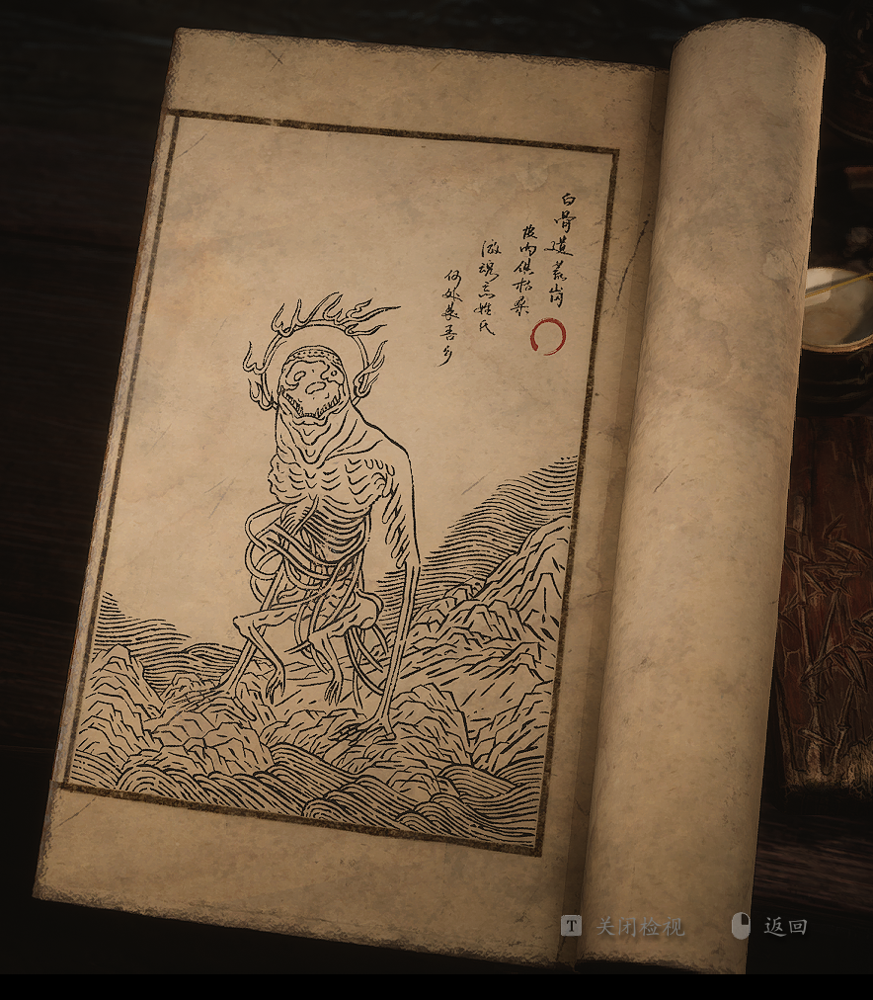

## 1.24 骨悚然

> 人情无寒署，世道不识途。
>
> 枪头凝盛气，盾后冷傲骨。

定风庄的大巫们，都是骄傲的战士。他们总爱拿着画有虎神的盾牌，舞着月牙形的长枪，呼呼喝喝，吓退鬼怪。尤其在送葬时，他们敲击着盾牌，走在最前方，自称开路将军。

大巫们享有极高的地位，就连小妖们也时时贡上山珍野味，以保平安，不被驱逐。

这日，有庄民发现山中多了不少妖怪，便去找大巫商量，大巫们不屑地说：“妖怪和我们住在同一个山间，难免撞见彼此。他们既然上贡作保，那就饶过他们罢。”

又过了几年，山中忽而刮起怪风，吹续不断，原本安分的众妖也纷纷猖狂起来，常常生事。大巫们穿戴齐整，举着盾牌，直冲庄外，与闹事的妖怪们战做一团。

可妖怪居然不惧怕他们，大巫们一向引以为豪的长枪盾牌，只能阻退几个小妖，很快就被围困了起来。为首的红袍鼠妖奸笑道：“因为菩萨在山中修行，所以先前特意给了你们几分薄面，你们区区凡人，该不会真以为自己有本事打妖怪吧？”

庄民见大巫们根本无法退敌，反引得群妖愤怒，急急锁了庄门，要求大巫退散鬼怪后再回来。

这些大巫最后战死在了山中，现在仍保持着打斗的姿态，四处寻人晦气哩。

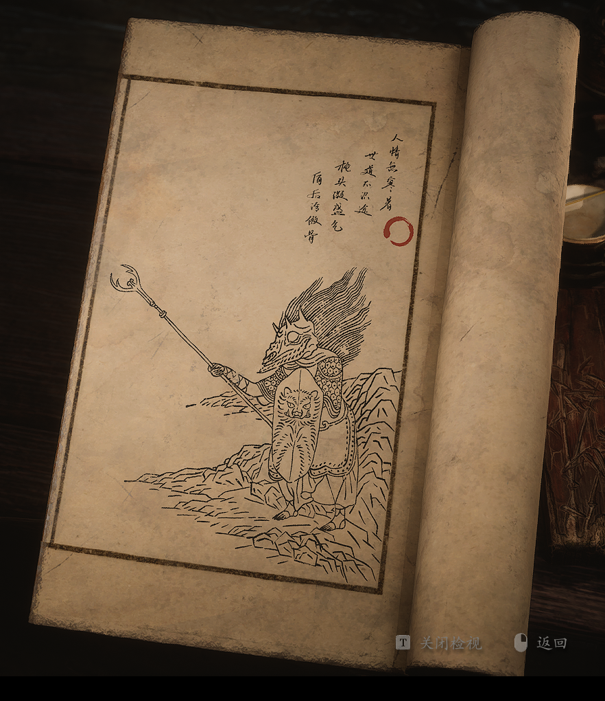

## 1.25 疾蝠

> 隐逸鼠中仙，藏幽绝烦喧。
>
> 色素飞无声，饮血黄风前。

这年秋收后，庄头来村中收租。村民把村头那栋空置许久的大屋收拾出来，腾给庄头暂住，并为他置办了丰盛的筵席，洗尘接风。酒足饭饱后，村长对庄头坦言道：“田租实在太高了，能不能减少一些。” 庄头道：“田租是你们与主家定的，我既拿了月俸，只管来向你们要债。你与我商量此事，我也没有办法呀。”

大家争来吵去，谈不出个结果，眼看天色渐晚，便都草草告辞，走在最后的老鳏夫对庄头道：“小村鄙陋， 没什么好消遣的地方，倒是后山亭，是个赏月的好去处。庄头若是烦闷，可以去那处散散心。”  言罢，这才告辞离去。

是夜，庄头挑灯整点账簿，想到剩下几日还多有言辞交锋，的确烦恼不已，便打着灯笼往亭中而去。待他刚走到院里，忽见天上飞下来个人影，胁下生有肉翅，手脚有爪，满嘴尖牙。庄头扭头就跑，不想旁边的树上也飞下只相似的怪物，将庄头扑倒在地。那两只蝠妖争着要吃庄头，吱吱喳喳，似在交流，如人相谈。

他两个相持不下，却见庄头从腰间抽出把大刀，一挥间，就斩掉了其中一只蝠妖的脑袋。另一只飞腾而起，借势要扑咬，庄头艰难闪躲。那夜，它两个乒乒乓乓地打斗，直至拂晓才止。

次日，村民来大屋给庄头准备饭食，却见他坐在门前，腿旁的地上插着柄大刀，刀下钉着两具没有脑袋的蝠尸。其后几日，村民们缴齐了足额的田租，又置办了丰厚的酒席，恭敬地送庄头回城里去了。

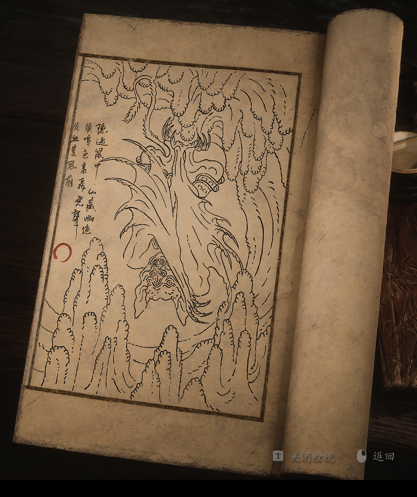

## 1.26 干尸

> 贱命绝今日，魂去尸长留。
>
> 一朝临邪风，飘荡不得朽。

黄风岭风沙迷道，货殖难入，只有山岭脚下一个小小的镇子，是乡民们赶集的去处。镇上有个长生店，乃十里八乡唯一卖寿材的地方。

这日，老板正在店内闲坐，不想进来一个汉子。他周身旭羸，一副乞丐模样，老板起身要赶他，汉子却道：“老板莫急， 我不是来行乞，是来买棺材的。” 汉子细陈了一遍来意，原来他们村里遭了匪盗，死了很多人，他要买四口棺材收敛尸身。老板十分犹豫，怕汉子给不起钱。汉子又道，他们村中盛产苁蓉，只要棺材送到，必有重谢。

老板应承下来，招呼伙计架了牛车，拉着棺材跟着汉子出发了。他们顶着风沙艰难行进，直走到太阳下山，才到了村口。这时，汉子忽而对老板道：“众生必死，死必归土。我知道这黄风有古怪，若是死后尸体不能下葬，恐怕要被这风吹成怪物，请老板垂怜，将我一家收敛。家中所剩的锁阳和苁蓉，便赠于老板了。” 语毕，汉子就消失无踪。老板和伙计进到村里，这才发现村中所有活物不知被何人斩杀了，竟没活下一个。在村中一间大屋前，老板看到了那汉子的尸体，他和妻儿倒在一起，也不知死去多久了。二人急急收了四具尸首，将他们葬在一个风景秀丽的崖头，什么也不敢拿，赶紧逃命去了。

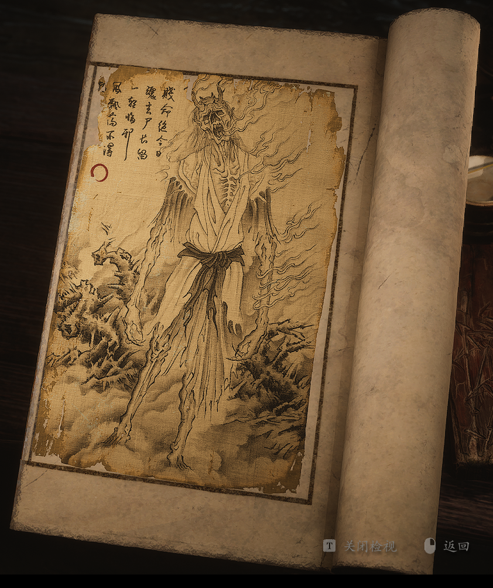

## 1.27 鼬侍郎

> 通晓故人情，难耐佛灯青。
>
> 凄凉黄风地，终是作别离。

自黄风岭重又刮起那阵怪风，小妖们的生活日渐难熬。虎先锋与沙国王处处争雄，这可苦了黄鼬们，他们的血脉两边势力都沾一点，自然两边都难讨好。

一日，鼬侍郎坐在沙场边，想到这些年受的窝囊气，突然有了寻死的念头。他找到棵枯木，挂上腰带，踏上叠石。待他套住脖子，两脚一蹬，便后悔了。痛苦和晕眩促使他胡乱地挣扎起来，可无论他如何努力，却丝毫无法挣脱。

恰在此时，有人托住他的双脚，一把明晃晃的镰刀，划过他的颈边，将绳圈割断了。其后，鼬侍郎只觉跌坐到了地上，他喘着气望去，就见是个瘦削的老妪，背着药篓，对他道：“既然死不甘心，那就好好活。” 言罢，也不怪异他是个妖精，便蹒跚地离去了。

鼬侍郎急忙化作只黄鼬，跟着老妪回到了她的家里。就见那处只剩下烂屋空堂，厨下无米，斗中无粮。原来她丧夫失子，靠挖苁蓉，换些散碎银钱过活。鼬侍郎得知后，不禁生出些同病相怜之意，索性打算帮她一阵。

他化作一个逃荒的老汉，推说自己无依无靠，借住在老妪家中。白日间，他去黄风岭中捕猎；黑夜里，他请小石精修缮房屋。二人搭伙，竟将日子过得红火起来，看得村里人好生眼热。

一日，有两个村民偷偷跟在鼬侍郎身后，想瞧瞧他捕猎的手段。却见他摇身一变，现出本相，竟是只穿着衣服的黄鼬精，腰里还别着一把晃亮的弯刀。见他是妖非人，村民只觉那刀，似是已架在他们脖颈上。他们急急将这情形告知了全村，大家便请来道士诛杀鼬侍郎。那黄鼬精死后不久，老妪也一病而亡。大家纷纷说是那房子不祥，分完屋里的皮货草药，又放了一把火， 将房子也烧掉了 。

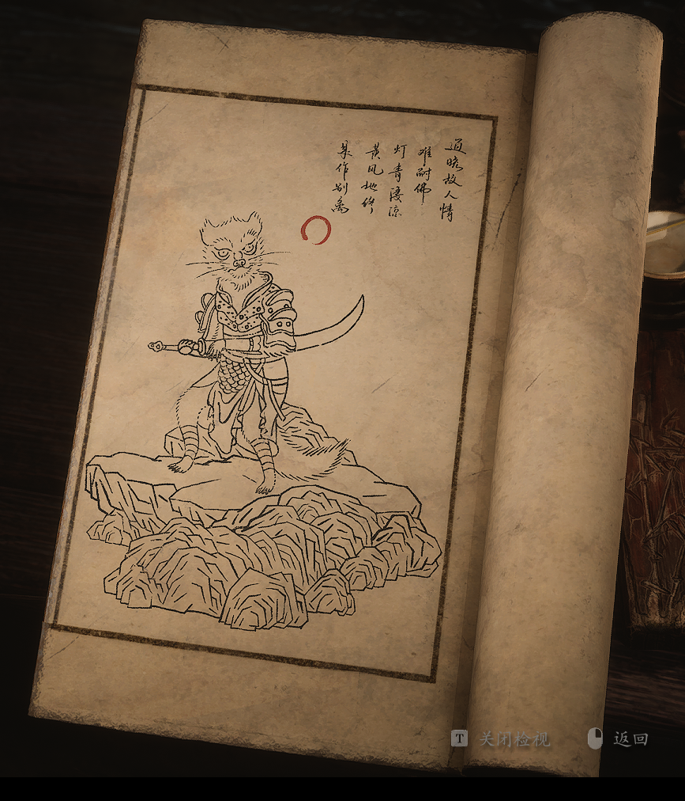

## 1.28  狸侍长

> 不力事本业，享乐歇幽凉。
>
> 小儿淘气时，翻脸作虎狼。

昔日，有一富绅建了好些房舍，其中有个别院，无人居住。院内有一方清池，一株古榆，树上悬一架秋千，十分吸引村里的孩童们，他们都想入内嬉戏。

富绅却命仆役们严格看守别院，绝不许外人靠近。时日一久，村童们玩心愈炽，便投石丢瓦引走仆役，意图溜入院中。

一日，仆役被村童们抛出的利石打伤了眼睛，富绅万分气恼，索性撤走了看守别院的仆役，只在院门落了把锁，贴上告示道：“舍下老狸成精，切勿擅入。”

村童们皆以为告示是唬人的，便翻墙而入，摘榆钱，荡秋千，捕池鱼，疯疯耍耍，欢声不绝。

嬉戏间，屋顶飞下数瓦，砸落在村童们身侧。他们受到惊吓，叫叫喊喊，将家中大人们招了过来。大人们高呼主家，欲要索取赔偿。嚷闹许久，院后屋顶上突然传来一句尖声厉喝：“凡胎俗子，不知死活！” 语毕，不知何处掷来两柄飞刀，团团旋舞，划伤了数人。众人大
骇，相携而逃。

其后，有人问富绅：“果有老狸成精否？” 富绅笑而不答，此事终无一个定论， 自此，再无敢进此院者。

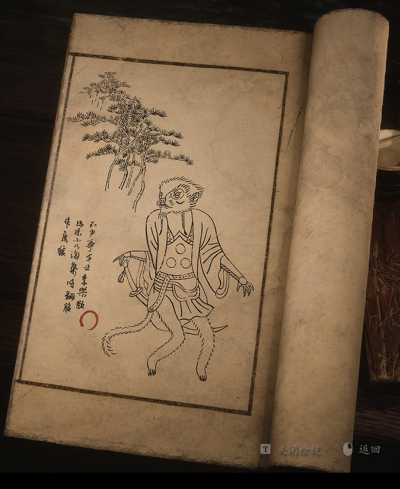

## 1.29 小灵芝精

> 林深松乔下，山青水秀间，
>
> 专护山中友， 强采刀枪见。

乌斯藏地界内有家酒庄，以酿制药酒著称。因这酒功效甚独，甘香醇美，深得百姓喜爱，生意十分红火，经常供不应求。却说庄主有两个儿子，正值及冠之年，慕仁好义，骄心气傲，他们不爱学习酿酒，时间总花在结交豪杰上了，父亲如何训斥都没有用。

彼时，邻里有户人家新丧未久，坟却不知被何人所掘，乡勇们集结去查探，就见棺材板破了个大洞，上面长满了芝兰，而本应躺在里头的尸首却不见了。这事在他们那里偶有发生，却从未被破悉过，兄弟俩便决定要查个明白。

他们每日都在山中寻找踪迹，早出晚归。这夜，直到三更时分，兄弟俩才悄悄溜回家中，恍惚间他们看见有个人影，往自已酒窖中去了，以为是进了贼人。 二人跟在后面，这才发现原是个头顶血红灵芝的妖怪。 兄弟二人不由分说，立刻扑上去将那妖怪打死了。

打斗声惊动了庄主，待他寻来之时，灵芝精已然气绝。他又恨又恼，这才告知兄弟二人，酒庄中卖得最好的药酒，便是托这灵芝精所酿。兄弟二人原要拿这妖怪去显眼，没承想和自家有这般关联，羞惭不已，也不敢再作声张。

此后几年，酒庄的生意越来越差，昔日豪庭，落得如今蓬门破败。兄弟二人耐不住这凄凉景况，欲要离家换个生路。临行前，老庄主为他们置办了一场酒席，请了无数亲朋好友为他们送别。说来也怪，自他二人走后，酒庄的生意突又红火起来，更胜往昔。不过庄主自己明白，每到深夜，有两个与儿子身形一般，长着灵芝伞盖的妖怪，会帮他酿制成缸的好酒。

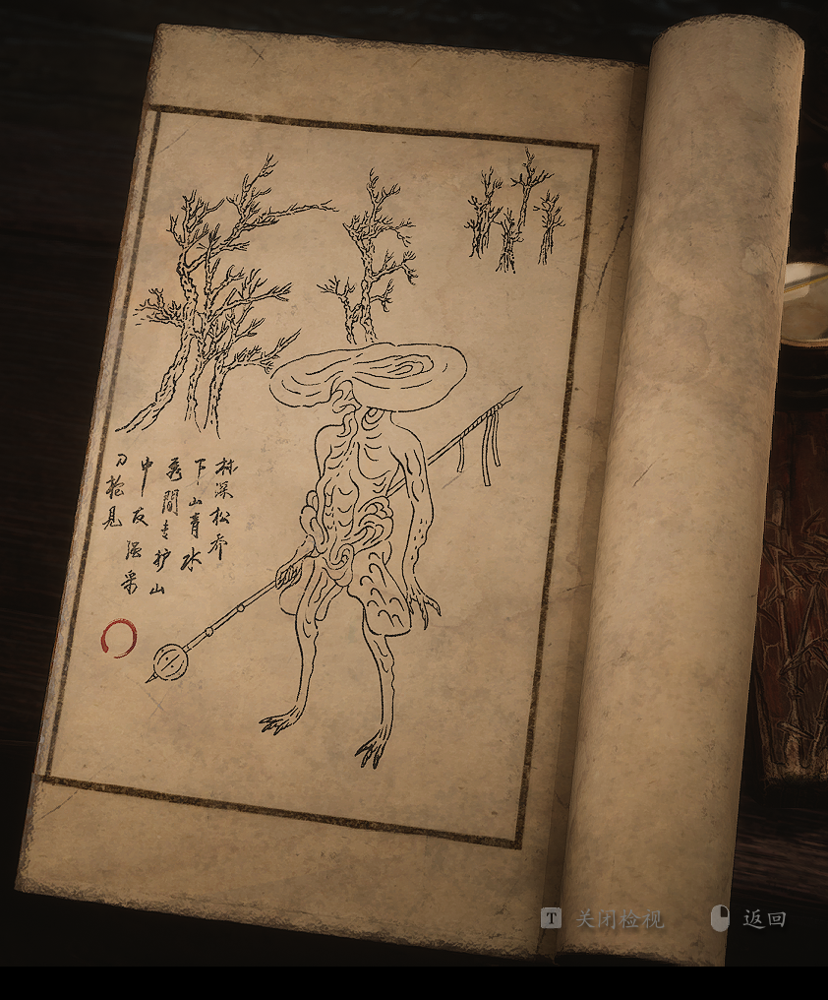

## 1.30 支应僧

> 有力无处使，光光举大石。
>
> 眼亮尚迷茫，目空常自失。

昔年，在小西天修建大殿的工匠们，屡遭异事，多有辞工者。其中，有好奇的工匠，听闻院主是位高僧，便寻去找他解惑。

院主毫不避讳，引其至浮屠塔中，让他见了掌灯狱使。工匠们见后，心中骇然，虽幼时也曾听过妖怪传说，但从未亲眼见过。斯时，塔中妙音响起，掌灯狱使瞬发光亮，工匠们双目应光而盲，众人叫苦不迭。

院主笑道：”要见真相，必有舍取。汝等不若留在这庙里，随我修习极乐大道，或有缘超升凡界，早登佛国。”

工匠们情知自己瞎了双眼，难找活计，索性弃了尘世，入寺修行。他们向院主询问，应该如何修行，院主答道：“你们所长何事，即修何法。”

工匠们膂力过人，遂决定以武悟道，因盲眼，便跟着监院僧修炼。他们将大石拴上铁链，扣在腕上，日日挥举，恰好将那修建寺庙的石料也备齐了。院主很高兴，让他们做了支应僧，还省下一笔工钱哩。

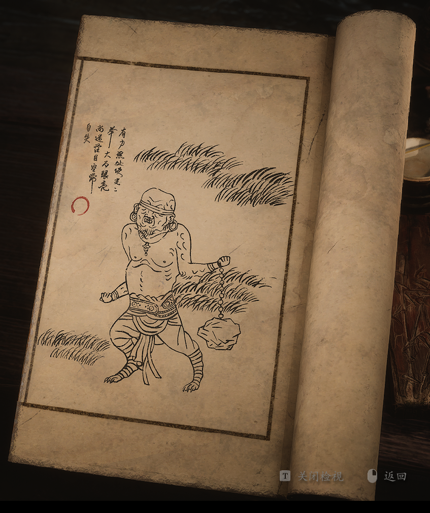

## 1.31 戒刀僧

> 愚僧听妙音，砍头作修行。
>
> 歪门引歪道，刀醒人不醒。

投靠小西天的夜叉，大多不愿断了旧日恩仇，便充作俗家弟子，在寺中生活。还有一些夜叉，想修正果，便削发剃度成了内门弟子。他们曾向师父许诺，要斩千首，以证道心。黄眉很高兴，赐他们戒刀，唤他们戒刀僧，入浮屠界修行，若真能斩足千首，便可在大殿做罗汉。

初时，戒刀僧们认为这是极易的事，浮屠界里常年关着初来修行的人。可随着求法之路越来越难，浮屠界里余下的，都是些强者：步伐灵动的冻饿鬼，他们追不上；枝长树大的掌灯狱使，他们不敢惹；喜怒反常的夜叉奴，越打越狠;就连最弱的穿云鬼，自从修 了闭眼禅也疯癫癫的，令人害怕。

他们见赤发鬼平日总爱独自静坐，好似非常老实，便把主意打到了赤发鬼身上。赤发鬼虽觉众生皆可活命，但因亡国之战，他们最恨砍人首级者，所以对戒刀僧们毫不留情，反将他们的首级砍了下来。

受了这次教训，戒刀僧安分了许多，可仍是满心不甘，他们常持刀潜伏在角落里，偷袭过往之人，用这等阴损伎俩凑些砍头之数。

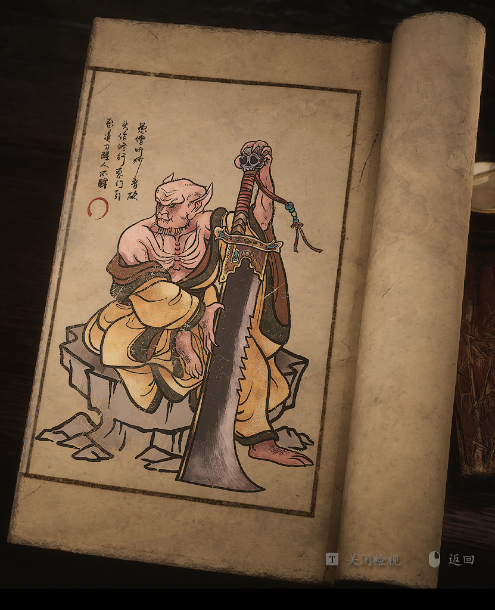

## 1.32 提炉僧

> 沉香断，铁炉寒，霜刃风刀佛衣单。
>
> 参修苦，极乐难，魂梦渺渺锁尘寰。

昔年，有个商贾欲越过小西天去做买卖，他本应徇官道绕山而行，可因盘缠不多，钱粮吃紧，便决意翻山而过。

他入山未久，便迷失了方向。积雪阻道，寒气逼人，商贾又冷又怕，正是前后失距，就见个苦行僧，袒朐露臂，提着个香炉，正从不远处的坡前路过。商贾急中生智，急忙拖着货物，追着和尚而去。和尚走得不快，但商贾有货物拖累，走得更慢，总也追不上和尚。

他二人就这样一前一后，爬到了山顶，有座宏伟的庙宇坐落在此。商贾喜不自胜，打算去那处歇脚，再雇上几个和尚，替他担着货物过山去。待他走至寺庙的山门前，他警觉起来。原是有许多和尚如雕塑般，立于雪中，纹丝不动。

商贾心惊不已，慌忙找那引路和尚的身影。忽闻得脚步声响，就见尸身间，走来数个提着香炉的和尚。他们将商贾团团围住，商贾正想求饶，就见那香炉中，飘起寒雾，把他也冻在了原地，站在了覆雪的僵尸之中。

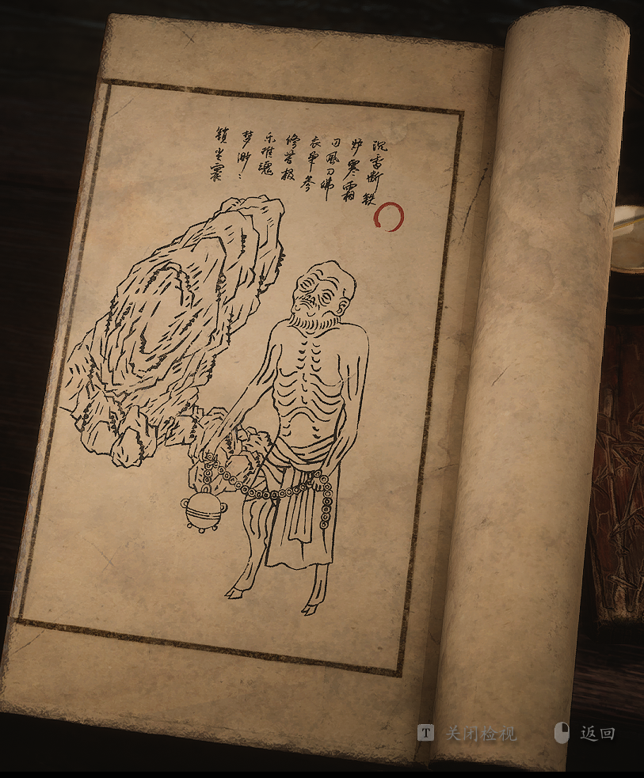

## 1.33 迎客僧

> 跳圈翻筋斗，筛锣耍杂戏。
>
> 行凶坦荡荡，行善常戚戚。

昔年，花果山被毁，赤尻马猴率部下离了山场，欲寻新地界修行。他们跋涉至火焰山，欲在那处安家。未几，猴群突发瘟疫，赤尻马猴下令将病猴抛入深谷。此举令众猴心生惧意，纷纷离他而去，开始四处流浪。

它们沿着凡人的城池前行，扮成耍猴的艺人，赚取盘缠。可观众每每看完猴戏后，就四散而去，令他们收获寥寥，经常食不果腹。

一日，有猴突发奇想，何不以杂耍为饵，聚齐路人，再行匪盗之事？于是，他们敲锣打鼓，卖力表演，引来围观者后，又将众人一一宰杀，选剥了衣服金银，再逃去下一座城池。

他们就这样一路撑到了小西天，听闻赤尻马猴也在此修炼，便出家做了猴僧人。自觉愧对同族的赤尻马猴，对他们避而不见，让这些猴子更是愤恨。因他们自己本事平平，不是赤尻马猴的对手，便主动揽下了迎客之职，只要筛锣，便能唤来其他巡山的妖怪。他们日日都在等着见到赤尻马猴，那时必要敲锣唤来众妖，将他揍个痛快！

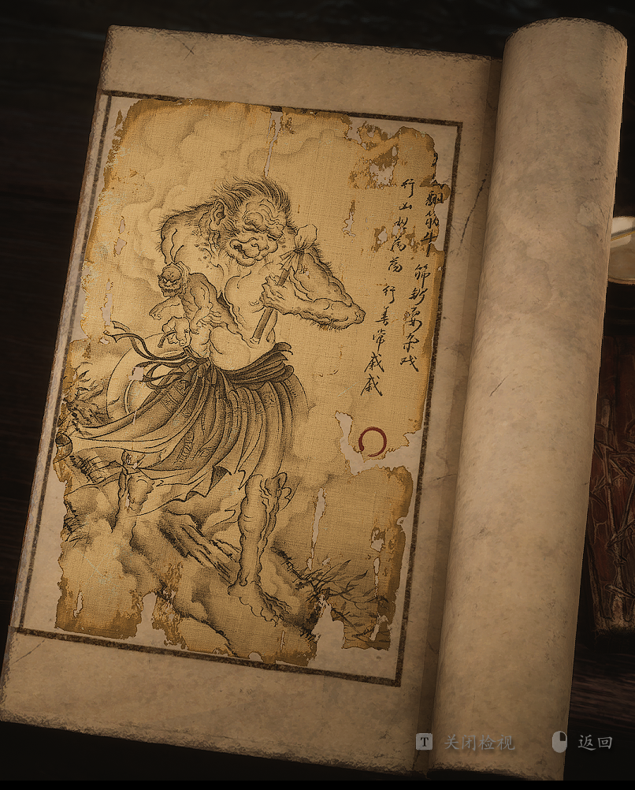

## 1.34 监院僧

> 闭眼练空拳，熄声辨忠奸。
>
> 断念参禅境，绝欲灭新缘。

寺中众僧，皆可向强能者请教功法。

其中，笃爱拳法的僧人，一直跟着二师兄不能，练功习武。他们的秉性，也酷似二师兄，最是好打抱不平，因此得了监院僧的名号。

自二师兄被师父罚去塔林面壁思过，监院僧们少了庇护，是以总在替旁
人鸣不平时，吃上大亏。

监院僧们非常苦恼，都跑去问师父该怎么办。师父笑道：“不见，就能心无挂碍。人之大患，莫过于弱矣。闭上眼睛，好好修行。”

起初，监院僧们为自己蒙上了眼睛，可摘下布条，他们依然无法不闻不问。于是，黄眉告诉他们，何不挖掉眼睛试试。

自那以后，寺中又有了一种全新的法门，唤作闭眼禅。修习此法的人，以不见外物，来修心止如水。

可真能如此？只怕任何风吹草动，反更能搔挠那蠢蠢欲动的心罢。

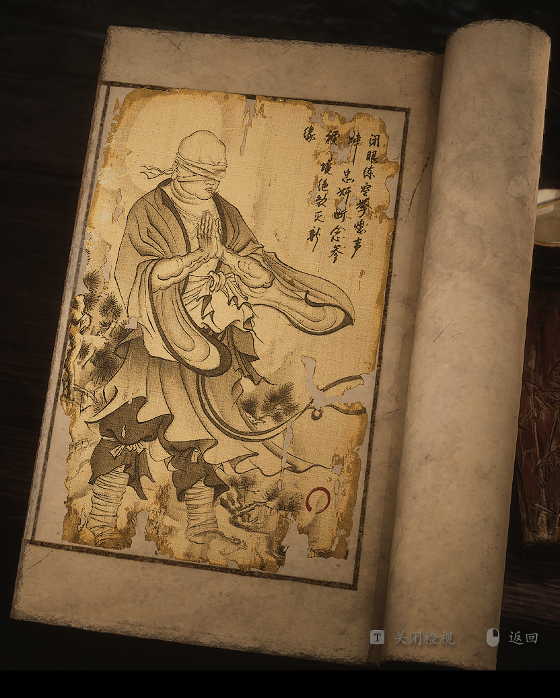

## 1.35 双刀僧

> 红衣单影舞双刀，素刃焕新意气豪。
>
> 锋中藏锋图花头，中年悟道亦中道。

昔日，有手持双刀的僧人，求访于小雷音寺，寻求更厉害的刀法。

僧人的刀，外形平平。待他拜入小西天，见识到夜叉们奇怪绚丽的兵刃，十分羡慕。他幼时也曾看过一对华美的双刀，师父却斥责他太过虚荣：“刀，是武艺的精髓，形美而质虚，非正道也。”

僧人谨记此话，但现下见旁人并未遵循此道，内心就动摇了。他寻到夜叉处，询问关于刀的美丑之理。夜叉们奇怪道：“刀越好看，我越想勤加练习，何来妨碍之说？”

僧人犹豫不决，又寻去寺中问不净师兄。不净擅使戒铲大刀，他回道：“刀法既已练成，昔年之事，你又何必挂怀？”

僧人闻言立刻弃了旧刀，依着夜叉们那些华丽的刀形，为自己铸了两柄新刀，以期圆满幼时的愿望。可这新刀样式虽奇，终究不是他常年所用的朴素旧刀，多年培养出的招数定式，反而让他的刀法露出了更多破绽。

咦，春生夏长，秋收冬藏，万物之势，皆有时序。得之非时，虽得尤失。

知机，难矣！

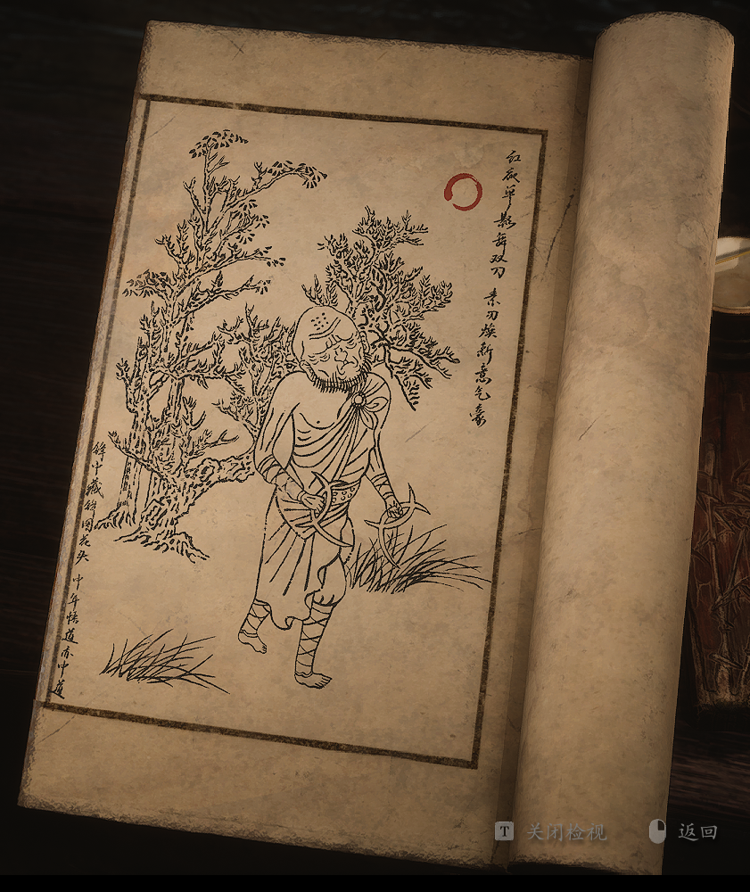

## 1.36 青蝠

> 手持铁叉枪，身着布衣裳。
>
> 林深天地白，正是好猎场。

昔年，禅光村有个姓王的刀手，他幼时失怙，母亲养不活他，就送他去山下屠户家当徒工，让他习得了一身好本事。

这日，刀手去富户家杀猪，主人家多赏了他一条猪腿。刀手想将其送给母亲享用，就连夜赶路回村。行至半路，见山道旁有人，手持一杆猎叉，着一袭旧布衫，招呼道：“阿哥，我是村里的猎户，在这坡下摽兔。夜里有些怕鬼，想与你同行。”

刀手点头答应，二人继续赶路。没多久，猎户道：“听闻近日山道上闹妖怪哩。” 刀手笑道：“妖怪有什么好怕的？若是遇着，我就用猪腿抡他，用屠刀砍他。”

又走一阵，猎户道：“阿哥既不怕妖怪，想必很有本事？” 刀手笑道：“我自小宰杀畜生，一刀就能直中要害，一劈就能断骨断筋。” 猎户生
气道：“妖怪怎能和畜生并论？” 刀手严肃道：“在我看来，世上没有妖怪。替天行道的，都是豪杰；欺负良善的，都是猪狗。”

村子遥遥在望，猎户又道：“你既不怕我，何不转身看看？” 刀手早有所料，抡起猪腿就将其打倒在地，举刀就砍。

那怪早已走了气势，急忙扇开翅膀飞到半空，啐道：“遇到个硬茬，晦气晦气！” 骂完立刻逃走了。

咦，都说柿子要拣软的捏，做人还是刚强些好，硬气起来，妖怪都怕你几分哩。

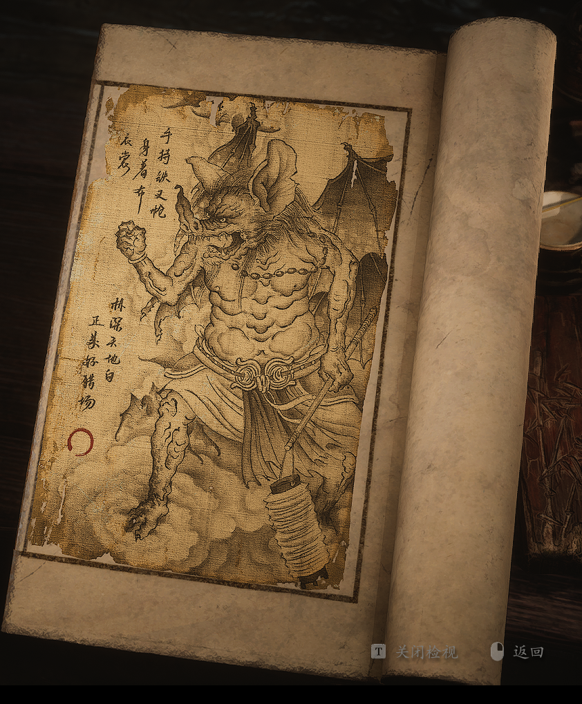

## 1.37 雪僵尸

> 慧灯燃春秋，光阴作水流。
>
> 风雪迷大道，功果等浮沤。

庙规有云：新僧入庙，可领件新袈裟。

这日，不空法师喜得一名新徒，便亲领他去库房取袈裟。小徒弟发现这袈裟乃是单布所裁，在这雪岭之上，穿着不过聊胜于无。他问道：“师父， 这薄袈裟合该是夏季衣裳，可否让弟子换件毡布的？”

不空抖抖自己的袈裟，道：“为师穿的， 和你手上这件一般，只是华彩了些。 心有般若， 自然不惧寒冷。”

小徒弟将信将疑，问道：“弟子看那路旁，有许多冻死的师兄。”

不空慈蔼道：“他们都是悟性不够，禅心不坚的人。你不一样，为师能看出来，你有慧根。” 小徒弟心中一喜，抱着袈裟开开心心地随师父回去了。

没过多久，寺门外又多出了一具新的雪僵尸。不空长老领着新徒弟从旁而过，新徒弟问道：“师父， 这些师兄都冻死了？”

不空慢慢朝前走着，道：“徒儿勿怕，他们心不诚，无慧根，你不一样......”

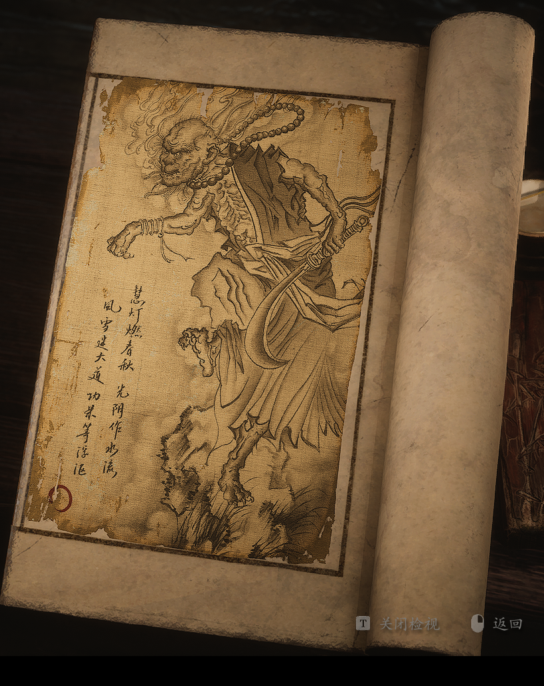

## 1.38 巡山鬼

> 山中怪兮阻险道，恶相貌兮舞拐刀。
>
> 风飒飒兮魂杳杳，思性命兮速速逃。

从西边迁徙来的夜叉，素爱食肉，幸而小雷音寺并无吃斋这一戒律，这让投靠而来的夜叉们颇为开心。

山中夜叉都想当巡山鬼，不仅是那柄造型奇特的大刀，看着格外威风，飞去自来，十分巧妙，还因巡山鬼执守外山，总能弄到新鲜的血肉。这日，众夜叉正聚在一起饮血吃肉，开怀享乐，由于太过嬉闹，庙里人尽皆知。监院僧很不满意，他们秉承苦修，只吃素食，便抬着一口大锅，寻至夜叉跟前。众夜叉往锅内一瞧，俱些萝卜青菜，顿觉扫兴。

夜叉呵斥道：“难道吃这些就能助你对佛法有更精妙的理解？真是肤浅。” 另一个又道：“师父说过，要修极乐，就不要辖制欲望。” 听到这话，监院僧便道：“我的欲望就是劝善，不劝你们，我也无法修极乐。” 于是双方争得面红耳赤，也没分出个对错。

咦，世间万象，皆有其理。是非曲直，一言难尽。若人人皆以己意为绳墨，以己心度人心，争执又该如何止息？

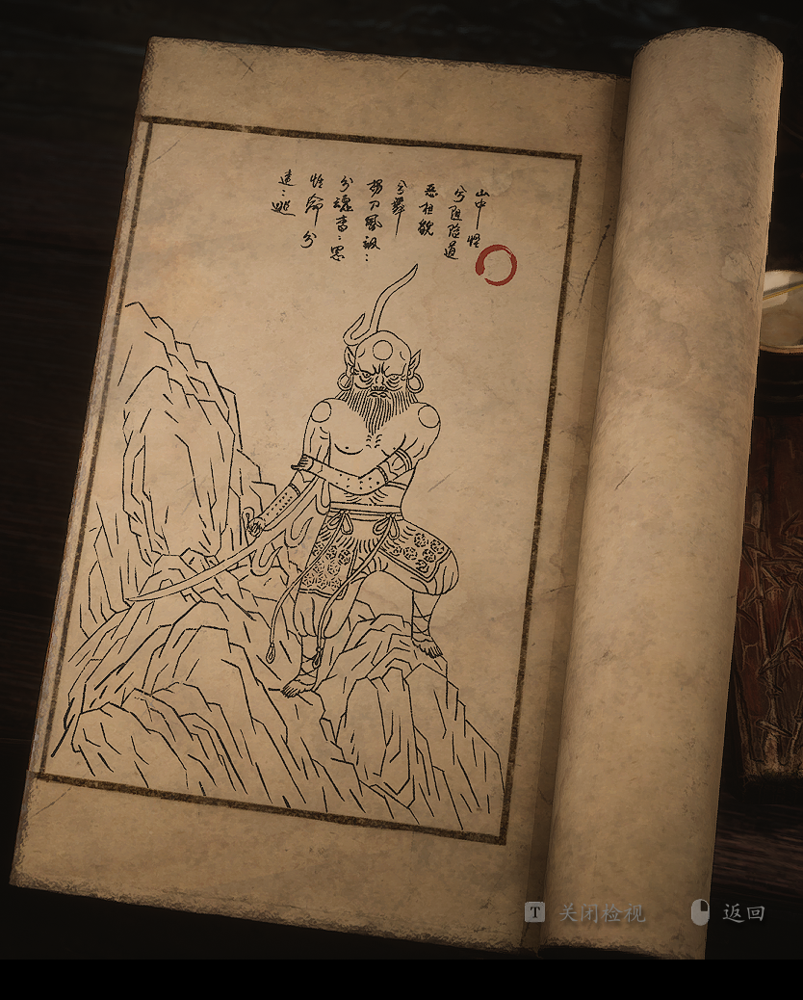

## 1.39 穿云鬼

> 声来架惊弓，箭过起乱红。
>
> 眼盲换心亮，善始难善终。

夜叉国覆灭后，夜叉们流亡他乡。曾是御前仪仗卫戍的射手们，仍以旧日荣耀自居，不愿脱下华丽的铠甲。可他们箭术虽精，却射速极慢，不善近战，故在流亡中饱受艰辛。

由于他们战力不济，只能暗处偷袭，黄眉便将其分配至地牢，让他们在那里好生修炼。他们在牢中日日遭受折磨。当轮藏中响起妙音，众人为之癫狂时，戒刀僧便绰着大刀专挑他们砍头。被逼无奈下，他们也只好开始想办法反击。

他们四处寻求指点，屡屡找戒刀僧挑战，结果屡战屡败，反遭羞辱。一日，监寺的盲眼拳僧来地牢巡视。他们为修武道，不惜自毁双目，但拳法着实精妙。夜叉射手向其请教，和尚答道：“你们太想命中，盯瞄太久，失了先机。不如学我，挖去双眼，便可凭心而射，箭无虚发也。”

射手们深以为然，遂自剜双目，还给自己换了响亮的名号。此后，戒刀僧果真很少再欺凌他们。有人问戒刀僧为何，戒刀僧答道：“谁想和疯子拼命哩？”

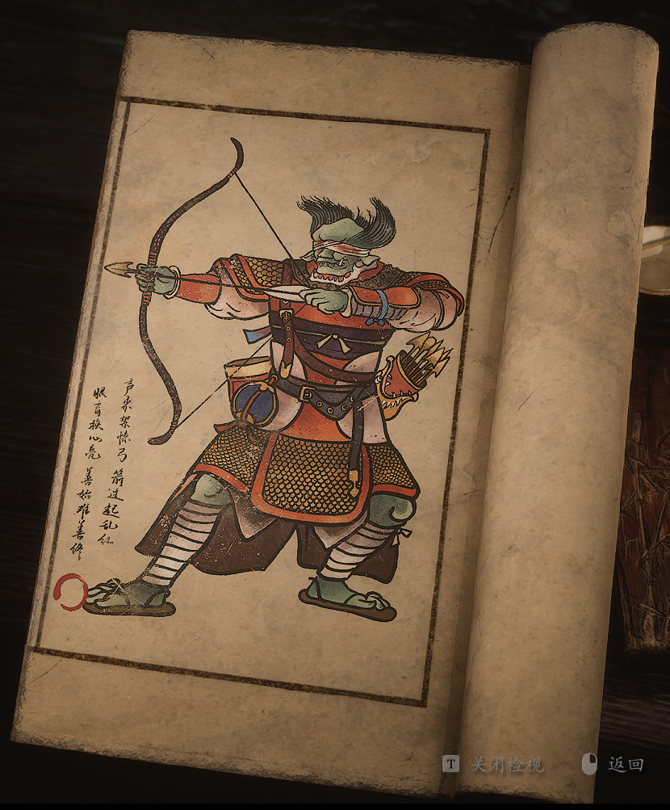

## 1.40 冻饿鬼

> 若有鬼兮冻寒道，腹鼓鼓兮颈生毛。
>
> 既骋凶分谗且狡，子惧予兮丑相貌。

昔年，小西天山下有个禅光村。村中有个青年，他与青梅竹马的姑娘私许了终身， 以一条白玉络子为定情之物，誓日发达之日，必将上门提亲。

青年是个货郎，往来周遭以贩粮为生。忽一日，村边的大河里，驶来一条楼船，富丽繁华，村人从未见过。那船头立着个身披黄袍的胖和尚，浑身金光闪闪，众人都说那必是得道的高僧。

自楼船到来后，山中的寺院越修越大，青年往来贩粮，买卖也越做越大。一次，青年贩粮月余都没有回来，姑娘打听了寺院的方位，就去庙中寻找青年。待青年回村，二人未曾相遇，姑娘不知所踪。

青年召集了乡勇，要去山里寻人。大家一路找去，并无收获，就见河岸边有座高耸的佛塔，青年便领着他们去那处歇脚。众人刚到塔前，那门兀自开了。有好奇者往里窥看，惊叫连连。原是那门后有座深入地底的监牢，像是关着许多人哩。乡勇们义愤填膺，嚷嚷闹闹冲入塔内。未走几步，只听砰然一响，塔门竟消失了。监牢里走来几个怪模怪样的妖怪，他们手里持着镰刀，挺着巨大的肚子，发出嘻嘻的奸笑声。

其中一个将一袋钱抛给青年，随后急不可待地跳扑而起，镰刀乱挥，将近前的乡勇斩成数段。众人这才发觉被青年骗了，急忙朝监牢深处疾奔而去。青年望着他们，喃喃叹道：“既已失 了所爱，不能再失了钱财。”

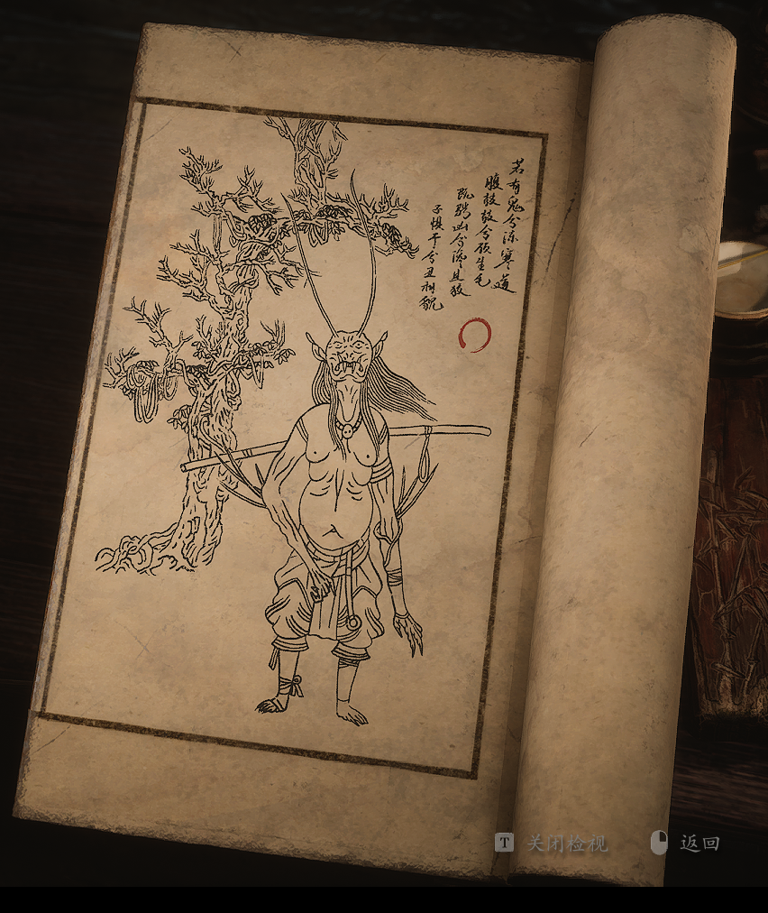

## 1.41 赤发鬼

> 横刀穿敌胸，浴血染发红。
>
> 亡国悲不尽，东风叹西风。

夜叉国中有八位大将，其中一人唤密严。他曾在灵山脚下，玉真观中，随金顶大仙修行。又经百战，有万人敌之勇。

强敌来袭时，夜叉王将密严封为前锋将军。密严在国界驻下大营，对众将士道：“若有怯战者，今日可走，我不怪罪。但此地若失，国即破矣。国中老小，身家财富，全要拱手让人矣。” 言罢，与全军歃血立誓，只进，不退。

夜叉国的大军势孤力单，敌人四面合围，旌旗蔽天，敌军一阵杀完，再接着一阵。密严与部下血战连场，伤亡惨重。最终，密严在诸罗汉的包夹之下，被斩下了首级。

将士们牺牲无数，将自己将军的头颅夺了回来。众人将密严的头颅放入棺中，却见尸身慢慢坐起，哀叹道：“若失去了家国，有头没头有何异？”

语毕，这才合目倒下，彻底死去。血从他的脖颈处涌出，把头发都染红了。后来，他的部下奋勇杀敌，将敌人的鲜血浇在头上，以此效仿密严，表达自己的忠勇。终究，夜叉国还是覆灭了，但密严的大军里，没出一个逃兵。

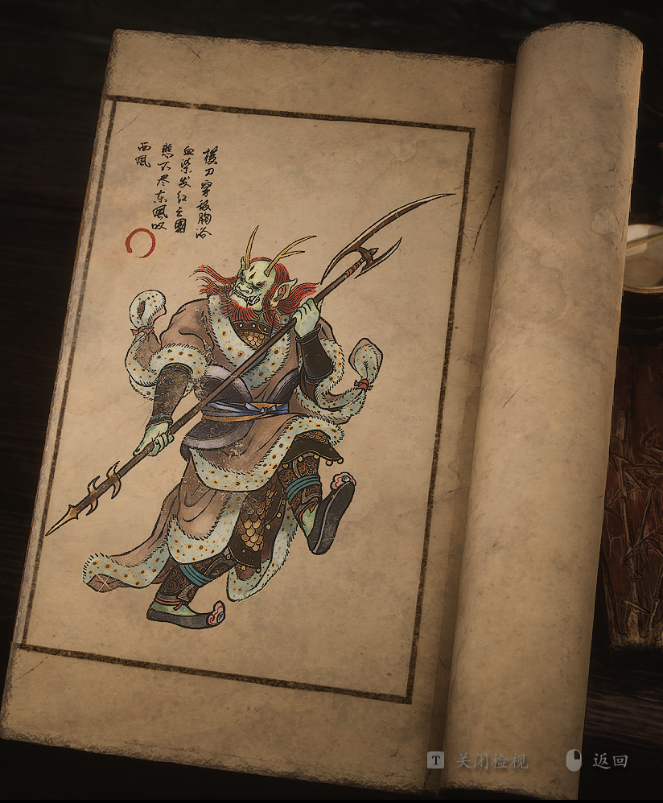

## 1.42 掌灯狱使

> 古刹树参天，幽牢性命悬。
>
> 冥中有光处，最是临深渊。

山巅的古寺，历经岁月风霜，日渐颓败。院主多年归来，见这庙荒废如此，心中悲怆。他散出许多金银，要重修一座宝刹，来彰显自己的极乐大道。院主在山中选了一片参天的林场，要用那处的古木做栋梁。专司木料支应的工匠们，依着指示，在林场边扎好窝棚，就近伐木取材。

诸事顺遂，不上半年，木料就全备齐了，工匠们结了工钱，收拾停当，次日便可下山。

是夜，值守的工匠提着灯笼正在巡视，忽听林中有竈宰之声。他非常害怕，便去叫醒了所有人。大家都点起灯笼，绰着斧子，寻声而去。

待众人结伴走入林中，有人怪叫一声，竟不知被何物，连着灯笼一起拖入了黑暗里。其后，不论如何躲藏奔跑，大家挨个被拖了去。

只有一个聪明者，赶紧灭掉了手中的灯笼。他心惊胆颤地独自在林中摸索前行，好在，远处微光升起，太阳要出来了。

有了这微光，他找到了来时的路，急忙向窝棚处跑去。待他到了林场边，阳光骤然晃亮，照得他眼内一片白芒。

他忍着疼痛去看，只见那光并非初升的太阳，而是发自同伴的灯笼。这灯笼撑在一截藤蔓上，而这藤蔓顶替了同伴的脑袋，撑在其尸身上。

有个黄袍的白面胖娃娃，骑着一只高大的四足兽上，兽头不断发出奇妙的声响。

那人刚要开口求饶，只觉背后一凉。其后，他瞧见自己不断升高，直与那灯笼齐平。那胖娃娃拍拍兽头，声音静息下来，灯笼灭了，夜又归于了凄清。那胖娃娃笑着道：“好料子，就得用尽方好。”

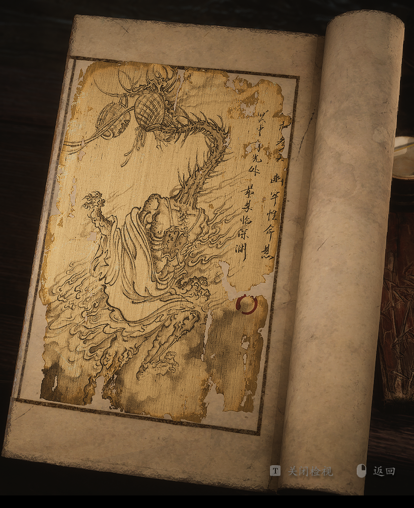

## 1.43 夜叉奴

> 善哉真善哉！孽缘结孽债。
>
> 持戟畏人识，悲从卑中来。

月陀国西北边陲，有个小村落，村中有对老夫妇多年无子。某日，老汉入山砍柴，在古木下发现个稚童。他皮肤暗沉，面相可怕，和寻常小儿多有不同。老汉见他四肢羸弱，衣衫褴褛，想必是无家可归的流民，就将其带回了家。

夫妇二人为他换了衣裳，喂了饭食，不免生出些爱怜来，一番商量，决定收养他。

初时，他们对孩子极好，可不上半载，因他长相迥异，村人私下议论不止，都唤他为“丑奴”。老夫妇亦觉丢脸，对丑奴也不如先前和善了。

未及二载，丑奴的肤色变得更暗了，老夫妇心中厌恶，便让他穿上厚实的衣裳，掩住全身，酷暑也不许脱下。

又过了三年，丑奴身形逐渐魁梧，身上生出了尖角和刺。老汉愈发惶恐，将其捆在柴房中，以柴刀削他的刺，弄得鲜血淋漓。

老妇心中厌恶此事，将错全怪在丑奴身上，轻则鞭笞打骂，重则以炭火烧他。丑奴又如此挨过了五年。

一日，有群流浪的夜叉途经此地，闻柴房内传来夜叉语的咒骂，闯入一看，是自己饱受折磨的同胞。他们给了丑奴一把长戟，让丑奴报仇雪恨。丑奴走入老夫妇的房中，将昔日所受，一一奉还，只把二人折磨成两摊烂肉才罢。

多年后，丑奴心中的不平仍未静息，只有戏虐猎物，才能缓解他的痛苦。

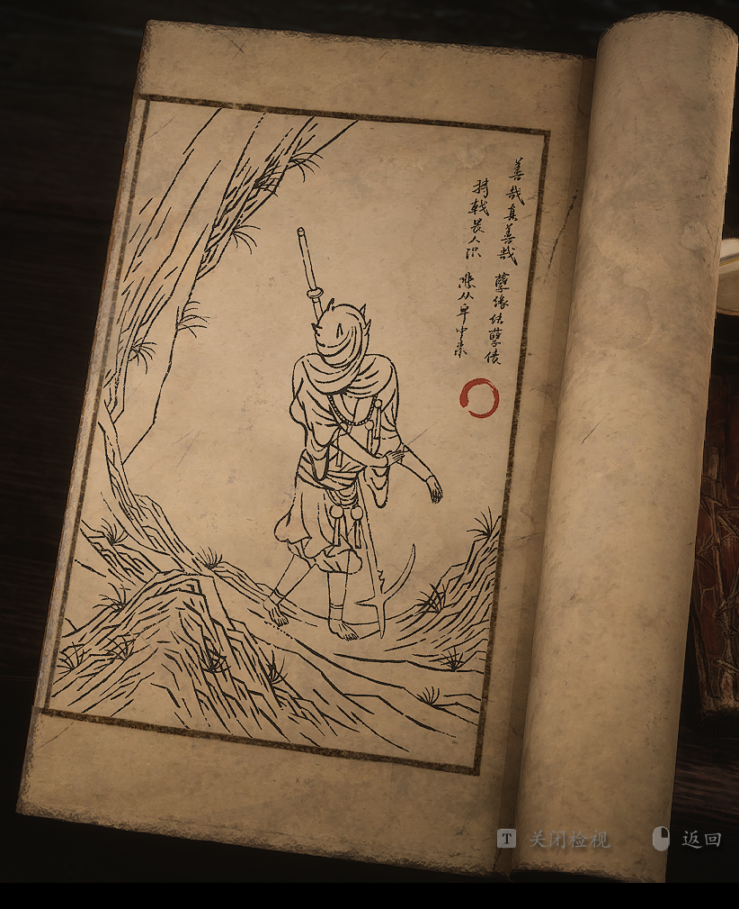

## 1.44 隼居士

> 鸿鹄高飞，其翎丰茂。燕雀低举，其毛轻浅。
>
> 志士惜羽，不以利损。贤者远虑，后劲久长。

扁毛的飞鸟，是乘风的能者。其中，有群住在雪岭上的海东青，尤善制吹寒风的法宝。他们以自己的绒羽，造成扇子，大受风婆和云童的青睐。依照族规，每只海东青，都必须学习制作法宝方法，若有不从，则夺其名号，逐出族群。为了激励大家钻研更好的制作之法，族中每年设下擂台，以法宝的优劣，决定他们在族中的地位。有只海东青，他的祖辈皆为平民，他梦想做出一柄宝扇，翻身当上贵胄。

他丝毫不吝惜用自己的羽毛，来增强法宝的威能。历尽艰辛，终成一扇，在擂台一举夺魁，成了族长。可他也因拔光了身上的羽毛，不可飞腾，着衣避丑。

继任那日，鹤仙人为其授篆。他正为自己的扇子自鸣得意，向鹤仙人夸夸其谈。鹤仙人便将芭蕉扇借他一用，道：“此乃老君失败之作，你也是做扇子的，我便赠与你罢。” 待鹤仙人走后，族长一试，立时灰心丧气，再也不愿自己的族人以羽毛制扇了。他带着追随者，离开了雪岭，去寻找太阴芭蕉叶。后来，在小西天附近寻得几片，模仿老君的制扇之法，做出了许多仿品，重又找回了飞翔的能力。

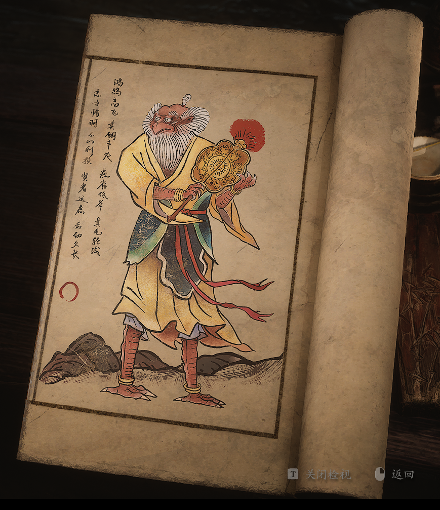

## 1.45 狼护法

> 狼心本忠良，执迷骋凶狂。
>
> 原有回头路，恶言断肝肠。

昔年，有只小狼跟随大苍狼学习捕猎，师父教导他，优秀的猎手，出击果断，不曾让猎物受苦。小狼一番参悟，多年修炼，成就了一门杀戮之术。

他以为师父会为自己的进步而高兴，师父却责他伤生造孽，令他悔改。师父的话前后矛盾，让狼妖很困惑，是以他离开了黑风山，漂泊四方。途中，他听世人说，狼虽坚韧团结，却鄙薄凶残，忘恩负义。狼妖愈发困惑，似乎多年所信，都与世界相悖。

一日，他途经小西天，听闻此地有种极乐法门，可解脱愁苦，他便主动求见了院主。

院主是位着黄袍的白胖和尚，他听狼妖诉完苦楚，笑道：“狼，生而食肉，杀生屠戮，此乃天性；凡人不同，他们生而食谷，播种采收，天性弱小。故而，他们想用编造的准则来约束狼，希望免遭毒手。依我看，各从其类，各行其欲方好，何必在乎人言？”

听罢此话，狼妖豁然开朗，决意拜入小雷音寺，追求极乐大道。胖和尚道：“我这寺中，唯从已心。贪生怕死，莫入此门。”

狼妖欣然接受，成了院主最忠诚的护法。他们手持镰刀，没有任何礼义廉耻的准则，无论他们说什么，切莫当真。

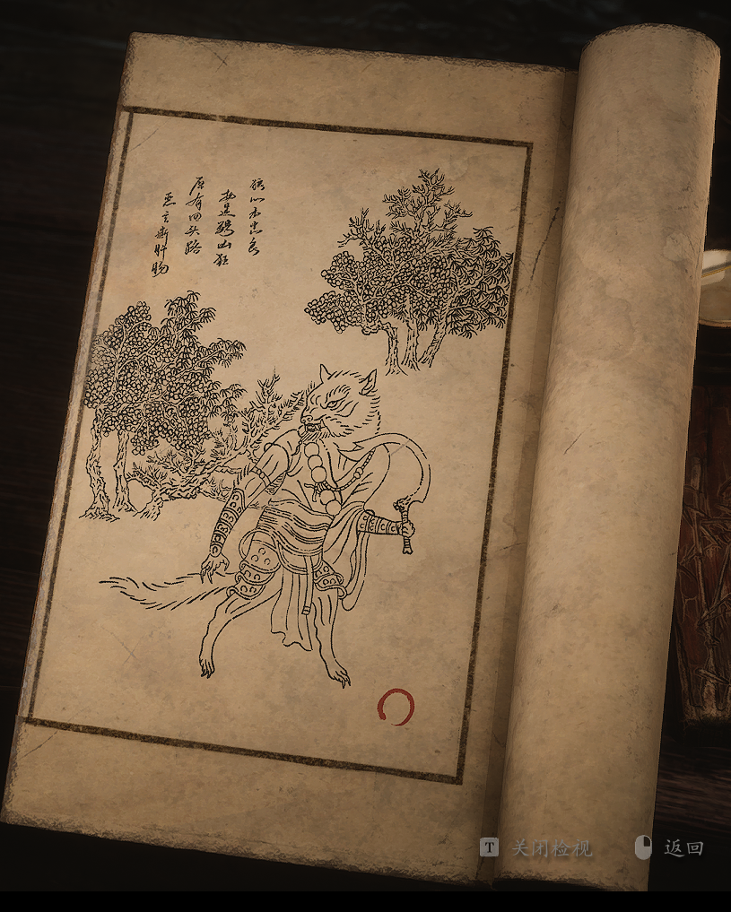

## 1.46 鳖宝

> 人心善恶两边开，有财有宝方自在。
>
> 倒骑锤儿能飞天，你说怪哉不怪哉？

昔年，陈家村有个村民，某日外出，见有个奇人，手牵绳索，拴着一只白鼋，站在路旁。路上行人往来，但无人多看这怪事一眼。

村民亦装作没见着此事，打算匆匆而过，却听那脚边白鼋，发出哀鸣，十分可怜。他动了恻隐之心，与那奇人争讲一番，将白鼋买下，放归了水里。

是夜，村民偶得一梦，见那白鼋口中呕出个小人，青紫皮肤，面貌丑陋，那小人朝着村民跑来，村民吓了一跳，惊坐而起。

自那以后，村民起了些微的变化，他的眼睛能看到山野之间偶有光芒发出，而他的食肠也与日俱增，力气跟着他的肚子也一起变得越来越大。

某次，他提着铲子，试着挖了下去，竟发现一口装着许多明器的棺材。村民凭此攒了许多意外之财，从此发家致富。这夜，白鼋再次入梦而来，朝他发出一声叫喊，他只觉肚内翻涌，呕出一物，原是那青紫皮肤的小人。小人跌在地上，急忙朝着白鼋跑去。村民似有所悟，捉住那小人，急急吞回肚里去了。其后，白鼋又呼唤了几声，村民都捂住嘴，不肯放那小人出来，二者一番对峙，村民又惊醒了。

过了一段时日，村民的相貌变得不似常人，他只好戴上铁制的头面，遮遮掩掩。后来，他连皮肤也变成了青紫色，他索性逃入了山里，拿着自己特造的工具，寻找更多宝贝去了。

说来也奇，在他那寻宝之路上，竟发现此般经历者，不止自己一个哩，倒也让他心下稍慰了。

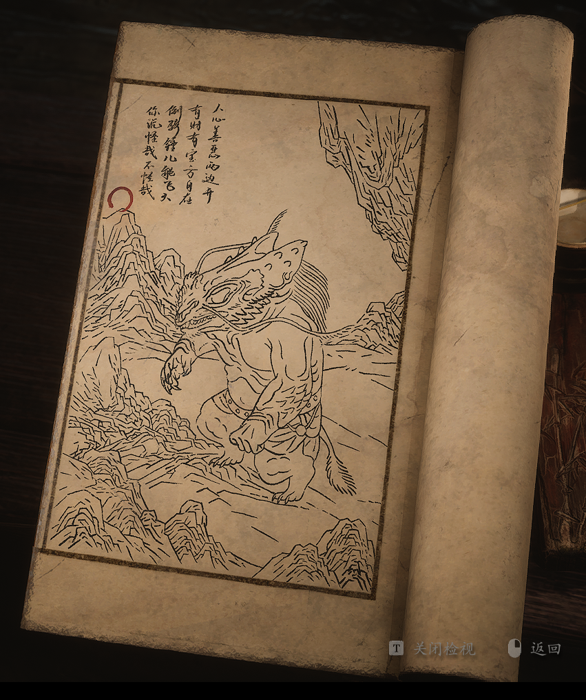

## 1.47 雷长老

> 青松固残雪，碧火守零灯。
>
> 流离灵山外，克己是性真。

与夜叉国同时覆灭的还有罗刹国，只因他们有同源之亲，是以必须共赴灭亡。

雷长老实乃罗刹后裔，他们中仍有亲族至今还在追随罗刹女修行。罗刹女自从东迁后，在天界拜认了一位师父，也算佛道兼修，和昔日有些不同。雷长老不喜这般双修之道，又听闻夜叉有一支在小西天寻求佛家法门，便转来了此处。

与夜叉自在的修行迥然不同，雷长老虽也是外门弟子，却对师父非常恭敬，严守清规戒律。抵达极乐，不是他们克己的真正目的，实乃本性使然。他们不论做什么，都拼尽全力。哪怕在守卫寺庙时也是如此，若有外人扰乱庙中清净，他们唤来的雷电，便会紧追不舍地劈来。这等人物，有时让人心生敬佩，有时也的确令人烦恼哩。

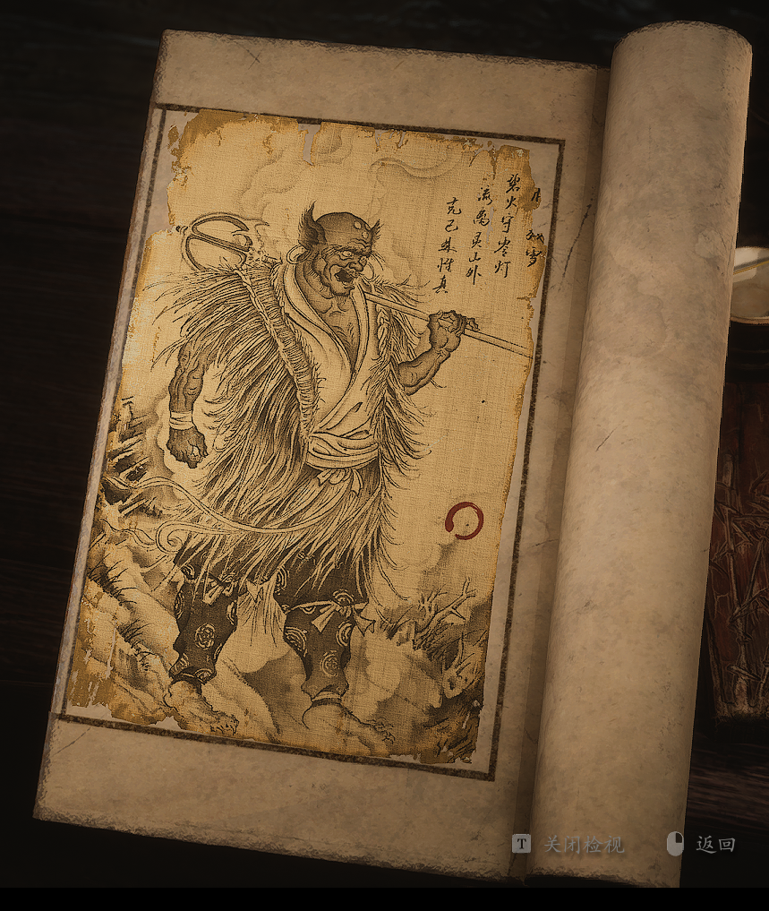

## 1.48 焦面鬼王

> 山躯何巍巍，金顶有光明。
>
> 风云随人变，不昧夜夜心。

大殿的香会，济济一堂。这是黄眉为凡间信众办的第四次香会。

香客甲次次不落，每次都见证了许多神迹。香客乙与香客甲是同乡，他头次来这岭上，对香会多有猜忌。

未多久，就见有两个瞎眼和尚，抬上了一尊怒目金刚。香客甲道：“这金刚，能断人好坏。”

待他说完，便有两人走近金刚，为了一些恩怨互相指责，忽然就被金刚焚成了灰烬。香客乙大惊，没承想断罪竟这般草率。他正要出声质疑，殿外传来极重的足音。他顺窗棂往外看，有个青色皮肤的巨汉，身披金刺彩袍，缓步走来。

香客甲又道：“这护法，能断人诚心。”

语毕，众人在和尚的引领下，挨个去护法前上交供品，香客甲叮嘱道：“一定要把钱散干净。”

香客乙不信这说辞，道：“你被他们骗了， 这些和尚，断断没一个好人。”

香客甲愤然道：“你岂可胡说，我与你同乡一场怎会骗你。”

“谁知你与他们是不是一伙的？”

他两个越吵越凶，那金刚闻声，举着钢叉直奔而来。香客乙赶紧逃开去，香客甲却大声道：“勿怕，我要以身为证！”

金刚毫无半分留手之意，香客乙以为同乡必死无疑。霎时间，那青皮巨汉将手掌一格，挡下金刚，救了香客甲一命。自此，香客乙也成了香会的常客，每次都与同乡一般，要将钱散尽了才肯离去。

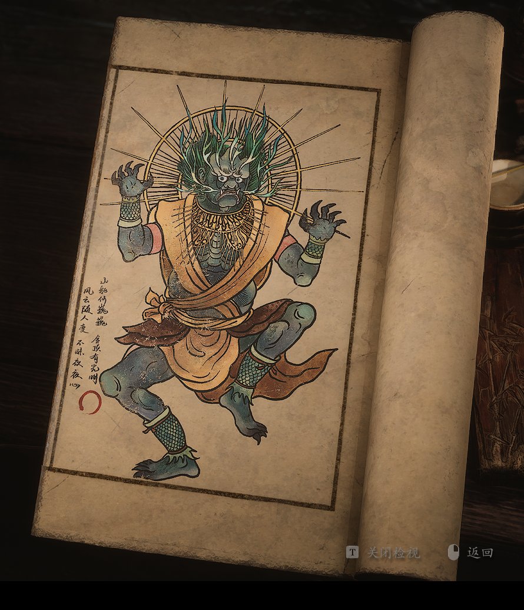

## 1.49 泥塑金刚

> 铁叉恶金刚，怒目凶模样。
>
> 众生皆负罪，焚尽才吉祥。

佛经载，金刚乃佛之侍从力士，有秉持公正，灭罪消愆之职。

自那黄袍胖和尚成了山顶寺庙的院主，他大修宝阁，常常举办香会，吸引山下的信众。

一次，有二位香客，在大殿首次相逢。他二人眼神对过，便心念电转，陡生警觉。斯时，院主令人抬入一尊金刚塑像。此像四足而立，手持钢叉，怒目圆睁，唯胸前有一洞，形态稀奇，不似寻常庙里的泥塑。院主介绍道，此乃他新造之物，附了通灵之法，极是灵验，能断是非。

那二位香客其中之一，急忙走到金刚前，道：“愿金刚灭尽世间捣虚的骗子，还某一个公道。” 原来此人是个素爱贪便宜的老实人，常常受骗，又不敢讨还，所以有此一愿。

另一个上前，道：“愿金刚灭尽那贪了便宜又牢骚满腹的人，还某一个清净。”  原来此人是个以次充好的奸心商贾，经常被人追骂，四处躲藏，所以有此一愿。

二人听了彼此的愿望，在塑像前大吵起来，竟忘了许愿的事儿。

那金刚兀自眼珠一转，举叉挥下，将两人都刺死了。其后，那四足上又喷出火来，将他们的尸首也烧了个干净。

那院主抚掌大笑道：“好个金刚。既然你们都觉得彼此错了，那便都帮你们报仇雪恨。”

此事传开，乡里皆惊，有人骂是那院主是妖法惑众，有人说他是神通广大，但无人敢不敬畏他。

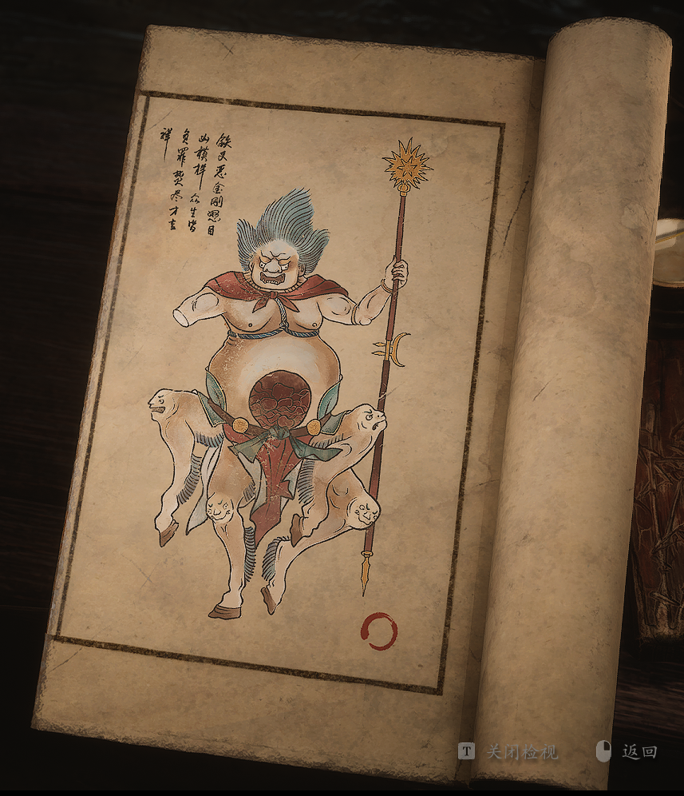

## 1.50 地莲精

> 云上尽瑞祥，未知世沧桑。
>
> 子孙飘零尽，本为择膏梁。

古籍载，凡菩萨佛祖显圣之时，地涌金莲，璀璨生辉。

随着岁月流转，金莲们渐生不满。他见灵山的老鼠，偷饮灯油而称王；南海的鲤鱼，窃摘莲花而作祖；甚至连毒蝎蜇伤如来，亦得了老魔的权势。反观自己，勤勉效力，却一无所得。

他们细细盘算，决定把登堂入室的重担交给后代，便将种子抛洒凡间，希望它们在下界修炼成妖，得道升天。

可金莲们未尝料及，凡间的修炼之路，异常坎坷。诸多机智勇敢的生灵，亦有得道的想法，竞争残酷而激烈。投生下界的金莲们也想过许多办法：化作女子，欲骗凡人元阳，却被道士所识，斩于剑下；化为老者，欲以智取，骗食书生，反被看破嘲讽；诸如这般，不胜枚举。

历经波折，下界的金莲们渐渐发觉，本相反而更有胜算。他们重回庙字间，以佛祖菩萨庇佑的瑞兆，诱人采摘，再将人吞食。

咦，若要以急功近利之心，参悟世道，世道何其纷杂？因果相连，缘分奇妙，每行一步，皆有定数。

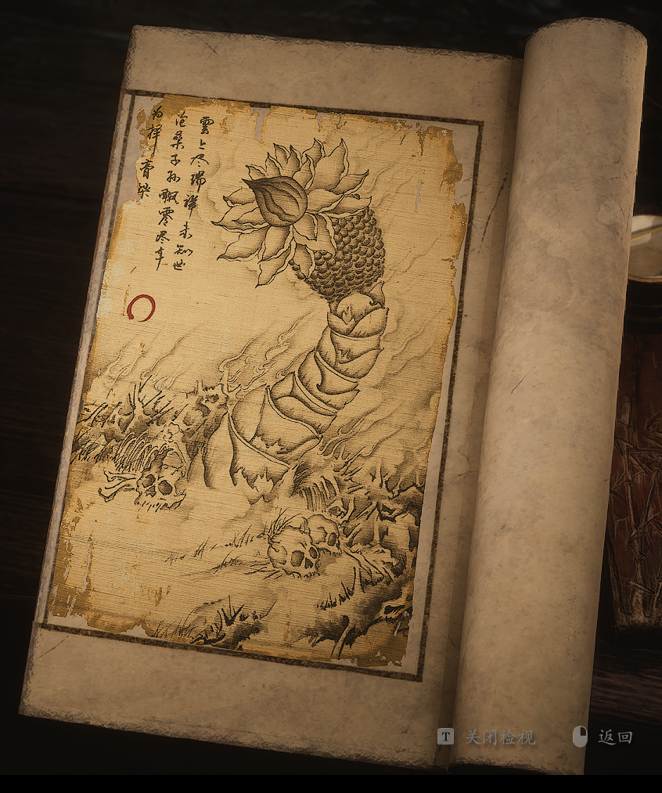

## 1.51 巫山小妖

> 嘴长肚儿圆，生来不十全。
>
> 身粗贪美味，弄舌爱胡言。

某年春，盘丝岭大设赏花宴，巫山来的小妖，交明了花红表里，见夫人们正在席间谈笑，便去洞中与小妖们饮酒作乐。

几杯酒水下肚，大家互相打趣起来，一猪妖道：“你们洞里当真阔气，四时八节都有宴席，哪像我们那处，夫人严厉得很，平日没什么乐事。”

一虫妖骄傲道：“几位奶奶都是怕夫人太寂寞，所以常常设宴，找人来陪她说说话。我们不敢与天上比，但我们二奶奶在凡间确有些买卖，不差银钱。说来也是难，她若不想法添置些，我们哪能撑到今日。”

另个猪妖道：“你们家几位奶奶，各个都仙姿玉色，不知哪座仙山能得了这福气去。”

那虫妖笑道：“我们奶奶离不了此地，外头的买卖也都是挑了好的人在支应。因为只招上门女婿，才俊们都不肯来，来的奶奶们看不上。你瞧瞧那边，四个毒敌山来的，家道落寞，子孙不济，只有一个还看得过眼。奶奶们都不肯嫁，说是哪日撞天婚，谁倒霉谁嫁他。”

众妖笑做一团，正是畅快，却听那边高呼：“不得了啦，不得了啦，两位夫人吵起来了。”

又有个管事的猪妖，气喘吁吁地跑来，大喝道：“这洞里的夫人昏了头，因小丫头多了两句嘴，就和我们夫人吵起来了，还砸了送来的东西。”

众妖俱是一惊，有那乖滑伶俐的，赶紧拿荷叶包了吃食，递与猪妖赔罪：“下次再来，此番定是有些误会，扫了大家的兴致。”

“好说，好说！” 猪妖们拿的拿，揣的揣，赶紧随着管事的往外走，问道：“到底出了何事？”

“ 谁知道呀， 古怪得很，每次来都得闹一场， 听说他们家的夫人向来糊涂得很。”

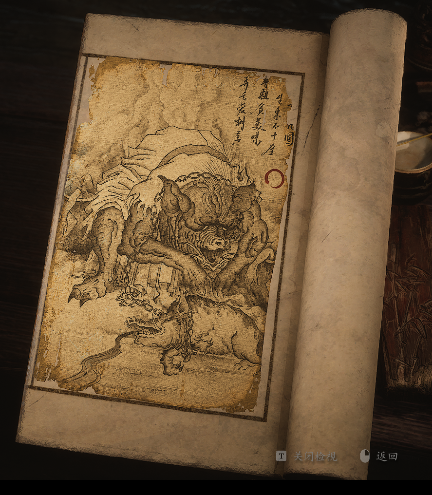

## 1.52 傀蛛士

> 糟鼻子，歪俫口，獠牙尖利毒浊稠。
>
> 查耳朵，砍额头，面生八目相貌丑。

昔年，有个樵夫住在深山之中。某次他下山赶集，观赏了傀儡戏，十分喜欢，便一直惦记着，想寻个机会再看一次。

这日，他在山中砍柴，突闻得欢呼喝彩之声，便循声而去。瞧见有群妖怪正围在一起，好不热闹。那樵夫虽是害怕，但耐不住好奇，就攀上块岩石，远远眺望。原是那群妖怪，围着空地在看杂耍表演。樵夫站得太远，看不真切，只能认出有个身着红衣的妖怪，正舞着两柄尖刀，旋转翻腾，非常精彩。

樵夫情不自禁朝着那边走近了些，又见那翻腾的妖怪背上，反绑着几条腿足，足上悬着些丝线，他一眼便认出那是傀儡的戏法，赶紧选了棵大树爬上去，要在近前观看。

那怪相貌滑稽丑陋，樵夫只觉这表演比那集会中的鲍老戏还诙谐，看得如痴如醉。忽觉脖上一凉，樵夫伸手摸去，是些绿色的口涎。他赶紧抬头，正对上几只盯着他的眼睛。原是那树顶上，吊着个藕荷色的大蜘蛛，它的腿上连着许多丝线，牵牵扯扯，带动着远处的那只妖怪。

樵夫怪叫一声，跌下树去。大蜘蛛顿时停下，看戏的妖怪们也纷纷回望过来，都死死盯着樵夫。樵夫吓得急忙逃命，回去后一病不起。他吃了许多药也无济于事，没过多久就病死了。

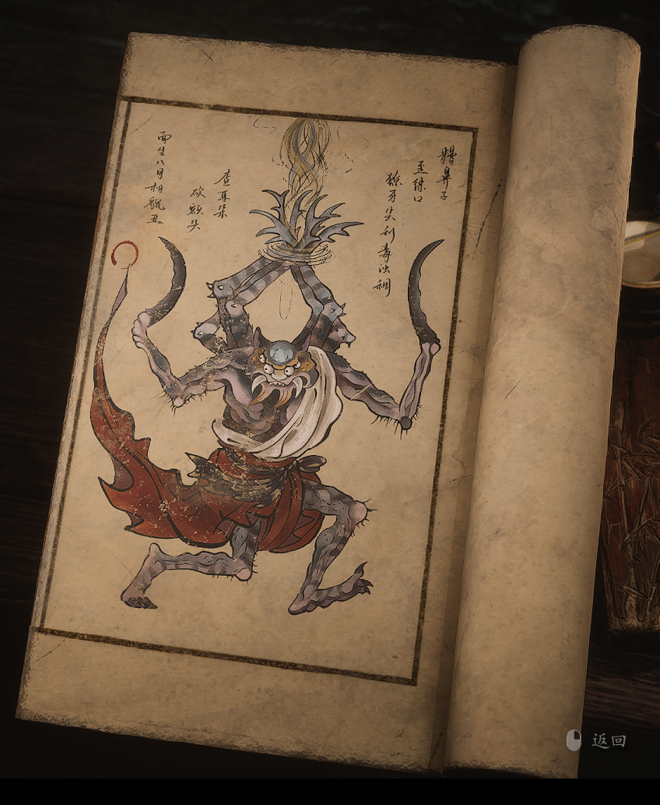

## 1.53 儡蜱士

> 外相包皮君可识，身后安排有谁知。
>
> 下场高挂成何用，刻木牵丝此一时。

相传，盘丝岭中曾有个朱家大院，是朱紫国纺织大户朱氏的祖宅。大家都说那院子里藏着许多金银珠宝，但从未被找到过。

却说朱紫国里住着两个盗贼，二人兄弟相称。年长者，是个魁梧憨实的汉子；年少者，是个精细俊秀的郎君。他两个因被官府通缉，便想着去山中寻那朱家大院，顺道避避风头。二人在山中寻了数日，干粮吃尽，一无所获。正是精疲力竭，艰难前行之时，忽见有座茶寮。郎君急忙道：“兄长，我们去那里歇歇脚吧。” 汉子道：“我们走了多日，不曾见半个人影，何来茶寮？” 可那郎君早已饿极，甩开汉子就跑了过去。

汉子紧随其后苦劝不止，二人拉拉扯扯，进到茶寮之内。茶寮不甚整洁，粗劣的桌子是用木桩削成的，地上堆着石块权当凳子。里头没有茶客，仅有个拄拐的驼背老汉在煮茶。郎君问道：“老头，此地无人，你怎在这里卖茶？”

老汉指指茶寮后，隐隐绰绰的村落，道：“老拙住在山顶的村子里，在此处摆个茶寮挣口饭钱。”言罢，老汉盛出两碗茶来，汤色浓稠，异香异气，郎君立时就要去接。汉子拦住，又问道：“你可知道朱家大院？”老汉笑道：“正在村内哩，二位吃完茶，我引你们过去。” 郎君听罢，十分开心，汉子则更加忧虑。他抢过郎君手中的茶碗，道：“我先试试。” 言罢，一饮而尽。

茶刚入肚，汉子立时痛苦难当，翻倒在地。郎君再去看那老汉，但见他转身一旋，现出原形，乃是只驼背杵杖的大虫子，身上缠着许多丝线。顺着丝线往上看去，有只大蜘蛛正趴在屋角，提着丝线，引着大虫子敲击拐杖，发出“铮铮”的声响。地上的石块闻得此声，伸出腿足，变成一个个小石蛛。它们朝着汉子喷出蛛丝，要将其捆住。那俊秀郎君见到这般景象，来不及管他那正在求救的兄长，拔腿就逃走了。

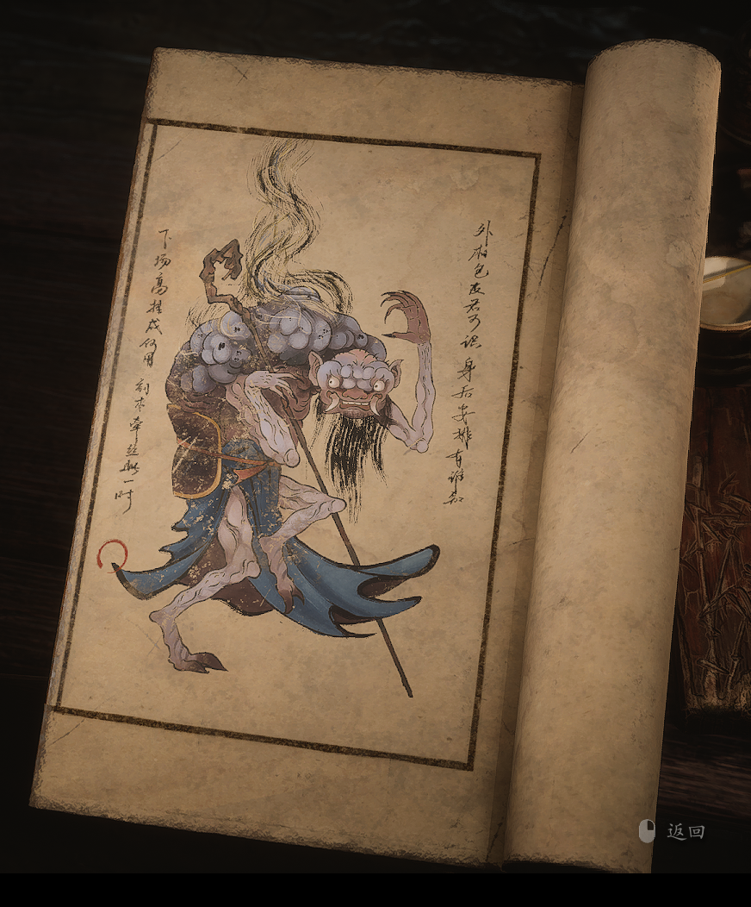

## 1.54 幽灯鬼

> 夜阑无光自有明，召阴克阳火荧荧。
>
> 好似庄户急收麦，行割随手取性命。

虫妖们素来不爱巡夜，因为扑火的天性，让他们很容易在夜晚受伤。幸而，有群自西边来的青面夜叉，登界游方，最终在盘丝岭安家落户。他们主动请缨，要承担巡夜的工作，虫妖们便顺水推舟，把这个招人嫌恶的缺儿让与了他们。

夜叉秉性桀骜，虽然落草为寇，今非昔比，但他们仍然积极划分族群，早晚都点着灯笼，很少与虫妖们来往。虫妖也视夜叉为稀奇的异类，看不惯他们目无尊长，不分上下地戏耍作乐。更令虫妖们迷惑的是，夜叉们开心时，看似关系很亲密，但他们经常翻脸吵架，次次都言语犀利，锋芒毕露。

某夜，又有四个夜叉在巡夜时闲磨牙，继而争执了起来。因为闹得动静太大，将洞外的虫妖们全都吵醒了，它们急急赶来劝道：“你们每天如此，山前吵完，山后和好，到底闹腾些什么？何不如我们一般，客客气气的多好。”

四个夜叉原本争得面红脖子粗，一听此话，马上合力反驳道：“你有所不知，言论畅达才能积极进取。”另一个帮腔道：“意见之不和，说开了方好，彼此相知，感情才能厚笃。”第三个也赶紧道：“正是。我们互相扶持，一路残存到此，即便言语激动，也不伤和气。”最后一个总结道：“我们夜叉才不像你们虫妖，面和心不和，外头客客客气气，心里实存许多怨怼。”说罢，他们四个又勾肩搭背地一起离开了，留下无法理解他们的虫妖们以白眼对之。

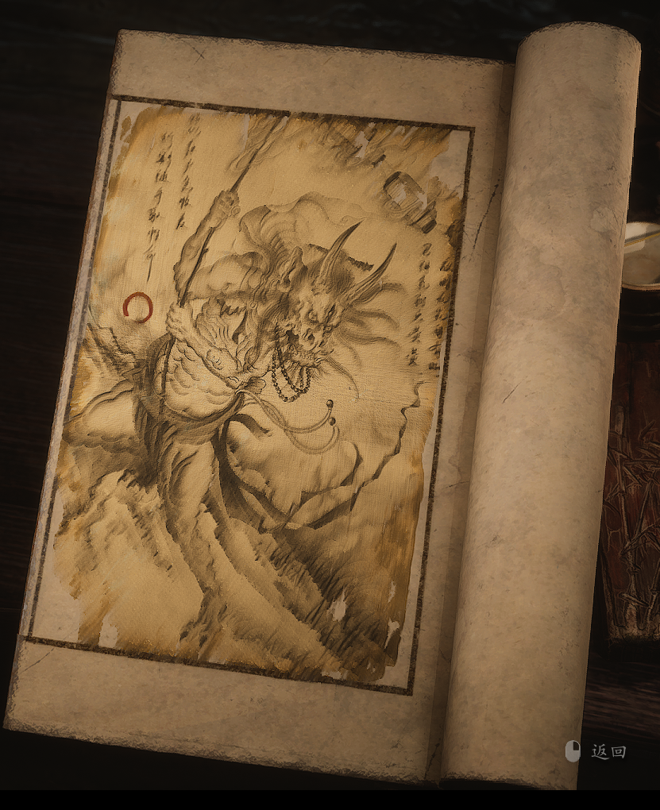

## 1.55 蜢虫精

> 青矜腿脚长，铁臂镰钩亮。
>
> 长林饱风雾，论亲心同样。

元鼎中，有个甘泉村。村内有口热泉，是从山体内自然冒出。相传，此泉的水，能驻颜益寿，达官贵人们纷纷慕名而来。

一日，乐成侯来村中游玩，他的儿子时年六岁。小公子在草中捉得一只小蚱蜢，想留在身边赏玩，便拔掉了蚱蜢的翅膀，将它扣在茶杯之内。

是夜，乐成侯梦见有个青衣人前来求告，他悲痛欲绝地说：“你的孩子将我的孩子困住了，我们同为父亲，希望你帮帮我的孩子。”

次早，乐成侯叫来儿子，盘问是由。孩子素怕父亲严厉，支吾应对，二人都未得出始末。夜里，青衣人再次入梦，腰配双刀，警告乐成侯道：“你再不放还我儿，以后也休想见自己的儿子。”乐成侯惊醒，急急找去，发现儿子的床塌已然空了。家丁全村找寻，也无半点音讯。

唯有小公子的书童，记起昨日捉虫之事，赶紧找入书房，寻得那只倒扣的茶杯，小心翼翼地将小蚱蜢放回了草地。

次午，小公子安然归来，只是双手通红肿胀，啼哭不止。问他昨夜发生何事，他只呜咽道：“我夜来梦见个青衣人，极善跳跃，他背着我蹦了几下，我就不知身处何地了。他责我伤生，拿大刀拍了我二十下手板。”问及他是如何回来的，他却说不明白，想是吓着了。

咦，都说世人皆爱子，天下一般，人同此心，原来妖怪也不例外呀。

及至延康年间，甘泉村的热泉突然断流，山岭之中生出许多虫豸妖邪，村民便搬去山下居住了。又过了一二十年，此地改名唤作盘丝岭。

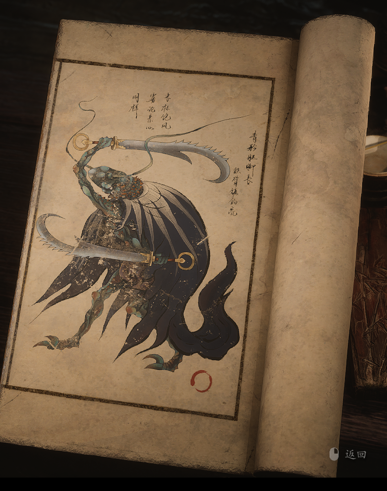

## 1.56 蜻蜓精

> 穿花度柳放暗箭，奋翅鼓翼乘歪风。
>
> 好行小慧难成善，三三两两阻道中。

蜻蜓精很爱射箭，母亲发现他有这项才华，便托了关系，将他送去妖王处学艺。

在妖王看来，蜻蜓精是个异常优秀的徒弟。他每日除了勤勉地完成练习，还十分恭敬地服侍师父，随叫随到。有时他明明刚在殿外射箭，但师父嘴上一提，他就立刻出现在了跟前。师父本有些怀疑，但想他有双灵便的翅膀，行动如风，似乎也合情理，便没再深究。

这日，师父教他如何在箭上蓄更多的妖力，叮嘱道：“只待箭头耀光，正是射出之时。”那蜻蜓精满口答应记住了，可当师父下午考查时，他却懵然无知。师父暗想，许是他未曾学会，又细细教了他一遍。待次日再问，他又不明白了。

这般情况越来越多，妖王动了大怒，要惩罚蜻蜓精。蜻蜓精心下害怕，赶紧跪地求饶，道：“师父息怒。我有几位同胞兄弟，平日里，大家轮番学习和休息，所以各自都只学了一点，这才答不上来。”言罢，妖王就见拉拉杂杂跑出来数十个蜻蜓精，长得俱是一般模样，全都跪在那里，不停磕头。妖王见此哭笑不得，将它们贬作巡山小妖，再也不教他们本事了。

咦，小聪明初时总显得周全完美，招来称赞和嘉许，其实暗中却埋下了隐患，待露馅之时，非但遭人嘲笑，还会惹祸上身哩。

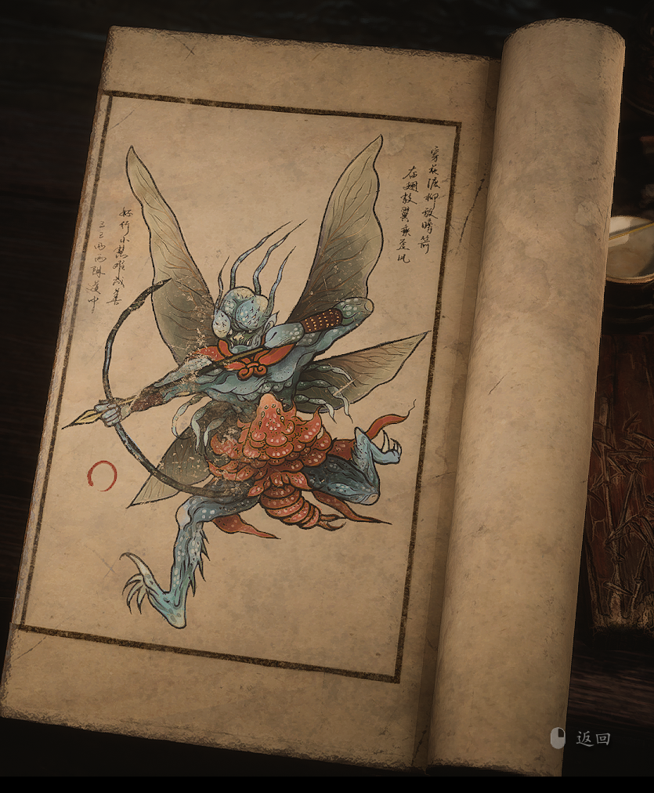

## 1.57 蚂蜂精

> 乘胜既低飞，势竭倏远逃。
>
> 辛苦忙淘染，借力上青霄。

盘丝洞里曾住过一位少年，你道他为何住在妖精洞中？原来，他本是朱紫国人士，家中以纺织为业。某日，他父亲要去寻一柄玉梭，自此没了音讯。他母亲几次寻访，都说他父亲抛妻弃儿，入赘了朱家。母亲成日哭泣，说他父亲是被妖精迷了心窍。于是，少年自幼时起，便立誓要杀妖精报仇。

一日，他听闻过山的商旅，谈及盘丝岭上的朱家大院，说那里的女子各个花容月貌，便独自去岭上寻仇。不想，他刚一入山就被小妖所获。正在他害怕无措之时，有个穿黄衣裳的小姑娘喝止众人，救下了他。这小姑娘十岁上下的年纪，粉面可爱，与“迷人心窍”相差甚远，少年一时竟不知如何是好。

未料，这小姑娘娇憨烂漫，许是极少有同龄的玩伴，一见少年便将他领到洞中玩耍去了。少年在洞中暂时住下，小姑娘时常来找他解闷，他内心很是矛盾，就夜夜对着油灯告诫自己，明日定要杀了妖精报仇。某夜，恰巧有只细小的蜂儿飞入他屋内，将他说的话全都听了去，少年却全没在意。

次日，小姑娘没来，却来了位身着青衣的女子。她盘着髻，一脸凶相，异常美艳。女子身后有一队虫豸侍卫。其中有只蚂蜂精，熟练地从少年的衣箱里，翻出了逃跑用的盘缠，从瓷枕里搜出了刺杀用的匕首，并将少年对油灯念的复仇之话复述了一遍。

青衣仙子对少年道：“盘丝洞本不留活人，但念幼妹没有玩伴，所以我们未曾伤你，如今你却想着要害她。不过，你也是为父报仇，情有可原。那就让虫窟来决定你的命途罢。”言罢，侍卫们将少年一下押住，将他拖了出去，扔入深穴之中，没人再管他死活了。

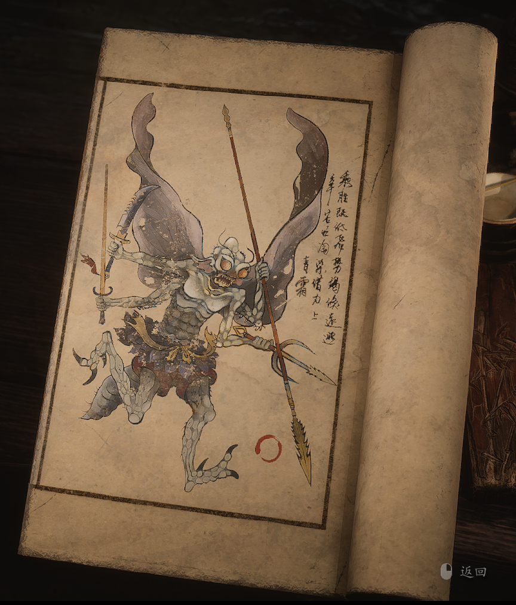

## 1.58 虫校尉

> 暑往寒来春复秋，形骸蹉跎渐老丑。
>
> 了知白发换功名，性刚气傲累君生。

不比蜜、蚂、蠦、班、蜢、蜡、蜻——这些仙姑们的义子，甲虫校尉的功名，是靠自己一刀一枪挣回来的。许是这个原因，他为人耿倔，很介意别人对他的礼数，经常因一些语言和行礼的小事，与小妖们吵个没完。小妖们总在他背后说他作威作福，傲慢自负，愈发讨厌他了。

这日他又因小事与小妖们争执起来，绰着两口大刀就要与他们比划比划。甲虫总兵恰巧路过，将其拉到一旁，提点道：“你总仗着自己的功绩和本事，要求别人恭敬你。可你须明白，身份的高低与旁人如何行事毫无关系。如果以他人的态度来评判自己，那岂非石蛛们对你无礼，你就比石蛛还鄙薄了？”

甲虫校尉反驳道：“您身为总兵，大家自然不敢得罪您，如我这般是个小校，若不为自己争辩，更要被那些小妖们瞧不起了。”

总兵摇头，道：“若大家对你的礼数超过对我的礼数，你就能凭此比我道行高，功夫深了吗？自我投生以来，要求礼数越多的人，恰恰越得不到敬重。”

有人问甲虫校尉后来如何了？咦，他还是老样子，性格使然罢了。听说他后来处处与人争锋相对，最后不知所踪了。

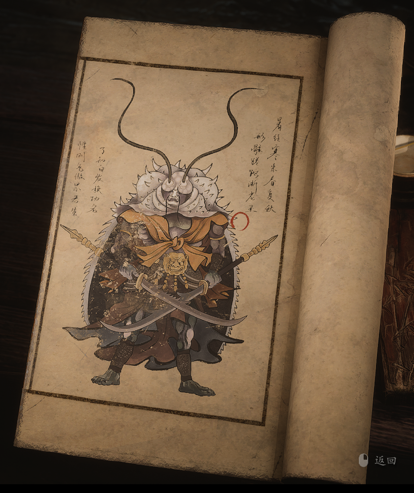

## 1.59 石蛛

> 渺渺怜身小，微微何足道？
>
> 无衣裹危石，敌忾有同袍。

昔年，盘丝洞有个小妖凭借实力，真刀真枪爬到了校尉之职。不想，他新官上任却成天作威作福，闹得众妖都对他爱答不理，让他很是气恼。

这日正逢休沐，甲虫校尉无友可聚，就独自在洞中闲逛。远见有个石块，伸出些细长的腿足来。原是有寄居在那石中的蛛儿，要起来活动了。

这些蛛儿因要驮着石块，走起来总是颤颤悠悠的，十分蠢笨。原也不打紧，奈何校尉心气不顺，就起了作弄之意。他故意将石蛛一脚躧翻，看着它蹬腿踢足地挣扎，翻不过身来。待它刚要成功时，又用脚尖一挑，将其再次掀倒，大笑不止。

也不知耍了多久，洞窟深处传来几下清脆的敲击声。未几，许多石蛛成群结队从暗处走来。校尉见它们似有威胁之意，抽出兵器，冲入蛛群，与它们打作一团。石蛛们也毫不畏惧，抛石丢瓦，吐丝喷毒，冲撞顶击，把个校尉逼得发起火来，竟舞起双刀在蛛群中乱杀乱砍。他杀得正是起劲，忽有一豆灯火从远而近，有个俏皮的声音道：“好个呆子，你难道想凭一己之力，杀光洞中所有蜘蛛吗？不如随我来，我带你到桃花树下耍子。”

甲虫校尉抬头，看见是个神仙似的姐姐，不由心下一炙，紧随女子去了。之后，大家再也没见过他。有个老妖品评道：“蜘蛛洞里杀蜘蛛，真是寻死哩。”

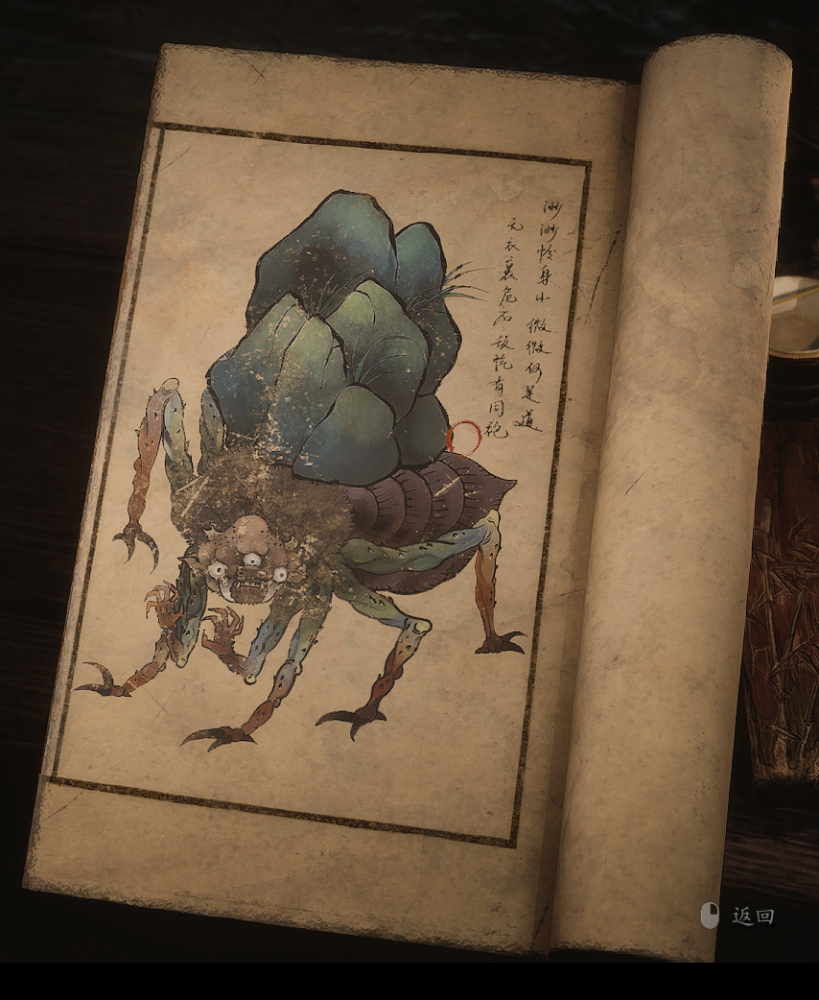

## 1.60 琴螂幼虫

> 投身在异乡，吐丝做茧忙。
>
> 无能羽化去，有心坠罗网。

从槐江山南望昆仑阆苑，可以看见它发出万丈光芒，气势恢弘。

在昆仑山上，有种名叫土蝼的东西，它长得像羊，却有四个角，会吃人。有种名叫钦原的东西，长得像蜜蜂，有鸳鸯那么大，蛰了鸟兽，鸟兽就会死，扎了树木，树木就会枯。

周穆王曾有仙缘到阆苑中造访，游览了上面华丽的宫室，品尝了不少瑶草珍馐，听了许多美丽的仙女演奏乐曲，还见了不少神奇的灵兽。

仙女们给周穆王送上礼物，周穆王却指着阆苑中的灵兽问：“这等奇物，我可带一只回去吗？”仙女们告诉他：“阆苑中的生灵，饮天堑，食百草，即使你带下界去，它们也不复此间模样，仙法异能都无法施展。还是不要带下去了，若它变了身形，我们也不知会闯出什么祸来。”

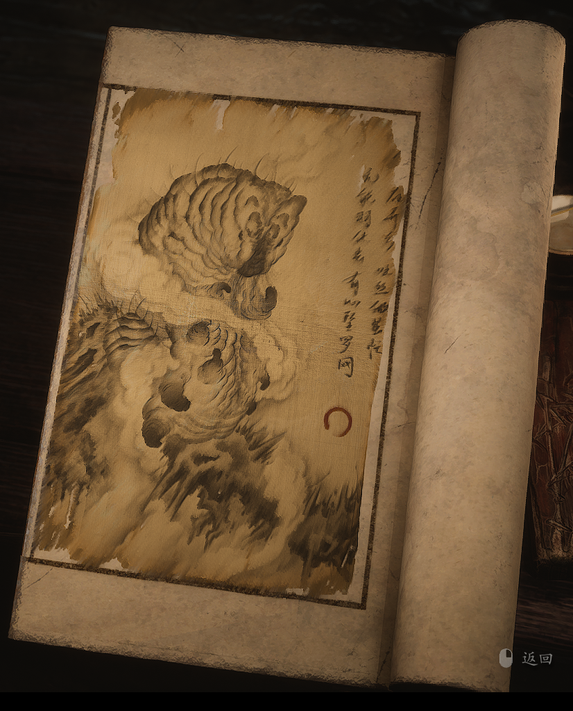

## 1.61 利爪茧

> 世事攘攘利纷纷，营营扰扰赚几文？
>
> 天罗地网甘就镬，机缘巧线自缠身。

朱紫国有个传闻：不论国王换了几代，官营染织署的朱家从不挪窝。据说，朱家能织出一种名唤降真纱的布料，如月华般莹润，如堆云般缥缈，贵胄富户都十分喜爱。城中织户们眼红许久，可从未有人能仿制出降真纱。渐渐地，大家都说朱家能织出这种布料，全靠红衣仙姥赏赐的一柄玉梭。

有个织户深信只要弄到玉梭，他也能发家致富。于是，在某个天交二鼓的深夜，他翻入了朱家在城外的布庄。

朱家阔绰，布庄有百里之大，此时夜深，四下里更无半个人影。织户独自在晒布场的垂纱间穿行，一道沁白的光华，骤然落在晒布场的中心。月色黯然，四周陷入浓黑，仅有那道光柱连接天地。

织户跌跌撞撞地奔过去，瞧见那光柱竟是无数垂落的丝线而成，有两条巨大的蚕虫，将垂丝做成虫茧来，吊在晒布架上。那些虫茧向外伸出带钩的腿足，钩住丝线并将一柄玉梭互相传递，织出华美的布匹。织户分不清是真是幻，他一心只记得冲向梭子，认为拥有它，便能拥有这般术法。不想，大茧们舞起腿足，比比划划地打来，锋利的勾刺几下就将织户捅穿了。将死之际，织户看见大蚕朝他爬来。它们将他驮到光柱中，将他包成了莹润的虫茧。

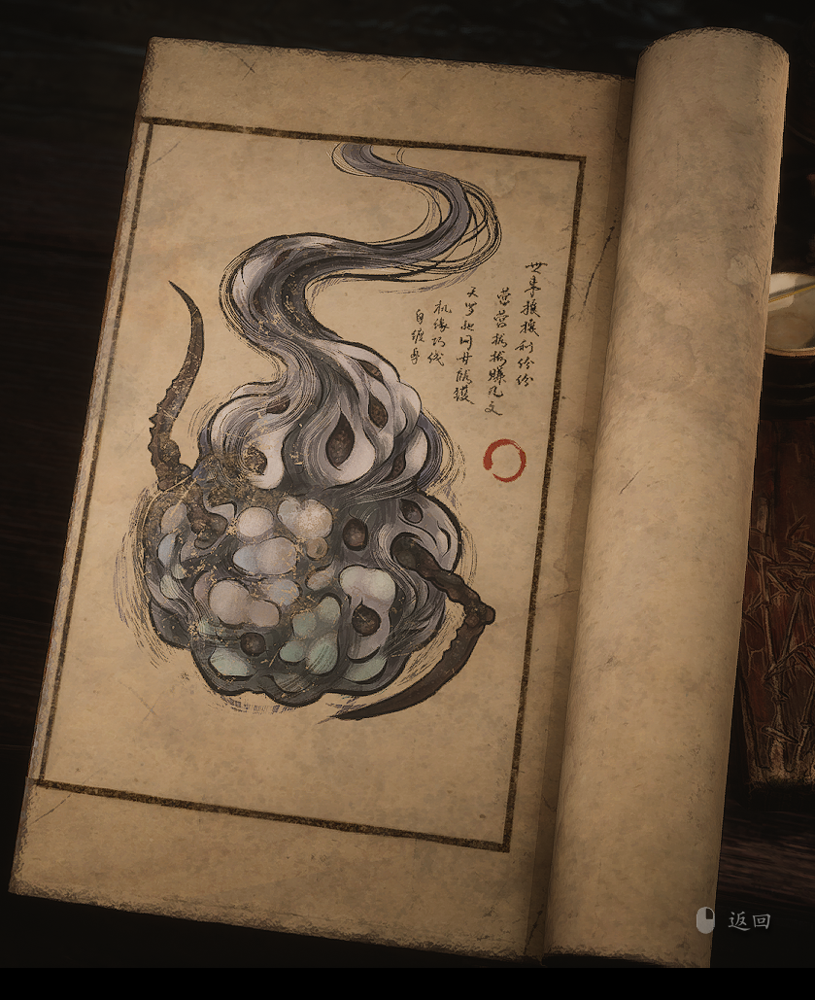

## 1.62 蝎太子

> 藏声潜毒螯，倒钩上凶药。
>
> 来时气汹汹，败阵夹尾逃。

蝎家四子，私下常探询彼此的近况。此绝非手足情深，而是存了竞逐之意，恐有手足抢先一步，被洞里哪位姐姐相中了去。

他们非但要探听行踪，末了更要点评一番。若是闻得兄弟近日有所作为，便冷言酸语，醋上一醋；若是有所过失，便讥讽嘲笑，幸灾乐祸。

洞里的小妖们，对此事非常不解，便寻至虫总兵处问个究竟。

虫总兵道：“他们担心的不是娶不到夫人，实则是担心对方的升迁限制了自己的利益。”听罢此话，小妖们纷纷表示，自己更糊涂了。

虫总兵解释道：“魔君不会让蝎家坐大，是以他兄弟四人，只要有一人做了驸马，剩下的兄弟，机会自然就小了。洞里的官职也是这般，你瞧那得了二奶奶器重的蝎大，受兄弟们的排挤也最多。”  “但那蝎大的确也厉害些个，其他可不中用。” 有小妖附和。

“是了，也正因他自己有些本事，除了背后说道说道，他的兄弟们也不敢朝他下手。若是换做别个，可就未必了……”

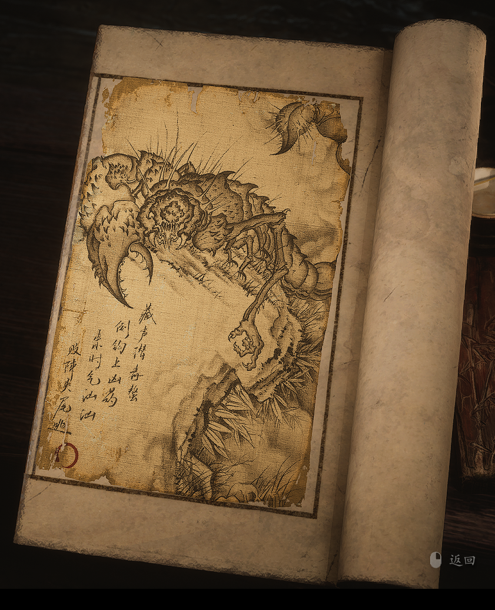

## 1.63 御剑道士

> 访道远寻师，笃志入剑门。
>
> 剑门通幽处，升仙见性根。

每十载，黄花观便大开门庭，广招一批弟子。

这日，有个新入门的小道士，发现内门师兄，共有三种不同功法的派别。一种使杖，一种使拂尘，还有一种使剑。

小道士细细观察他们，发现使杖与使拂尘的师兄，除了要负责观中杂事，吃穿用度也较不如意。反观使剑的师兄，他们只需专心练功，每日还能受到师父的点拨。小道士又私下跑去请教不同的师兄，发现使剑的师兄，也是最快得道飞升的。

但要成为剑门的弟子并非易事，需经过师父的查考，只有被定为悟性最高者，才有机缘。小道士挨个拜访了师兄们，记下了当年师父查考他们的题目，做了万全的准备。其后，他如愿以偿，一举夺魁，师父还亲为他簪了发髻，赐了佩剑。

自他入了剑门，他日日早起，在虫总兵的监督下练功，午后，又在师父的指点下练气。生活乏味又艰辛，他却很满足。

十数年的艰苦修持，他们这批剑门弟子，终于盼来了师父的认可。

师父告知他们，他们如今功法已熟，可入山闭关，若有仙缘，便可入梯仙国，等待升仙。

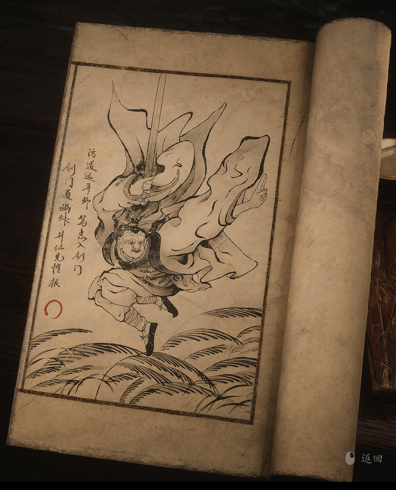

## 1.64 拂尘道士

> 宽袍鹤氅两袖风，有道无道何须同？
>
> 颂德咏功扰清梦，拂尘掸土乱虚空。

落花庄中有个道士，拜师最晚，年纪最小，因此多得祖师关照，他也乐意时时孝敬祖师。祖师伸手，他就端茶，祖师抬脚，他就脱鞋。扑蝇打扇，叠被铺床，殷勤周到，祖师十分偏爱他。

师兄们心中嫉妒，却拉不下脸面做谄媚的事，只能说长道短，排挤打压，以此宣泄。

这日，祖师登台，考查众徒弟的学问。问到小徒弟时，祖师有意袒护，便只让他背一段《道德经》来听。小徒弟满脸自信，声音嘹亮地背诵：“道，生一一，生二二，生三三，生万物……”

师兄们翘首以盼这情形许久，今日终于得偿所愿，大笑不止，甚至偷眼斜睨，要看祖师羞臊的模样。祖师果然十分气恼，甩袖走了。众师兄又恐吓小徒弟道：“你十分无状，今日气到他，以后可别想再得到他的真传了。”

其后一段时日，祖师对小徒弟避而不见，奈何身边竟无半个人能使唤周全，久而久之又念起他的好处来。没过几日，祖师就将小徒弟招来跟前伺候，可瞧见他那副心思全不在悟道上的模样，又觉嫌恶。一日，小徒弟恳求祖师传他门手艺，也不知是否在刻意嘲讽，祖师便将他日常扑蝇打扇之举，创成一套招式，教了他些御风的法术，草草了事了。

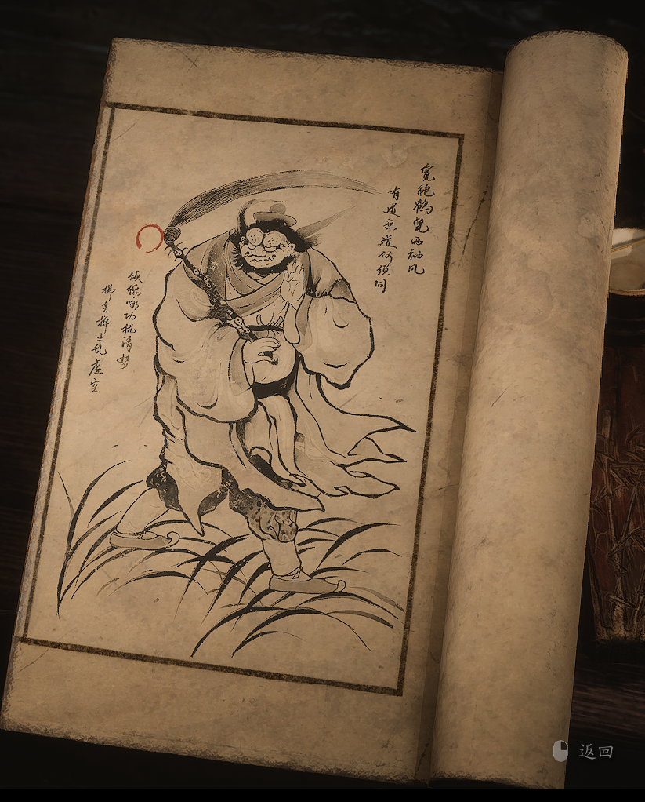

## 1.65 执杖道士

> 仙山云水连天涯，天涯望尽不见家。
>
> 持杖远走入危巢，得享白雪与黄芽。

昔年，有个山村建在多虫的山岭之上。后因怪事频发，山民们纷纷搬走，这里便成了个荒村。却说山下的村里有个青年，母死家贫，父亲是个赖汉，对他很少管顾，村民们也都瞧不起他，时常欺辱，他自觉在村中难以为生，索性躲去岭上的荒村居住。

那荒村被一伙虫妖所占，青年登上山岭，立时就被妖魔捉了去。他本没牵挂，存了求死的心，全无反抗之意。虫妖们见他这般，并不为难他，将他安顿在了一间破屋里。

是夜，有个中年道人，带着衣裳饭食而来，对青年道：“我听闻你无处可去，便为你带了些起居可用之物，你若不嫌弃，就拜我为师，留在此间罢，我还能教你些养气之法。”那青年许久未被人关照，急急换了道袍，行了拜师之礼，从此便和虫妖们一起生活修炼。日则同行同坐，夜则同息同止。

这日，有个书生闯入青年的房中，道：“我刚从妖怪的洞府里跑出来，他们把我封在虫茧中，不知是何打算。我正要逃离此地，见你是个活人，我们一起走罢。”那青年摇头道：“我在这里过得很好，为何要走？”那书生气愤道：“因为他们是妖怪，而你是个人。先不说他们日后是否会害你，且说你跟他们相处久了，也会变成个怪物。”

“你说得对，” 言罢，青年抄起身旁的长杖，将书生打翻在地，“可就算变成妖怪，我也心甘情愿。” 那书生见青年执迷不悟，忍着伤痛翻出门外，独自一人逃命去了。

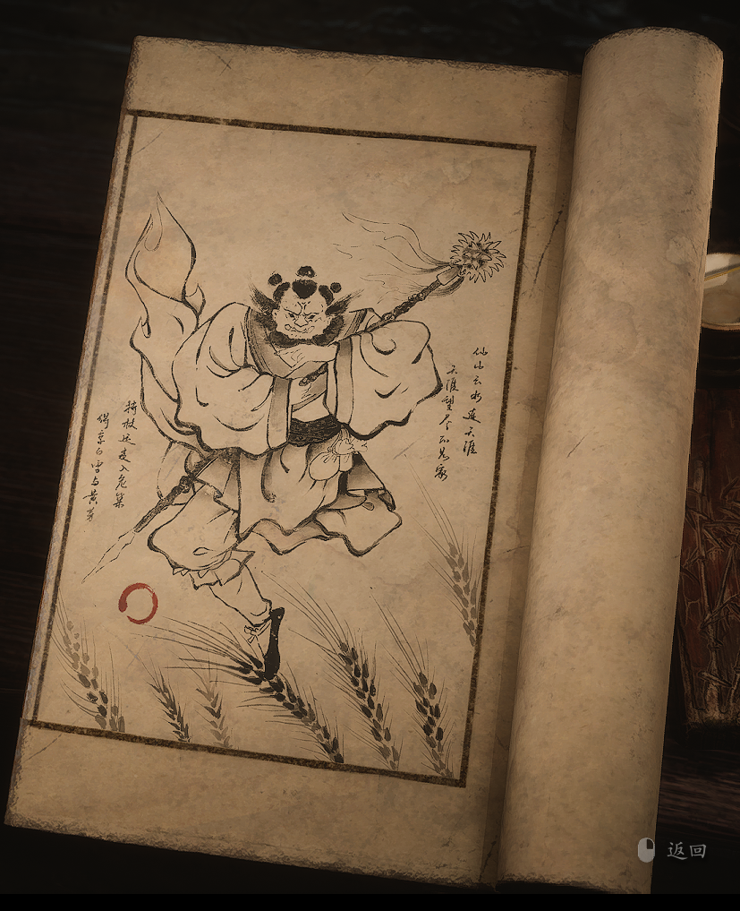

## 1.66 蛇司药

> 松竹梅兰色，豺狼虎豹心。
>
> 采药穷山川，全无济世情。

旧时，紫云山下有座道观。这日，有个苦修的道姑来此借宿，因她远走四方，风尘仆仆，观中的女冠们体恤她，便为她备好热水，让她沐浴更衣。

正是梳洗之时，道姑忽闻梁上传来响动。她毫不声张，披衣出浴，顺势拿起拂尘轻轻一甩。那拂尘应风而长，盘盘绕绕，竟从梁上捉下来个妖怪。

听得屋中声响，观中女冠们急忙来看，就见地上伏着个青色鳞片的蛇妖。那妖被捉也不急慌，想是偷看惯了的，众女冠都吃过他的亏，相继来骂他。那蛇妖满脸不屑，两颊一鼓，从嘴里喷出些绿稠毒液，四下飞溅。但凡沾到些些儿的，立时倒在地上，痛苦难当。

见此怪毫无悔改之意，道姑寄出一根飘忽的金针，要将其打灭。那蛇妖这才怕了，赶紧求饶道：“我乃是山中炼药的小妖，屋外药篓里正有解毒之物，但求仙姑饶命。”

那道姑听他如此恳切，便给他个机会。他从药篓中翻出白色小丸递与道姑验看：“此乃树珍珠，是珠树之叶，凡间少见，可解百毒。”他给众女冠每人喂下一颗，她们立刻就好了。

此后，观中不知缘何，常备有树珍珠。世有中毒者多来此观求救，只是树珍珠一颗千金，大多人都买不起，只能等死罢了。

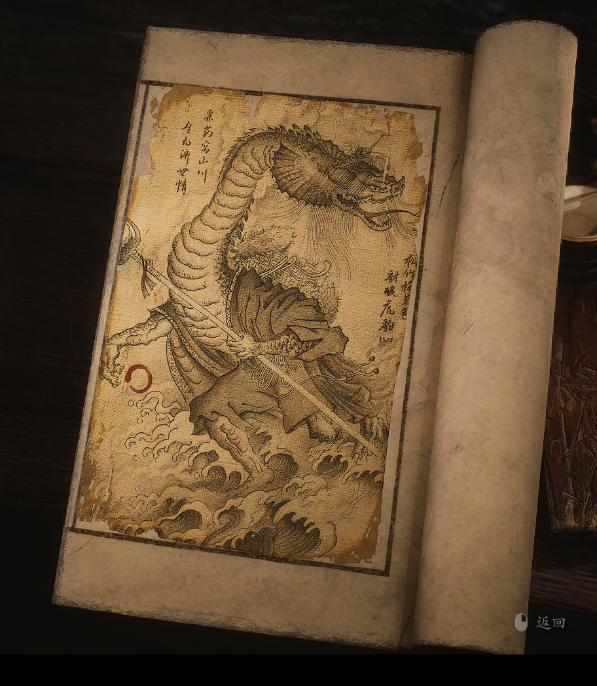

## 1.67 蛇捕头

> 头大尾细七尺长，花身电目逞凶狂。
>
> 虎纹赫赫夸海口，可怜头下怪模样。

山中有虎，好道心坚，遍访高山大川，想寻道观修行。可他道分稀薄，一直没找到肯收他的师父，直至他寻到盘丝岭，想在那处拜个得道的仙人为师。

初时，仙师嫌他是只老虎，与自己门中弟子不相类便不肯见他，老虎就跪在山门外几日不起。仙师觉他有几分诚意，给了他个机会，收他做了个外门弟子。

岂料那老虎没长性，凄凄哀哀地拜师后，却不见用功，仙师劝他道：“修行是靠自己，不是靠师父。”怎奈那老虎却点拨不通，仙师就罚他去虎蛇虫林守山。老虎被罚心中愤愤不平，越发耍赖躲懒，成日只在树下闲躺，嘴里还骂上师父几句，以此打发辰光。

这日，他半睡半醒地躺在树下，嘴里又抱怨起师父来，他忽闻耳边一声轻叹，有团东西滑入他口中，他吓得惊坐而起，周围并无半个人影，干呕许久也没吐出来什么，以为自己只是做了个梦。

过了些时日，老虎的脖颈变得又细又长，再也不能说话了，整日很勤奋地在空心林中巡视。大家私底下议论道：“他学道虎头蛇尾，师父定是对他做了些惩处，他才变成这般模样，以后我们都得小心才是。”

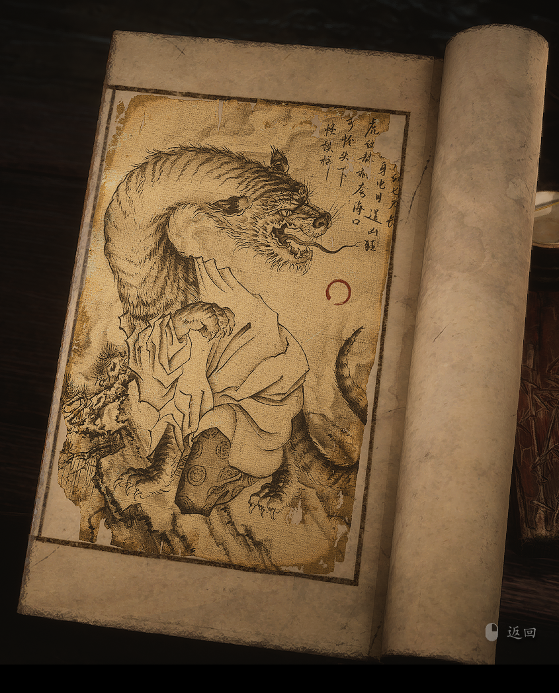

## 1.68 虫羽士

> 吞丹催羽化，染秽同污流。
>
> 宁向直中取，莫向曲中求。

观中舞剑的弟子跟着师父修行已久，他们从拜入门下，都怀着得道的心愿，练功不辍，非常刻苦。

这日，师父终于告知弟子们，经过长年的修炼，他们功法纯熟，可随他去山中闭关，若是有机缘，便可羽化飞升，前往北方的梯仙国，等待位列仙班。众弟子欣喜不已，收拾好行囊，急不可待地随师父入山了。

师父带着他们，使一个缩地法，到了一处风景奇绝的山中。那里满山金风飘荡，秋叶飒飒，一副秋高气爽的景象。

山顶有一处庄子，他们放下行囊，师父就领着众人，顺着庄后的小径，走到了峰顶。只见空中垂着缕缕丝线，丝线一头悬在山岚之中，另一头却高在云端里，不知能到何处。师父道：“这便是前往仙国的天梯，几百年前，你们师兄正是在此处飞升的。”

语毕，他与每人发了颗藕荷色的奇物，道：“这是助你们羽化的仙丹，徒儿们快快服下罢。”

众人正是心情激荡，一下便将那肉卵般的东西吞下肚去。有几个弟子，稍有迟疑，却见先行服下的同门，面具一破，竟化成些扁头肉虫来，恶心可怖。他们吓得急忙询问师父，师父摇头叹道：“缘至而无胆，不是做仙人的料。”

叹息未止，那些羽化为虫的道士，便朝他们扑了过来。

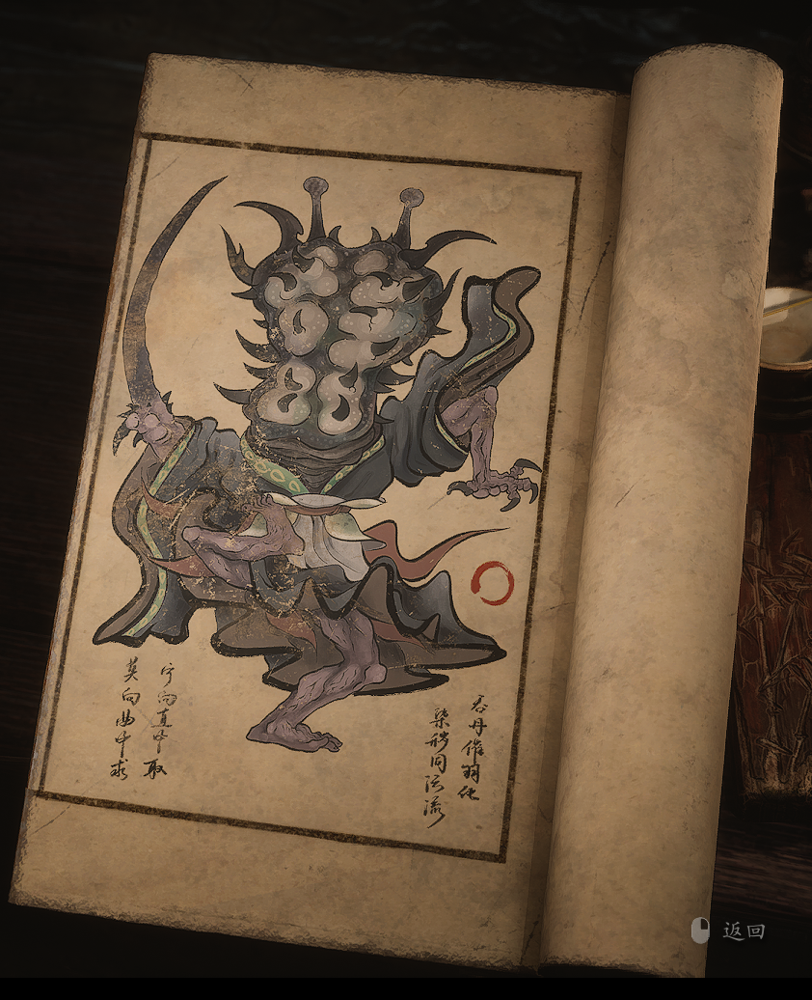

## 1.69 青冉冉

> 林深青冉冉，全无俗尘沾。
>
> 连枝常相衬，道心坚似磐。

昔年，有个富家子为访道求仙，抛离了家业，躲入山中修行。因他自小由仆从伺候，不擅家事，独自生活让他吃尽了苦头。这日，他浣衣用的木盆顺水漂走了，他便坐在河边嚎啕起来，忽听树头沙沙作响，抬眼一看，竟有个年轻貌美的女子，足踏枝叶，飘摇而来。

那女子落在他跟前，问明缘由，安慰道：“我是这林间柏树成精，听你如此好道，心下感动，便助你一二罢。”于是，女子时常帮他准备饭食，浆洗缝补。每次她来，从不多言，绝不多留。可即便如此，富家子的心中还是生了别的念想，对女子道：“你既然愿意照顾我，何不与我双修，我们做对林间道侣，也好阴阳调和。”

那女子勃然大怒，严词拒绝：“我与你修的是不同法门，况且我已有千年道行，岂会因你透漏真元？”言罢，匆匆离去。富家子多次去河边哭求，这才得到原谅，但不上半年，他又旧事重提，痴人说梦起来。

女子思索一番，道：“你未曾见过我的原貌，谈何做道侣呢？你先随我来吧。”

女子将富家子带入深林，但见群木之中，有棵巨大的柏树，树皮窊皱，沟壑森然。那女子飞上树梢就不见了。旋即古木发出长啸，拔地而起。它轻捻法诀，唤出周围几丛矮树，大家丫丫叉叉，比比划划，要教训那富家子。富家子吓得抱头鼠窜，急忙收拾行李，逃回家中去了。

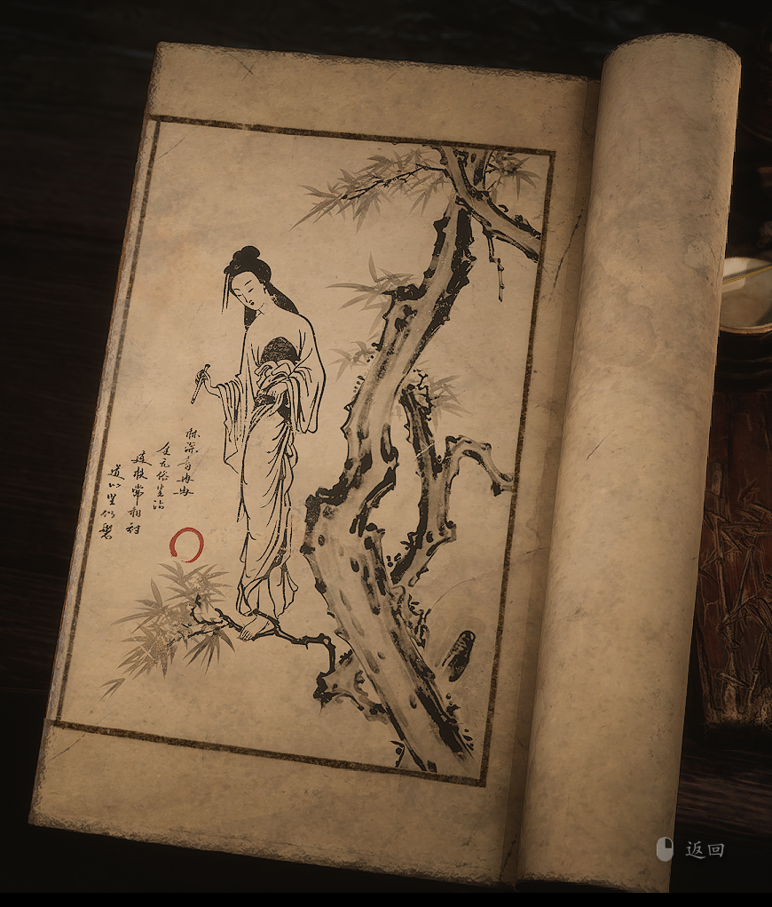

## 1.70 阴兵·力士

> 日日驱驰无日闲，乐山乐水总无缘。
>
> 普度他人空劳碌，哀叹辛酸又百年。

从地狱被土地公召来的力士们，是地狱最低阶的冥卒。他们素日里要完成许多活计来维持地狱的运转，能来阳间奉差，对他们就如休沐般快乐。

这日，四个结伴巡山的力士，边走边聊了起来。一个指着丹灶谷道：“看着这岩浆，我就想起我那差事来。若有生前放火害命者，死后入我们铜柱地狱，要裸身抱住沸烫的铜柱受刑。为了烧红那铜柱，我等只能不停地添柴扇风，还要去刷洗粘在柱上的焦皮烂肉，真不如弄个火河瀑布省事。”

另一个听完也抱怨道：“是呀。若有那生前离间亲情者，死后入我们铁树狱，要从背皮插入尖刀，挂在利刃树上。连累我们日日磨刀，时时修树，有些皮开肉裂从树上掉下来，我们还得拿针线缝补，再驮着把他们挂回去。我看，还是前头的大铁球好使。”

第三个又道：“你们这都算好。若有那生前虐待牲畜者，死后入我们牛坑狱，要被无数火牛踩踏，角顶，我们除了养牛，还要钉铁掌，磨牛角，那些踩成劖肉的亡魂隔些时日就得挖出来，不然积多了会陷牛蹄，那我们还得受罚哩。倒不如那火焰战车更便利。”

最后一个力士，边听边对着火焰山的山景一一望去，赞叹道：“还是这火焰山好啊，你们看，它多像一座与日俱新的极品地狱。”其他三个听后同时啐了他一口，十分扫兴地散了。

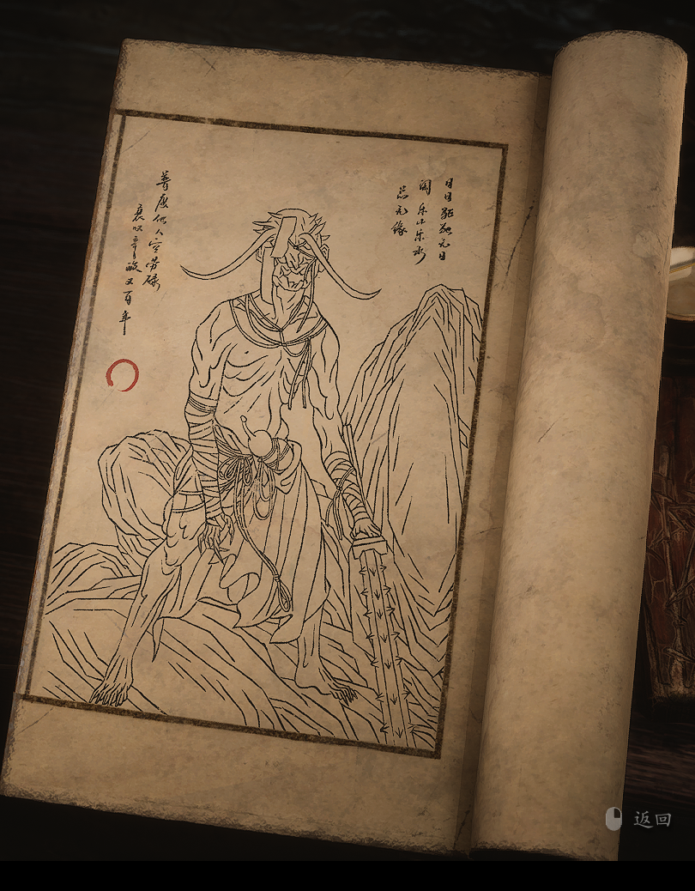

## 1.71 阴兵·弓手

> 来说是非者，必是是非人。
>
> 莫信直中直，须防仁不仁。

月陀国南大营的军队中有个伙头兵，负责每日给士兵们送饭。他时常能看到有个人影远远跟随他，他胆子很大，便跑去拦住对方，发现那原是个人俑。人俑的手里拿着弓，却没有箭，非常奇怪。伙头兵自认没做亏心事，便大声质问道：“你为何总跟着我？”

那人俑虽没有五官，却从肚子里发出声音，道：“你前世与我是同乡，我们曾在一处当兵。后来我在敌国被射伤，你却丢下我独自逃生了。我流落在野地，最终疮伤溃烂而死。我心有不甘，不肯投胎，阎王便让我当了个阴兵。我是来找你偿命的。”

伙头兵奇道：“那你为何不杀我？”陶俑举起弓，道：“这弓只射阴箭。你此生还算正直，我找不到箭来射你。所以只能徘徊于此。”伙头兵听完，问能否帮他，陶俑生气道：“本来就是你的错，该由你来偿还，怎么说是帮我？只要你能为我磕一万个头，每次磕头都念一遍佛号，我便能超生了。”

伙头兵见他如此态度，愤怒道：“你在敌国中箭，不是我射的；你没躲过箭，不是我推的。若论救你，那叫重义，若论不救你，也是合情合理，你怎么反来怪我？”言罢，伙头兵举起饭桶的盖板，就将陶俑砸了个稀巴烂。那陶俑碎裂开来后，化成风沙飘散了。

咦，连鬼也怕恶人哩。做人做事当然要反省自身，以善良为本，以巧便为门。但也需提防，别让人利用了好心，说不定他还要反过来怪你哩。

## 1.72 阴兵·火牛

> 登高堂，着新鲜，一朝报应生死变。
>
> 牛首阿旁岂为虚？人心善恶方寸间。

净乐国有个大官，位及光禄勋。这人不信鬼神，做事毒辣，为爬上高位，害死了许多人。迟暮时，他因一场风寒，重病不起。这日昏睡间，他做了一梦：熊熊烈火中，走出两个牛首妖怪，他们如人直立，身披铠甲，说要拿大官去阴曹地府对案，让他赶紧交代后事。

大官惊坐而起，想到平生恶事，害怕不已。他急忙唤来家人，命他们请和尚道士来家中打醮作法。他还将自己所攒财富，全都散了出去，施粥舍米，救济贫苦；又捐了五座寺庙，镀了二十座金身。一段时间里，整座城，都因为他而热闹非常，街头巷尾全是称颂他的声音。

某日夜里，大官又做了一梦：牛首妖怪们手执文书，来勾他的魂魄。

大官反抗道：“我这些时日做了许多善事，不说长命百岁，至少该将功折罪了！”一个牛怪解释道：“你的确做了不少好事，但你诬告忠良贤臣，诈害同僚下属，盘剥农民佃户，抢掳人口财货。如今阎王要你下去对案，你就必须下去。”另一个牛怪嗤笑道：“善是善，恶是恶。你这贪官，今番坐定是死了。”

言罢，二人就用铁链锁了大官的生魂，拖着他走入烈焰中，往地府去了。是夜，大官便眦目咧嘴，滑脱不禁，卒于榻上。

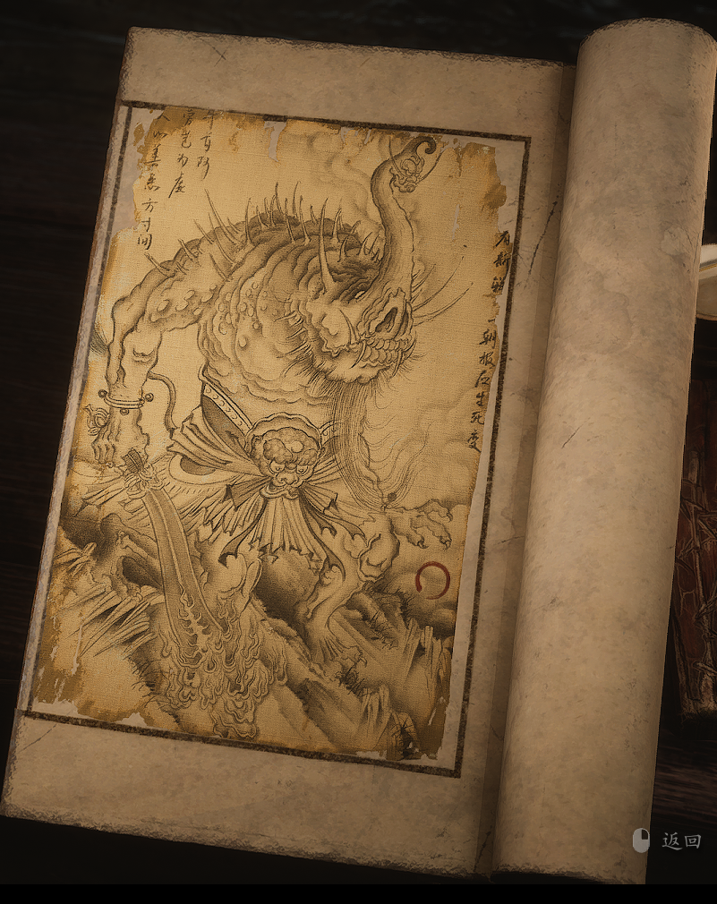

## 1.73 阴兵·焦尸

> 万事随心莫苦求，害人人害几时休。
>
> 若说歹毒无报应，自有炼狱在九幽。

净乐国有个大官，世代簪缨，他的父亲更是位及光禄勋，家族风光无两。这年，他的父亲病故，没多久，他也突然暴亡了。

他的魂魄迷迷瞪瞪来到了地狱之中，看到了许多可怕景象。最后他在一扇巨大的石门前停下，往里望去，看见许多焦尸，他们被火焰炙烤得身体干瘪，面目全非，正戴着枷锁跪在一起。突然其中一个焦尸看见他，艰难地爬起来，冲着他大喊道：“子荣，我是你爹呀！”

子荣是大官的乳名，听见这焦尸如此唤他，便信了半分，大官赶紧问：“爹，我给您做了度亡道场，您如何在这？”那焦尸道：“没用。生前做的善事，来生才能兑成福报。但做得孽，现在就得还清。太多人因我而死，阎王把我罚到无间地狱里，日日受业火焚烧！儿啊，你千万莫学我。”

言罢，他又从焦尸中叫出来其他五个，分别是大官的祖父，曾祖父，曾曾祖父……他们六个围着大官反复叮嘱。不多久，一阵阴风刮来，石门骤然闭合。大官在阳间苏醒过来。此后，他也收敛了一阵子，终究过不惯那清贫艰难的日子，他告诉自己那是个梦，又重新回到了原本奢靡的生活。

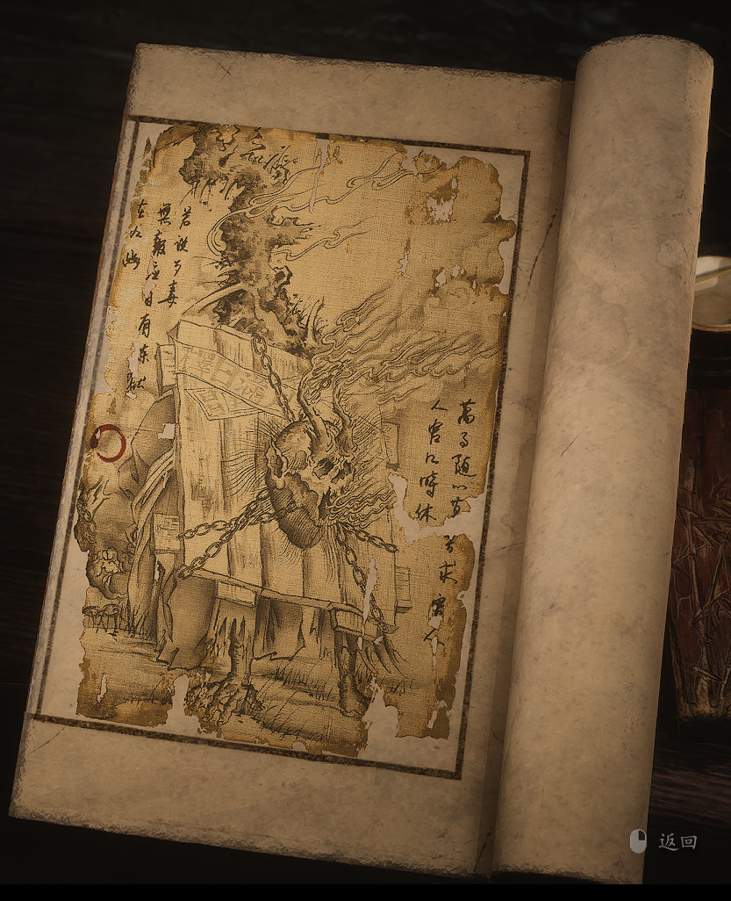

## 1.74 阴兵·黑脸鬼

> 白驹忽而已，去来何依依。
>
> 事往如流水，魂梦委尘泥。

黑脸鬼是枉死城的鬼差，与勾魂使不同，他们主要负责守卫枉死城。他们能在刀上焚起业火，将亡魂烧成灰烬，所以他们身上总是黑黢黢的。

这日，有两个黑脸鬼在城门前戍守，有个亡魂企图混出城去，被抓了个正着。一个黑脸鬼燃起刀刃就要斩灭那亡魂。亡魂赶紧求饶道：“两位大哥若能放我还阳，我就烧十库纸金锭作为报答。”另一个黑脸鬼拦住了前者，对亡魂道：“那不如我们打个赌赛。若是你赢了，放你回去。若是你输了，就别怨我们。”亡魂问：“赌什么？”黑脸鬼答：“就赌，今日排队入城的人，是不是都如你一般想还阳。若有半数，就算你赢了。”言罢，他递了纸笔过去，让亡魂在城门前，把新死者的姓名，以及生前执念都记下来。

待要闭城时，亡魂找到黑脸鬼，激动道：“我赢了！我赢了！”鬼差把名单交于城门使对比，发现数量和名姓都能对上，还补充了许多亡魂没有交代的内情。城门使十分满意，很欣赏亡魂，给了它不少好处，道：“今日城门已闭，你明日再来吧。”

一连数月，亡魂天天都来，黑脸鬼每次都和他打起了同样的赌赛。后来，亡魂不再吵着还阳了，他在城门使手下当了主簿，放下了阳世的执念。 咦，生活究竟是该往前看，还是该执着地贯彻目标呢？或许没有完全正确的解答，重要的是，自己心甘情愿地决定这样做。

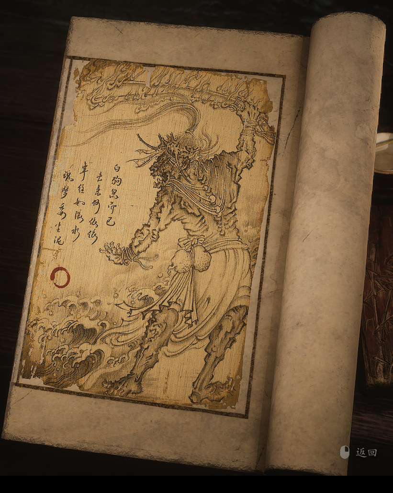

## 1.75 焰蝠

> 炎炎烈烈飞天燎，威威赫赫扑地绕。
>
> 生生化化皆因火，冲破关窍是雄豪。

火焰山有不少仙洞，可大多数洞里，都淌着流火，既不适合居住，也不适合修炼。要在山中寻得清凉的洞府，十分不易。其时，山中的小蝠妖们都极善飞腾，总能在悬崖绝壁上找到舒适洞穴。

于是，大妖怪们就以他们为踪迹，跟随他们寻到洞穴，继而霸占洞穴自己来住。小蝠妖们的洞穴屡屡被占，盛怒之下，它们索性搬去了丹灶谷中居住。

那个地界，崖边是垂天的流焰瀑布，地面是奔流的热浆火河。妖怪们都不愿往那处去，大家都劝他们赶紧换地方。

小蝠妖们对这些建议置之不理，答道：“舒适的领域我们抢不过你们，所以特选了这处极凶极险的地方。这次修行，我们要么生，要么死，再也不想过受人欺负的日子了！”

所幸，这股子气性终助小蝠妖们修炼有成。流焰虽烫伤了他们许多次，也铸就了那披着火霞的皮肤，为了闪躲飞溅的热浆，也练就了那迅捷的身手。

咦，世上本无固定的道路，若许多人走同一条道，许是它更平坦更容易。另辟蹊径必定要面对许多苦楚磨折，质疑嘲笑，若能悉数克服，那便是可以独享的收获哩。

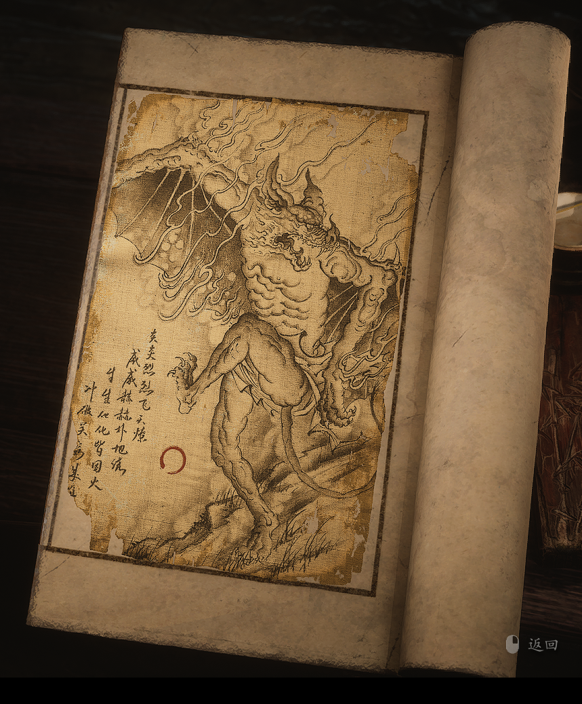

## 1.76 牛侍长

> 罗衣行火阵，金刀守翠门。
>
> 半身俗世里，枯荣皆眼尘。

历来，想寻铁扇仙求雨的人，总会供上一些花红表里。作为御前带刀侍卫的牛侍长，专司盘收交来的贡品。

贡品的好坏，关系到山中群妖们这年的受用，所以，他总思如何能让贡品里多有些自己喜好的东西。一日，他靠在门槛上唉声叹气，发现自己鼻子喷出来的烟，特别像自己最爱吃的鸡，便立刻有了计策。

他告诉所有上贡的人，每日酉初之时，火焰山冒出的烟雾像什么，就是贡品要交什么。大家真的以为这是铁扇仙给的预兆，便不顾生活艰苦，每次都按照烟雾的形状，老实进贡。牛侍长收到了许多自己想要的各种物件，生活非常幸福。可时间一久，民怨四起，大家纷纷对铁扇仙的雨表示不满。

这日，铁扇公主受天庭之邀要去听老君说法，将有些时日无法回来，自然也无法下雨。牛侍长赶紧跪到公主面前讨起饶来，原来公主根本就不需要任何贡品，每到春耕夏种的时节，自会为周边的村民施法。贡品之说，全属乌有。

铁扇公主并没有责罚牛侍长，只是命令他赶紧将东西退回去，并向村民解释清楚。可村民都不肯收，反倒又推给牛侍长，让他劝诫铁扇仙多下些雨来。最终，牛侍长夹在村民和铁扇公主中间两头挨骂，里外不是人。

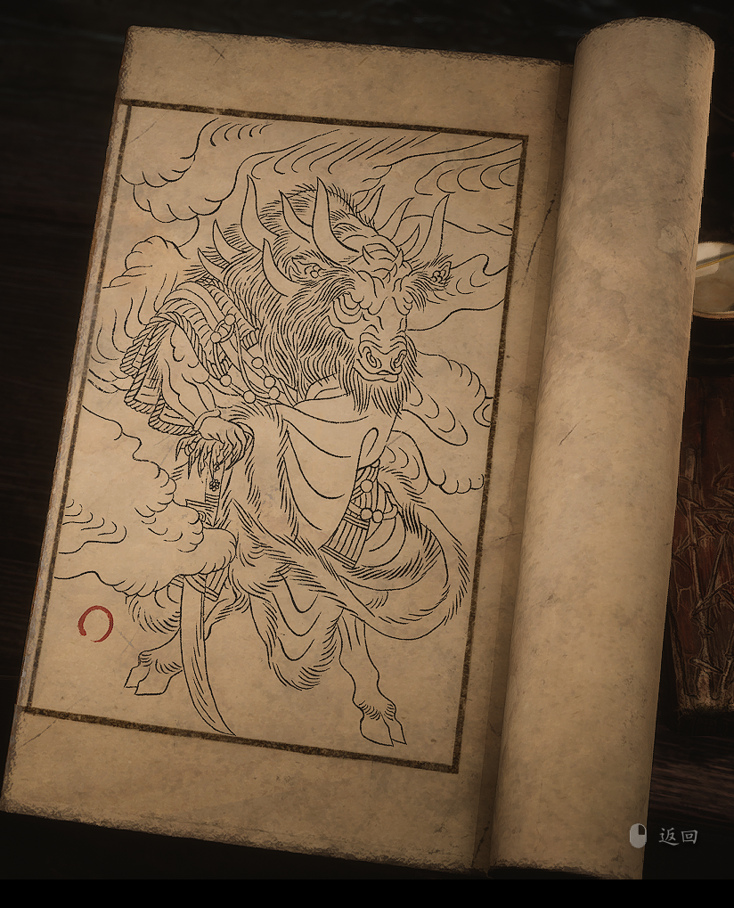

## 1.77 牛校卫

> 体壮技精妙，盾厚持枪矛。
>
> 心如烈火热，多情却被恼。

故事发生在三百年前，那时大力王尚在天庭未归，红孩儿正于南海修行，火焰山一片安宁。

某日，璧水金睛兽从众校卫中提拔了个校卫长。由于事务繁杂，校卫长便搬去了罗刹宫的宿直间居住。

校卫长分到的是西厢房和一侧的耳房，他便把耳房用来坐卧；把厢房用来待客。一日晨起，校卫长发现厢房被人连夜整理过。桌椅被擦得一尘不染，盘中有洗净的瓜果，壶里有新沏的茶水。他惊疑不定，细细盘算，想起了服侍夫人的毛女们，和伺候小姐的狐女们。他又想到，平日里侍卫们总笑他比别个俊刮些，现在升了官，是不是……思绪翻涌起来，校卫长不禁有些飘飘然然。

接连月余，这位“好心姑娘”每夜都来，却始终不肯相见，校卫长终于迫不及待。这夜，他躲在厢房外，守至四更，才闻得有脚步声传来。只是这声音粗重，失了毛女狐女们素日的做派。但校卫长顾不了那些，就在门被推开的瞬间，他已扑到那人身上，将对方一把抱住。怀中的身形结实魁梧，校卫长的胸膛甚至容不下他。对方闷哼了几下，传来牛侍长的声音：“我好整洁，看你屋子总乱糟糟的，值完夜便替你收拾收拾，你不用这般……客气……”

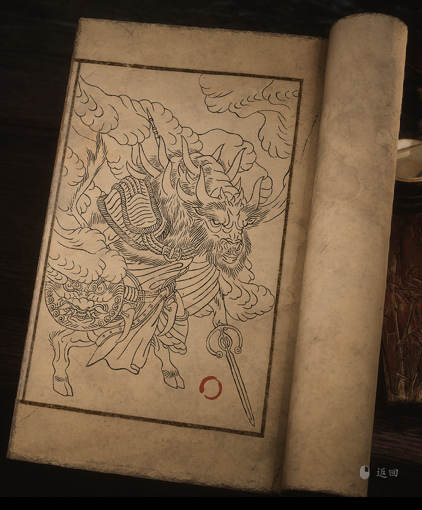

## 1.78 牛力士

> 地辟能存凶恶事，天高不负善人心。
>
> 恶有业报火销骨，善无人怜天自荫。

火焰山下有个村庄，村民以蒸糕为食，只穿葛布麻衣，生活极贫极苦。村中为了求雨，便规定将年岁超过六十的老人，送去火焰山中给妖怪们当祭品。

许老汉少年时慕道，年老后身体越发硬朗，精神瞿烁，似有长寿之相。可在他六十岁寿辰时，村民们熙熙攘攘给他大力操办了一番，便叫他坐在红布铺就的祭桌上，由后生们抬着，送往山中的石庙里当祭品去了。

许老汉在石庙里关了好几天，他又饿又渴，奄奄一息。就在他快死的时候，石庙的门突然被撞开了，有硕大的身影走进来，一个道：“又是个老货。”另一个道：“还在喘气，我们快去看看。”等他们到了近前，许老汉才看清，来的是两只穿着铠甲的牛精，手里各持一对双锤，吓得他连叫喊都忘记了。

两只妖怪却并没有动粗，他们将一个水囊递给了许老汉，还分了他好些干巴，这才对许老汉道：“从这石庙出去，沿着后头插有竹签的小路一直走，就能寻到官道。从那里往西可到祭赛国，往东可到西凉女国。”

许老汉缓过神来，这才问他们为何不吃了自己。另一个牛精答道：“你们凡人也太小瞧妖怪了，就算要吃人，我们也不吃你这个年纪的呀！我们夫人好几次将老人送回去，结果都被害死了。所以我们现在都是指路，让你们去别处谋生。你吃完了就赶紧动身吧。”

言罢，两个牛精也不搭理许老汉，舞着双锤，继续巡山去了。

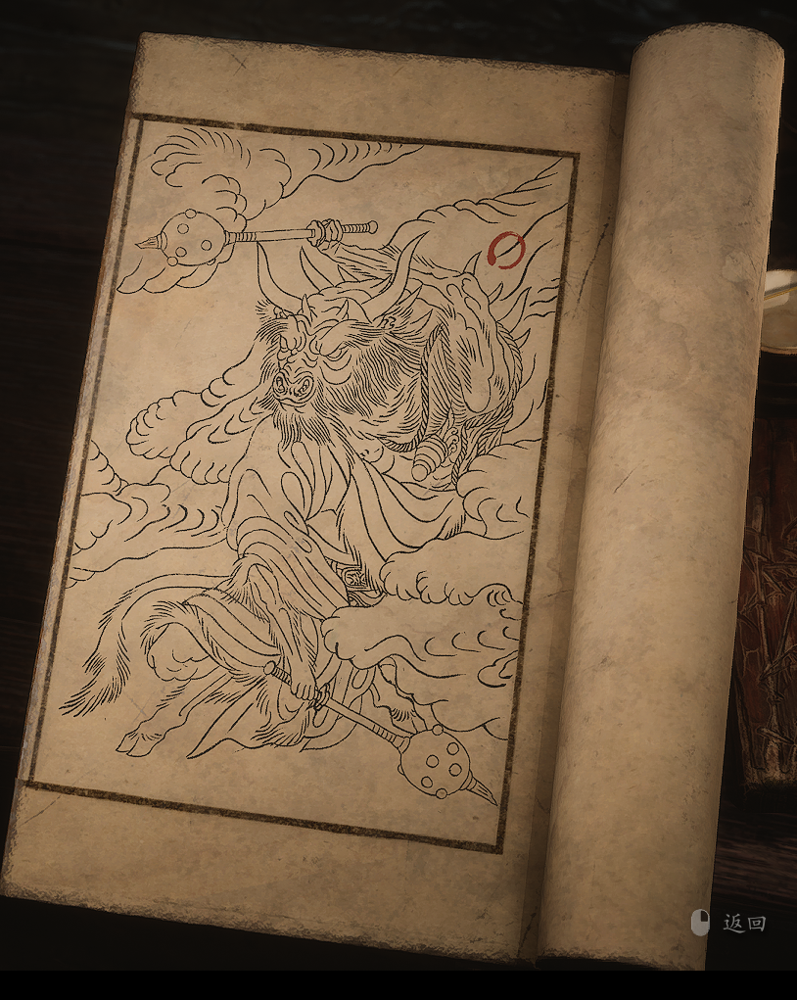

## 1.79 火烈烈

> 霞举飞升易，修行举步难。
>
> 世人迷捷径，祭赛千千万。

祭赛国城外有个烟火观，专收帮闲的破落户子弟，因教他们修道走正途，口碑极好，许多人家都将不争气的子弟送来这里，这个故事便是听某员外说的。

今次讲的这个弟子本叫赵三。他因在勾栏里帮王员外的儿子使钱，被员外告上府衙。官差满城在捉他，烟火观的道士恰巧遇见，便将他收入了观中。

自此，赵三日日跟着师兄们悟道练功，讲经说法，还勤勉地完成师父布置的任务。某日，赵三奉师命下山，在山脚遇见一户外出上香的女眷，其中有个小妾叫媚娘，正被家中太太虐打。赵三出手救下媚娘，又恐她被夫家捉回，便将她带入了观中。

媚娘无处可去，好在师父肯收留，她也拜入观中，做了个女弟子。初时，媚娘因赵三救她一命，她颇为感激，便时时替众人做些缝补浆洗之事。媚娘多次恳求与赵三做道侣，都被拒绝了。

几年后，赵三修炼有成，师父在山中替他举行了升仙仪式，媚娘也被邀请观礼。他们被带到一处淌着火河的山巅上，赵三接下师父传授的符箓，便跳入了火河。媚娘为了能和赵三双修，也在众人的簇拥和祝福下，步入火河。 烟火冉冉升起，他们在炽焰中羽化新生，成了火河使者，将随着火河长生不灭。

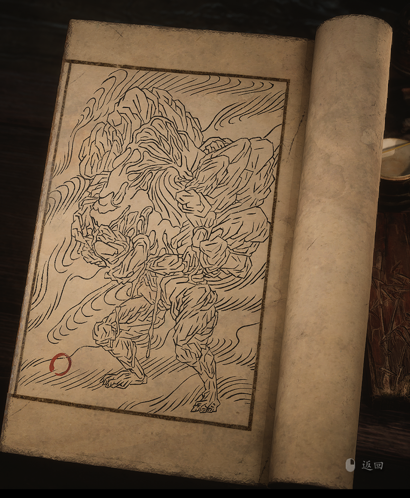

## 1.80 炎赫赫

> 蒙昧生愚焰，日日复熬煎。
>
> 吃尽无间苦，求死不求仙。

相传，黄帝时期有个叫宁封子的陶正，他从神仙处学会了五色烟火法，于是他把自己架在火上烤，有人说他飞升了，有人说他把自己烧死了，没有定论。祭赛国有个烟火观，正是以五色烟火法立派而建，这个故事是听其中某个出逃的道士讲的。

道士的师父是烟火观的观主。某日，他陪师父去市中买酒，在路上遇到个被差役捉捕的逃犯。因观中人口不多，逃犯又有些钱财，他们便将其带回了观中。这逃犯叫赵三，原不过是个替人使钱的浮浪子弟，观中打家劫舍之徒大有人在，赵三与他们朝夕相处，不久，就比原先还坏了十倍。

这日，正该赵三下山劫道，充作日常花销，恰巧有家富户的女眷上香归来，赵三不仅劫了财，还看上了那家的小妾媚娘，将她一同抢上了山。

媚娘被锁观中，不但每日要给他们洗衣做饭，还时时挨打。她恨毒了赵三，却斗不过他，几经凌辱，只能暗自隐忍，等个逃生的机会。

几年后，媚娘忽闻观中要举行升仙仪式，道士负责押着媚娘一同前往。在淌着火河的绝高的山崖上，赵三接受了师父授予的符箓，准备跳入火河登仙，但他非要媚娘陪同。在场的道众，发出癫狂的欢呼声，媚娘十分害怕，但道士仍旧依照师命，把她推下了山崖。

他们的尸首在火河中烫得焦黑，受符箓的吸引，岩浆汩汩钻入他们的头颅里，将其胀大了好几倍。新的躯身在火河里挣扎着站起，面目全非，他们不停地痛苦晃动，最终朝着火河往黑山的深处跑去。推下媚娘让道士看到他们变化的过程，不论烟火观的观主再如何解释这是羽化蜕变，他都不肯信了。

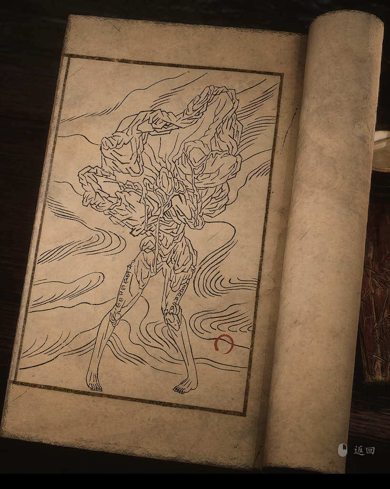

## 1.81 火灵童子

> 童子笑，好心肠。童子怒，恶无双。
>
> 难对敌，钻山岗。放阴火，背后藏。

古籍载，火灵砂形似丹砂，无毒，强阴健阳，比丹砂更适合炼丹。许多丹家，都想买来制药。可火灵砂乃山精之宝，世人少见，所以有价无市。

却说，有个喜欢研究奇物的人叫成名，穷困潦倒，家里人都看不起他。他知火灵砂是火灵童子体内所结精石，便想以此做空手买卖。他变卖家产，闯入山中，誓要捉到火灵童子才罢。他在山中寻荡多日，一无所获，存身的木棚反不知被谁烧毁了。

成名又气又急，他在烧毁的木棚前，跺脚咒骂。地上突然钻出条红色的大蚯蚓，那蚯蚓半截身子冒在空中，半截身子埋在土里，有张善财童子般稚嫩的孩儿脸。它见成名如此凶恶，竟嘤嘤地哭泣起来。成名又吼叫着吓唬它，想止住精怪的哭声，那孩儿脸又转成愤怒相，钻入土里不见了。

待它消失后，成名才恍然，那是火灵童子。于是他又不停跳来跳去，想把精怪引出来。许是成名太过吵闹，那精怪从斜刺里钻出，朝成名喷出个火球。成名躲闪不及，被火球打中，烫得满地打滚，连衣服也烧没了。 成名知道自己没本事采到火灵砂，大哭起来。火灵童子又笑嘻嘻地钻到成名的身旁。成名一狠，捡起石头，疯狂敲在精怪头上，将其砸得稀烂。

依照此法，成名才到了许多火灵砂，但他从不将此法外传。后来，因他卖得火灵砂越来越多，竟成了远近闻名的采药人。

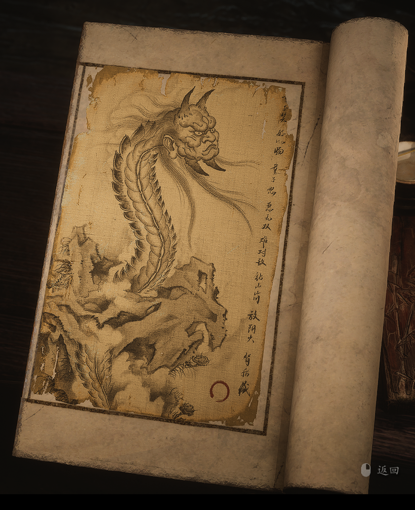

## 1.82 行什

> 堪叹妖猴遇兵凶，离山远走万事空。
>
> 祸不单行遭罗网，因果自在大化中。

数百年前，天兵再次烧毁了花果山。得知大圣已死，许多猴子只得忍痛离开，另寻别处修行。念及大圣曾与牛魔王结义，不少猴子便往火焰山去投靠牛魔王。

牛魔王十分痛恨猴子，可这次他却额外开恩，收留了逃难而来的群猴。可火焰山火气蒸人，极贫极苦，还有时常来挑衅的妖魔，猴子们活得很艰难。幸而，土地公待他们极好，送吃送喝，猴子们便倚靠着他过活。

不想，时日不多，猴群却出现了瘟疫。猴子们开始不停地掉毛，皮肤溃烂，背上鼓起又大又黑的脓包，十分可怕。瘟疫极速扩散，许多猴子都病得生不如死。作为猴群的领袖，赤尻马猴下令将染病的猴子扔到了丹灶谷底，任由他们自生自灭。

被遗弃的病猴们，天天在谷底咒骂着昔日同伴，就在快病死之时，土地公带着灵丹妙药救起了他们。半旬后，他们的皮肤愈合了；月余，他们背上的脓包破裂，生出一对乌黑的羽翅。土地公细心教导他们如何飞腾，还接受了他们投诚的忠心，将他们纳入麾下，因他们排行第十，便被赐名行什。

行什接到的首件事务，便是清理赤尻马猴的营地。他们毫不留情地杀死了背叛者，只有技高一筹的赤尻马猴侥幸活了下来，但没人知道他逃去了哪里。

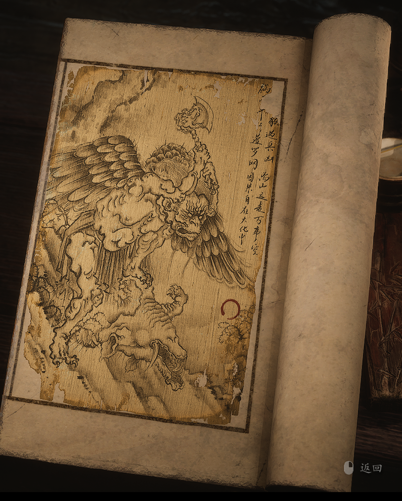

## 1.83 地罗刹

> 滴溜圆眼睛，身躯血津津。
>
> 头戴七宝帽，面掩赤诚心。

地罗刹是海罗刹的后代，他们出生在流亡的路上。因灵蕴不同于故乡，他们都没能长成海罗刹那巨大的身躯。虽是如此，地罗刹们效忠罗刹女的心，却与祖辈们一般。他们谨守铁扇仙定下的戒律，勤修术法，改掉了许多恶习。

民间有许多罗刹极好吃人肉的传说，是以火焰山附近的村庄，总以此为由将老人们送到石庙里当祭品。其实火焰山的罗刹们根本不吃人。非但如此，因其巨大的气力容易伤到凡人，罗刹女还让他们使一种特制的重盾，要求他们多守少攻。但若是把他们逼急了，他们也会使出些喷火的本事。

即便地罗刹已经做了许多改变，但人们看到他可怖的外貌，还是会被吓得惊叫乱逃。其实在地罗刹眼里，那些高喊高叫的凡人，又何尝不恐怖呢？

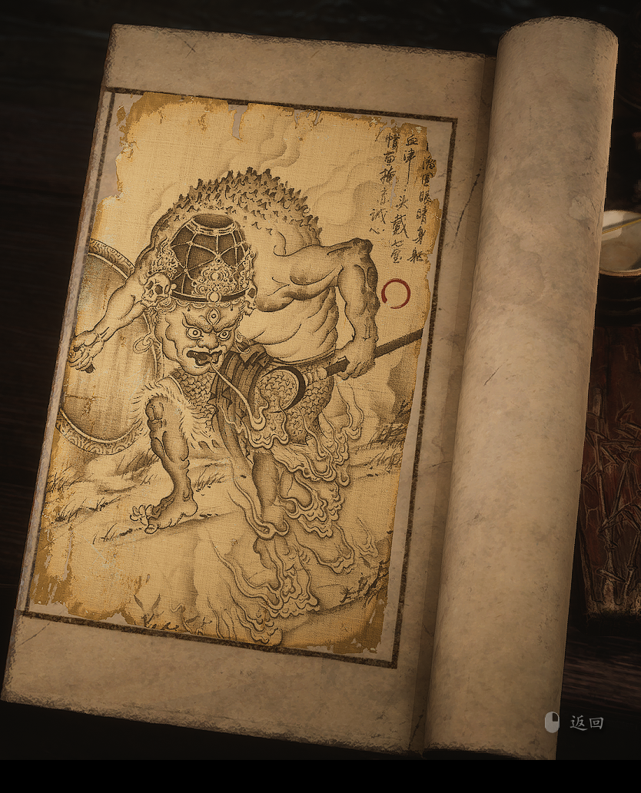

## 1.84 海罗刹

> 山恶人善丑自丑，看你笑我狗咬狗。
>
> 亘古英雄不论貌，痴愚不识本源流。

古籍载，西海之外有大罗刹国，海罗刹居其中。他们相貌怪异，与海内者差之甚远。

某年，海边有座庙宇传出有海妖作祟。这庙修在海内罗刹国中。罗刹国的王女奉命调查。她自幼在佛前修习，法力极强，便支走了所有人，要独自降妖。

这夜，王女在佛堂中大声诵经，就见门外突然跪着几个丈高身影，头如肉瘤，歪来斜口，鼻有三孔，眼生额头。王女不曾见过如此丑怪之人，吓得跌坐在地。而门外的几人，也同样指着王女的脸，大喊大叫，撒腿就跑。王女头次被这般对待，十分好奇，赶紧出声挽留他们。

可那几个怪人还是没命地奔跑，王女再次背起佛经，他们这才小心翼翼地走回来。知晓彼此没有敌意后，他们交谈起来，王女这才知道他们是海罗刹。

王女听闻他们想要修行，就收留了他们。为了不吓坏百姓，她给海罗刹制作了黄金宝石面甲，罗刹王又给他们打造了巨大的盾牌，让他们做了王女的侍卫。

百年后，罗刹国灭，海罗刹护送王女东逃，一路历尽辛酸苦磨，才在火焰山落脚。为了更好的保护王女，他们甚至学会了吞火的技能，青色的皮肤变得赤红。他们如今住在火河里，在火焰山中翻波掀浪，喷吐流焰。即便罗刹女早已韶华不再，但她知道，守在她宫外的最忠诚的侍卫，并不在意她的美貌。

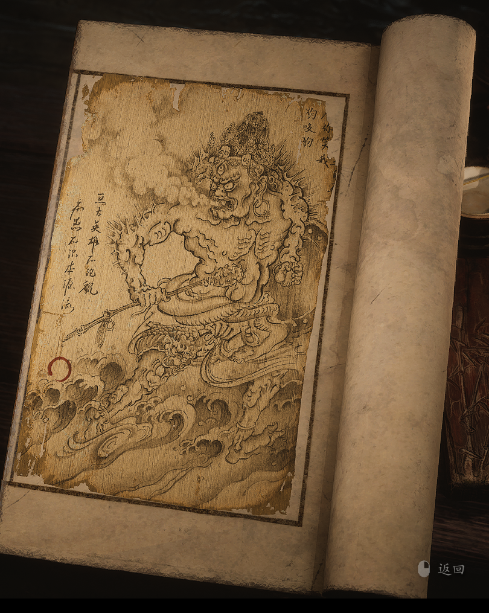

## 1.85 火长老

> 嵯峨独角冠，素洁青衫影。
>
> 灵犀报君恩，愿君寿长欣。

传说，堕和罗国好养犀牛。一次国王狩猎，射中了头怀孕的母犀。母犀临死前，娩下一子，国王甚觉有趣，便将它养在了上林苑中。

幼犀深记杀母之仇，十分惧怕宫廷里的人，一见到他们，幼犀就吓得四处乱窜。宫中众人便故意拿着鞭子追赶它，撵着它到处跑。

直至幼犀的角，长得又尖又锐，它才乘着宫人来追它时，用角将其胸腔顶穿，为母报仇。国王得知此事，便招来屠夫要杀掉堕罗犀。屠夫十分怜悯它，便以狗血淋在堕罗犀身上，伪装成宰杀，将其带离了皇宫。屠夫将幼犀藏在自家的犀牛群中，用珍贵的麦子喂养它，他们一起生活了很久。

某夜，屠夫做了一梦，梦里堕罗犀道：“我今生本有仙缘，可以成妖。但你有恩于我，我不可不报。明日你阳寿将尽，我便把我的寿命让渡给你。我会把犀角留在你的桌上，等你断气后，让你的妻子将犀角点燃，若它能全部烧完，你就可以活过来。”

次日，屠夫起床，见桌上果然有支犀角，而堕罗犀已然不见。他叫来妻子，交代好后事，便咽气了。屠夫的妻子点燃犀角，足足烧了四十九天才彻底燃尽，屠夫果真重返阳世。可自那之后，他生出了长长的犀角，皮肤也变成了青色。待他妻子去世时，他还年轻挺拔。后来，他拜了罗刹国的王女为师，大家都称他火长老。

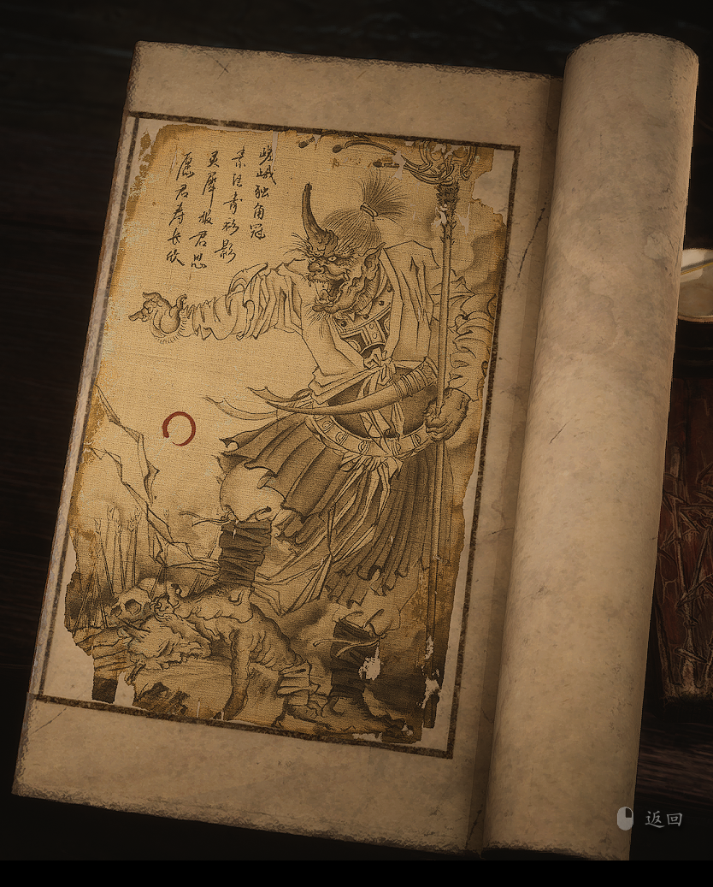

## 1.86 牯都督

> 老牯戟枪尖，业火焚两肩。
>
> 渡人过阴阳，劳碌尘世间。

昔年，有个少年躲在邻家库房中玩火，不小心引燃了库房里的物件，他害怕责罚，想要靠自己灭火，结果火势越烧越大，不但烧毁了整间库房，也将他烧死在了火海中。

他死后留下了极大祸患。邻家找他的父母赔物件，他的父母找邻家赔儿子。双方争来吵去，直到他的头七那日，还没吵出个结论。设飨都不安宁，牛头马面便不肯去送煞，牯都督见手下都不去，只好自己陪少年走一遭。

二人刚到他家门口，就听到院里传来他父母与邻家的争吵声，推门进去，就见少年的父母道：“我儿子烧死在你家的仓库里，谁知道是不是你们有什么见不得人的勾当，被他撞见才被杀掉灭了口！”邻居道：“我家库房里放的都是值钱货，肯定是你儿子动了贼心，进库房偷盗，结果引发火灾，必然是你们赔我们。”

两家人吵闹不休，最终竟打了起来。牯都督问少年：“你可想过会有今日？”少年十分后悔，流泪不已，牯都督于心不忍，道：“也罢也罢，今日是你头七，闹成此样也太无礼了。”于是他肩头火起，烧出一股烈焰，持戟一下劈裂院中的一棵老树，将其烧得焦黑。众人这才想起今日是头七，急急忙忙都跑出了院子……

## 1.87 鹰天兵

> 凡仙都混然，命中各有难。
>
> 千生犹懵懂，万死仍不甘。

有三个人，同日而死，亡魂相会于阴曹地府。

他们在判官前跪好，判官指定一魂，道：“你生前做贼，抢夺伤人，欺凌良善，如今判你入刀山狱，偿还罪愆。”那人哭嚎道：“我家中烧了十库金银，判官大人若肯留情，这些金银都是您的。”判官不为所动，一拂袖，让阴兵带他下去了。

判官指定第二个亡魂，道：“你再世为人。”亡魂嚷道：“我此生勤修佛法，做了许多善事，不曾伤生害命，为何还要入轮回受苦？”判官道：“人生一世，草木一春。能再世为人已属优待，难不成你想做畜生？”亡魂不乐意，道：“做人太苦了，我修佛可是为了脱离沉沦。”判官冷哼道：“今日恰好地藏菩萨不在，沉不沉沦可由不得你了。”一拂袖，让阴兵带他下去了。

判官指定最后一个亡魂，道：“你生前炼丹，造孽害命，夺人内丹，如今判你入血池狱，洗清罪孽，才可轮回。”一拂袖，正要让阴兵带他下去，却见个身披金甲的天将，闪身入殿，将军令扔在案上，道：“他以通玄了道，这是天庭召令，如今元帅府让我来接引他，入仙箓，做天兵。”语毕，那亡魂振奋不已，急忙跟着天将走了。

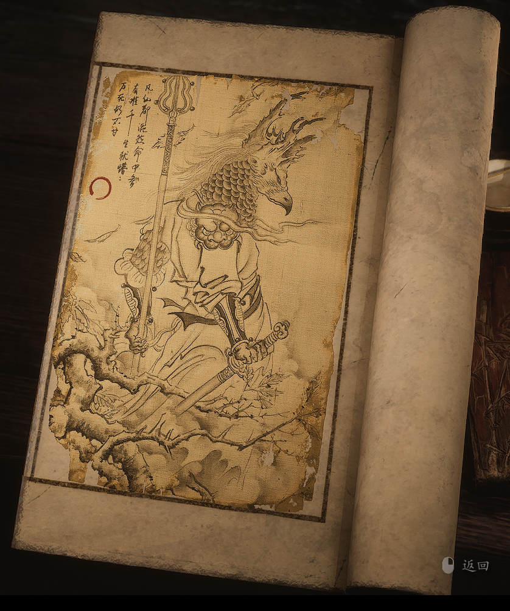

## 1.88 犬天兵

> 明盔配亮甲，金戈覆雕花。
>
> 造化玄功妙，涤荡入烟霞。

却说，在阴曹脱难的亡魂，初登天界，心怀激荡。他随天将穿巷过廊，步入武库。天将道：“此为楮白甲，皆为极品，凡间难有。”遂取一套，替他捧定，又转到三曹处，却不入正殿，只往偏殿的一处小吏前，取张契据，令其签字画押。

小吏在旁，漠然叮嘱：“签此契书，日后只可在天庭效力，永不入轮回矣。”那亡魂四下里观望，一个个玉簪朱履，一殿殿金碧辉煌，立时画了押。

天将带着亡魂又往兜率宫去。亦不入正殿，转过回廊，来到后方极大的塔楼前。那楼顶上冒出滚滚乌烟，正有许多兵将，手捧盔甲，正候入殿。

待亡魂入内，只觉热浪灼烧。无数炉灶齐燃猛火，有一巨釜悬吊其上，正融着些铜汁铁水。一个执扇的道童迎上来，笑道：“天兵天兵，我说你听。肉身既殒，魂附钢金。恶战沙场，临危履冰。道消功散，三思慎行。”

语毕，那童子便把亡魂推入模子中，摆好盔甲部件。那亡魂犹自懵懂，就见头上巨釜一斜，滚沸的浆水浇落，塔楼中回荡起他嘹亮的哀嚎。

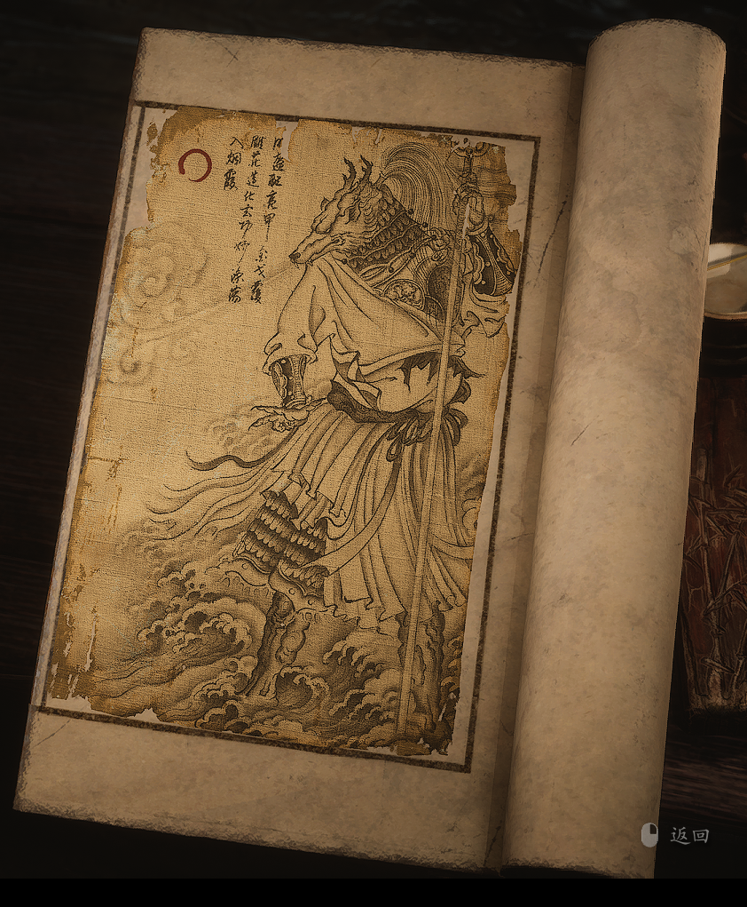

## 1.89 豺天兵

> 猛将如雷云，随电降尘凡。
>
> 输赢两争持，苦命不苦难。

却说，那亡魂熔炼了盔甲之躯未及数日，便听闻玉帝大恼，调十万天兵下界降妖。天将恐他兵器操练不熟，给了他一柄铁弓，让他躲在后方射箭。

他随众下降凡尘，就见旌旗飞彩，戈戟生辉，十八架天罗地网遮蔽了山场，满天庭星宿武将围困了四方。李天王调四大天王与二十八宿出师来斗，那魔王调四健将与七十二洞妖王列阵来迎。一时间，只杀得扬砂走石乾坤黑，播土飞尘宇宙昏。

这新征的天兵未战片时，被场中一道神力振飞开去，醒时已在兜率宫廊后的塔楼前。两个道人抬着他，进到楼里。道童笑着迎来：“幸好你这盔甲未烂，否则就治不好了。”童子边说边将他推入模中，摆好盔甲部件，滚沸的浆水再次浇落。

待他淬水而出，一道法力乍起，他竟随着雷电再次落回了战阵里。

新兵站在场上，晕眩疼痛未定，不知天上哪位神仙，又砸下一个法器，金波荡漾，他再醒来时又在兜率宫的塔楼之前……

此后，他被火烧过，被水淹过，被雷劈过，幸而次次都得了个全尸，次次经铜汁铁水浇铸，又重返战阵。

难忍难忍！他绰起地上的兵器，终是下了决心，不能只有自己受苦，反抗天庭就该是绝路。

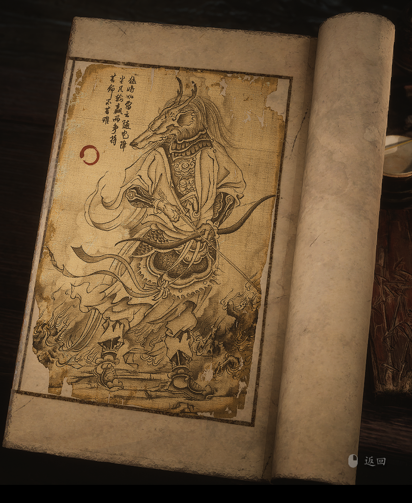

## 1.90 天将

> 授箓定长生，钢铁铸躯身。
>
> 离恨不离苦，轮回又归真。

话接前文，自亡魂成为天兵已然千年，他亦历尽淘选，成了天将。虽升了职，他却迷惘无措。原来生前未得道，做了天兵后，他能晋升的顶点便是天将。有许多前任天将，为了改变这宿命，逃脱下界，又被追杀毙命，从此魂消梦殒，再无机会。

这次，听闻花果山有异动，天庭再调天兵下界，因他差了一员部下，便领了召令去阴曹地府挑个亡魂。

他走至判官身侧，看见三个跪着的亡魂，他将其中那个修道的亡魂带出幽冥，那亡魂看他盔甲晃亮，刀锋透寒，一块精铁做的大盾，雕着华丽纹样，心怀激荡。天将停下脚步，失言问道：“若你今日随我去，日后再无投胎轮回的机会，做神仙也只能到我这官职，你可还愿意去？”

那亡魂回道：“愿意愿意，我也不知再入轮回可有别的机缘，指不定再轮回千万次，只是过得更惨了。”天将知他定不会回转心意，只得带着他朝天去了。

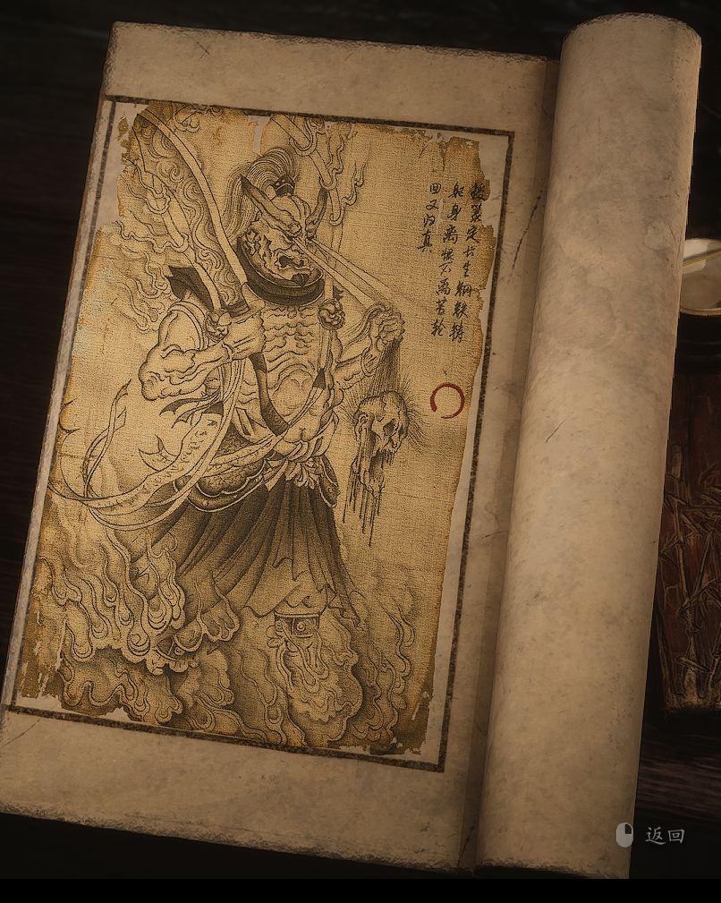

# 二、头目

## 2.1 牯护院

> 赫赫扬扬，身高过丈。腰悬甲沉，手持戟长。
>
> 其神凶恶，其目呆光。若愚若智，糊涂模样。

山门使，是个吃力不讨好的活。牯护院在这个差事上呆了百余年，从没升迁过。但他对此事从无抱怨，只因他十分敬慕大王，而大王又常常赏赐他丹药，他便十分满足。他将丹药供奉在一个金漆的花梨木匣儿里，匣内垫着锦绒的衬布。每次服药，还会净手漱口，烧高香，敬天地。山中实则有许多小妖都得过大王赏的丹药，但全然不如牯护院般谨小慎微。

一日，有小妖问牯护院道：“你每日守山这般劳累，如何还能龙精虎猛？”牯护院诚实道：“俺是因为服了大王的丹药，这才觉得气力不竭，你们也可多服些，便如我一般了。”那小妖道：“我们也吃过，但大家都觉得没效果，这才疑惑为何你的这般有效。该不会是大王给你的，比给我们的好吧？”那护院惊讶道：“都是由护法一同发放的，怎还能分得出个你我？”那小妖仍是不信，非要与牯护院换上几颗丹药才罢。互换丹药后，小妖仍觉无效，而牯护院依然龙精虎猛。

咦，人人都说这就是：“傻人有傻福。”但这或许并非不够聪明带来的补偿，而是痴狂的崇仰，为那护院带来的力量。

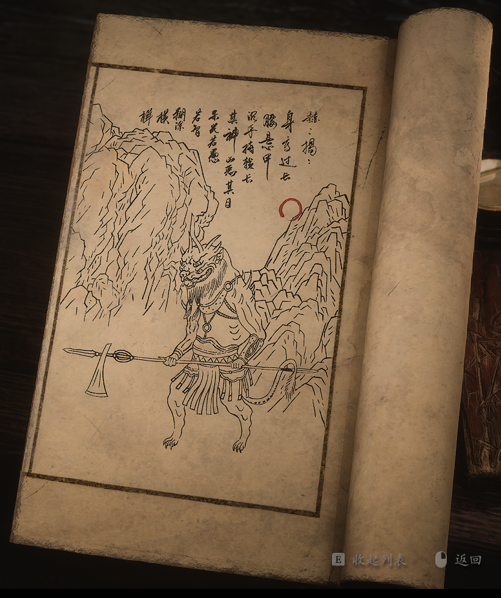

## 2.2 广智

> 意气出毒谋，惹祸终自受。
>
> 天道虽不言，善恶必追究。

广智幼时并非和尚，而是只极想做人的小狼妖。

他经常化形去镇上玩耍，却总被人们识破，受人追打。他向其他小妖询问缘由，众妖都道：“你虽变得像人，却没有人味，自然会被认出。你若想学做人，就该去人堆里待着，与人相处，学习他们的礼仪和习惯。”他深以为然，跑去求大王成全。他的大王凌虚子与山中的黑熊精十分相熟，黑熊精就将其化作一个小和尚，荐给了一同论禅的金池长老做个弟子。

初时，庙里一众和尚都不喜欢他，时常戏弄他做耍。而他总是讷讷的，上当受骗。老和尚便给他取了法号叫广智，希望他机智敏锐，不再受同门欺负。在老和尚的关照教导下，广智真就学会了读书写字，清规戒律，慢慢融入了和尚之中。

某日，庙中来了师徒二人，一个是白面的胖和尚，一个是雷公嘴的毛和尚。他们带来了一件锦襕袈裟，是老和尚从未见过的异宝。老和尚一心一意地想要，广智想报答老和尚的恩情，就仔细替他谋算起来。

广智从未料到，只因自己的一念之差，红色的火浪，吞噬了他熟悉的整个禅院。其后，老和尚自戕，凌虚子死在了金箍棒下，连黑熊精也受降去了南海。他深觉自己连累了许多人，认定自己做人实乃惨败，便弃了和尚的身份，重回山中，照着老和尚教的佛法，好生悔悟去了。

在山中修炼的日子里，他仿照那夜所见漫山遍野的火浪，炼就了一门新兵器，名为“赤潮”。即使许多年过去，他仍能听到山中传来的呼唤：广智，广智！这究竟是谁，在不住地呼唤他？

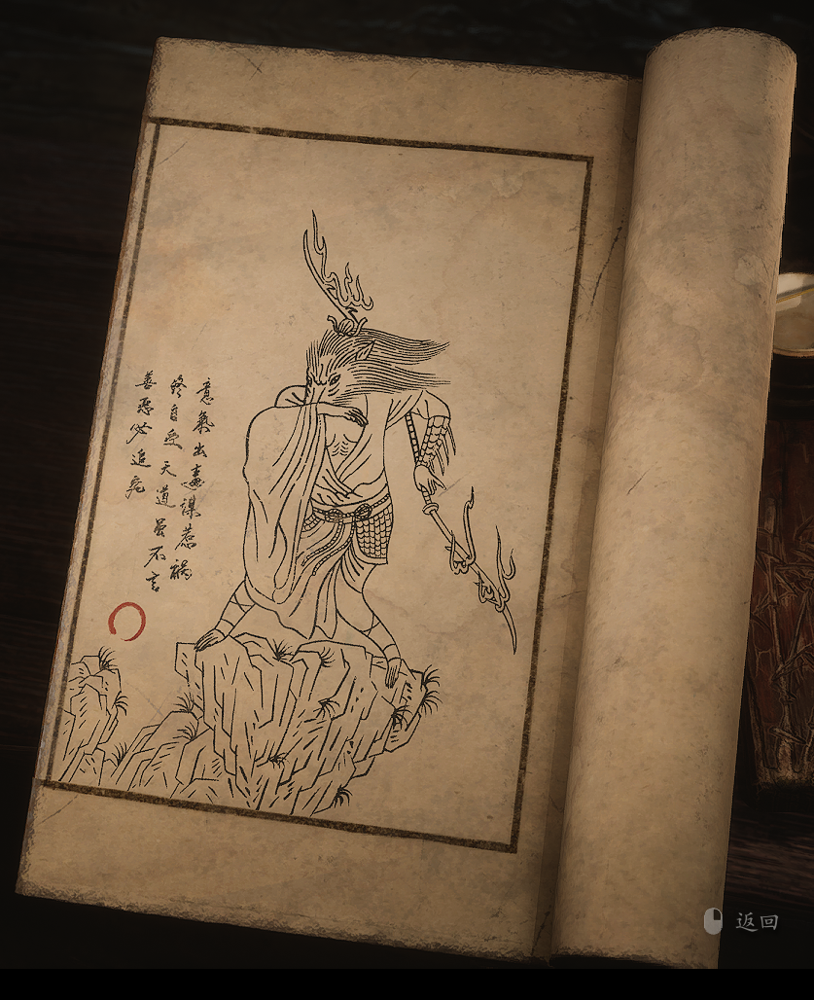

## 2.3 广谋

> 佛口蛇心真似毒，两面三刀还反复。
>
> 哪得丹心向明月，空听禅机夜虚度。

广谋与他师兄广智不同，他自幼的心愿，是做个历代持名的大妖王。

可事与愿违，因凌虚子将爱徒送去观音禅院做了和尚，白花蛇精十分忧心，他忌怕这是凌虚子拉拢黑熊精的手段，就命令广谋也出家为僧了。

临行前，白花蛇精告诫广谋，绝不可落于人后，尤其是广智。可不论广谋如何努力，金池长老总不如像喜欢广智般喜欢他，哪怕他学得更快，练得更多，也无济于事。广谋认为此乃非战之罪，皆因大王照猫画虎，这才连累自己受人厌弃。他时常安慰自己，他是要回山中做妖怪的，才不在乎这些。

广谋忆起当年，老和尚常教导他：“你行事太绝，事事都应留个有余不尽的意思。”可那日见到锦襕袈裟，老和尚一心想要，竟彻底忘了此话。他嘤嘤哭到半夜，广谋早就看出，他动了杀人夺宝的念想。众人俱是小心避开，唯有耿直的广智说了出来。

广谋心中无名恼火，索性计中生计。老和尚与那师徒二人饮茶时，他就看出，那猴子的双眼中，戾气难驯，定是个有仇必报的，就依着广智的主意，推波助澜，出了个赶尽杀绝，不留余地的计谋。那老东西果真高兴起来，头次欣赏起广谋的才华。

献完计策，广谋料准此夜大祸将至，使股旋风，躲入山后竹林去了。果然，那晚发起大火，非但没有烧死取经僧，反把个禅院烧没了。

咦，世上果有此等小人，引得高士入局，败在他的一条歪计之下，或许就是世人常说的借刀杀人罢。

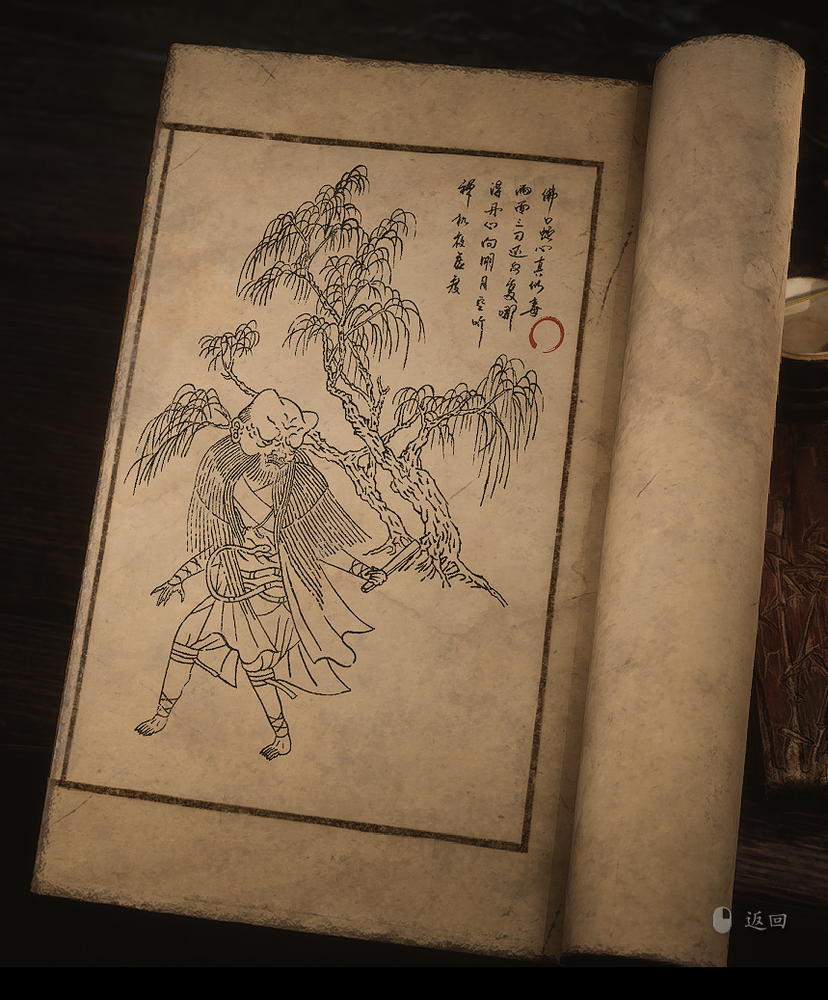

## 2.4 波里个浪

> 皮肤窊皱皱，吹气臊腥腥。
>
> 股长跳高云，偏爱钻泥泞。

哈咇国有个小城，每至拂晓，城门外常聚起夜集。这本是货郎们等待入城时以物易物，置换货品所为，但因价格便宜，不少百姓也来参加，慢慢便在城中有了名气。

数月前，夜集来了个古怪的卖油翁，穿一领青不青，白不白的褂子，瞪一双铜钟般的眼睛，说话声大如锣，张嘴腥臭难当。偏他话多，生性聒噪，大家都不想结交他。可他卖的油清澈见底，细腻柔滑，只需极少的香粉就能换得一大葫芦，所以摊前总围满了人。

这日，有个游方的小道士途经此处，也想瞧瞧夜集的热闹，便跟着乡民秉烛夜游。起先他逛得很尽兴，直至到了那卖油翁的摊前，一股绿气荡荡悠悠，自他的身上飘散而出。那小道士知他是个妖怪，随即念起灵官咒驱邪消灾，那卖油翁不消挣扎，迅速现出原形，乃是个绿皮大青蛙。

周围的人吓了一跳，随手捡起扁担铁钎就要打它。那青蛙双腿一蹬，蹿起有树高，远远往山里逃去。众人结队去追，寻至一片洼地。却见许多小蛤蟆，从彼此身上剔下黏液，盛到个大桶里，接着给自己扑上香粉，彼此闻闻抱抱，玩得不亦乐乎。大家悄悄潜过去，往那桶里一看，里头所盛的粘液晶莹透亮，正和他们平日买的油一般无二。见此，人们哪还有气力打妖怪，只顾蹲在一旁呕吐，让妖怪都跑了。

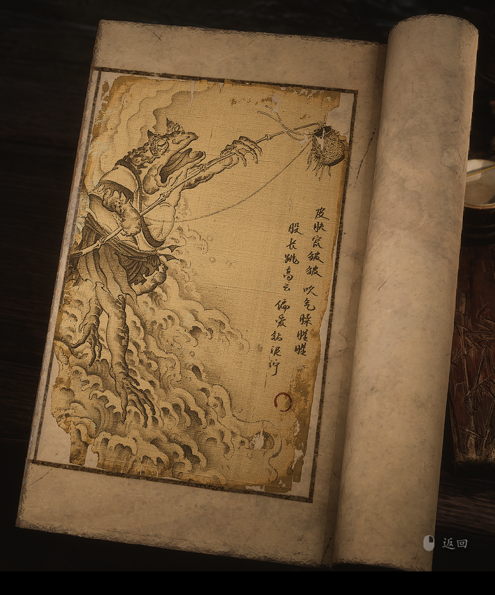

## 2.5 浪里个波

> 鼓腹出奇能，呱鸣引雷震。
>
> 呼风不需龙，浅水有蛙声。

话接前文，途经哈咇国的游方道士，自从撞见了蛙精，便以捉妖为己任，四处寻访他们的踪迹。

这日，他行至一处河谷，听到有蛙鸣作响，伴生电光。那道士欣喜不已，急急来到河边立下法坛，要降服此妖。他先是点了香烛，做了祝祷，随后摘了道冠，披散头发，以朱砂画下三道灵符，抽出宝剑，唧唧哝哝念起咒文。

只听他大吼一声：“太上老君急急如律令！”就见宝剑一晃，他挑起一张灵符，甩向空中，果就燃起一团火光，倏忽而灭。那河中的蛙精见这般动静，一蹦而出。原来这是只黄皮大蛙，穿一领青不青，蓝不蓝的布衣裳，与前次竟有些不同。

道士见蛙精蹦来，急急挑起第二张符，倏忽焚起，就见风起云涌。待第三张符火起之时，乌云中劈下一阵惊雷。道士与蛙精俱吓了一跳，各自捂头。待响声过去，二者抬头观看，只见劈毁了几棵树，而天上，风云已然散了。

道士一怔，赶紧举笔，打算再画三道灵符。那蛙精不急不慢，拍拍肚皮，天色不动，但应它的敲击，空中落下十数道金光，每一道都落在道士身侧。

道士翻翻滚滚，难堪避开，那蛙精又张了张嘴，吐出一群带电的小活师。不论道士如何闪躲，它们都紧追不放，道士只好落荒而逃。

咦，凡举世立业，常以行事做派的绚烂华丽程度，来判断实力，倒也有几分道理。

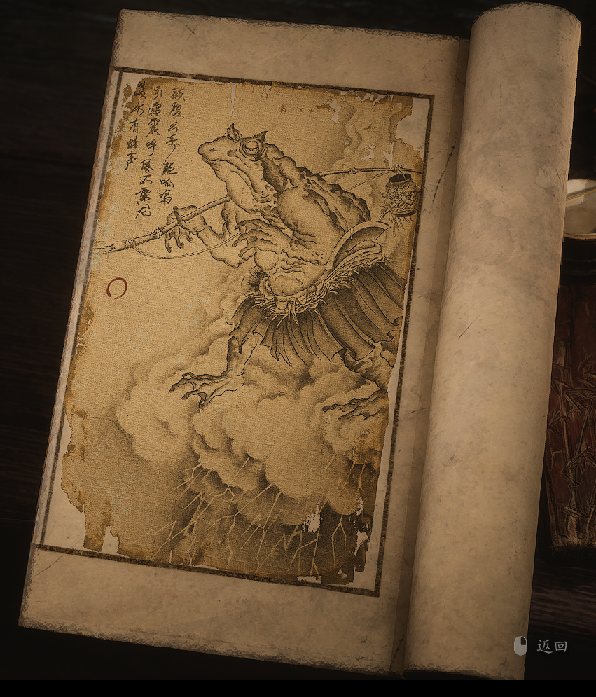

## 2.6 地狼

> 月黑风高夜，恩仇相报时。
>
> 善怪犹可近，恶人不可亲。

昔年，有个将军的儿子，在营中作团练使。他性格残暴无情，兵士都很惧怕他，但碍于将军的情面，敢怒不敢言。

团练使喜欢打猎，养了条细犬。一日，他与几位教头外出游猎，一无所获，很是丢脸。他将责任推到细犬身上，命人将其活活打死了。

打死细犬的几个兵士心有不安，营房后面有片野地，多灵芝，他们便将犬尸埋在那里，夜里过去诵经。

一日夜里，团练使听到营房外有犬吠之声，叫人出去查看，声音立止，待人重新睡下，则吠声又起。反复数次，团练使暴躁难禁，亲去查看，只觉声音从地下传出，便命人刨开土面细查。

待土出石露，就见那细犬从地下跃出，宛如活时，只是身上长了些细小的触须。团练使非常高兴，以为得了稀奇之物，便招细犬过来。那犬见主人呼唤，十分欢喜，冲跳而来。可它头上有对木芝硬如盘角，一扑入怀，就将团练使的胸骨顶裂，团练使当场气绝。

众人见状，忙着呼叫医官，一时喧嚷慌乱，竟无人去捉那细犬。后面无论如何找寻，再没发现它的踪迹。

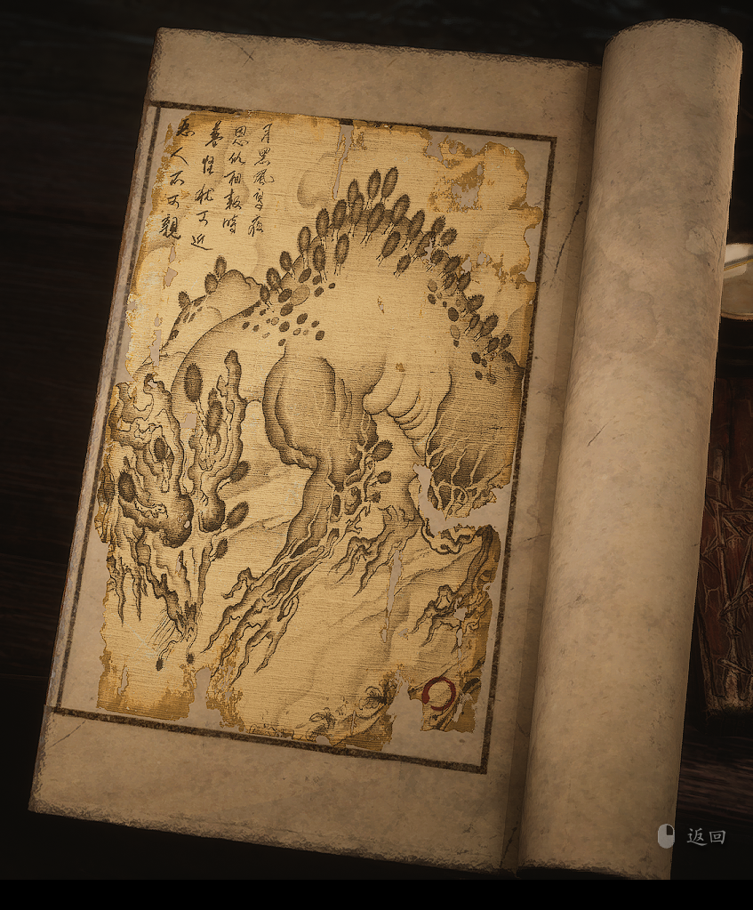

## 2.7 沙国王父子

> 聪明老子糊涂儿，一个算计两个呆。
>
> 阵上父子谈何情，相父逞奸跑得快。

斯哈哩国曾经有三位王子。

大王子最受国王宠爱，其人英姿飒爽，在蝜蝂之乱中，屡建奇功，被封为英武将军。可他却忽染癔症，七情不全，六亲难认，如今只能幽居不出。

沙国王疚心疾首，幸而，他还剩两个儿子。

三王子最受国王信重，饱读诗书，喜爱佛法，文武兼备。可他在国王斩杀了一批大臣后，诀别而去。

沙国王怒气填胸，幸而，他还剩一个儿子。

二王子天生神力，可惜有些憨傻，不似大哥那么能打，没有三弟那么有谋。三个儿子中，国王最不喜他。可陪国王最久的，却偏是他。

黄风大圣得了神物，再次归来。沙国王遂率残余国民，归其麾下，以图复兴。黄风大圣见二王子颇有几分蛮勇，山中又正是用人之际，便收留了他们。

不过，黄风大圣手下还有位虎先锋，极好吃鼠，每日都要啖下几只才觉饱足。好在二王子的大锤使得凶悍，倒能稍稍令他忌惮。

二王子为国王做了许多牺牲，可不论局势多惨烈，多艰难，沙国王到哪都要带上大王子，派人寻找三王子，也不知二王子心里到底是何样的心情。

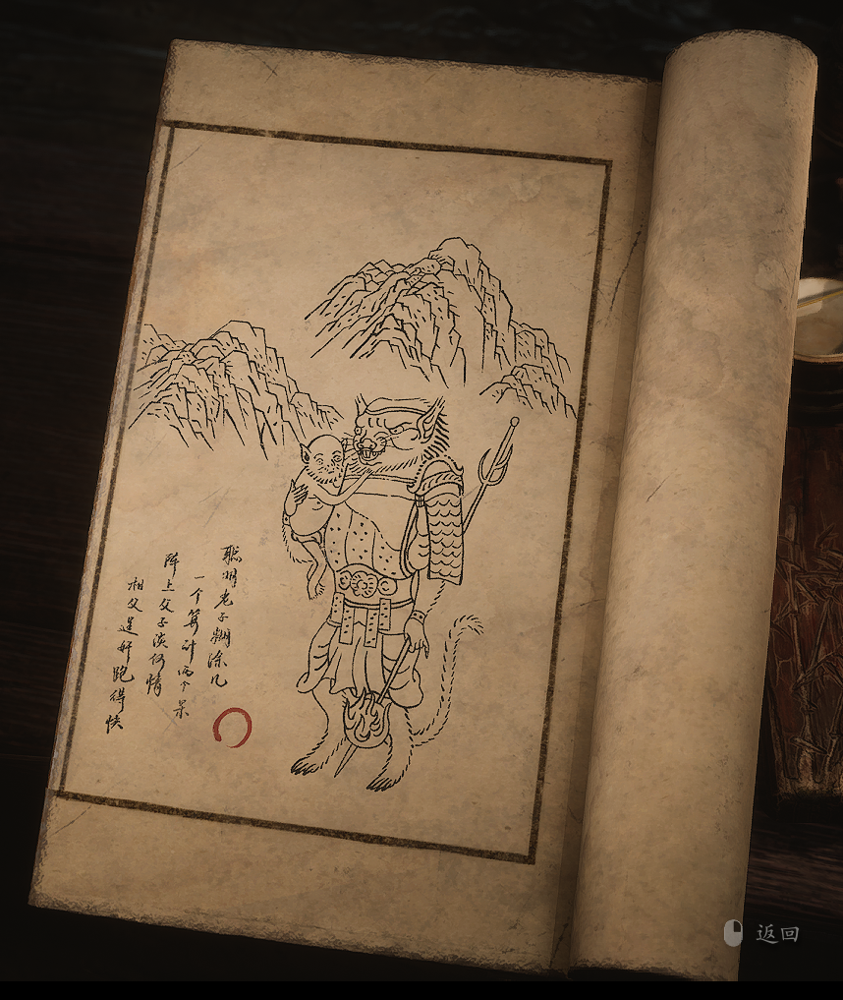

## 2.8 沙大郎

> 无毛力更强，秃皮腰板壮。
>
> 疯魔藏山底，阴沟作大王。

黄毛貂鼠平定了蝜蝂之灾，国王十分敬重他，将其奉为了国师，不论朝政大事，民生细务，必先征其意见，听其看法。

在国师的提议下，国王颁布了“敬鼠令“，十里八乡的老鼠精怪，纷纷往城内迁徙。

大王子因阵前有功，被封为英武将军，却被一个妖怪抢了风采，十分不甘。三王子也不满妖怪当政，两人联手在朝中闹了数次风波，却仍未动摇国王对国师的信任，三王子最终负气出走。

这日，正逢国师诞辰，举国上下都在供奉他的雕像，连国王也亲临护国寺，为其添香祝祷。大王子愤懑难忍，当众掀了香案。

国王一怒之下，将大王子下了监牢。国师却不生气，反替英武将军说了许多好话。大王子得知国师求情，更认为他是个城府极深的邪魔，成日在监牢里咒骂不止。国王得知此事，深觉儿子放浪狷介，应严加管教，便下令一日三餐只可送至牢门前，不许任何人探视。

不知过了多久，这一日，饭食迟迟没能送来，大王子正是惊疑，却听锁钥一响，牢门居然开了。

他等了片时，未见有人进来，就自己走了出去。可他万万没想到，那外头往来穿梭的侍卫，大臣，没有一个人模人样，俱是些穿着衣袍的老鼠。

大王子以为国师带着鼠妖篡了皇位，心下惊惶不已，一路横冲直撞，闯入父亲的金殿——

一只矮矬的老鼠，以其父之声，叫唤了他两句。这必是假扮的！大王子一把夺过侍卫的刀，劈向国王。

刀被国王近旁一只手持巨锤的鼠妖架住，两个斗在一处，殿前乱成一团。打斗间隙，大王子无意瞥了一眼王座旁的铜镜，镜中哪有什么英武将军，乃是一只肥硕无匹的老鼠！

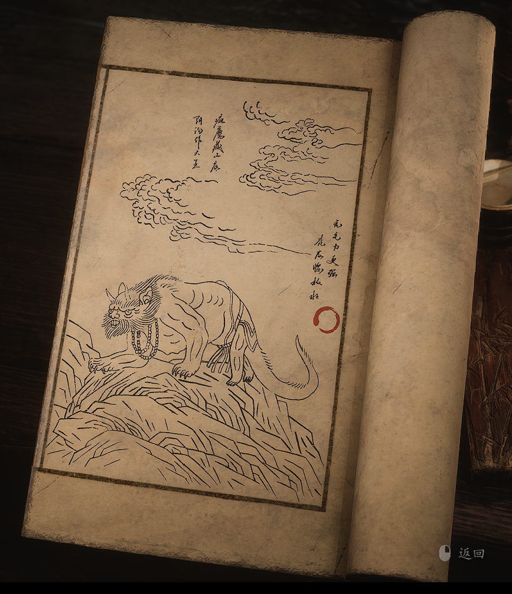

## 2.9 石母

> 事有机缘刚凑巧，命若蹭蹬总归空。
>
> 莫以本事论英雄，且看眼前造化功。

昔年，黄风岭曾有两位山神。他们受一位高人相助，得了一颗大妖怪的内丹。

他们分而食之，得了大法力，自此有了人心人形。为报答高人的恩情，他们主动为其塑造山场起来。

山中的土地没能分到这好处，便十分羡慕山神的机缘，得知他们可以任意化生山中的石精，便一直谋划着想夺过来。

但他却不知，化生石精，需要消耗许多灵蕴。山神们一直是从自己的体内，分出灵蕴来，才孕育了出石精们，搬山造石，栽种花草。

土地却每日惹是生非，企图夺他们的道行与修为。这日，山中化生了个巨大的石精，众石精都拜他为先锋。那土地还是不知死活，寻衅滋事。被石先锋又打又砸，直至捶进了土里，还在骂骂咧咧。

咦，为人为事若要往坏处里去，多半无人拦着，但若要往好处去，却总有些人想方设法制造些困境，想拦住你哩。

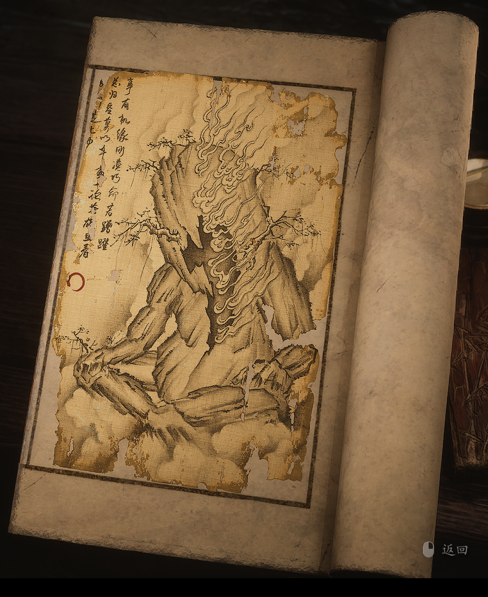

## 2.10 虎伥

> 刀客竟何去，回首泪潸然。
>
> 狂风扫碛北，凄凄复单单。
>
> 草访村舍空，尘迎恶鬼还。
>
> 谁知莲心苦，梨儿腹内酸。

昔年，江湖中有个刀客，为娶心爱的女子，弃了旧业。未想，城中受黄风吹过，妻子染疾下世，儿子也生起病来。

男人听闻山里有个菩萨能治风疾，就携子寻到了黄风岭。他们借住在定风庄内，孩子养病，男人则去寻找菩萨的踪迹。

一日，男人路过村外一口枯井，听到有虎啸之声传来。他下井一看，竟别有洞天——

有头受伤的猛虎在那井底修行，猛虎告诉男人，他原是山中虎神，村中的大巫们也受他庇佑，谷中还有村民为自己修建的寺庙。他说那刮起黄风的妖怪偷袭了她，占去了他的寺庙，这才落难到此。

男人将信将疑，经过一番查访，大巫与寺庙之事，果都应证了，便带着儿子来给虎神瞧病。

虎神用个怪模样的葫芦灌满水，喂给孩子喝。说来也奇，自喝了葫芦内的水，孩子好了大半，又能活蹦乱跳了。虎神嘱咐男人，他被邪风伤了元气，若能吃些活人，恢复神通，定能停下风沙，根治孩子的风疾。

男人极不情愿，但见儿子精神渐好，又能在村边游玩，还交了不少朋友，真就狠下心来，诱人入井，为虎神疗伤。时间一久，村民渐渐发觉了异样。待男人回到村中时，儿子已被激愤的村民打死了。

男人悔恨不迭，拔出封了多年的刀，将村民一一斩杀，这才踏着一条血路，迷失在了茫茫风沙里。

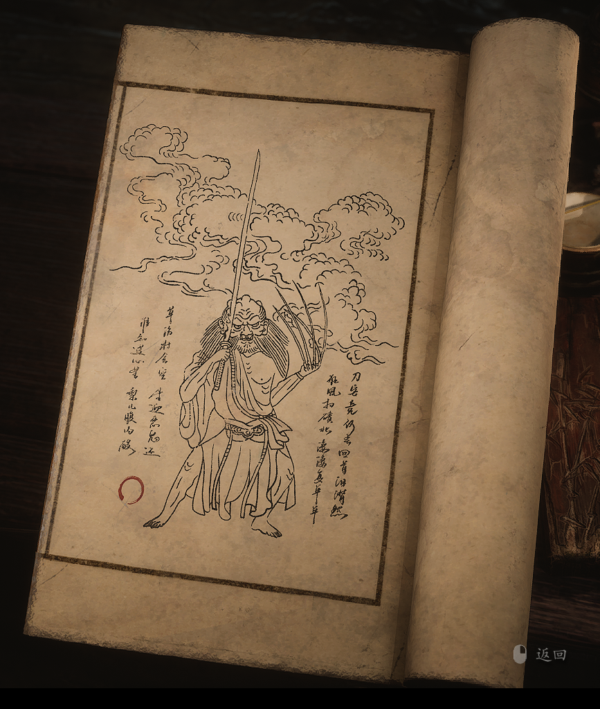

## 2.11 百目真人

> 怪人背生囊，一杆血灵杖。
>
> 颠颠还跳跳，百目透红光。

黄花观来过一个怪人。

他自称在灵台方寸山学过艺，只要魔君交出那东西，立时归降，便放他一马。魔君遣虫总兵，将这怪人制服，照例放入洞中虫卵内育化。未料，几日后小妖来报，卵被破开，人已逃了。魔君听罢，嘿然一笑。

自破卵而出，怪人背上生了一颗肉团，团上还有许多眼睛，十分骇人。怪人不以为意，继续云游修炼。

他途经一座荒山，山中盗匪横行，山下村民贫苦不堪。他就地住下，求风求雨，洗青荒山，栽种榆柳，遍植松冉。

经他一番整治，荒山连年风调雨顺，许多流民前来定居，山下人丁也日益旺盛起来。可那山中盗匪无心安居，见山青了，只顾砍伐，见人多了，只顾打劫。他又化作得道高僧，去盗匪窝中讲经诵佛，日日不辍，最后连那帮山匪也弃恶从善，在山下安居乐业起来。

过了数年，怪人忽至村中，绰起一根法杖，立在村口。那杖头发出幽幽红光，众生被红光一照，只如着魔般，互相撕咬残杀起来。

霎时间，山下血流成河，宛如地狱现世。

他驼背上的肉团倏忽张开无数眼睛，将周遭的血气精魂缓缓吸入其中。不多时，那肉团便胀大了一圈，直到再也吸不动了，那眼睛才缓缓闭上。

怪人苏醒过来，拔出法杖，又寻下一座荒山去了。

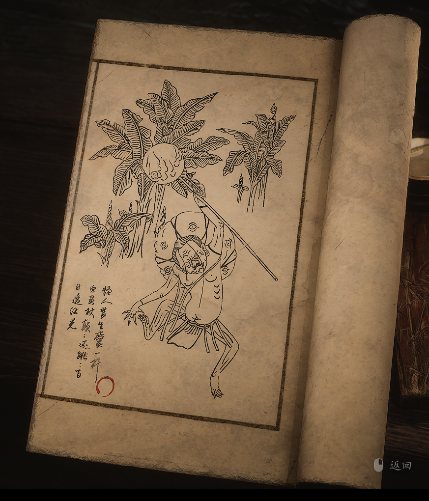

## 2.12 疯虎

> 黄风邪入境，兄弟乱阋墙。
>
> 父仇不得报，井底落平阳。
>
> 咆哮透山岗，装样软心肠。
>
> 行事总半道，志丧命也丧。

某年某日，虎弟正于井底练啸聚神功，忽见井口有人攀藤而下。见那人有几分胆色，虎弟没急着扑食他，反打探起他到此的缘由来。

原来这人要寻菩萨为儿子治风疾，可菩萨未找见，儿子反病得要死了。

听此一说，虎弟心下有了计较，他将兄长的事迹安在自己身上，说服了男人将儿子带来给他瞧病。

初见时，那孩子面色惨白，浑身绵软，只能由男人使一根火麻绳将其缚在身前，才能安稳下到井底。

虎弟仔细一看，这孩子果被三昧神风吹乱了精气神魂，若不停下风沙，神医也治不好他。

虎弟想起兄长曾给过自己一个宝贝葫芦，只要饮过葫芦中的酒水，就能壮人气力，或许能凭此保这孩子一命。

待孩子饮下虎弟喂的水，他有了些精神，能开口说话了。他虽是久病之身，却十分有礼，得了帮助，连声称谢，对虎弟崇慕不已，虎弟十分快意。

他叮嘱父子俩，每日必须来此饮一口葫芦中的水。数次之后，孩子越发好了，他不仅能在村中玩闹，还结交了好些朋友。每次来喝葫芦，孩子都围着虎弟“虎神虎神“地叫他，将自己新得的吃食、玩具和见闻逐一分享给虎弟。

虎弟原对父子俩有些提防，但见这男人也算重情重义，便将葫芦给了孩子，让他贴身带着，只用葫芦喝水，孩子的病又好了几分。

忽有一日，他二人都不再来了。虎弟很少在岭中出没，一连等了数日，他终想弄清楚究竟，就往村中寻去。

入村一瞧，只见血流满地，村民们都被斩杀了。村头有口薄皮棺材，孩子的尸首就在里头，胸前还挂着葫芦。细看那伤痕，不难猜出孩子是被乱棍打死的。

虎弟扛着棺木回到了井底。每日都在棺木前练功，他总想着，再等等罢，等我足够强大，定会替你停下那该死的风沙……

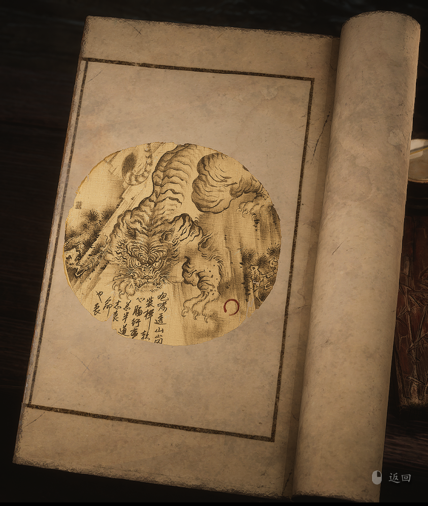

## 2.13 虎先锋父亲

> 啸聚夯气力，化石又奇袭。
>
> 赤胆忠良将，簪缨老剥皮。

师徒三众上前，不上半日，果逢一座高山。说起来，十分险峻。正看那山，忽闻得一阵旋风大作。只见那山坡下，剪尾跑蹄，跳出一只斑斓猛虎，喊道：“吾当不是别人，乃是黄风大圣部下的前路先锋。今奉大王严命，在山巡逻，要拿几个凡夫去做案酒。”

那妖精急近步，丢一个架子，望八戒劈脸来抓。那行者掣了铁棒，喝声教：“拿了！”

此时八戒抖擞精神，那怪败下阵去。那怪慌了手脚，使个“金蝉脱壳计”，剥下皮来，苫盖在那卧虎石上，脱真身，化一阵狂风，径回路口。路口上那师父正念《多心经》，被他一把拿住，驾长风摄将去了。那怪把唐僧擒来洞口，按住狂风，对把门的道：“你去报大王，说前路虎先锋拿了一个和尚，在门外听令。”

把门的入内急报，却又转来两只小虎，尊称了声：“父亲。”与那先锋互行了礼数。极大的一个道：“这白面和尚哪里来的？”先锋笑道：“造化！才要巡山，可可遇上这厮。”极小的一个喜道：“父亲好本事，来日教教孩儿。”

父子三个还待要说，洞主传令，教：“拿进来。”虎先锋遂携二子，双手捧着唐僧，上前跪下道：“大王，小将不才，蒙钧令差山上巡逻，忽遇一个和尚，他是东土大唐驾下御弟三藏法师，上西方拜佛求经，被我擒来奉上，聊具一馔。”那洞主闻得此言，吃了一惊，问了经过。先锋跪在下首一一作答。

洞主道：“且莫吃他着。”先锋道：“大王，见食不食，呼为劣蹶。”洞主道：“你不晓得，吃了他不打紧，只恐怕他那两个徒弟上门吵闹，未为稳便，且把他绑在后园定风桩上，待三五日，他两个不来搅扰，或煮或蒸，或煎或炒，慢慢的自在受用不迟。”先锋大喜道：“大王深谋远虑，说得有理。”

两小儿且随父退下，大的一个道：“大王素日食人，从不这般，断乎有些蹊跷。”小的一个道：“像是有些怕了这厮……”先锋喝道：“你们哪知大王的本事，我随大王多年，岂有他怕别人的道理。”二子互通眼色，不再多言。

不上半日，却又听大王传唤，原是那孙行者打上门来。虎先锋自请出征，那大王道：“但恐拿他不得，返伤了你，那时休得埋怨我也。”二子强劝，先锋不睬，只道：“放心！放心！等我去来。”

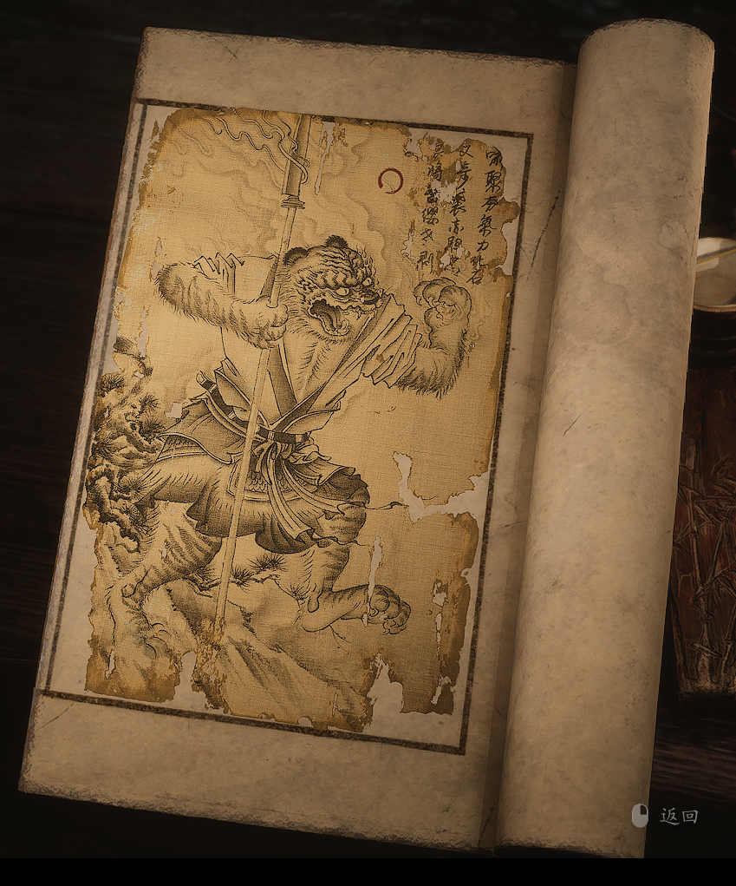

## 2.14 魔将·莲眼

> 诸法空相，不增不减。

自狂高慢，金身破碎

时时放佛光，庄严无量神威

霞光映照，耀我惊我破我

忘真言，堕伪魅

形孤形单形废

足之蹈之，若神若鬼

智者疯，勇者凶，仁者危

一朝染尘埃，禅心昧

愿以此身照世人

光即是暗，将那骄狂灭溃

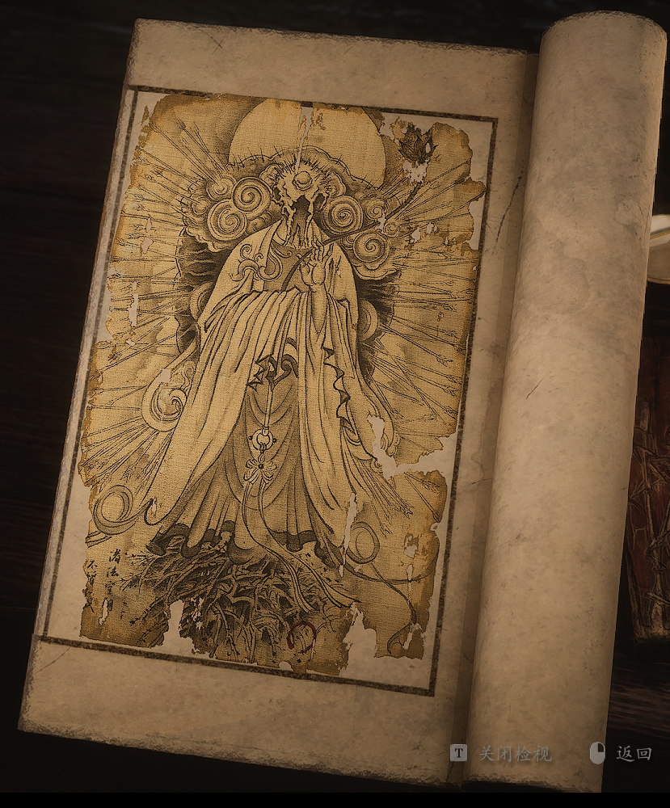

## 2.15 魔将·妄相

> 万法齐观，归复自然。

自命不凡，四肢卸尽

心心得真如，千手合掌结印

同虚空相，欺我哀我怆我

除牵绊，入涅樂

惟寂惟默惟静

生死独当，凋残独临

脱沉疴，离疾苦，无量福

牵情系恨，骨肉不散

此身不复辩伪妄

顺势泛涨，反将众生消荡

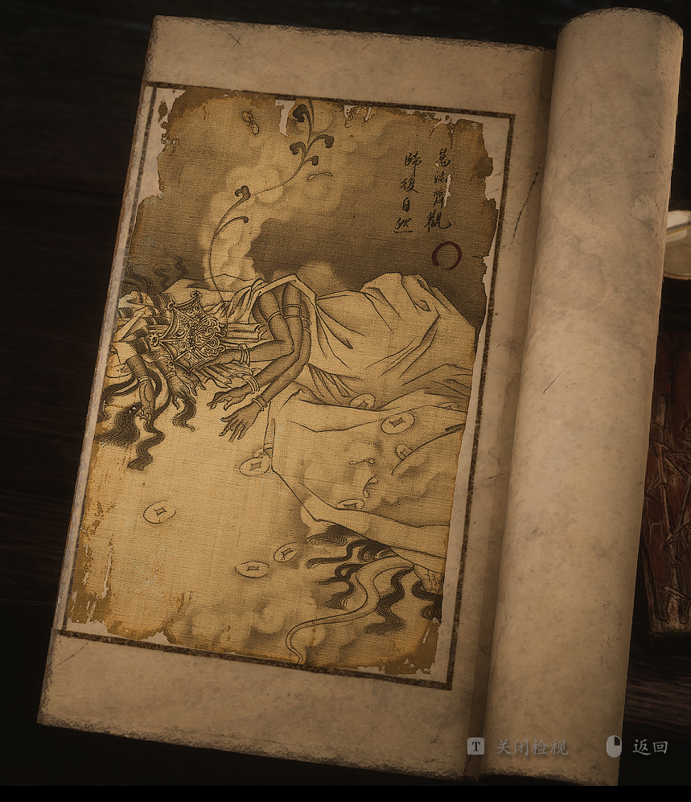

## 2.16 魔将·劫波

> 弹指一轻，刹那芳华。

自念显能，身首异处

血生红莲花，一念万朵尽出

吉祥纷呈，哄我诱我刺我

剪慧根，陷香雾

尽真尽善尽美

斗法证道，败中枭首

天生刚烈骨，温柔尽倾覆

浮云盖性，不得明朗

愿以此身种繁华

锦簇花攒，反将众生戮屠

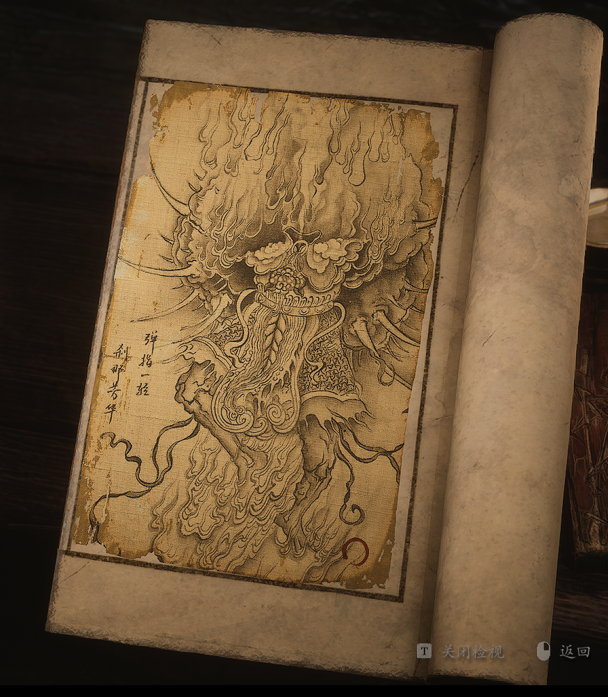

## 2.17 无量蝠

> 寄身佛像中，鼓翅可乘风。
>
> 铁心多劳碌，金身享华荣。

昔年，某偏僻山中有个小庙，乃山民自建而成。这庙无人看守，仅供着一尊黑色神像，檐缠蛛网，灰冷花残。

一日，有个走江湖的侠客途经此地，欲在庙中住过夜了再起行。睡意朦胧间，忽听背后风声响起，他微张双眼，见案上那尊神像，生出了双翅，竟飞到了空中。这东西的足上有一对镰刀般锋利的钩爪，侠客心中大骇，一个翻身，拔出腰间佩剑，与那神像战作了一团，终将其打杀。

次日一早，山民们围在庙门外，提着许多花红酒礼，来感谢侠客替大家除妖。他们说，山里还有很多这样的庙，都被这种妖魔寄居着，希望侠客能把这些伪装神像的妖怪都消灭掉。侠客见他们带来了许多银钱，贪念乍起，应承下来，让村民给他带路。

大家围着侠客，一边赞美一边催促他，将他送到了山林深处一座更大的古庙前。侠客刚走入殿里，就见炉里高香缭绕，宝烛辉煌，须弥座上供着一尊更大的神像，与之前杀过的形貌十分相似，浑身涂着金漆，格外雄壮威武。侠客感觉不妙，正想逃跑，那神像腾空而起，一抖翅膀，扇出两刃霜风，就将侠客冻在了原地。

山民们看着金身神像用脚上的钩爪穿了侠客的琵琶骨，将他拖入神殿的后面，都纷纷跪地许愿起来。翌日，他们所求的物件，全都一一出现在了家门前。

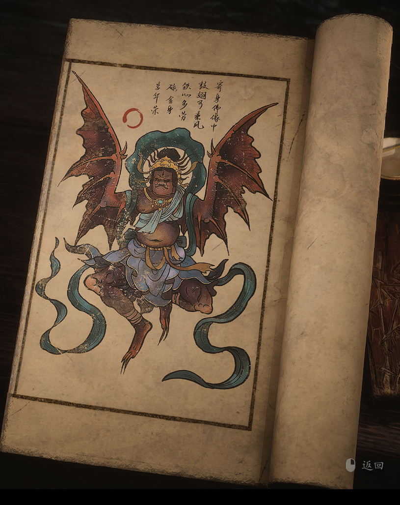

## 2.18 浪里个浪

> 不惧北风寒，肤凝玉骨般。
>
> 嗳雾成霜雪，嬉冰更觉酣。

书接上回，那落荒而逃的道士，痛定思痛，在山中闭关数年，只将那五雷法习得滚瓜烂熟，收放自如，便再次起行。

却说，那带电的小活师，被他收得一只，关在葫芦中，径过雪山时，活师于葫芦内跃动不止，他便知此地定有蛙精。他寻至深谷寒潭边，果见有只巨蛙，身披霜雪，蛰伏岸旁。

那道士二话不说，一道惊雷劈将而去，正兀自欢喜，以为那蛙精必要应声而亡，不料它高高跃起，那雷劈了个空。道士亦不忙乱，再捏诀又劈一雷，那蛙还是一跃躲过，几下蹦至道士身旁。道士连撤数步，向后急退，自以为十分巧妙。未想那蛙精，双腿直立，胸腹一挺，跃将过来，他反被那大肚子顶了个趔趄。待他再欲还击，那青蛙大嘴一张，将股寒风吹来，立时把他冻在了原地。

那蛙正要吃它，却见潭那边走来几个和尚，见有人冻在此地，把那蛙精驱走，这才保住了他的性命。

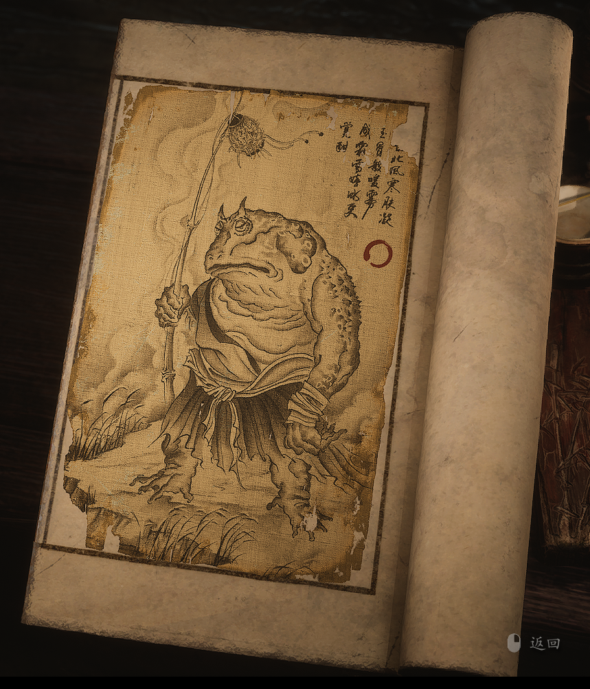

## 2.19 老人参精

> 摇光星散落山家，只生膏壤露甘华。
>
> 七两凡品八两宝，平常显达一两差。

此事听一城中药商所讲，是他表兄家的秘密。

表兄祖上原是山里的采参人，其后不知何故，弃了旧手艺，当上了樵夫，虽然家道不富，家中人人都很长寿。

表兄从小就常见个猥矬邋遢的老头来家中做客，每次他来，家中必会准备一桌好酒好菜，供他独享。彼时，表兄非常厌恶这老头，因他既不说话，还爱耍酒疯，只觉他是个蹭吃蹭喝的骗子。

直至有次，表兄的曾祖母伤寒难起，似有下世之象，那老头又来家中喝酒。听父亲说曾祖母病重，那老头走入院中，双手往地下一探，地上竟爬出许多藤蔓来。藤蔓间生出一棵小苗，那小苗迅速长大，开花结子。老头上前一拔，拽出一棵千年人参来。曾祖母饮下人参汤后，竟又好了起来，至今仍然康健。

表兄似有所悟，也恭恭敬敬地招待老头，如他的家人一般。

表兄曾邀药商也搬去山中，与他同住，药商却断然拒绝。

商人这般解释道：“表兄家虽是长寿，但一则日日粗茶淡饭，二来深山太过寂寥，我还是喜欢城里的生活，去不了去不了。”这话想来也只可当趣谈，不知真假。

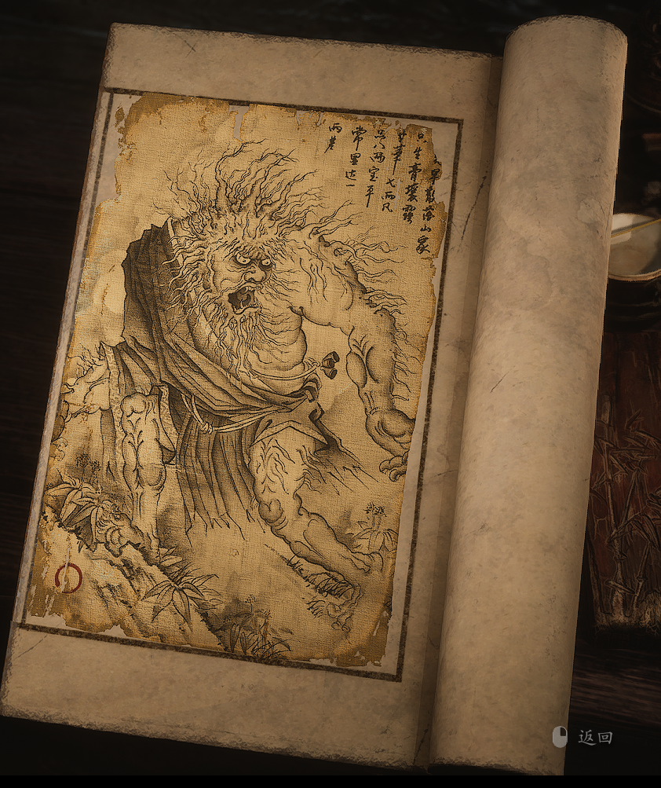

## 2.20 不白

> 丑脸扑白粉，玲珑狡诈身。
>
> 大胆唱主角，终是戏中人。

驼罗庄有个十几人的小戏班。听他们唱戏，是附近几十里最奢华的消遣。

这戏班中有个专唱丑角的人，平素总涂着张白脸，庄中人见他便窃笑不止。丑角十分郁闷，他自幼便有上台扮一次英雄好汉给大家看的梦想，为了进戏班，他无偿为班主当了一年的杂役，为了练功，他不管阴晴雨雪，生病染疾也从不休息。如今，却是落了个人见人笑的下场。

丑角提议，要换个英雄角色来唱。大家却说他身上没有正气，不适合这种角色。

丑角觉得大家在糊弄自己，便在一次登台时，改了自己的戏份，反将英雄在台上打了一顿。看客们十分生气，砸了戏台，没给戏钱就都走了。

大家纷纷指责丑角，又去劝慰被打的英雄。班主更是一怒之下，将丑角逐出了戏班。丑角不得其解，他努力反思，最终觉得是自己面相生得不好，便守在小巷中，用两柄淬毒的匕首，将素日扮英雄的那人杀了，剥下他的面皮，贴在自己脸上，想以此顶替他的生活。

第二天搭台唱戏时，到正角上场时，丑角忽然顶着他的面皮，旁若无人上台演起那英雄，咿咿呀呀唱了许久。

众人一时没反应过来，事后惊恐莫名，以为丑角得了癔症，便把他团团绑住，托人送到千里外的寺庙静修。那寺庙的院主见了，大喜过望，给他赐了“不白”的名号，还为他独创了一门毒冰双休的功法。

院主告诉他，只要他能等到一个让其功法大成的天命之人，就能顶着他的脸，做一回真英雄。

如今，谁都不敢走四师兄守着的山道，谁都害怕遇见四师兄。

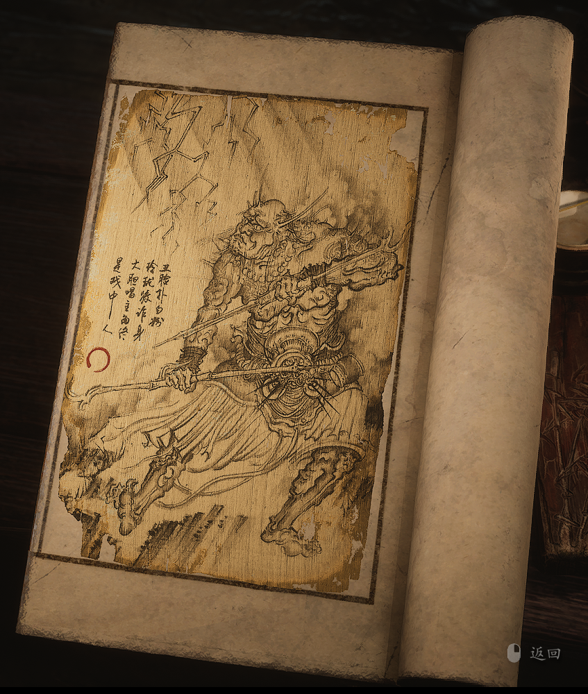

## 2.21 不净

> 心宽体胖肚儿大，相貌凶顽嘴角耷。
>
> 按兵不动稳如山，偷闲躲静守宝刹。

长空飘絮，玉砌琼楼。纷纷扬扬的大雪，经年累月，在这山岭上不曾停歇一刻。与这雪截然相反，三师兄不净，是个时时刻刻都想躲懒偷闲的人。

这日，三师兄不净正在偏殿里执守，以防师父随时呼唤，听见阶下有打斗之声，雷长老跑来禀告，原是山里不知来了个什么妖怪，非要闯进来见师父。

不净敷衍道：“你们先出去对阵，洒家拿了戒铲就来。”待雷长老步出偏殿，不净又坐回蒲团上歪着。殿外传来了妖怪高声的呼喊，说是要求见佛爷爷一面，拜师学艺，打斗声却越发激烈起来。

雷长老又赶来求援，不净起身道：“你们与二位鬼王先应对着，断不能放他进来。我这铲头的刃有些钝了，待磨好就去会他。”又过了一会儿，殿外静了下来，雷长老来报，说是要拜师的妖怪，被鬼王不小心打死了。

不净称赞道：“你们办得极好。把那尸首扔到枯井里，别脏了这地方。”雷长老听后，暗叹这妖怪无命无运，若是其他师兄值守，没准真能见上师父一面。

岂料，收尸时雷长老发现这妖怪身上，贴着些引火引雷的符咒，像是来找师父寻仇的。不由心中大惊，又暗自庆幸起来。

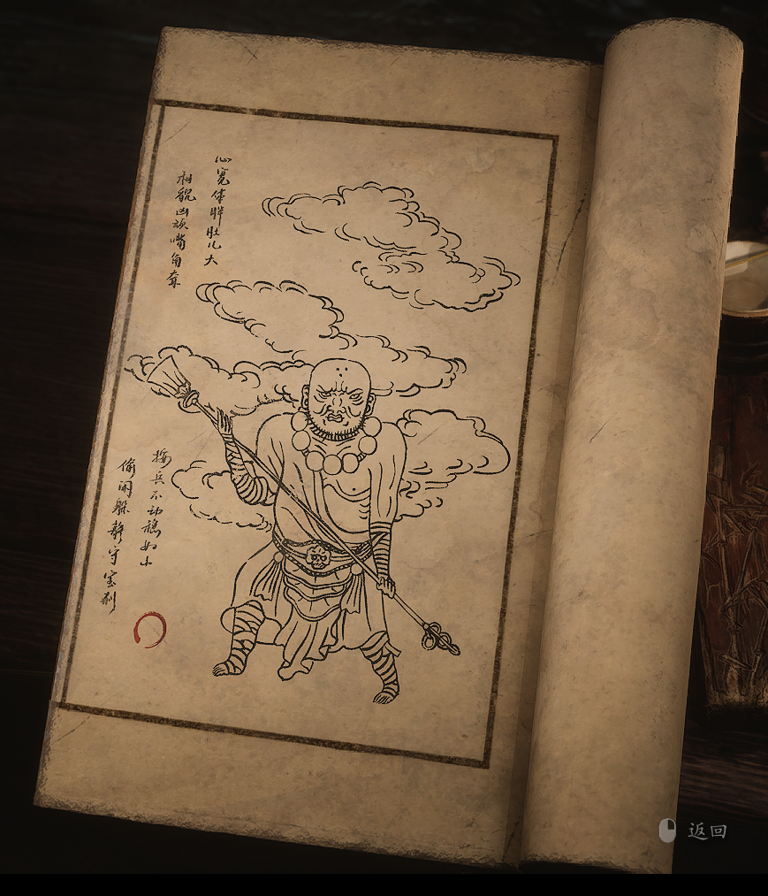

## 2.22 不能

> 雪中有怪僧，壁前临朔风。
>
> 以武入真禅，缚手难缚魂。

二师兄不能，拳法超群，寺中无人能敌。

一日，黄眉招他近前，要授他些克敌的法术。二师兄却道：“弟子自认拳法足以胜敌，不必再用他法。”

黄眉听罢，笑道：“你的堂堂正正，不过是不知变通。这般束缚自己，如何再进一步？”

不能道：“弟子觉得，若用自己不认同的方法争胜，即便最后赢了，面上虽能，心里仍是不能。”

黄眉问道：“你不认同为师的道？”

不能道：“师父，您一直走巧路子，所以难以成佛。看似样样皆能，实则样样不能。”

黄眉听后轻笑几声，命人反绑了他的双手，令其在寺外的石壁前思过。原以为他跪上几日便会放下执念，不想他十分耿倔，直至今日也不肯低头。

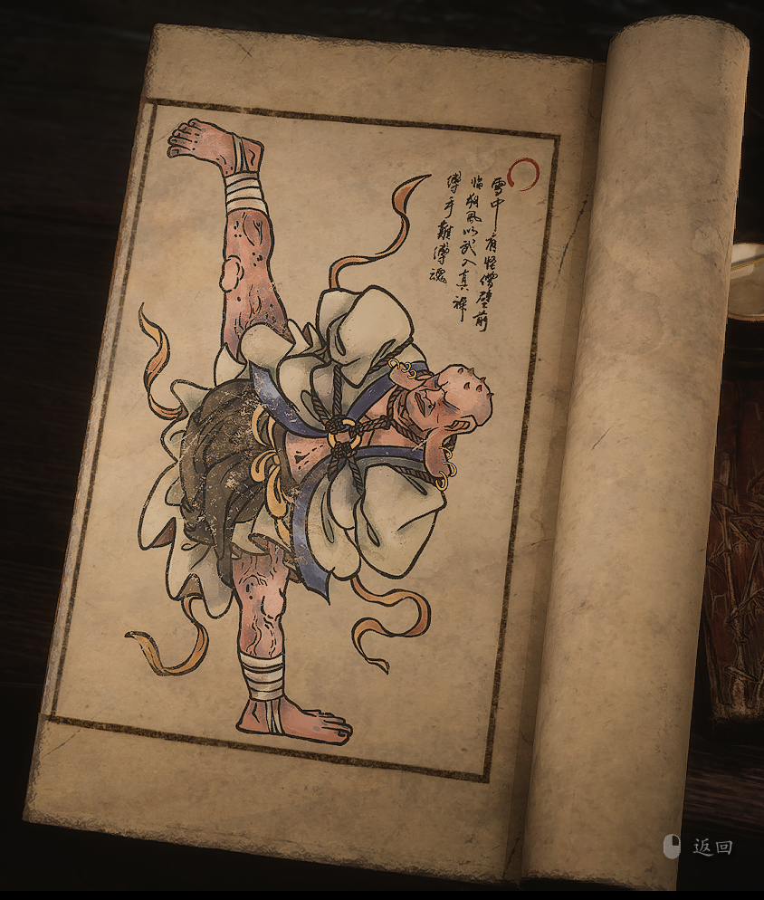

## 2.23 不空

> 不死亦不生，空余梦里人。
>
> 前脚差一步，光阴又半程。

很少有人知道大师兄不空是何时剃度出家的，只知道他是最早随着师父修行的，资历最深，庙中许多事务都由他来打理。

他极少从佛殿里出来，似乎总有念不完的经。他还极擅写诗作画，画过诸天神佛，叹过市井百态。可他却从不留恋，笔下的东西，写完画完就是草草扔在地上。有人问他为何，他便说：“我见不缘实我，不空是空。都是假的，何必吝惜？”

大师兄虽不出殿门，但爱好寻人辩经论禅。

一日，不能过来问他：“师兄，杀生有罪吗？”

不空答：“杀生有罪。可若为了大道，不得不杀，便无罪。”

不能反问：“那何为大道？”

不空答：“自是明空觉性，福徳圆足，登极乐，入净土。”

不能反问：“杀生不但不能了结因果，反造了更多孽缘业障，这又如何登极乐？”

不空答：“我不入地狱，谁入地狱。若不杀，便是为旁人遗留祸害，岂非更是缺了福德。”

不能笑道：“师兄你都说要入地狱了，可见无论如何杀生都不对。说来，好人自有福报，又何须你再多此一举？”

不空急道：“入地狱只是比喻，本义是替他人受苦受难……”

不能打断道：“放屁！杀便杀了，还搞这许多弯弯绕绕。师兄，巧立名目，我欲即法，杀生背后的这份装腔作势，才是真正的罪过啊。”

不空闻言，一时说不出话，似乎想到了什么往事。

至此之后，两人再也没论过禅。

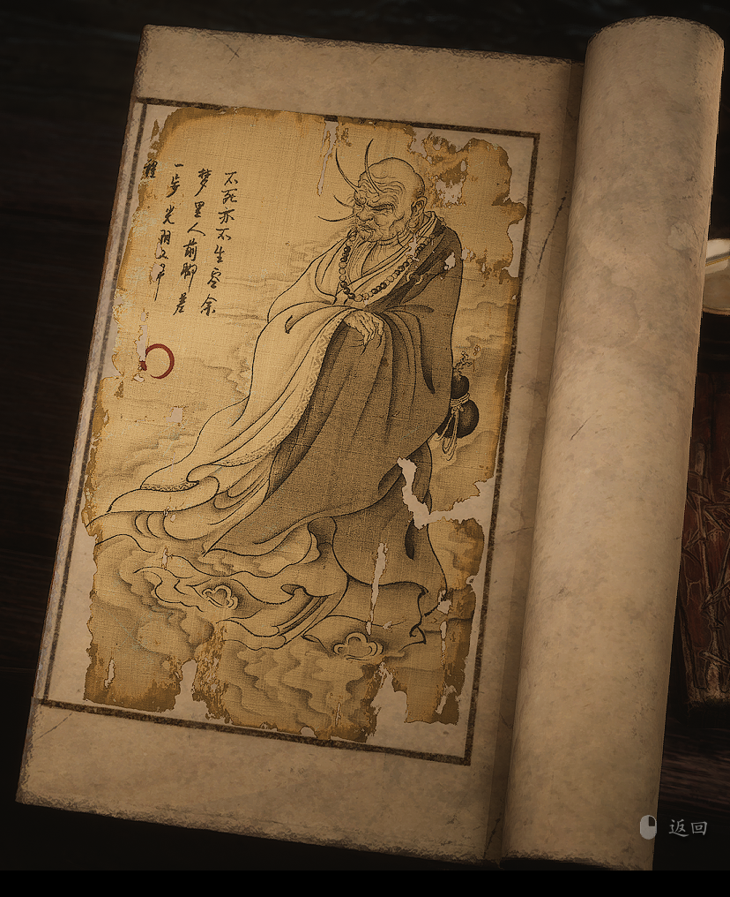

## 2.24 海上僧

> 苦海无边岸，登舟欲度身。
>
> 功成不择手，终究难成人。

昔年，黄眉乘楼船过苦海，下船时发现船身上爬着些怪鱼。这种名唤何罗的鱼，只有一个头，却有十个身子，狰狞怪异。

那些鱼见黄眉过来，竟主动叩拜，发出些喊声，原是想追随黄眉，脱离苦海。黄眉笑道：“汝等怪形怪貌，换作他人，定不会收。偏生是我，觉那凡夫俗子收了，又有何趣？”语毕，真就将这些怪鱼收作了弟子，教他们穿衣识字，收敛身形，化出人样，平日任他们在小西天境内自由修行。

有一只鱼妖，身形最为健硕，性子也最为乖戾。初通技法后，便埋伏在庙中各处，伺机偷袭黄眉，出手毫不留情。黄眉却乐在其中，每每遇到，都认真与他赌斗，但大多数时候，只用那狼牙棒一挥，便将其扫了开去。

这鱼妖屡战屡败，自觉近身缠斗难以取胜，竟独自悟出一套用躯肢抛冰砸雪的歪门法术，打人奇准，一次在快活林，连黄眉也被雪球砸中了几回，差点被冻成冰坨。

黄眉不怒反喜，破天荒赐了这何罗鱼怪一个新名号——“海上僧”，命他平日就在内院负责清洁打扫，实则方便他偷袭任何想偷袭之人，尤其是黄眉自己。

咦，虽是跟着同样的师父，但因修习的心境和目的各有不同，待遇也总是千差万别哩。

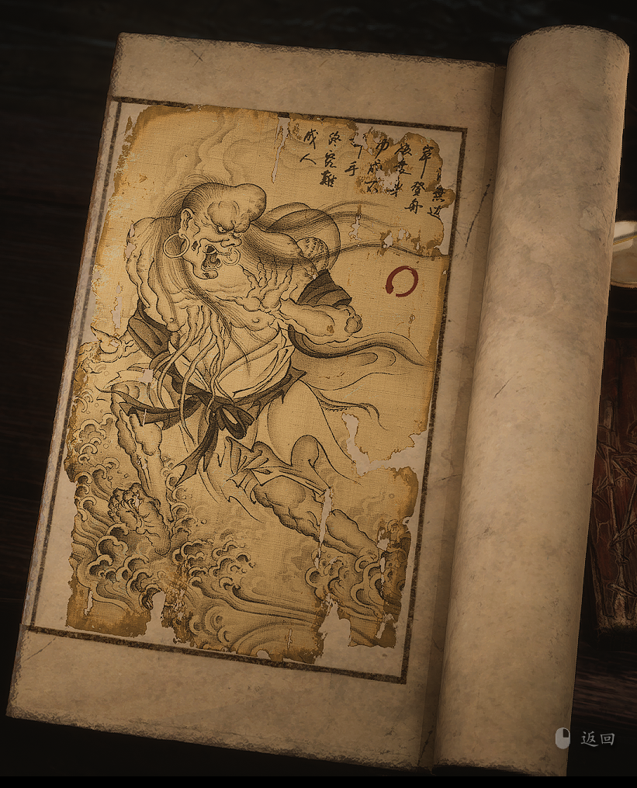

## 2.25 赤尻马猴

> 山中元帅唤马流，毛脸黢黑爱红绸。
>
> 冰刀雪刃劈赤胆，放屁添风笑石猴。

赤尻马猴躬着背，合上黝黑的羽翅，跪在金身佛像下，黄眉的脚前。

黄眉抬手，捏捏羽毛，道：“这等烂俗手段，也敢用在你们猴子身上，当真不识世情。”随即，他一挥手中的狼牙棒，点点灵光如银河倾泻在马猴身上，那双黑翅竟轻颤着缩回了猴子体内。马猴一怔，伸手抚背，欢喜不已。

黄眉大笑：“你乃孙悟空手下元帅，如今他已身死，你也莫要四处流浪了，本座重整雷音，救苦救难，你何不留在此处？”

马猴支吾不应，黄眉便道：“我知你受了许多苦。欲为诸佛龙象，先做牛马众生。众生你已做过了，如今入我门下，我带你做神佛的龙象。”

马猴搔首，似是有些心动，黄眉又道：“这世界，弱者多被苛责非难，强者却可横行无忌。你受的那些苦，归根究底，皆是力量不够。你不妨想想，若你有那闹天宫的猴子一般本事，吃苦的，就该是旁人了。”

那马猴念及这些年的心酸苦楚，禁不住要落下泪来，急忙匍匐到那胖和尚脚边，连连磕头起来。

黄眉畅快大笑起来，解下腰间的搭包，将那马猴收入其内，道：“很好很好，为师这就教教你。”

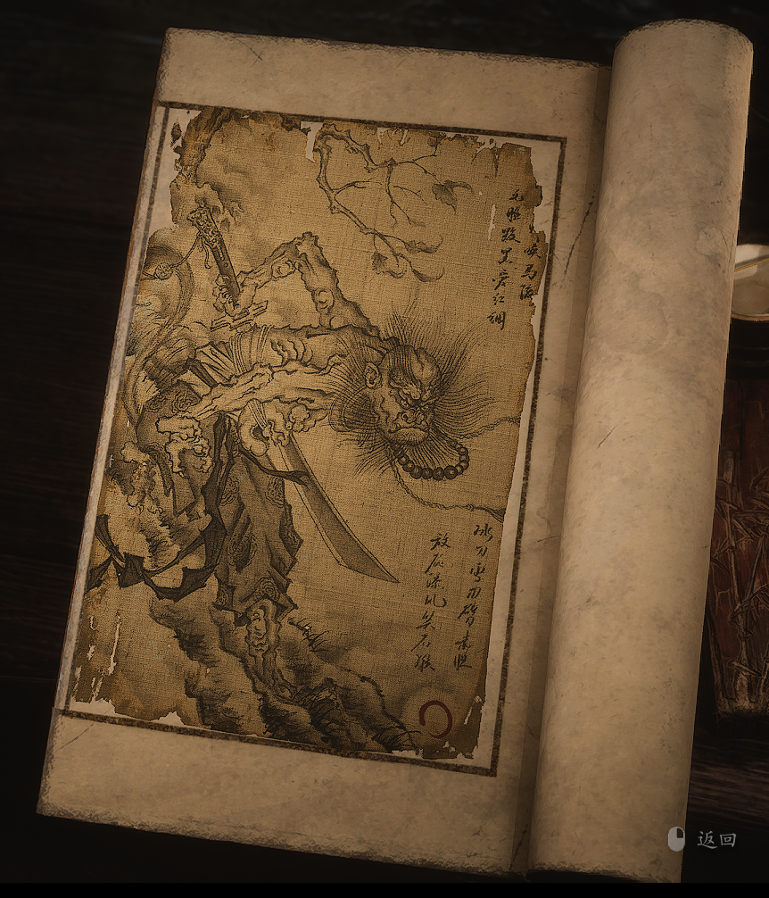

## 2.26 六妹

> 洞天疏影有人家，笑语盈盈满径花。
>
> 急走奔扑追蝶儿，且将闲语作流沙。

盘丝洞中，并无与六妹同岁的孩子，平日里她都跟姐姐们在一处。大家都对她很温柔，唯有四姐，会严厉督促她练功。有时她练功刻苦，四姐还会带她去山顶遥望外面的山水，给她讲些山外的故事。

她虽很喜欢跟着四姐，但四姐却常去山里探查一些她不知道的秘密。四姐总说危险，绝不肯带上她，她便又无趣了起来。

这日，山中设赏花宴，巫山来送礼的小妖们，照例交明了差事，又被留在洞中饮酒同乐。

姐姐们忙于接待客人，照管母亲，六妹便独自一人跑了出来。管事的虫妖被她缠得没法，只好带她在洞中玩上一会。

却就有两只喝醉的猪妖，见到六妹便指着她道：“这就是那个？”另一个猪妖道：“对，就是那个。”

六妹只觉受人议论，不甚高兴，反问道：“你们猪妖怎么指着人，这个那个的？”

管事的使劲给那两只猪妖打眼色，那两只猪妖却道：“小丫头，我们给你说个大家都知道，唯独不让你知道的秘密。”

那管事的赶紧制止，六妹却一脸认真道：“你说。”

两只猪妖笑起来：“你爹也是头猪，你是我们老猪家的亲戚。”

他们本想看那小姑娘生气跳脚，没想到，小女娃把嘴一噘，不以为然：“你们是因道行太低，才这般爱攀亲戚吗？母亲能相中的人，必定不是你们这样的腌臜东西。”

如此一说，猪妖自觉无趣，以后也不再开她的玩笑了。

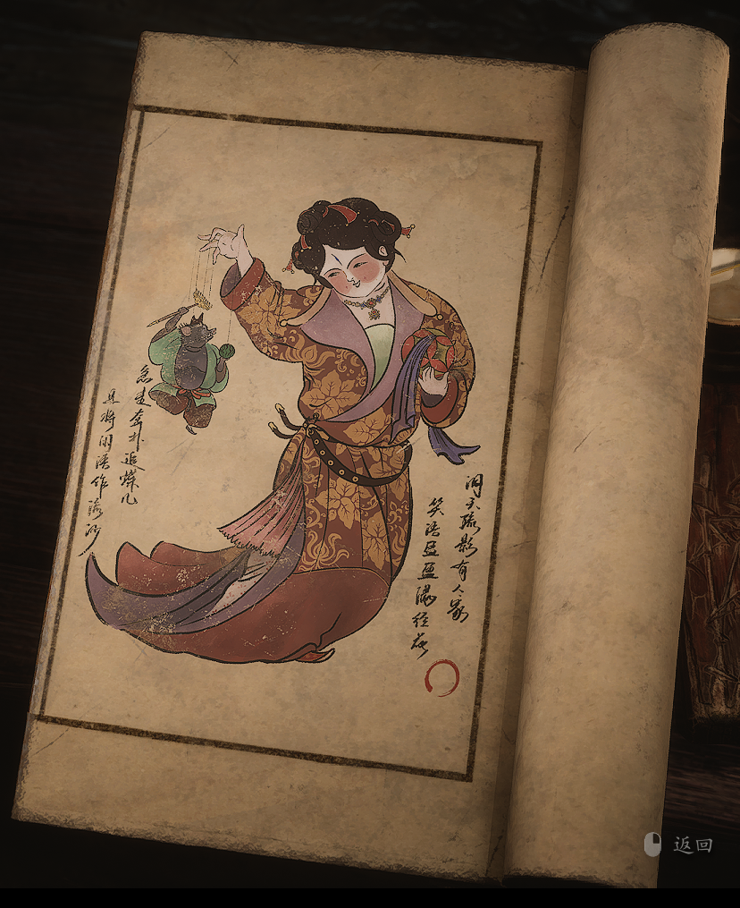

## 2.27 五妹

> 莺莺本多娇，燕燕爱嬉笑。
>
> 姐妹同相亲，只忧人间扰。

朱家五妹，适处华年，颜色艳丽，堪称国色。

这夜，乌云遮月，凉风过岭，似是有场暴雨在即。五妹陪二姐在兰喜村督办小妖们做活，远远瞥见有个赶路的书生来此避雨。她玩心大起，有意作弄作弄他。

这书生也是个呆子，因担心大雨浇湿书箱，竟一头撞入荒村，丝毫未发觉妖精们。他堪堪进屋，插好了门，点上油灯，屋外顷刻间大雨滂沱。

书生对着窗外的雨，诗兴大发，赶紧背诵道：“赫赫明明。王命卿士，南仲大祖，大师皇父……”

一道炸雷，轰隆响起。书生见那院门似乎晃了一下，并未留意，继续道：“……徐方绎骚，震惊徐方。如雷如霆，徐方震惊。”

此句刚完，书生又觉窗棂动了一下。他以为是风雨作祟，便急急关上了窗。如此这般，直待他诵完全诗，神清气爽，才惊觉确有人在敲门。

他见门上的窗纸，映出个娉娉袅袅的身影，不由心中一惊，料想来者必定是个妖精。但心念一转，又觉自己此生窝囊颓唐，若做个风流鬼倒也洒脱。

他慌忙起身，将那房门猛然一开——

也不见什么绝色的妖精，却是个披头散发，双目流脓的女鬼站在那里。他怪叫一声，撞开对方狂奔而逃。

门外的五妹正捏着兰花指，款款倚在墙边，未料被撞了个趔趄。她愤愤不平地走进屋内，口里骂着那书生不懂怜香惜玉，恰巧看见书案上有面旧铜镜，自己随手拿来一照，原是狂风暴雨洗掉了她的妆容，徒留一片斑驳的色彩绚在那脸上，湿发一遮，真真吓人，连她自己也被气笑了。

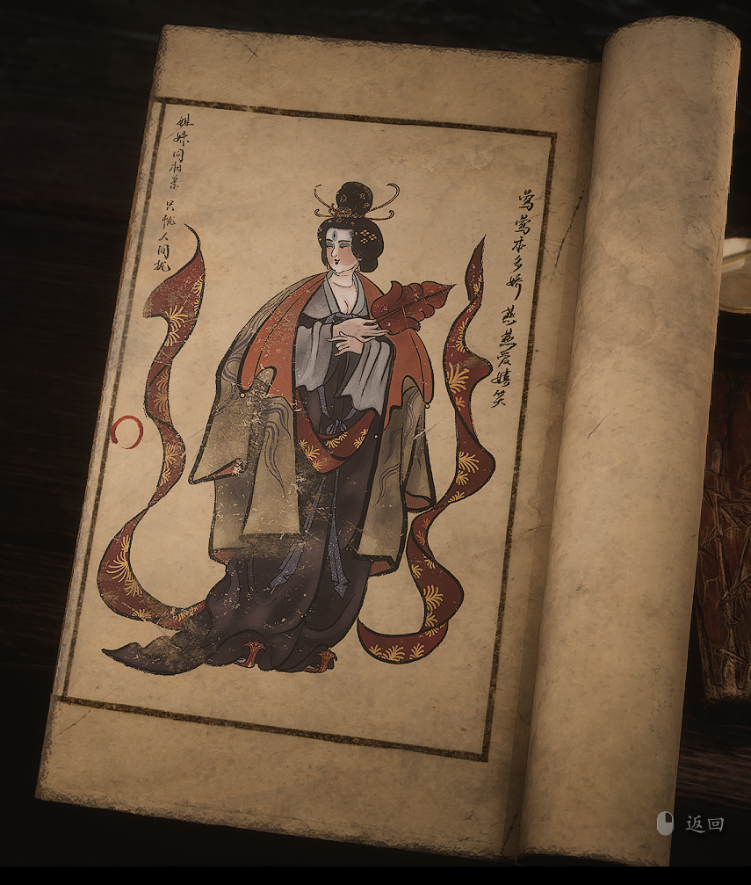

## 2.28 四姐

> 拔剑向青霄，敌血染皂袍。
>
> 幸得女儿身，娇娥胜俊豪。

昔年，毒敌大王带着四个儿子投来黄花观，百眼魔君觊觎倒马毒的威力，便许诺将几个蜘蛛精小辈与蝎家联姻，便唤老蜘蛛精带着四个女儿来相看。

待众人就坐，魔君让蝎家四个儿子逐一亮相。

蝎大起身，拍着胸脯道：“我的功法乃是父亲亲传，几个兄弟里最当属我是个好男儿，姐姐们若都想嫁我，可别生了嫌隙。”

众女蹙眉，那蝎二赶紧起身，抢白道：“姐姐们不用苦恼，我大哥心快口快，他虽是厉害，我也不差，若是招我做婿，我定扩充洞府，做大做强。”

魔君听了心下不喜，众女亦不置可否，又望向蝎三。蝎三见众人看着，不得不道：“哥哥们都是好的，我弟弟也很不错，姐姐们多瞧瞧。”

蝎四嫌老三落了气势，不甚满意，道：“我三哥性格有些别扭，姐姐们勿笑。我虽少他们几年道行，但未来可期，姐姐们选我便是选中未来。”

其后魔君便让朱家四女逐一发表看法。大姐温言道：“家中姊妹多，母亲又生着病，我暂不愿卸了这担子，让妹妹们受苦，晚几年罢。”

众蝎摇头，表示可惜，二姐一个娇笑：“我一人忙着撑起家业，许多窟窿要补。若是……下嫁，诸位谁愿意填上这银钱空子，我便考虑考虑。”

那毒敌山早已败了的，哪里有什么财帛，二姐便一下堵死了话头。三姐捏着扇子：“我要嫁个琴瑟和鸣的，我最喜罗隐的诗，四位好汉里，可有哪位读过？”

四蝎只怕连诗是什么都不知，哪里还晓得什么罗隐，众人只能寄希望于四姐。

四姐坐在末尾，百无聊赖，轻轻一哼，道：“姐姐们太客气了，说得这般婉转，只怕他们听不懂。什么相看相看，不过是想让我们赔钱嫁汉，还想成了他们的算盘。什么银样镴枪头的好汉，若真有本事，何不自己挣份家业，岂不比在这里说嘴现丑了强？”

其后，因四姐这么一闹，席上的话语转变成了批评四姐，互相致歉，许婚一说，便不了了之了。

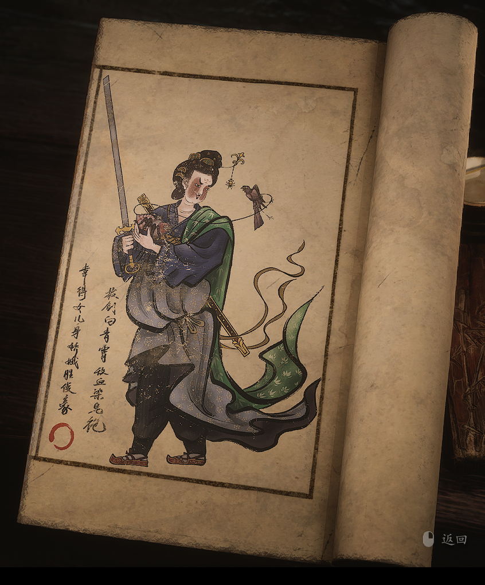

## 2.29 三姐

> 洞天隐居百余春，难见山外假与真。
>
> 君化白骨我未嫁，造化俱是捉弄人。

朱家三姐，举止娴雅，温柔端方，喜爱读书练字。她见家中妹妹都尚懵懂，两位姐姐又十分忙碌，便只留心针黹之事，是家中最好的纺织手。

二姐在山外经营的布庄，便是以她设计的织谱来织布，洞中的织工也都归她调教。因她面和心软，大多时候难以服妖，五妹便是她最好的帮手。三姐手拿织谱教学，五妹就手握戒尺相随。若有那十分不受教的，五妹心直口快，一头告到二姐处，那织工就全无幸免，封入茧里，当做餐食了。

说来，因大姐二姐事务繁杂，五妹自幼便是跟着她。她太安静，五妹就成了她的另一面。两姐妹吵吵闹闹，日子倒也好打发。

三姐常读的书里，曾有一些凡间来的志怪传奇，她每次读来都觉得有趣，总想见见那些花前月下的场景。不过，她可不会傻到喜欢什么风流才子，毕竟故事里的妖精，大多死得很惨。

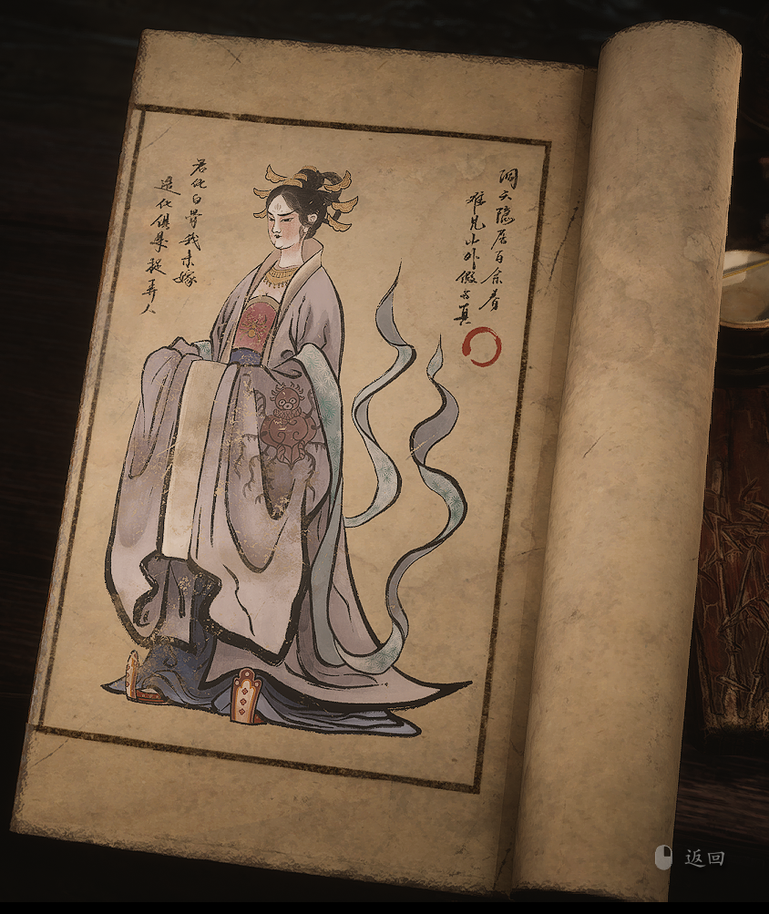

## 2.30 二姐

> 粉黛绾青丝，蛮腰缀玉石。
>
> 娇似天台女，最是利害时。

朱家二姐，自幼假充男儿教养，洞中银钱往来，买卖支应，皆由她一人单管。山外的管事和兰喜村的小妖们，与她往来最多。

二姐因事务繁忙，做事皆有时辰定规，若出了差错，便有一顿好罚，是以小妖们对她又敬又怕，总觉得自己这位奶奶样样出挑，个性又要强，没准以后能当上洞主娘娘，到时谁若有幸入赘，也能跟着当个便宜大王。这可连累了旅居在此的四位蝎太子，让他们没少受编排。

二姐却全不在乎，蝎家四子谁愿帮她卖力，她的脸色就对谁好几分。

前些日子，不知她从何处寻得一颗仙藤种子，栽在了洞中的别院里，找了蝎大替她守着。

蝎大喜滋滋地应了下来，暗想这必是二姐倾心于他，一头求到魔君跟前，望其帮忙撮合。魔君听罢直摇头，说这般有主见的女子，旁人替你说亲，只会让她愈发瞧不起你，还是靠你自己最稳妥。

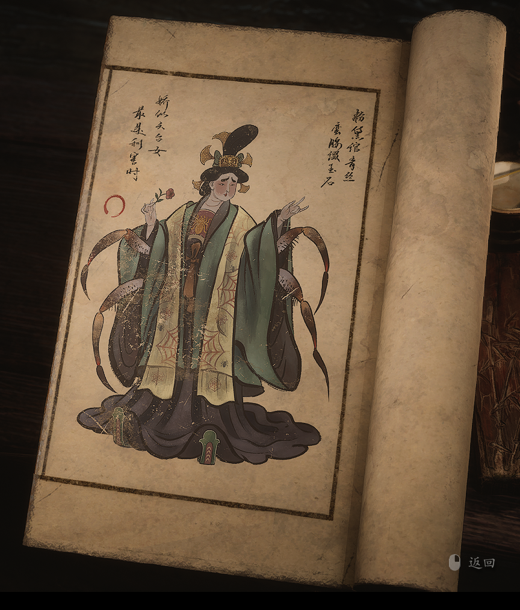

## 2.31 大姐

> 归路满青苔，桃花始盛开。
>
> 慈柔情几许，姊妹相亲爱。

朱家大姐，行事温柔和平，于众妹妹有如母亲一般，起居大小事情，皆由她体贴照管。即便爽利如二姐，自立如四姐，在大姐跟前也都老老实实，有些小女儿的娇憨之态。每日里，她要管待洞里的茶饭，众人的衣裳，生病吵架的寻她，高兴伤心的也寻她，整日忙忙碌碌。

来她身边传话的小妖，总是络绎不绝。

“大奶奶，二奶奶和四奶奶吵起来了。” 

“大奶奶，五奶奶教训了个织工，现在那边差个人手，问能不能调上来一个。”

“大奶奶，六奶奶练功伤了气脉，请您过去瞧瞧。”

某日，夫人将她唤到自己跟前。一踏入若仙庵，大姐就见母亲正在树下赏花，她招招手，叫大姐过来：“我们庵中的花，可比天上的好。” 而此时，若仙庵门外，当值做饭的小妖在等大姐定菜品，看育虫茧的管事在等禀报事项……

大姐问道：“母亲找女儿来，可是有什么示下？”

母亲只是拉住她的手，道：“陪我看看花。”她慈祥地对大姐微微一笑，“我怕他们累坏了你。”大姐看着母亲，忽然想起很多很多年前，母亲也曾牵着她的手，看过同一树桃花。那时花很美，母亲也很美。

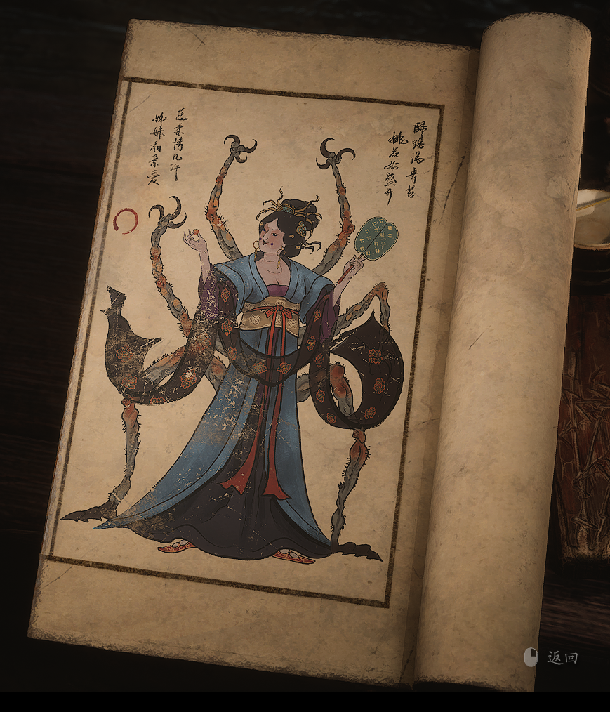

## 2.32 琴螂仙

> 阆苑非凡种，濯垢有仙风。
>
> 下界化奇样，入道不俗同。

昔年，有人从昆仑阆苑中往某个洞天福地投下了两枚仙卵。凡间灵蕴不似仙界充盈，仙卵下界，竟育化不出完整的仙兽，令其失了大半法能，形貌也迥然不同。其中一枚仙卵，被用作了度化有罪者，另一枚则被有心人藏了起来。因其育化成了别样的生灵，又将其唤作琴螂仙。

琴螂仙每隔数日便会产出如血囊一般的虫卵，若被生灵吞入腹中，幼虫便会啃食其五脏六腑，又因其天赋之差异，育化出不同的虫来。

若此卵未被生灵吞服，则自然育化，成为凡胎琴螂。凡胎的琴螂会吐丝做茧，用以困住猎物。因其体内的奇毒，困在茧中生灵非但不觉憋闷，还常有临风欲飞之感，如坠云端，但时间一久，身体便会异化。有修士想以此法，锻炼躯体，精进法力，但终究是旁门，极易迷了心智。

自这仙卵入世，已有许多生灵遭其毒害。此物其实极不善打斗，除了口吐秽物，并无什么大神通，相貌又极其骇人。想来，它能在世间繁衍至今，必是能给某些人带来不为人知的好处罢。

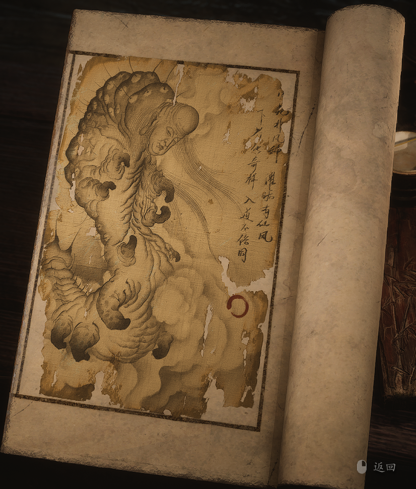

## 2.33 百足虫

> 蜷身一滚无首尾，展足扑腾爪似锥。
>
> 螯牙狠毒喷邪风，狭处相逢命无归。

昔年，有个到盘丝洞寻仇的少年，他大仇尚未得报，就被妖怪捉住，扔进了虫窟之中。他跌落深穴，摔在一团肉虫的尸体上，虽是摔折了腿，却活了下来。少年疼得嗷嗷大叫，支起上身，欲要求救，放眼望去，虫窟之中除了骷髅与尸骸，再无他物。

少年万念俱灰，忽感腿上钻心一疼，有只一人长短的百足之虫，咬了他一口，还生生扯下块皮肉来吃。少年大惊，急忙从身旁摸起块硬石，疯狂砸在虫子身上，直将其砸得爆裂开来，才怔怔停手。低头一看，手里拿的竟是块人头骨，赶紧将其甩了出去。

一番周旋后，少年发现受伤的腿竟然不疼了。他沾了沾虫尸淌出的浓汁，涂在擦伤的手臂上，竟也不疼了，想是它的毒液起了麻痹的效果。这给了少年不小的启发，他环视一周，从深穴边的虫茧上，抽下坚韧的丝线，又捡了两根不知是谁的腿骨，用它们将自己摔折的腿扎了起来。

处理完伤处，少年精疲力竭，可当他安静下来，立时听见些窸窸窣窣的声响。他抬头到处张望，去寻声音的源头，可那响动陡然而停，天上随即砸下来个白色的巨球。那球弹了几下，伸展开来，原也是只百足虫，却比先前那只大上数百倍。少年不敢迟疑，扑身躲到一旁，可他本就折了一条腿，如何能比百足虫还快？他灵机一动，将自己也抱成个球，在地上翻滚起来。那百足虫见少年这般作为，分不清敌我，双方对峙了起来。

恰巧此时，深穴中又传来坠地之声，少年望过去，有一堆被吃空了的皮囊被扔了下来。其后，坠地声密集而至，扔下来的全是些死物或残骸。许许多多的小百足虫都冲了出来，抢食这些残羹冷炙。它们每每经过抱成球的少年，都将他默认成自己的同类。少年立刻开了窍，他模仿着百足虫的行为，研究百足虫的习性，跟着它们住，跟着它们吃，足足花了一旬的时间，才从盘丝洞里逃到了外面。

当他迎着天光走出来，终于明白了，人若要好好地活着，就不该执迷于过往。他回到故乡打算好好生活，岂料，织户们知他去过朱家大院，便熙熙攘攘聚在他家门首，逼着他重回山中，带他们去找院中的宝贝。少年只好躲着他们，依然没能过上舒心的日子。

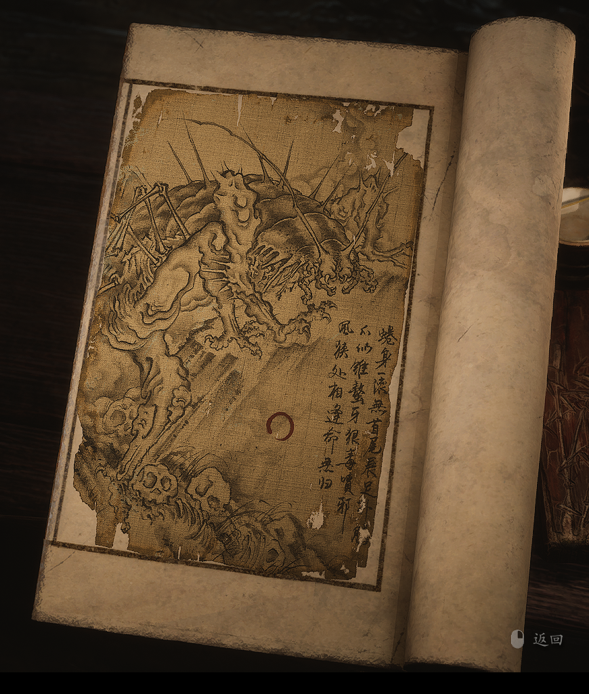

## 2.34 右手虫

> 昨为拈花指，今作零落肢。
>
> 同种不同胎，左右复谁知？

昔年，盘丝洞里曾有道士抬入了一双巨大的臂膀，小妖们都不知这是从何处得来的，但从这手的仪态推想，必是出自一位高人。百眼魔君亲临此处，将两枚卵状之物放入其中，并嘱咐洞中群妖，必要好生看守。

初时，这双臂膀往外溢出许多脓血，腥臭难闻。一段时日后，浊物干涸，结作了极厚的血膜，将其包裹当中。

又过了几年，从远望去，那血膜内蠕蠕涌动，似有什么已在内里育化而成，急待钻出。恰至十年之期，破卵而出两只虫来，身似蜂，尾如手，口喷之毒，鸟兽沾染便死，草木沾染便枯。

百眼魔君得知这个消息，十分高兴，设宴庆贺，席间他对蜘蛛精道：“师妹有所不知，我在紫云山中也试过一回，不料那仙卵羽化未成，连累我被师父好生责骂。此番我倒是想明白了，师父给的仙卵，命里承不起那般大的缘法，倒是这般，恰巧恰巧。”

这两只虫，一只其尾为左手，一只其尾为右手。它们极爱倒挂洞顶上，将尾巴垂下，诱猎物前往查看，其后合掌拍来，将其拍做一团劖肉，在将头儿垂下，正好囫囵吞吃。

其后，左手虫不知躲到山中何处修行去了，另一只无掌可合，便爱守在狭道里，若有来人，便可占尽地利之险，将其捕食。

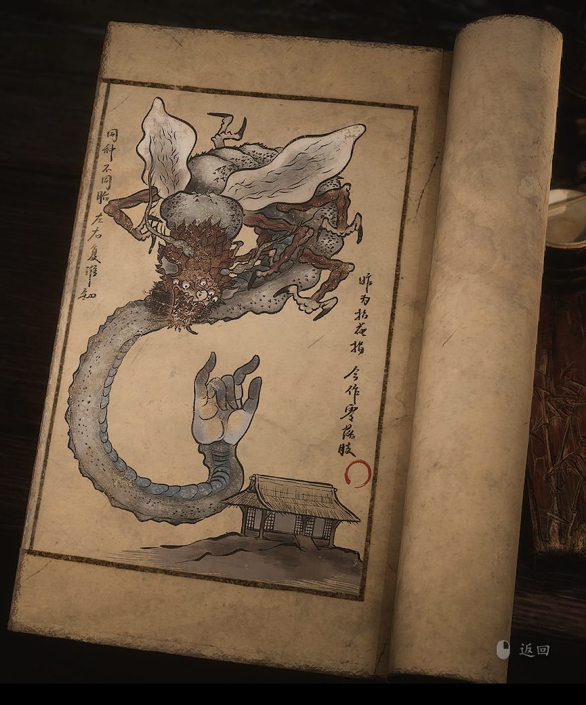

## 2.35 波里个波

> 倚石有活泉，粼粼清浅浅。
>
> 妙处霸王踞，蛙毒腥又甜。

话接前文，道士在寒潭被和尚们救下，抬着往山中去了。他原想和尚们会带他去庙中疗伤，不想却将他投入了地牢之中。

道士在牢中，听过魔音，红过眼睛，九死一生，侥幸逃生。虽是遭了些磨难，岂料武艺长进了不少，也算机缘。再回原处，那蛙早已没了踪迹。他只好离了小西天，继续前行。

某日天晴，道士到了一座岭上，只见郁郁葱葱，有几椽茅屋，像是有人居住。他正想找个歇脚之处，在个大宅院中，一脚踩空，落入个洞穴里。

那里头蛛网层叠，虫妖遍地，幸而他已并非昔日那般无能，一路直下，竟也探到了洞穴深处。那养在葫芦中的蝌蚪，倏忽间踊跃起来。

他穿过一道石缝，果见有只大蛙，正伏在水中，独占了一处天然泉水，虫妖们都不敢靠近。他拔剑朝那青蛙砍去，两个在水中战做一团，一个放电霹雳响，一个扑腾腿脚强。正是难分胜负之时，那蛙把嘴一张，竟伸出一只左手来，一下抡在道士的脸上，将他一下拍出了许远。其后，大蛙把头一仰，道士学了个乖，不敢近前。就见那蛙喷出毒水来，毒水不住扩散，竟将整个水潭都染上了蛙毒。

道士没想它有此技，身上又无解毒的药物，急忙抽身从石缝钻了出去，却听身后有个女声道：“你这道士，不在观里练剑，跑来这处寻死？”

他已毒气攻心，话还不及答，已然倒在地上。朦胧间，那女子似是叫了人来：“快把他抬回观里去，可别死在我们洞里，否则不好交代。”

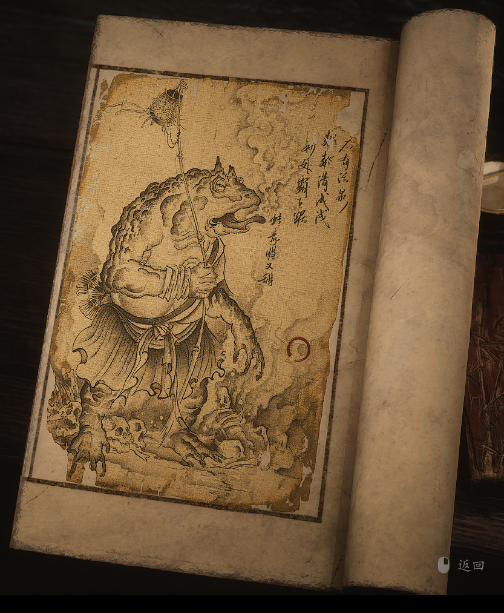

## 2.36 虫总兵

> 事遇机关须进步，人当得意便回头。
>
> 丈夫有志舒意气，复论功名换王侯。

翠屏村有个青年，在县里做衙役，因与县令不睦，所以屡遭排挤。这日，县令闻得兰喜村有妖怪作祟，故意派青年独自调查，企图让他有去无回。青年明知自己被刁难了，却不愿讨饶，领下差事而去。可待青年踏入那荒寂诡谲的村庄，立刻后悔起来。但日已西沉，他又不熟山路，只好留在荒村里过夜。

青年选了个檐角俱全的屋子，叉上门窗，点上灯，准备苦熬一夜，天亮就走。夜半他害怕起来，索性在屋内练刀壮胆。才舞了一会儿，房梁深处的黑暗里传来个沉闷的声音：“我是这岭上的妖怪，本想害你，但见你功夫很好，又配着官刀，想来是个当差之人吧？”

青年心下稍惊，但想到自己的遭遇，不吐不快，就都与妖怪细细说了，引得那妖怪也叹息不已。妖怪道：“我原也是个御前侍卫，受朝中奸臣所害，被妖术变作只虫子，只能在这山中讨生活。我本无牵挂，只想一死了之，奈何我的刀法无人可传。你若愿学，我就教你。”

青年哪敢拒绝，赶紧应承下来。他刚说完，就见暗处下来个一丈多高的甲虫，他项上有极厚的甲壳，果真像个将军的盔冠。那甲虫使一对双刀，出招一板一眼，劲力刚直，正合了青年的性子。青年说不出地喜悦，一虫一人就着残灯传艺受教，直至拂晓。眼见分别在即，甲虫总兵善意道：“如今世上，无才无德之人多，却偏能以阿谀奉承进位。你何必与他们纠缠，弄得腥臊满身？眼光长远些，人还须立于天地之间才好。”言罢，长笑而去。

经此一遇，青年豁然开朗，他弃了衙役之职改投边军，凭借精妙的刀法，当上了将军。后来，他率大军迎战外敌，连连大捷，成了无人不晓的名将。

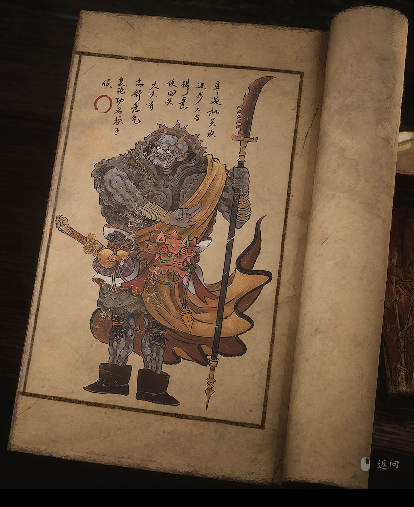

## 2.37 靡道人

> 访道空山闻落花，闻笛声声有人家。
>
> 穿戴假面如真像，借取他身炼丹砂。

昔年，有位少年独自来盘丝岭寻仇。不料，他被妖怪所擒，困在洞中历尽艰险磨难，侥幸脱身。待他返回朱紫国，众织户纷纷上门，希望他能引领大家，前往岭上的朱家大院，寻找传说中的玉梭。

少年心中杂乱，闭门谢客，但他的母亲却无法理解他，逼他率众去岭上除妖救父。可人心何其难测，各怀鬼胎的织户们并未在险境中团结一致，他们内斗不断，最终在朱家大院里，被只青色大蜘蛛悉数剿灭。

那少年匍匐在地，十分害怕，不想那蜘蛛化出人形，原是洞中，有一面之缘的青衣仙女。少年已对凡人厌倦不已，他痛哭流涕，求仙女留他在岭上修行。青衣仙女痛骂了他一场，将他从院里赶了出去。

少年流落至岭上的荒村里住下，虫妖们对他多有耳闻，蜻蜓精见他这般凄苦，便引荐他去黄花观，见了自己的师父百眼魔君。

黄花观中的道士们，皆戴着石质面具，魔君告诉少年，若想修行，就必须断绝世俗因果，戴上石面，了却尘缘。少年犹豫不定，在观中逡巡。

不料，有位红衣老太，正带着一群花容月貌的仙子们来观中拜访。其中，正有那青衣仙女和黄衣少女。

其后，观中设宴，请众仙子入座，少年在旁偷看，就见那桌上摆了好些菜肴，有人油炒炼，人肉鲜煮鲜烹，人脑煎作的豆腐块，人肉馅包的荤馍馍。他闻着腥臭，只能看着众妖食人。

魔君见他撞到这等场面，只淡淡道：“妖怪食人乃天性。凡人寿数有限，即便被我们吃了，也不过是少了十几年寿数，眨眼之间而已。”

是夜，少年感到无比孤独寂寞，他在月下吹出家乡的小调。他细细反思，问自己究竟是如何走到了今时今日。他哭了很久，最终决定拜师学艺，既然无法改变，那就只能加入他们。

他彻夜未眠，痛下决心在修行的路上一往无前。他询师父成妖捷径，魔君告诉他：“紫云山中有种异虫，名琴螂。生食其卵，便可飞升成妖……”

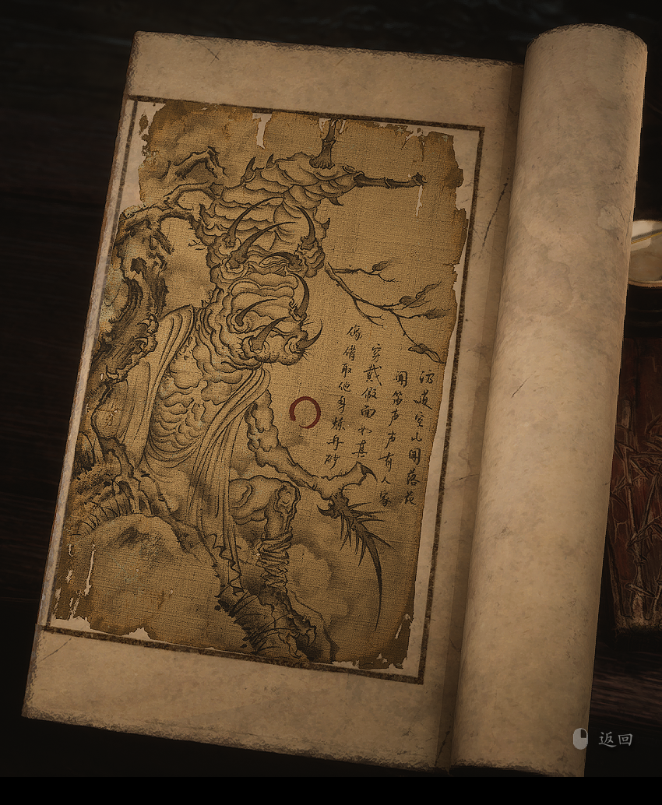

## 2.38 五行战车

> 五辆车儿合五行，五行生化火煎成。
>
> 兽首呼啸急行驰，火轮东西战道平。

火焰山，红孩儿即将迎来他的百岁生辰。他十分愉悦，对土地道：“马上就是我的生辰了，能让我出去玩一会儿吗？”

土地道：“你父王让我看着你，让你在此专心修行，不可随意外出。”

红孩儿道：“我已学会了三昧真火，难道不能歇息些时日？”说罢，他一捶鼻子，喷出一团火焰来。

土地摇摇头，道：“教你练三昧真火，是希望你能用它来炼制内丹，你这样随意吐火，散了神气，也不过是弄些小把戏。”

土地又道：“肝属木，木能生火；心属火，火能生土；脾属土，土能生金；肺属金，金能生水；肾属水，水又能生木。五行相生，循环不息。你有了三昧真火，自然是要用它来炼化五脏之气。”

红孩儿听得不耐烦，道：“罢了罢了，我知道了，我再去修炼。”

生辰那日，牛魔王在山中摆了宴席，广邀好友来参加。红孩儿命小妖们推出五辆小车来，只见小妖将车子按金、木、水、火、土安下，红孩儿走入场中，念个咒语，口里喷出火来，鼻子里浓烟迸出，闸闸眼，火焰齐生。那五辆车子上，火光涌出。连喷了几口，只见那红焰焰大火烧空。

土地心中不喜，只觉这孩子玩性太大，爱钻研些奇技淫巧，怕他来日难有出息，耽误了大事。

牛魔王却很是喜欢，觉得这孩子如今道行不深，却懂炼制器物相助自己，很有巧妙心思，当下便命人为儿子特制了五辆更大的战车。

自那以后，五行战车便成了红孩儿修行的陪侍，不上百年，这五辆车儿也因他的三昧真火通了灵性，成了山间十分厉害的妖怪。

## 2.39 石父

> 山中有山神，休羡难休嗔。
>
> 怀内骷髅骨，曾是花下人。

一日，黄风岭的磐石谷中，闯入个衣裳破烂的姑娘，她满身伤痕，因路过石精的洞府，见里头有些天然家当，便躲了进去，打算在那里栖身。

石父归来，见有人在洞中，原要赶她出去，见她一副可怜模样，只好容她休息片时。岂料，这姑娘将洞中的山果野味，炊成一桌可口的菜肴。那石父嘴馋，便留下姑娘来做饭。其后，石父每日负责带回食材，姑娘负责烹制，人与妖，相处极洽，便这样过了两年。

一次，姑娘外出洗衣裳，在河边遇到了同村的樵夫，回来之后不由大哭起来。原来她常年遭受父母虐待，因要把她嫁与一个傻子换彩礼，这才从家中逃了出来。如今，她十分害怕被捉回去，惶恐不已。

果然，翌日晌午，村民们都找来了谷中。她的父母因惧怕妖怪，便在洞口苦苦哀求。姑娘拒不从命，他们又转成破口大骂。只有石父冲出山洞大喝一声，他们才赶紧躲藏，待石父回到洞中，又跑出来继续辱骂。

石父索性坐在了洞口把守，那姑娘的父母就放下狠话，若妖精不还回女儿，便找道士来收他们。

姑娘害怕连累石精们，趁夜悄悄离开了洞府，结果不甚滚下山崖摔死了。次日当石精们找到她时，尸首都已凉透了。

他听山间的妖怪们讲，火焰山的铁扇仙极有法力，心也善良。于是石父抱着姑娘的尸首，一路走到火焰山。铁扇仙见过尸首后，说此事难如登天，若强行复活，只能是一副没有灵智的躯壳，不要也罢。

石父不死心，便日日抱着姑娘的尸首等在火焰山的山道上，希望博得铁扇仙的怜悯，哪怕姑娘的肉身已化为了白骨，仍是没有放弃。

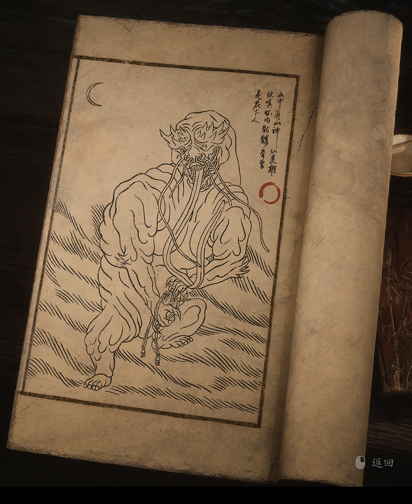

## 2.40 急如火、快如风

> 性烈把命烹，痴狂逞乖能。
>
> 鼻喷炎漠漠，嘴呼焰腾腾。
>
> 举烟风随火，燎原火趁风。
>
> 义气值千金，相辅才相生。

昔年，有两个泼皮在城里流浪，夜里总是宿在同一片城墙根下，所以交情很好。

他两个原就没有牵挂，做事不管不顾，下手总没个轻重，一次因抢个富家小公子，不慎将人打死了，便一同判了斩刑，关在牢里，只等秋后问斩。

关在牢中时，一个泼皮对另一个泼皮道：“此生倒也逍遥，死了便死了罢。可惜，以后无法再一同取乐了。”

另一个泼皮道：“若想再一道耍子，倒也不难，我乃落头民的后裔，有些傍身的小本事。”于是，便附耳教了他一套功法。

秋后，二人在市曹被斩首。侩子手将酒一喷，手起刀落，那二人的头顺势落地，却倏地一下飞去了空中，观刑的群众无不叫好连天。

其后，这两个头颅一起飞去山中做了妖怪，一个名为急如火，一个名为快如风。

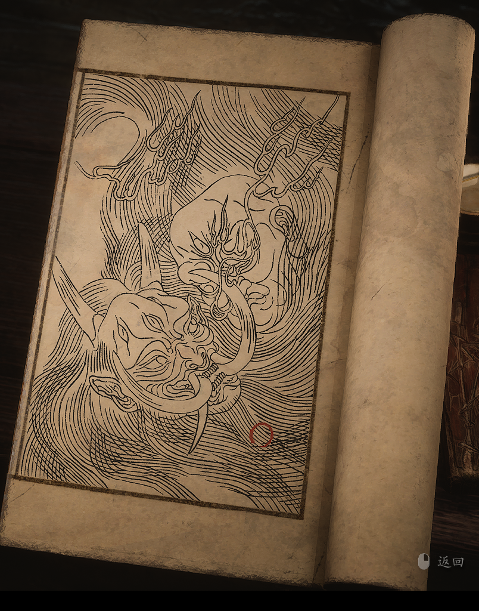

## 2.41 云里雾、雾里云

> 奇的由他奇，怪的由他怪。
>
> 跟着儿皇帝，山场任他坏。
>
> 不去逞刚强，不把雄心赛。
>
> 是非临到耳，抛到云霄外。

从前有三个鬼，共用一副身躯。他们想挣一个山神的名分，便疏通好门路，瞧准了号山的一个瞎子山神下手。

却说那位山神虽瞎了眼，但听觉十分敏锐，他极擅烟火之法，能放出烟雾，掩藏行迹。每每这三个鬼来挑衅时，便立刻隐遁了起来。

一次，三个鬼合力喷出雷光，扫荡开去，将那山神电了出来。山神大叫着，举起香把乱挥乱舞，三鬼却因身形笨拙无法躲避，挨了一下。眼见衣裳被燎着了，三个鬼丢开山神，竟互相骂了起来。

他二者斗得十分狼狈，山崖上忽传来一阵笑声，只见有个红皮肤白头发的小郎君坐在那处，像看把戏一般望着他们。

三鬼与山神恼羞成怒，暂且放下恩怨，与那小郎君打了起来。那小郎君甚感很有趣，也使一杆尖枪，和他们过了过招。

没承想，山神的烟雾正好能遮蔽三鬼笨拙的身躯，三鬼的雷光，正好能诱敌为山神制造进攻机会。如此这般，他二者竟能与那小郎君打个十数合。直至小郎君使出三昧真火，方才倒地求饶。

红孩儿对他们道：“这六百里山头以后都是我的，你们就跟着我，做我麾下的健将罢。”

自此，三鬼得了个新名字，唤作云里雾，瞎眼的山神被赐名叫作了雾里云。他们一起共事，服侍红孩儿，不过嫌隙始终难消，到今日还经常闹矛盾哩。

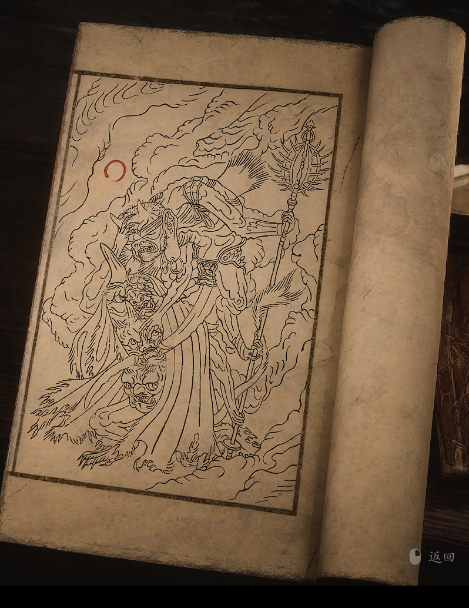

## 2.42 兴烘掀、掀烘兴

> 貌美娘子恶丑郎，犄角獠牙配浓妆。
>
> 鸳鸯盾里成双对，滚落红尘把命偿。

这个故事，是听许司徒说的。

昔年，许司徒因嫌夫人规矩周正，无甚闺房之乐，便讨了个泼辣貌美的小妾。

这小妾脾气十分大，对许司徒总是颐指气使，对正房夫人也从不敬畏，若有人拿礼法与她说事，她便将来者一通笑骂，只将人搞得灰头土脸才罢休。偏许司徒觉得这般有趣，便处处让着小妾，对她十分宠爱。

这日，许司徒回京述职，怕马车遭遇盗匪打劫，雇了一艘大船，将财物家人仆役同时带回京城。夜里，船上忽起打斗之声，原是有个妖魔，摸黑上了他们的船。不久，真就有个头长犄角，獠牙参差的怪人走将进来。他腰上别着一块破布，左手持一口锅形刺盾，右手攥一柄铁鞭，凶恶地盯着众人。

许司徒和夫人怕得瑟瑟发抖，唯有那小妾昂然不惧，大声呵斥妖魔无礼。那妖魔愣了半晌，忽然叹道：“化作人也如此娇纵，不愧是我们夜叉。”

小妾变色道：“放你的屁！我原想多玩些时日，如今被你坏了好事。罢了罢了，只好杀个干净，一起走了罢。”这才摇身一变，竟化作与那妖魔一样的容貌身形。

许司徒这才明白，自己识错了人，竟招了个妖怪到家里。

他两个正待要杀许司徒众人时，忽闻有个女声响起：“你们夜叉国虽灭了，流落至东土，也不该这般没规矩，不如随我入山修行罢。”他两个还想反抗，就见船头落下个女子，手里持一柄宝扇，尽力一扇，就将他们控在风中不可动弹。

许司徒经过这场虚惊，从此再也不敢纳妾了。

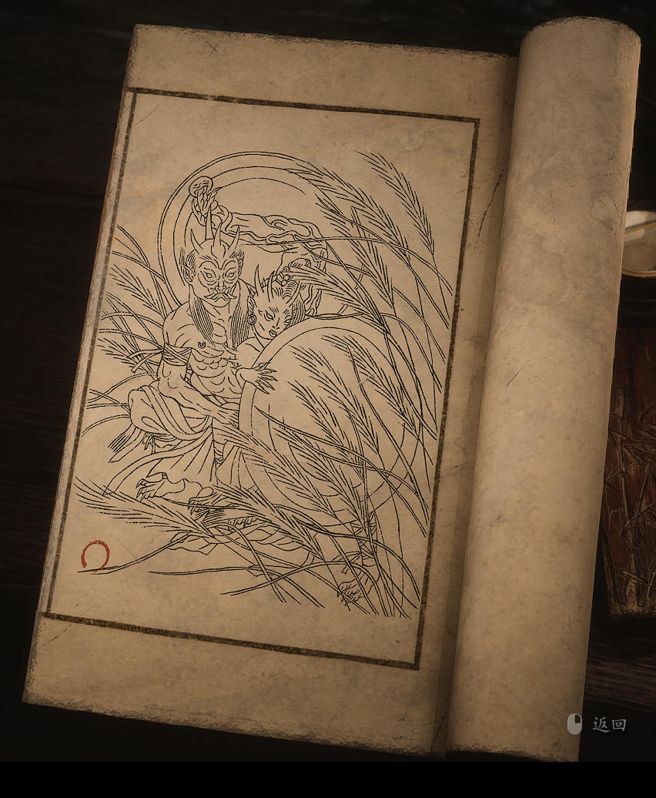

## 2.43 燧统领

> 神火造神机，炎池深处栖。
>
> 对手飒沓起，相持显威仪。

要说火焰山中，谁最惯着红孩儿，那非土地莫属。但红孩儿，却并不总是领情，正如他父亲母亲对那土地一般，不过此乃家事，土地一个外人，做得再多，旁人也说不上什么好话。

那日，红孩儿嚷着要在山中仿照黄风岭的石先锋，给自己也添一个燧先锋。牛魔王与铁扇公主无可无不可，倒是那土地一下就应承了。他怕只有石先锋还不够红孩儿取乐，又凭意增添了许多石精，其中有一个身形巨大，生着双臂，还有可撑起石身的腿足。

这巨型石精比寻常都厉害，大多时间潜息在火河之中，若强敌闯入，或是主人唤他，才会从火河里钻出。红孩儿并不喜欢土地擅自做主制造的这批精怪，大部分时间里，也只与燧先锋有些交往。

因红孩儿随罗刹女住在翠云殿里，土地就将这些石精排布在了丹灶谷中。后来红孩儿围困火焰山，这些火河里的石精，倒是帮了不少忙，难免让人生出些别的想法来。

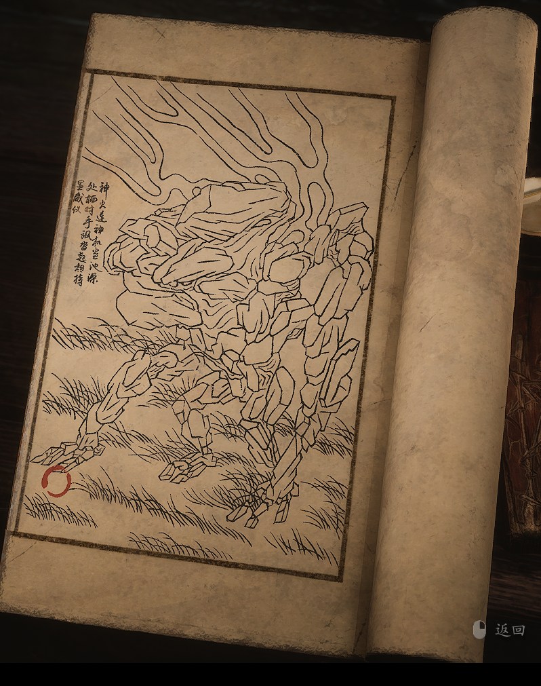

## 2.44 燧先锋

> 磊磊怪石火斑纹，出自炎河烈焰焚。
>
> 修河搬山忠诚性，不闻身外乱纷纷。

观音大士将赴小须弥山，与灵吉菩萨共议佛门要事。善财童子，素要侍奉菩萨，故此随行。

待其一众，驾云至小须弥山，方知灵吉菩萨云游未归，正在黄风岭中。观音遂又转往黄风岭上。因所商之事十分要紧，菩萨故令善财童子在河谷之畔，静候她归来。

善财独步河边，忽见一巨岩，巍然立于水滨，身形魁梧，状若看家之大狗。它勤勉搬石，垒土成山。善财心下好奇，便上前观看，好一番揣摩之后，将它细细记在了心里。

此后又过了数年，因牛魔王重回火焰山，菩萨一日突然唤来善财，让其回去尽孝双亲，红孩儿才得以折返故乡。

岁月流转，有人行经火焰山下，见一燧岩大石，大如堂屋，赫然立于炎河之侧。它不辞辛劳，搬山造石，其勤恳之态，宛若巨犬守家，令人啧啧称奇。

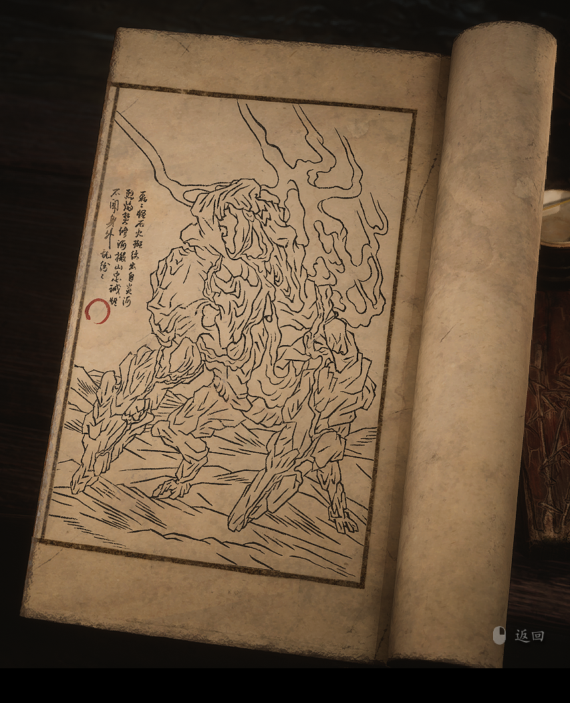

## 2.45 火灵元母

> 水有源头木有本，唯有黄金难寻根。
>
> 富贵如云一朝尽，清名如山天地存。

有个叫成名的采药人，因卖火灵砂而远近闻名。某日，有个方士打扮的壮汉，找来成名的生药铺中。方士从褡裢中，摸出一块手掌大小的金色丹砂。

成名从未见过这般神奇的东西，问：“这是何物？”方士道：“此乃金丹砂，是火灵元母体内之宝。我听闻你是此处最有名采药人，想要与你合作。”

成名道：“何为火灵元母？”方士道：“比寻常童子大十倍。此物一件便可卖黄金万两。只是需要许多火灵砂当诱饵。”

听说要用火灵砂为饵，成名立刻拒绝了方士。但没过多久，方士又背着满满一褡裢火灵砂找来，坦白道：“我实是需要金丹砂炼药。若你能替我捉到火灵元母，我便给你黄金万两，这诱饵也归我来出。”

见这买卖轻省，成名赶紧答应下来，二人次日就出发了。

一路上，方士逐渐发现成名根本不会术法，他用着市井混虫的把戏哄杀精怪。但方士转念一想，君子不拘小节，便也不以此嫌弃成名。最终，他们靠着成名的方法，摸索出火灵童子的巢穴。

在巢穴里，方士倒出大量的火灵砂，逼出了火灵元母巨大的身躯。见二人到来，火球如雨点砸向他们，二人果然不是敌手。成名不会法术，更是几乎被烧死。见自己难以脱困，方士不愿连累成名，便御剑朝着火灵元母直冲而去，与她同归于尽了。

随着元母死去，巢穴中的火灵童子也同时软倒在地，一命呜呼。成名割走了元母体内的金丹砂，火灵童子的火灵砂，还收走方士带来当诱饵的火灵砂，可谓大赚一笔。他回去后，还写了《山中记》《观火志》等书来讲述自己当日是如何独自击杀火灵元母的。

若要问他为何改写书，而不再以采火灵砂为生，他书中有句话或许可以解答：母死子散，火灵元母身殒，此地五百年不出火灵童子。

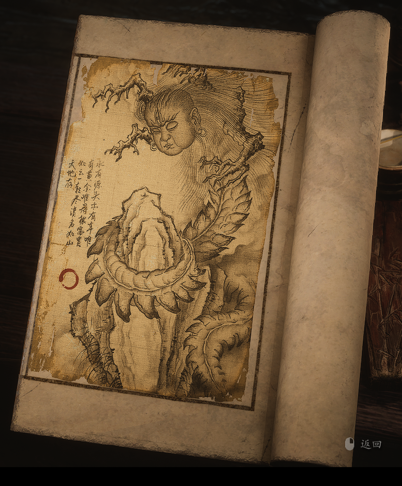

## 2.46 波浪浪

> 炳炳红艳彩，昂昂有雄风。
>
> 欲得清凉处，泄火小神通。

话接前文，被抬回黄花观的道士，不明就里被众人治好了伤。大家皆以为他是来拜师的，便对他多有关照。

道士在观中看众人练功，自练自悟，竟也习得了一招摘星换斗，野马跳涧。魔君听道士说了一路的见闻，知他头脑活络，敢为敢做，真就要收他当个弟子，行拜师之礼。道士受宠若惊，当即跪下认了师父。是夜，他又悄悄收拾了包袱，离了道观，重新踏上寻找天下奇蛙之旅。

翌日，魔君听人来报，笑道：“有小志而不拘大节，是个妙人。”

这回，道士继续向前，到了火焰山中。在清凉坡下，正遇着只火红的大蛙。他两个拉开架势，正要交战，却见坡后的洞里，走出只紫皮狮子狗来。

这紫皮妖兽极是蛮横，见他两个在洞前徘徊，直扑而来。那道士一见此物就被气势所慑，幸得那大蛙一脚蹬开，这才捡回小命。

见那蛙坏了好事，紫皮妖兽又转身向其扑去。那蛙张嘴朝天，喉头一哽，吐出一股火来，只将那妖兽逼得连退几步。

道士见机，将那新学的摘星换斗，野马跳涧统统朝妖兽使去。那妖兽见他两个联手，竟往洞中逃去。

道士急追，步入洞中，才觉此处无比清凉，与那火焰山中有天壤之别。

那蛙不多时也扑跳入内，躲在阴处不动了。道士恍然，原来这大蛙虽有吐火之能，但天性使然，亦怕山中炙热，只想找个清凉处歇息歇息。

知这妖怪也有贪生之念，道士心中感慨万千，杀意全无，提着剑离去了。

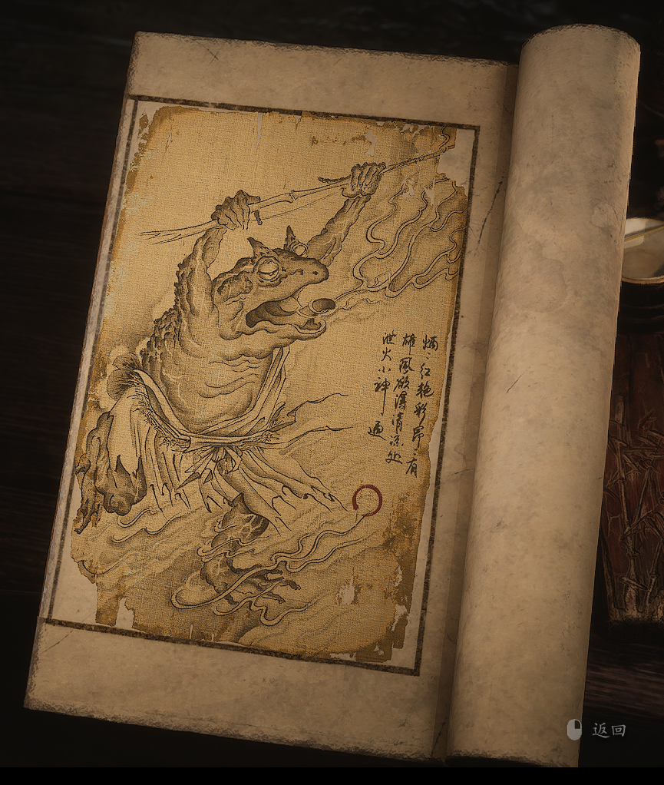

## 2.47 石子

> 小石子，傍山居，出深岭，有奇遇。
>
> 身藏奇能亮晶莹，天真地秀怀内聚。

天律载，山神不可擅离保生的山场，无故出走，一经发现，革职拿问。

昔年，石子尚未及冠，无法接替山神一职，石母不能踏出黄风岭，只好让他独自外出寻找石父。因担心儿子在外遭难逢险，石母便将体内石之精魄的神力，分了大半与他，这才放心让他远行。

无奈，石子出门，就与父亲走反了方向。父亲朝西，他却朝东，一直走到了花果山。

他原每逢一座山，都会进去寻寻父亲的踪迹，若未能找得，便起行向下一座山去。岂料，花果山中有许多好玩的，好看的，让他一直留在了山中。

若问他最喜欢何物，当属那只名唤凤翅将军的大蟋蟀。他日日坐在山头，看那蟋蟀冲天而跃，又撼地而落，每每开心就拍起巴掌助兴。日子一久，竟将那寻父之事，抛到脑后去了。

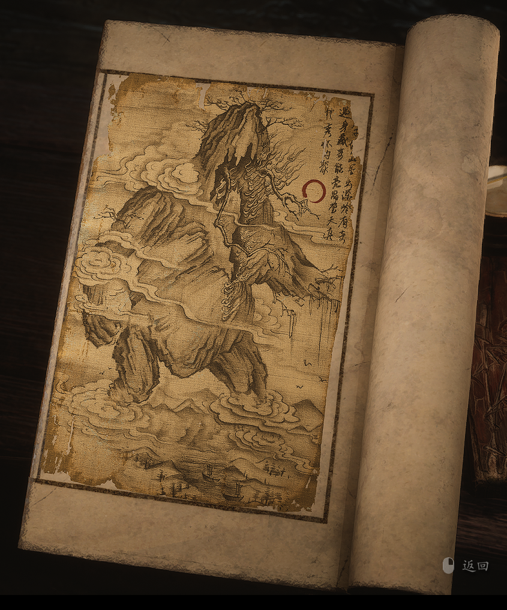

## 2.48 毒统领

> 天涯共沦落，同生互苦磨。
>
> 相宜情更洽，无根亦可活。

花果山顶，自被开山斧劈过一刃，许多山石树木滚落而下。有块崖石，本自吸取了多年天真地秀，如今因那一斧，脱了沉疴，便有化精之意。

却说与那崖石同落一处的，还有崖上的一棵歪树。那树被劈去了半截身躯，根残枝落，一副垂死之相。

那树对崖石道：“你我本是共处一地的情义，如今我快死了，救救我罢。”那石奇道：“我是块蠢石，如何救得你活？”树便道：“你是通灵之才，若能借躯壳让我扎根数日，必可活命。”

崖石极好脸面，便答应了歪树。那树将老根盘附崖石之上，紧锁牢拴，崖石嚷疼，它道：“我这树身沉重，缚紧些，怕跌下来。”

又过了数月，那树竟将茎蔓缠缚穿凿在崖石的各个部分，崖石痛恨得紧，想用双手将其扯下。用力猛拽，却似要把自己撕裂了一般，原来那根系早已和它融为一体，无法分割。崖石十分生气，成日咒骂歪树，两人彼此怨恨。

后来，那歪树因崖石也有了通灵之意，能发出毒雾，捕食生灵，自此两物才和谐起来，有了要好之意。如此也是情义反复，真心难料哩。

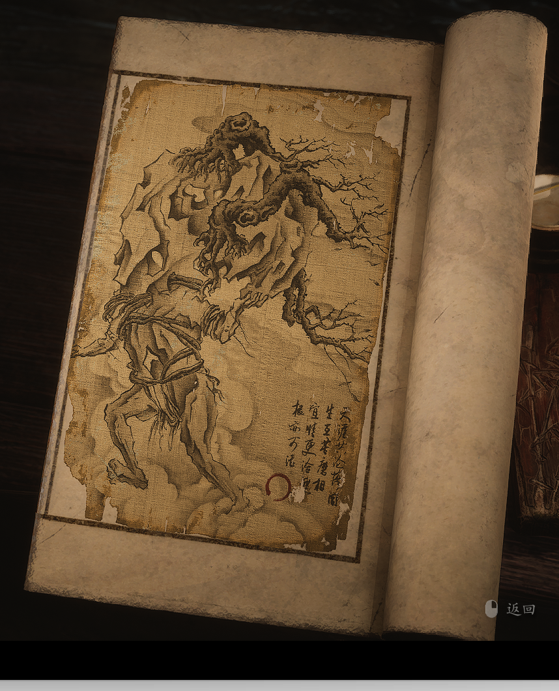

## 2.49 水木兽

> 祸兮福兮本难料，怨天怨地自难逃。
>
> 不如淡泊图快乐，乘风破浪定有朝。

昔年，有棵楠木长了千年，正是枝繁叶茂，郁郁苍苍，一朝天灾，将它被连根拔起，掀翻至河中。

因它枝干巨大，十分沉重，落入又窄又小的河湾里，河水无法载起它，它便只能搁浅在此。数日后，岸上的村民便打算将其拖走，拿去制成木料。那楠木却突然发出声响，扑腾起来，化作一只四足的木头巨兽，潜伏在水中。

此后，每有心怀不轨的工匠靠近，都会被它喷入水中，吓得三尸神炸，惊魂难定。但若有孩童来河湾里游水戏耍，它非但不吓唬他们，还偶用木枝将溺水者救上岸去。久而久之，村民也习惯了它的存在，唤它作水木兽。

某年，有个游方的道士途经此地，听人提及水木兽之事，便在岸旁对它大声道：“你困在此间岂不无聊，那外头多有你的同伴哩，快快起行罢。”

这水木兽丝毫不为所动，如此又过了两年。一次，大雨连绵了数日，河水越长越高，水木兽不住冲撞河岸，将村民全都吓得躲去了邻村。是夜，上游河堤决口，将下游的村庄冲毁了。待大水退去，村民回到村庄，那河湾里的水木兽也不见了踪影。

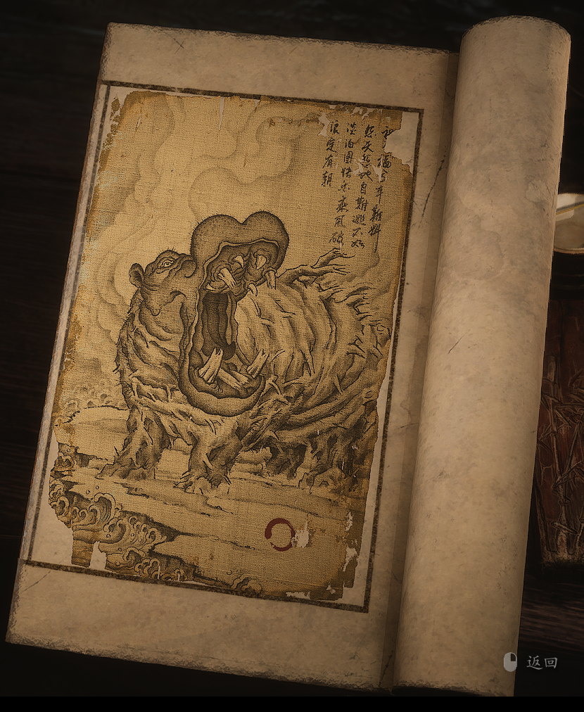

## 2.50 跳浪蛟

> 钢爪如翠口内红，呼气吹雨啸成风。
>
> 倚水跳浪白练起，生死皆在波涛中。

古籍载，蛟乃水虫之神者也，能率鱼飞。乘于水，则神立，失于水，则神废。

却说，陈家村有个渔民，在孙行者拆毁灵感庙时，曾听他说了个蛟能号令河中之鱼的故事。那渔民心念一动，也想去学些蛟的本事，从此便能让鱼儿自己跳入网中，省下大家不少劳力。

一次，他外出捕鱼，天空乌云密布，未多时，便雨疾风骤，恶浪滚滚。他的渔船被浪头掀翻，一下没了踪影。

却说他的确有些机缘，沉到河底时，正巧遇到蛟神巡河。蛟神将他救起，他苦苦哀求，要那蛟神传他些本事。蛟神慈心一动，真就教了他些水族的修炼之法。

其后数日，渔民都未归来，大家都道他已淹死在了浪中，为他买了口薄棺，预备立个衣冠冢。

出殡那日，暴雨倾盆，河中钻出一条大蛟，长尾一扫，带着许多鱼儿窜上岸来。众人赶至岸边，就见那蛟化成渔民的模样走出河来，大家又惊又喜。

岂料，那渔民归家后未久，只觉神魂倦怠，将其放回水中，他又立时精神起来。大家这才知道，他已无法待在岸上生活。

果然，又过几日，渔民跃入浪中，随水而去，没人再见过他。

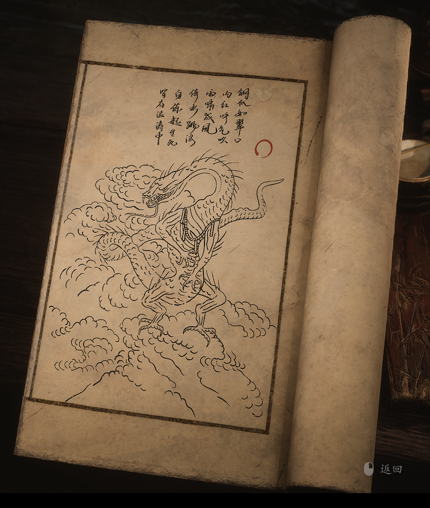

## 2.51 浪波波

> 投身仙山随缘宿，因势运化作磐石。
>
> 着意寻真不知远，坚心琢磨是修持。

昔年，有个道士，他以捉妖为己任，因一次偶遇蛙精，他走遍天涯海角，意欲追寻他们的踪迹。这一路，他得了许多机缘，如今已成了个本事了得的道士，也感受苍生各有生存之道，不再沉迷于捉妖，反倒起好奇他们的生活来。

这日，他途经花果山，见此处风景极佳，山青水秀，便将葫芦中陪他一路同行的小活师，放回了山涧之中。岂料，他刚放走那小活师，就见落下几道惊雷，电光散去，正是几个披甲执锐的天兵。

道士以为自己闯了什么祸事，正要告罪一二，天兵们已朝他乱砍乱劈而来，他急忙抽剑招架，终是难敌众人围攻，渐渐露出颓势来。

正是要伤身遭难之际，从那岸边蹦来只大石蛙，非但不怕那刀光箭雨，连那天将唤起的雷电也丝毫不惧。石蛙助道士将天兵打退，道士走至岸边，才知是自己放生的小活师引来了石蛙相救，心中十分感激。

自那以后，道士也不再已成仙为念，反倒时常去拜访蛙精，向他们讨要些小活师，散到各个钟灵毓秀的山川之间，世人都称其为蛙仙人。

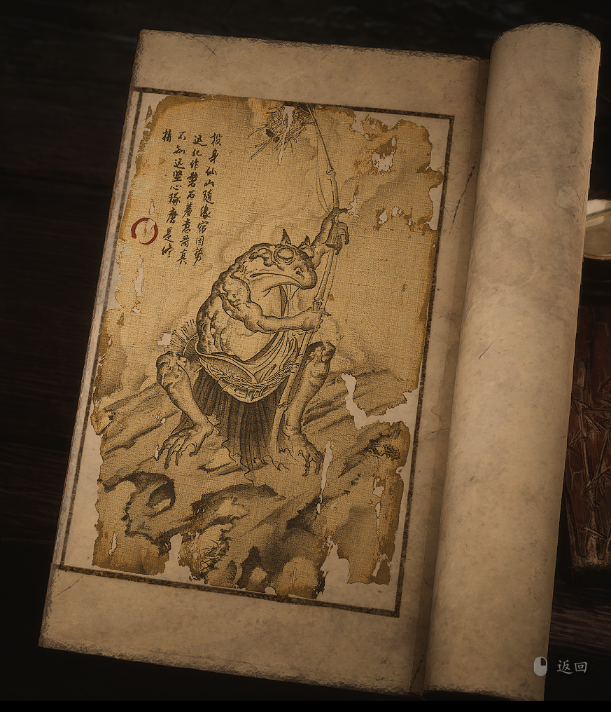

## 2.52 金甲犀

> 霹雳为角金做甲，奔走驰迈动地摇。
>
> 身硬何怕诸邪近，初心不折永称豪。

世人皆知，孙悟空在八卦炉中，经神火锻炼，炼做个金子心肝，银子肺腑，铜头铁背。但世人或许不知，那刀枪不入的身体，受伤也不免会疼。

他在五行山下被压了五百年，兄弟们未尝来看过他，只有山神土地喂些铁丸铜汁聊以充饥；在黄风岭被三昧神风迷了眼；在平顶山入了金角银角能化人的葫芦；在枯松涧被三昧真火烧得背过气去；在车迟国砍过头；在琵琶洞被蝎子精蛰了脑袋；在小西天被关入金铙；在黄花观被摄在金光罩内；在比丘国剜了心；更不消说，那一路上，被念了十几次紧箍咒，回回把头勒成个亚腰葫芦才罢。

伤身苦磨，劳心劳力，也只有他，才能领着众人到那灵山脚下。若说这金甲犀是大圣那件黄金甲所化，倒是更像大圣那犟脾气，从来不认输。即便是把角折了，也没断了上阵的勇气，挺一挺，又能战了哩。

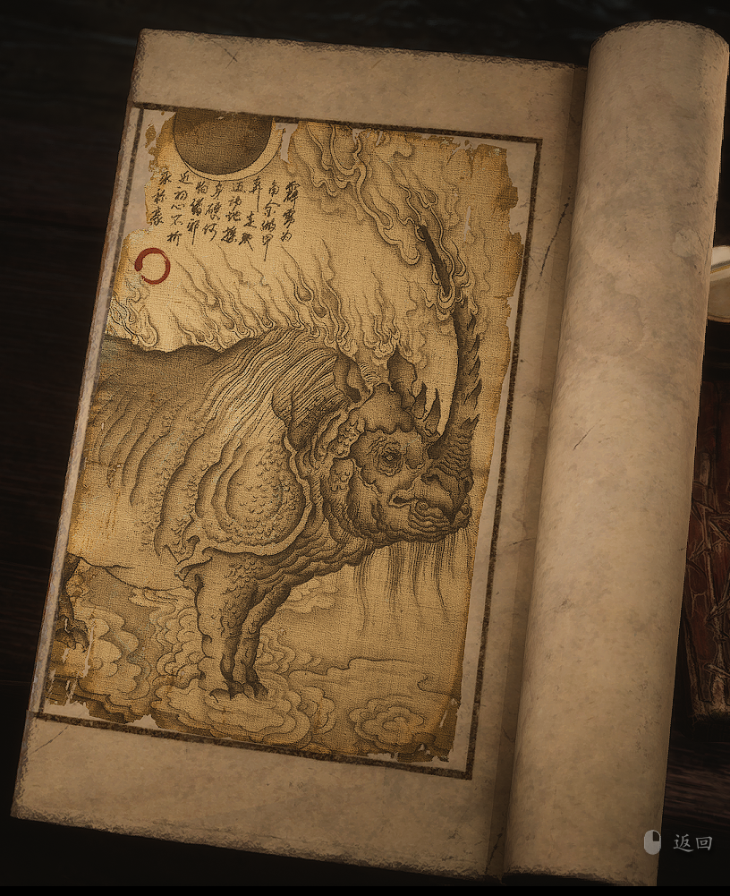

## 2.53 步云鹿

> 风高傲骨远，云低腐肉贱。
>
> 止步青天上，放荡尘浊间。

孙悟空在斜月三星洞学艺时，菩提祖师不仅授了秘诀，教了地煞数的变化，还传了“筋斗云”。自此，悟空躯体坚牢，身法灵动。但在众人面前逞能显耀之时，祖师算出了他没个坐性，定生不良。

神仙都说，做猴王时的孙悟空，是他最顽劣凶残的时候。但那时的他，除了与天庭争斗，鲜少打杀其他生灵。倒是后来拜了师父，成了行者，有了方向，才又多出许多霹雳手段。偷抢拐骗，杀人放火，毁山灭洞，通通不在话下。

说这步云鹿，是孙悟空的步云履所化，能看出他无拘无束的灵动性情，却也暗藏着他心中的那份凶狂。一旦落了下风，本相便显露无疑，再也装不得那份逍遥矣。

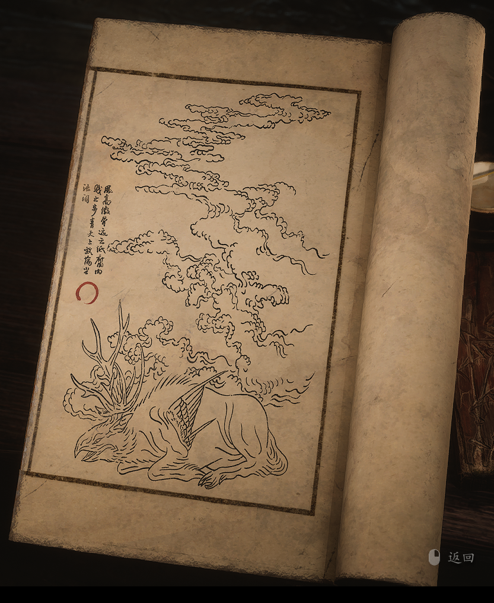

## 2.54 凤翅将军

> 火翎额上簪，山中扑飞乱。
>
> 善争者不争，善战者不战。

灵明石猴，天性聪慧，登界游方之中，学人礼，学人话，又在灵台方寸山通了法性。今次不表命里的天赋，单说他后来悟彻的经历。

他在鹰愁涧负气出走，老龙王与他讲了一番道理，便又回去认错，从不专断独行，听得进善言。

他与妖怪称兄道弟，与神仙们逗趣嬉闹，与菩萨调嘴玩笑，谁都喜欢他，谁都肯帮他。知情识理，懂得进退分寸。

他遇火呼风，唤雨请龙，打探变小妖，受困借法宝。遇到难解的局面，请高人，搬救兵，外力无所不用，鲜少强攻，从不硬扛。

这凤翅将军，头生多目，知己知彼，一路跳脱不停，强敌能避则避，倒有那猴子的几分乖觉。不愧是戴在猴头上的冠子，最懂他那些活络心思。

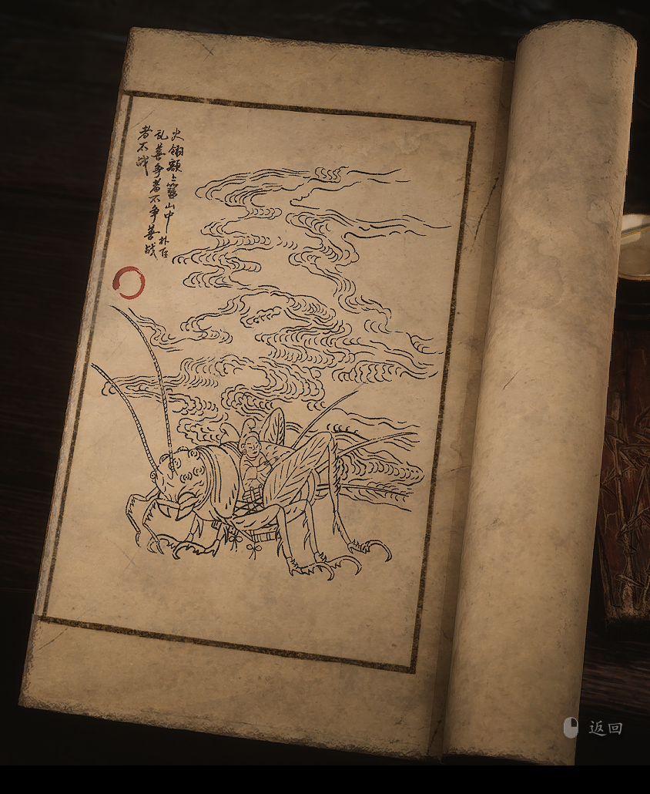

## 2.55 碧臂螂

> 红眼碧玉妆，舞刀逞凶狂。
>
> 道义若来迟，铁腕不可当。

唐僧多劝善，悟空多惩恶。

在奎木狼处，他听闻了百花羞所受的苦楚，又见她为了情分和孩子留恋不舍，索性让八戒将那两个妖儿从天上掼下去，摔成了两个肉坨子。

在杨老汉家，他听闻了老夫妻不肖儿子的行径，又见他们为了香火纵容他为非作歹，哪怕杨老汉事先求情，他也索性将那儿子的头割了下来。

凶匪恶徒，他天性不肯姑息；鬼魅妖邪，他乐得斩草除根。西行路上的累累血债，虽各有缘故，却多半都要算在猴子头上。

世人皆知另外三件披挂，却不知这螳螂是大圣的手甲化生。想来这手甲，必是传承了大圣不为人知的狠辣手段，就连捉弄八戒这件事，也是如出一辙哩。

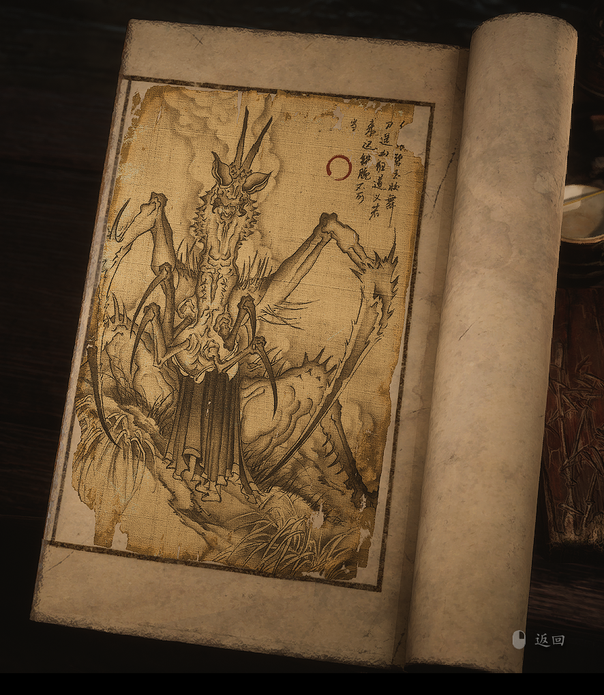

# 三、妖王

## 3.1 灵虚子

> 苍毛生锐气，血口透寒芒。
>
> 爪如索魂钩，尾似哭丧棒。
>
> 假名成道友，禅院充虚相。
>
> 可怜功果散，仍是旧皮囊。

禅院的苍狼精，原是狮驼国流民。城破后，群狼随他一路远走，终在黑风怪的庇护下，安家落户。

与求仙问道的老凌虚子不同，这苍狼精不屑长生虚言，只情修炼气力，铁爪一钩，脱皮露骨。 黑熊精扶了这苍狼做新的妖王，改其名为灵虚子，着他看守观音禅院。

与灵虚子同来的狮驼国狼妖，自然也得了势，吃的用的都超过了黑风山的旧部。本处群狼原就不喜灵虚子的修炼之道，如今还把他们挤到一边，更是心生怨怼。他们时常相聚，互相安慰，怀念老妖王的统领，一边密谋声讨新继位的妖王。

未料，灵虚子早有所备，他假借点卯之名，将本处小妖召集在禅院之中，命令接管的随从侍卫们围捕闹事的妖众。禅院乱作一团，他从房顶一气跃下，扑在群妖中，要将他们吞噬殆尽。

广智闻声赶来，这才抵敌住灵虚子，保下小妖们性命。黑风大王得知此事，原要发落众妖，幸得蛇精一派调停周旋，这才双方安宁下来。

自此，本处的旧狼妖们再也不愿意靠近观音禅院半步。

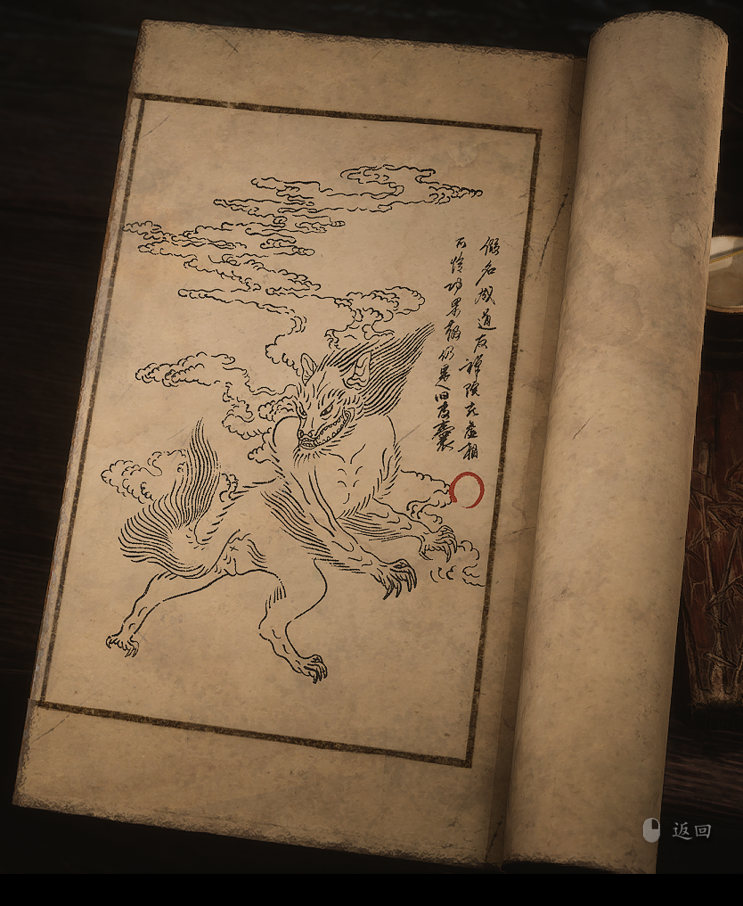

## 3.2 赤髯龙

> 木生炉烟，雾长雷电。
>
> 击背而歌，真意自现。

自泾河龙王公案了结，诸龙子深感前途未卜。西行之后，论功封赏，惟有龙子们赏罚未定，更是让他们惶惶不已。他们寻至袁守诚处，求他再算上一卦。

此卦乃潜龙勿用之象，更是成了他们的心头刺。其中，尤以四神龙最为忧心。他们监管四渎，深知上界的凌厉做派，主动请辞，想以退保命。谁料，进上天庭的表文俱被驳回。

光阴似箭，岁月如梭。这日，袁守诚寻至四神龙，告知他们卦象更新，乃潜龙在渊，有可动之机。四神龙听后，纷纷离了水府，各自谋划去了。

赤髯龙十分乖觉，他知黑熊精贪财，又有南海庇佑，就将宝贝悉数取出，与黑熊精换了块宝穴。此后，他在山间闭关沉睡，如是这般潜伏多年。

一朝，他醒转过来，想要飞腾九霄，伸展躯体，却发现自己难以爬云。他忆起古训，龙欲升天，先阶尺木，便用自己的掣电尾在山间削出一片尺木，助他飞腾，仍是于事无补。

赤髯心有不甘，向黑熊精求助。黑熊精不善飞举，但上门的买卖岂能不做？他将自己从南海带来的博山炉卖与了赤髯，声称博山炉能起云烟，又以古籍中所载：“龙无云而不行。”一话劝说赤髯。

赤髯信以为真，将博山炉嵌在背上，以灵蕴焚之，强行起烟。一炉不足，则再添一炉。博山炉每次发烟十分耗费灵蕴，所助却十分有限，赤髯虽可借其再次腾飞，却终究难比从前，只能困顿地栖居在尺木之间。

咦，世上竟有这般不如意之事，明明是拿手的技艺，却因久疏而忘。天下的学问却都是如此，不以致用，终将荒废，可叹可叹。

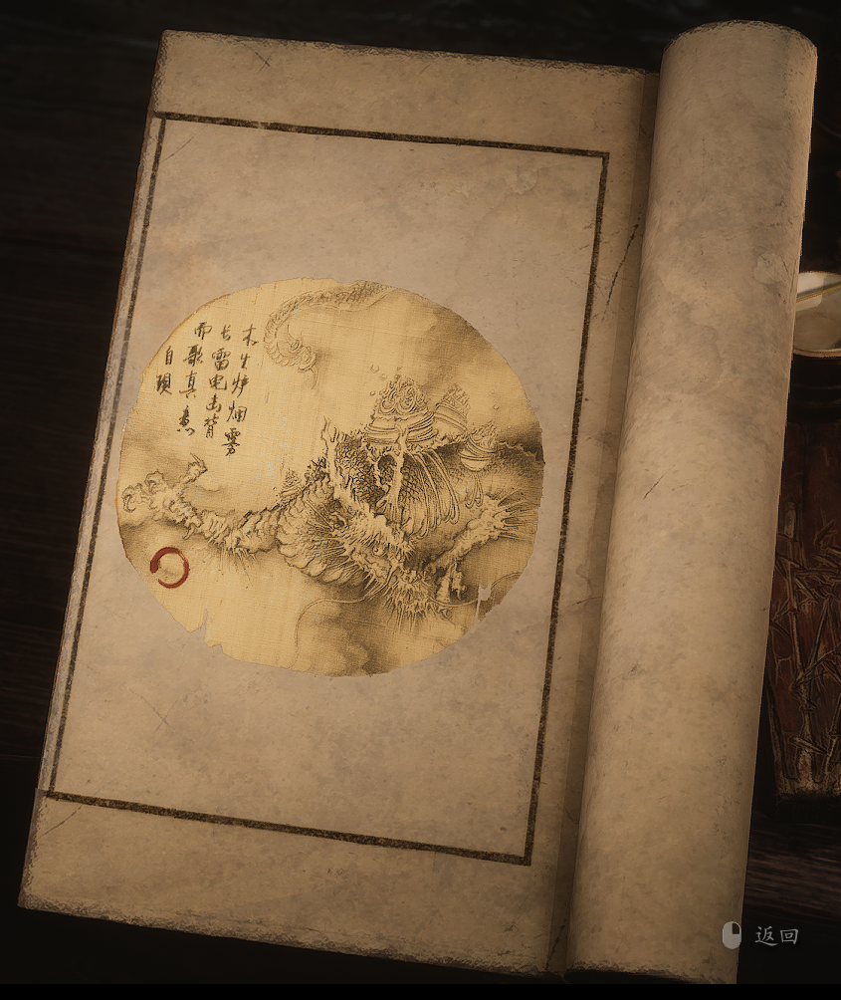

## 3.3 金池长老

> 白手传经饿后人，竞财争产误终生。
>
> 合该定杆金银秤，好算功德抵罪惩。

一行有两个月太平之路，三藏勒马遥观，只见山凹中楼台影影，殿阁沉沉，直至山门首观看，果然是一座寺院。

他师徒两个道了问讯，进了山门，见正殿上书四个大字，是“观音禅院”。三藏大喜，行者却道：“师父，这不是个好去处，还是趁早走了为妙。”这长老哪里肯听，望了金像就拜。行者在侧，只管撞钟不歇，惊动寺里大小僧人，上下房长老一齐拥出。

众僧与三藏见礼，行者就拿火眼金睛四下观望，笑道：“你们这里的和尚，怎么面黄气弱，元神不足？莫不是破了戒矣？”

三藏见此间和尚各个袈裟簇新，身体高大，只觉行者说了句风话，道：“莫乱谈。”转而向众僧告罪。众僧也只当行者胡说，唯有两个绝小的和尚，掩在人群里，不敢出头。

院主又请师徒二人入后房用茶，待众僧序了坐次，排了斋宴，那两个小和尚才搀着老僧进来。

三藏躬身施礼，二人寒暄数句，三藏问：“老院主高寿几何？”老僧道：“痴长二百七十岁。”行者听见，笑道：“你这老剥皮，禅院怎么有些妖气？”

老僧不做答，三藏忙道：“我这徒弟性子有些不好，老院主勿怪。”

有个小和尚，正用美器斟了三杯香茶来献，行者盯着他瞧，又道：“你这小和尚哪里来的？”小和尚放了茶，忙躲身老僧之后，咬着指头道：“这和尚丑头怪脑，有些吓人。”

三藏瞅了行者一眼，道：“谨言！莫要不识高低，冲撞人。”又借口对香茶美器夸爱不尽，揭过了此番。

老僧不戒意，反问三藏道：“老爷自上邦来，可有什么宝贝，借与弟子一观？”

三藏再三推辞，行者却笑道：“师父，那领袈裟，不是件宝贝？拿与他看看何如？”

众僧皆笑，继而抬出十二柜袈裟，抖开挂起，请三藏观看。行者却笑道：“好，好，好。收起，收起。把我们的也取出来看看。”

三藏把行者扯住，十分劝阻，行者道：“放心！放心！都在老孙身上！”不由分说，取出袈裟与众僧看了。

那老和尚见了这般宝贝，果然动心，走上前对三藏跪下，眼中垂泪：“我弟子真是没缘。眼目昏花，不能看得明白。”

行者复又笑道：“你要怎的看才好？”老僧道：“老爷若是宽恩放心，教弟子拿到后房，细细的看一夜，明早送还老爷西去，不知尊意何如？”

三藏听说，吃了一惊，埋怨行者。行者笑道：“怕他怎的？等他拿了去看。但有疏虞，尽是老孙管整。”

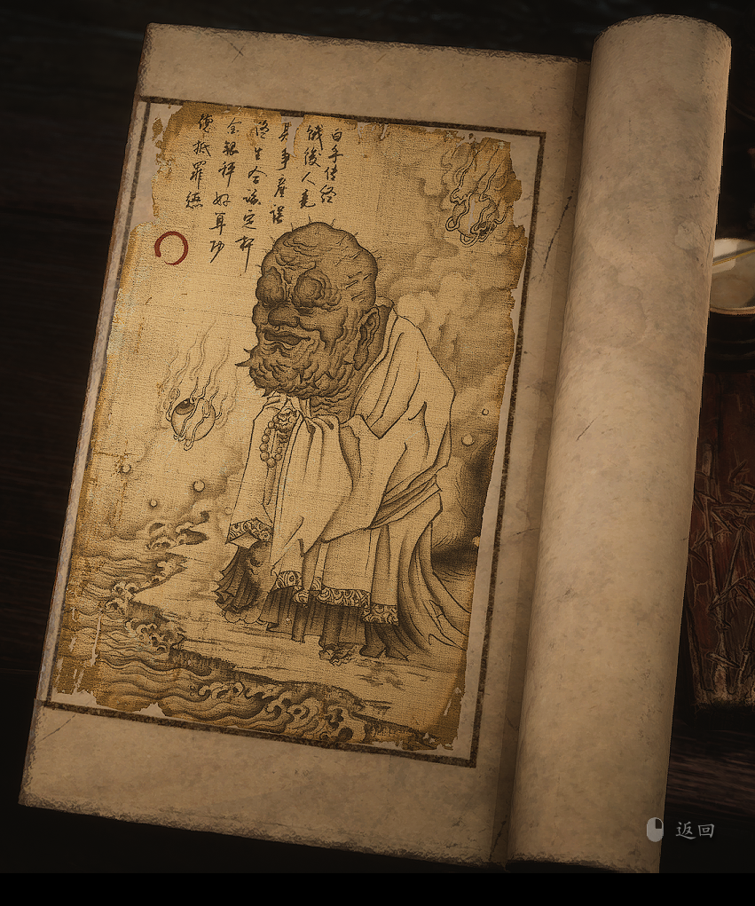

## 3.4 黑风大王

> 前程暗漆本难知，乘风得势各有时。
>
> 既成南海修真士，却教愚迷作顽痴。

自南海归来，黑风大王心怀壮志，誓要在山中重振雄风。他深知自己一去多年，要在群妖中树起威望，单凭武力是不能服众的，因此他做了许多举措，想挣得敬畏与忠诚。

在南海时，他学过起死回生真言，便以自愿赴死的狼妖为祭，救活了老友凌虚子。不曾想那老狼却不识好歹，还魂后竟兀自离去了。

黑风大王怕群狼无首，乱了阵脚，只好另选狼妖继任妖王。他见狮驼国来的苍狼精，年富力强，是个尚佳之选，便亲自赐了名，扶他上位。不曾想群狼却在禅院引发动乱，险些酿下自相残杀的大祸。

苦闷之下，他又施法想要还魂昔日一同论禅的老和尚。不曾想那老和尚的魂魄未在拼凑的尸身上复生，反与他旧日埋藏的金银铜钱化生了个发昏的精怪，四处游荡，搅扰山场，没个消停。

新封的白衣秀士也不简单 ，他平素只喜独自读书吟诗，虽看着听话老实，却总有些神秘莫测，让人猜不透心思。

咦，自作高明，反而一事无成，真可谓下士有志，不如碌碌庸人哩。

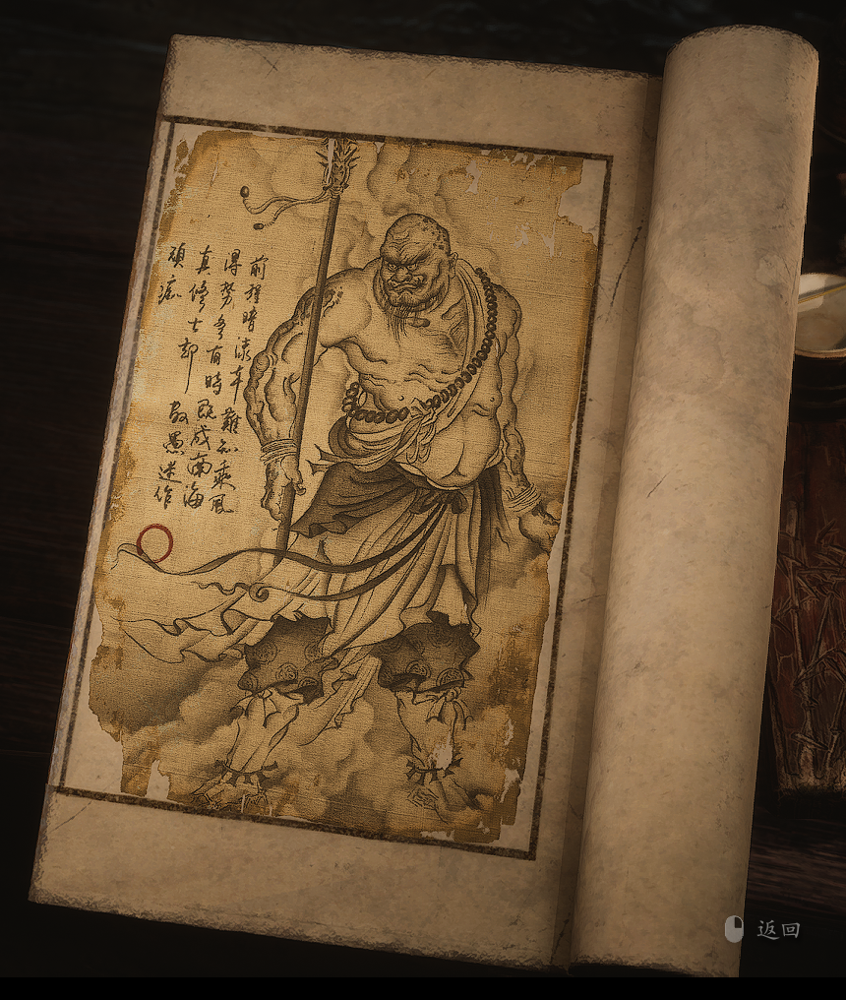

## 3.5 黑熊精

> 紫竹难定俗尘心，潮音未改风与云。
>
> 知机未必真机灵，倚天才知无天命。

紫竹林中，素日清闲。黑熊精天天就着马蓝头醋拌笋尖，喝些自酿的竹叶酒，日子快淡出鸟来了。

这日，龙女携善财突然造访，慌得他急忙收拾碗盏，遮遮掩掩。

龙女将眼一翻，问道：“前几日菩萨与你说的差事，你可想好了？”

黑熊精不答，只从箱内找出个匣子，递到龙女跟前。善财抢过来，揭开一看，是座蜜煎糖浇，晶莹剔透的狮仙糖。

“昨日有场法事，斋宴顶上，有座最洁净最显眼的糖点，我特意留着，孝敬你的。”

“你知我吃不吃糖？就这东西，还是留给小孩子家罢。”

善财一听，没了兴致，立时将匣子捽回黑熊精怀内，龙女这才轻侮地一笑。

知道自己闹了个无趣，黑熊精磨磨蹭蹭道：“我有心效力，但手段平平。此等大事，只怕办不好……”

龙女答道：“我们岂能不知？放心，自有比你凶，比你狠的冲在前头。”

“无功不受禄，若是烫手的山芋，不好下口哩。”

“自有菩萨打点，哪有什么烫手之说。”

“你莫诳我，菩萨叫我在此静修，怎会又替我打点。”

龙女悾着脸，道：“你怎这般没胆识，此番可是个大机缘，抢着去的人排都排不过来。只因菩萨要点个亲信些的，这才选了你，你竟悟不出来？”

黑熊精半晌无话，龙女被磨尽了耐性：“这点胸怀也无。罢！罢！罢！我替你回了菩萨去。”

“姐姐，姐姐，我不是那个意思。我去，我去！”

只待瞧见了黑熊精满眼热盼，龙女这才将眼又一翻，撇下善财，飘摇而去。

见她走远，善财急急追问：“到底是何差事？我想走，你不若禀告菩萨，把我也带上罢。”

“是有些要紧差事，可你刚听了，菩萨不让你去。你休再缠我，别连带我也失了机缘。”

数日后。

黑熊精收拾停当，绰着一杆黑缨枪正要远行。善财在竹林外守候多日，赶紧跟上他，又闹着要与他同行。

黑熊精一反常态，劝道：“善财，菩萨嘱咐了，让你老实呆着。此次你父亲也被强征出战，可见凶险，不是胡闹的。”他摸了摸额上的禁箍，叹道：“为了去个箍儿，丢了性命，便是不值了。”

话毕，他将身一摇，化作一道黑风，不顾善财的呼喊，迅速遁去了。

其后，善财在紫竹林外等了他很久，再也未见他回来。事后回想，那原是他在南海，最后一次见到黑熊精。

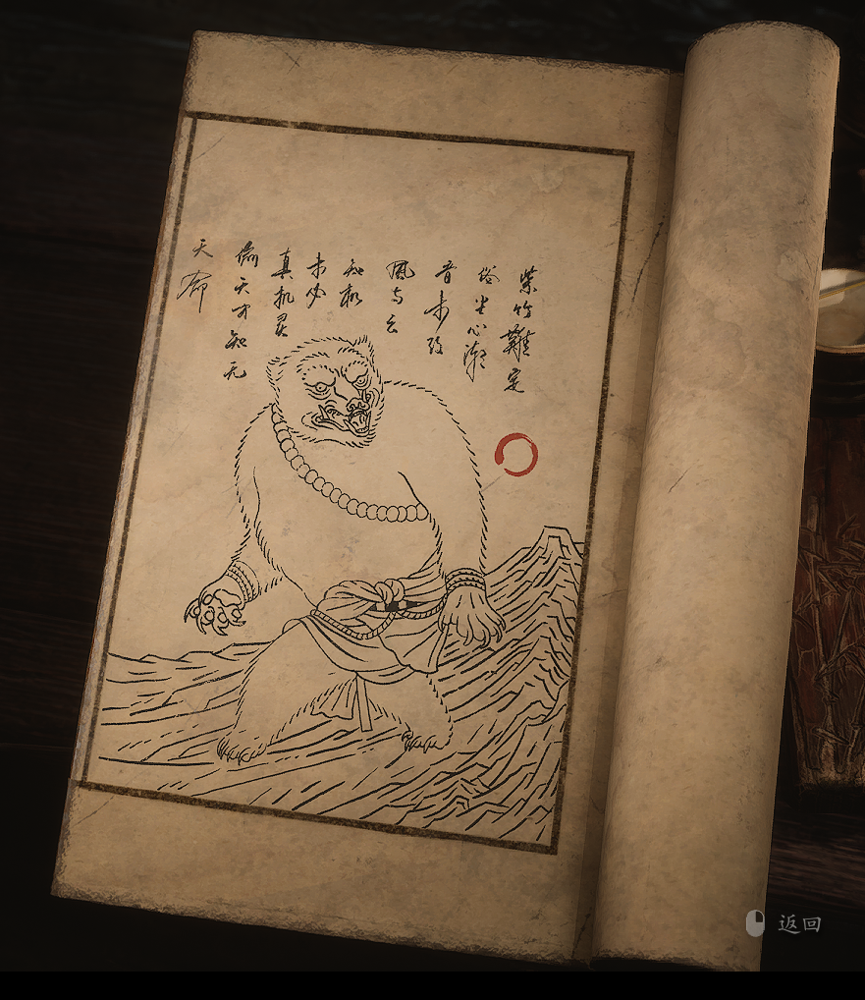

## 3.6 虎先锋

> 威凛凛，气堂堂，花身电目逞凶狂。
>
> 腥风血雨起杀意，铜头铁尾镇四方。

数百年前，前任虎先锋因捉唐僧，丢了性命，他膝下所遗二子，只得靠自己过活。

虎兄虎弟领着残存的小妖，在毁坏殆尽的山中过得很辛苦，所幸，父亲教过他们些真本事，也让他们熬了过来。

随着风沙停息，石母与石精们将荒山重建出昔日样貌，虎兄就仿照父亲所做，管束起山中群怪，让他们各安其职，不得随意祸害生灵。

后来，有凡人在这山中建起了村庄，虎兄依照“啖尽迷路奸邪，护送过往好人”的风俗，为自己博了个“虎神”的名号。

村人为“虎神”建了座卧虎寺，常常供奉，这让虎弟心下越发不服，总觉兄长占尽了威风，只因比自己早生几年。

又过了百年，黄风大圣忽然带着一群鼠妖重回了黄风岭。虎弟不悦，说正因这黄毛鼠精坐视不理，才致父亲身亡。他怂恿虎兄赶走鼠妖，虎兄觉得有理，就应承了下来。

谁知这一战黄风大圣祭出个状似菩萨头颅的法器，呼风如刀，一个照面便重伤了虎弟。为保弟弟一命，虎兄只得扔掉兵器，跪下称臣。黄风大圣倒不计前嫌，得知虎兄弟身世后，还将虎兄命为麾下先锋。

虎弟救还醒转，得知兄长做了先锋，更不肯依。二虎大吵一番，虎弟负气出走，再也不肯与兄长往来。

对虎先锋而言，那黄毛貂鼠害得他两次家破人散，着实可恨。但他除了每天多吃些老鼠泄愤，他又能做些什么哩？

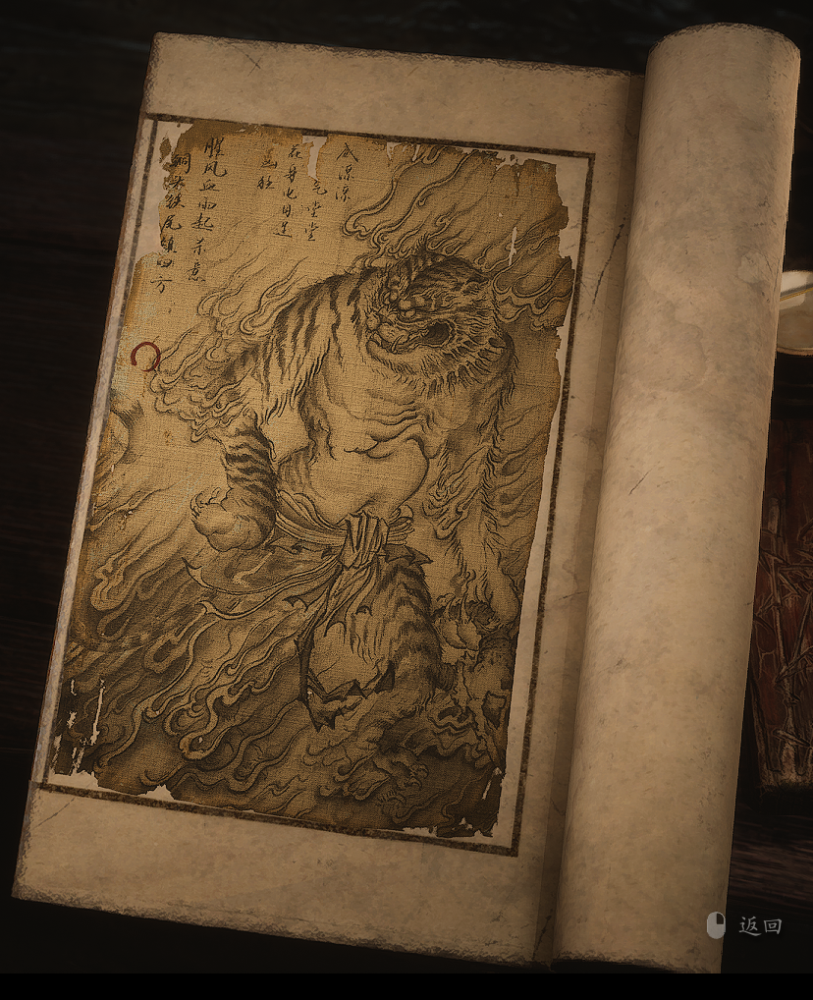

## 3.7 石先锋

> 山以石为骨，石作土之精。
>
> 背岩屹嶝嶝，躯壳耸青云。

自黄风大圣将那佛头石怪的精魄给了两位山神，他们分而食之，竟有了人心人形。二石和合，竟诞下了个石头孩儿。是以，众妖就将他们三者称作石父、石母与石子。其后，石父因故离了山场，石子寻父而去，便就只留了石母一个，孤零零在此。

取经人径过黄风岭时，黄风大圣因捉了唐僧，被孙悟空请灵吉捉回了灵山。待他重新归来，岭上竟生出了许多石精。其中有只石精，极为健壮强横，打听才知，它乃石母尽全力化生，用以守护这片土地。

一日，黄风大圣亲来寻石母，不想被众石拦在了外头。黄风大圣心下不悦，便叫唤来新任不久的虎先锋，让他铲除这些不认主的石头精怪。

虎先锋一口答应，可心中并不愿与他们为敌。当年他们一起合力重塑山场，也算老交情，他知那大石精极受众石精拥护，视其如兄长，便劝道：“兄弟，能有今日，你我吃了不少苦头，能帮我自会帮你。差事我已打点好了，你等只需退入谷内，专司镇守石敢当，也不用做甚恶事。我今日来尚且有话好说，若是明日，就得兵戎相见了。你我虽有些本事，确实非那鼠妖的对手，不如同做个先锋，一切如故，有何不好？“

翌日，黄风大圣封了大石精为石先锋，命其率领群石退守河谷。自那以后，石精们老实本分地守着那封印的邪物，再也不过问山中之事了。

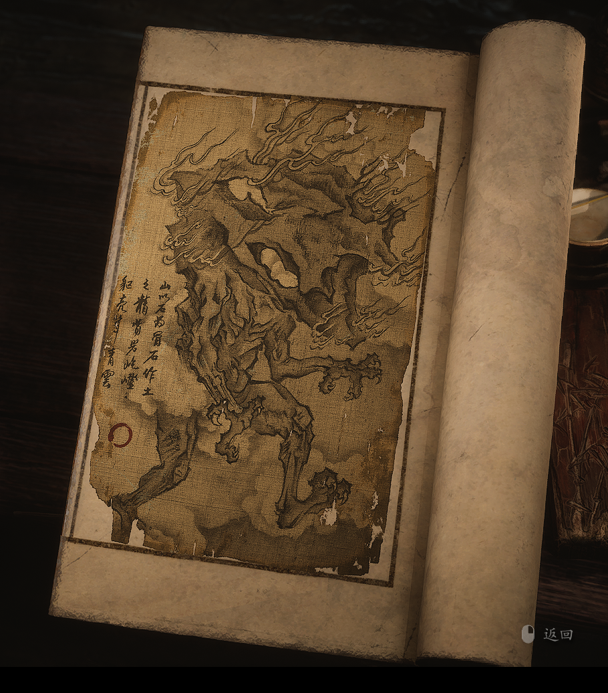

## 3.8 石敢当

> 苦海无边浪，只渡有缘人。
>
> 雨后三千土，灯前一点尘。

昔年，黄风岭中有几块崖石，吸取天地灵气，日月精华，遂感通灵，修成了几只石精。其中有两只，因道行较深，被授以了山神之职。

一日，岭中不知缘何生出了几颗佛头，有眼耳口鼻，筋肉俱全，长在土里，十分古怪。即见活物，这些肉佛头便放声嚎叫，若对方靠来，它就一口将其吞下。

有个石精见这肉佛头诡异，要除了它，保护山中生灵，就一下撞在那佛头上，将其碾作了肉泥。这肉泥黏在它身上，不久竟依凭它的石身，又生出个石佛头来。

自此，那石精全然变了心性，成日在山中搜寻其他肉佛头，先将其砸烂，再把残骸包裹到自己背上。随着它的佛头日益增加，它也不再感什么天地之气，全以啃食山中生灵修行。石精们都斗不过他，经常被撞得粉碎，神魂俱灭。

黄毛貂鼠带着众妖离了斯哈哩国，径过黄风岭时，正巧遇见两个山神率着几只石精，意欲驱他离去。黄毛貂鼠似是极懂那佛头之物，心中一股意气涌上，带着众妖加入了战斗。

一战大捷，貂鼠不仅灭了那佛头石怪，还将山中肉佛头悉数铲灭了去。佛头石怪遗留的精魄，他将其分给了那两位勇猛的山神，又将其佛头上的目珠一一挖下，镇在了山谷中。

山中众生十分感谢貂鼠，将其拜作大王，称他为黄风大圣，他便也在此定居了下来。

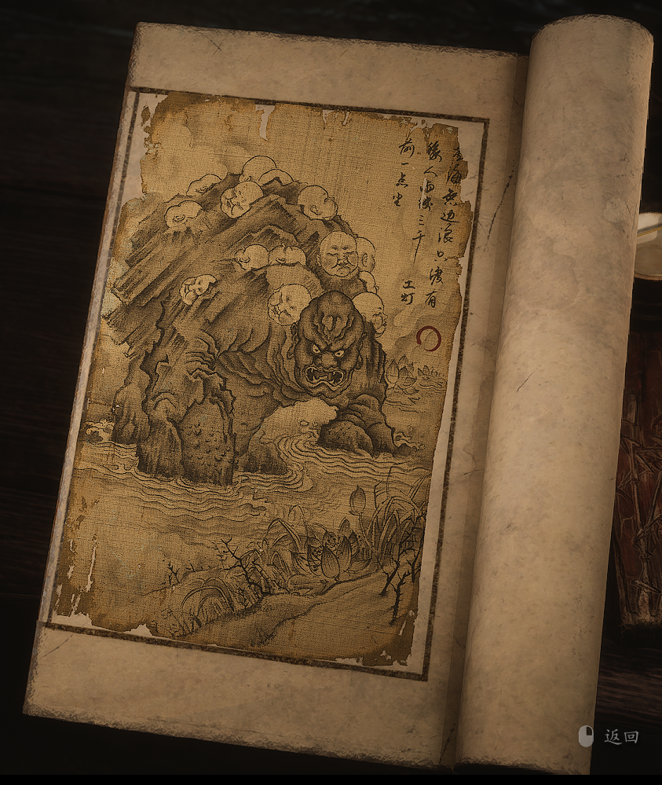

## 3.9 小骊龙

> 血口铁髭须，瓜锤双双提。
>
> 电光激造化，风雷振玄机。

济水旁的渔民们常说，九渊之下，有骊龙，项下有慧珠，拿到的人可开明大智慧，因此价比千金。许多人不顾危险，想要探骊得珠。少数有命回来的人都哭道，空手而归就算了，还遇到水下凶恶的龙王，舞一对双锤，能唤出雷霆万钧，被他劈得尸骨无存。

此后千百年，下河探珠的人屡禁不止。大家总说济水泛滥，必定是探珠人得罪了龙王，所以修造了宏伟的庙宇，祭祀和供奉他。这日，来了个年轻人，他穿一领皂色衣袍，戴一串月白项链，自称盗圣，手段滔天。大家纷纷劝他不要冒犯龙王，可他只一下扎入水中，朝龙宫去了。

他见那处既无虾兵，也无蟹将，门庭冷清，景色凄凉，心下奇怪，径寻海藏而去，就见个黑壮的汉子，坐在高高堆起的箱笼之间，愁眉不展。听得响动，那龙王草草从箱子里翻出一挂珍珠，随手扔在地上，敷衍道：“我的慧珠实是不能给你们，这个送你，拿了快走吧。”

年轻人奇道：“岸上的人都说你凶恶哩，若是稍有得罪，不是吃人劈雷，就是水淹千里。”那龙王道：“凡人那点血肉我才看不上，你当我是寻常妖魔？若无旨意，岂敢行云布雨。那岸上的人竟说些瞎话，想我父亲，不过一点过失，就挨了一刀。我们龙族啊，再老实不过了，哎……”

年轻人听后便道：“泾河龙王之事我也曾听闻，的确冤屈，你如今这般境地，难道是受了牵连？”龙王知他不是凡人，便道：“正是，我可不想去那剐龙台上，我问过那算命的，他说只要我寻个隐蔽处躲好，杀掉西去的猴子，便能将功折罪哩。”

年轻人若有所思：“算命的，我也是听一个算命的，才寻来此处。既是如此，也是机缘，不如来我家，我正好住那西去的路上哩。”那龙王听后大喜，年轻人又道：“只是不能白住。你这海藏里的宝贝，都得归我。” 自那年轻人来过后，济水边下河探珠的人渐渐少了。再后来，大家纷纷弃了探珠的行头，也没人再谈论过那九渊之下的龙王和慧珠究竟如何了。

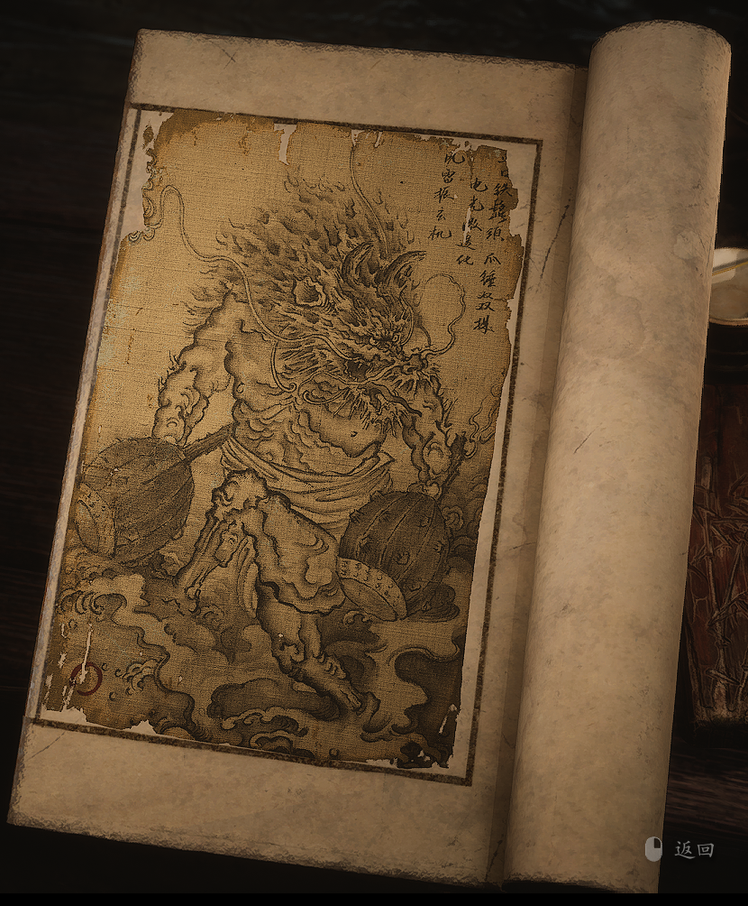

## 3.10 蝜蝂

> 甲坚牢，角峥嵘，钻食人间祸无穷。
>
> 佛头竟是不祥物，一面菩萨一面虫。

流沙国遍地黄金，传说是日落之处。

日乃太阳真火，落于西海之间，如火淬水，接声滚沸。每到申酉时，国王差人上城，擂鼓吹角，混杂海沸之声，谨防振杀城中小儿。

这所擂之鼓，名落日鼓，原是佛祖所赐。百姓凭此鼓得以安居，是举国上下崇信佛法，为佛祖塑了许多金身法相，又称黄金佛国。

可随着信众日多，寺庙遍布， 大家日渐信佛不信王。国王对此十分不满。丞相洞悉了他的心思，上疏止浮屠，以言无佛。

国王遂下令，拆毁寺庙，驱赶修行之人，改国名为斯哈哩国。

此事兴起不久，一日黄昏，城楼击鼓，国界之外尘土纷飞。有一大虫，掘地而出，将边陲村庄破坏殆尽，死伤无数。

自此之后，每日日暮击鼓，大虫必出。

臣民进言，说此乃止佛的报应，国王只得停下此事，派大军去剿灭妖邪。

可大军并非妖邪的对手，牺牲无数也只得了个吓退之法，难以根治。

幸而，有个黄发黄毛的修士途经此地。他为人仗义，最见不得不平之事，便协助大军斩杀了虫妖。国王将其敬为国师，他便在斯哈哩国修行了数年。

其后，国师游方而去，听闻他被菩萨收作弟子，如今在黄风岭还有了自己道场，国王总说这是天道喜善哩！

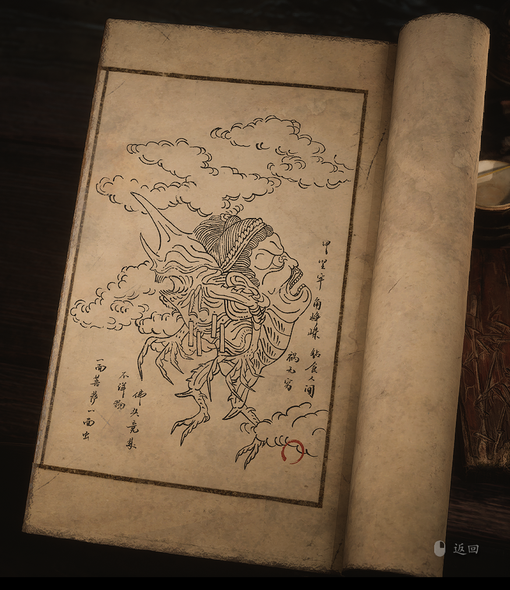

## 3.11 黄风大圣

> 千里黄风万里沙，八百方圆无人家。
>
> 半妖半仙谁评说，是盗是圣何足挂。

炉火荧荧，满桌酒菜。

沙二郎举着半拉不知何物的腿，正啃得有滋有味。

沙国王安分地坐在儿子身侧，素日设宴，他最爱告状的，今日也一直沉默着。

虎先锋也十分文雅，只看着对面的傻子吃得喷香，自己面前的酒食却一点未动。

黄风大圣坐在太师椅内，一只手摸着桌上闭目的佛头，不言不语，似是有心事。

“爹，吃完了。”沙二郎喊了一声，在场众人都朝他望去。

沙国王怒斥了儿子一声，赶紧连滚带爬地跪下请罪。

“都是小事。”黄风大圣把手搭在灵吉的头顶，终于开口了。

他站起身来，道：“我既拿了师父最宝贝的东西，定能炼化那玩意。从今日起，我需闭关修行。天上那些老东西说是安排好了，还是多留一手为妙。”

“大王若想闭关，我和我的子民愿搬来洞外，守护大王身侧。”沙国王谄媚道。

“身侧？”黄风大圣看着师父的头，断然拒绝，“你们都搬去岭上住，我要开黄风大阵，谁都不要来扰我修炼。”

“若是不能见大王，又如何向大王禀事？”

黄风大圣指着虎先锋道：“叫你那石头兄弟，修出几条沙道来，每条沙道由大门锁住，你们两个先锋，各持一个开门的秘符。”

还不待虎先锋下跪领命，沙国王急切道：“大王，我们与那大猫向来不睦，若……”

黄风大圣根本不想听，他抱起佛头打断道：“都出去，不出天大的事，别来烦我。”

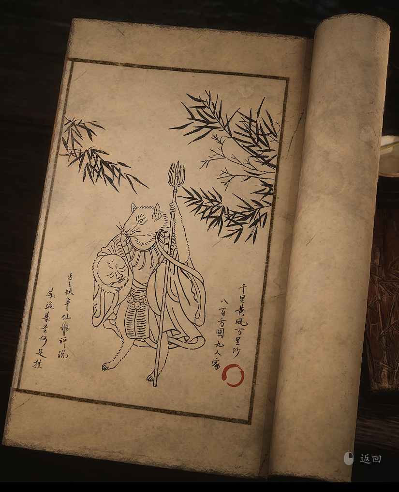

## 3.12 亢金龙

> 西天远去半程途，东土归来一梦初。
>
> 暗解宝袋撤强能，私开尘锁冲歧路。

亢金龙乃二十八宿之一，为东方青龙第二星宿。其额上有一尖角，锐不可当，曾为大圣顶开金铙，将其救出。自此，星宿们常以“秉持坚锐”为傲，连累众仙以为，他们神识里，侵入了什么邪魔。

某日斗牛宫点卯，昴日鸡未在天上，一番查问，众人竟俱不知晓他的去向。恰于此时，黄眉回归小西天，要办盛大的香会，并广邀诸位妖魔神佛同来参加。亢金龙向天庭请旨赴会，要去秘密查访昴日鸡的下落。但这一去，亢金龙也如昴日鸡般，断了音讯。

星君们议论纷纷，一番比较，发现昴日鸡和亢金龙都曾帮过大圣的大忙，便就猜测与大圣有关。星宿们细细回想他们与大圣的交情，害怕不已，奎木狼嗤之以鼻，道：“他虽坏了我的好事，我倒敬他是个汉子。倒是你们，平日里最喜说和那猴子多要好，怎么今日都没声了？”

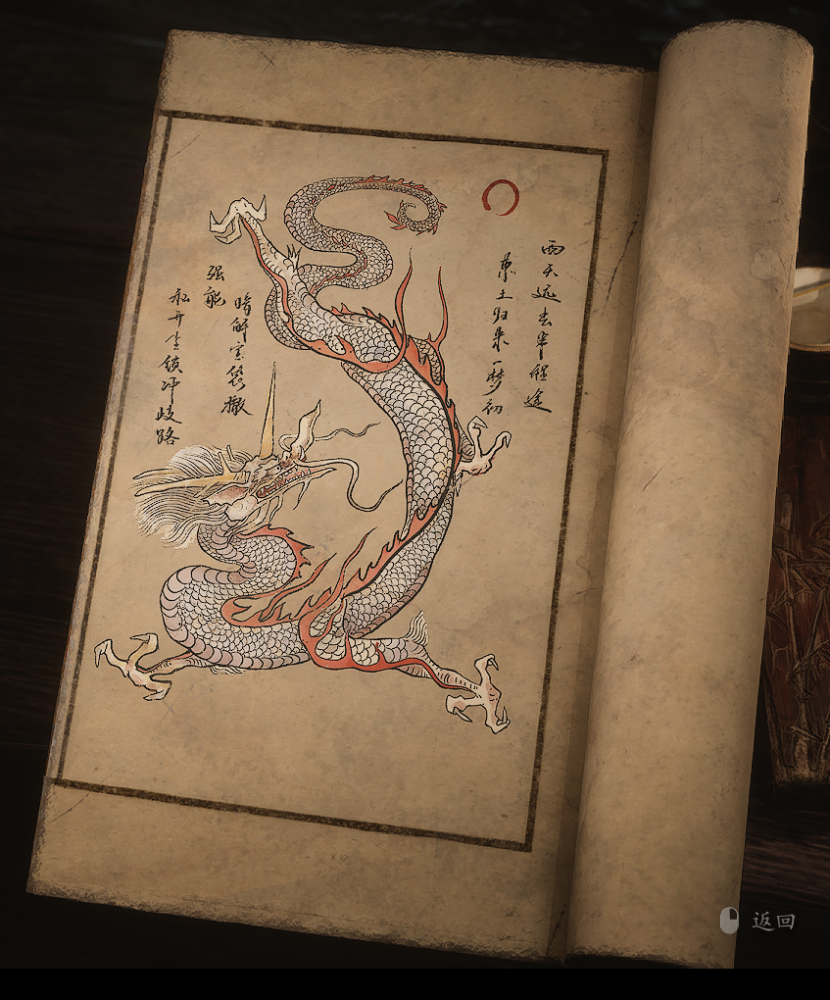

## 3.13 亢金星君

> 龙女名亢金，白角映碧波。
>
> 不羡鸳鸯侣，风姿绝世多。
>
> 故人难再见，袋中黑白颠。
>
> 风刀霜剑下，犹自舞翩跹。

等了许久，亢金龙也未盼来星宿们下界救她。

黄眉笑道：“你这女娃，心气太高，才输到这般地步。”

亢金龙道：“我又未向你求饶，论什么输与不输？”

黄眉也不恼，只道：“为了那只放哨的鸡，你绝不会这般冒险。你来，是为了那猴子。”

亢金龙闭口不言。

“我的确是得了那猴子的……一小块东西，就放在这袋子里。”说罢，他从腰间，解下个包儿。

亢金龙认得，那曾是捉过他们的后天袋，不屑道：“什么稀罕物件，我又不是没进过你那搭包儿。”

“你若真想知道他的事，就得自己进去瞧瞧。”

吸入袋子的瞬间，她依稀看到袋中有只十尾金鱼，朝自己游来。

待黄眉再将其放出时，那星君已变得痴痴傻傻，愣愣怔怔。

黄眉大笑：“如何，他可还是你熟悉的那般英雄？”

亢金龙问道：“他与满天神佛，皆是如此？”

黄眉不置可否。

又过了许久，亢金龙忽然跪在了地上，道：“还请师父，收我为徒……”

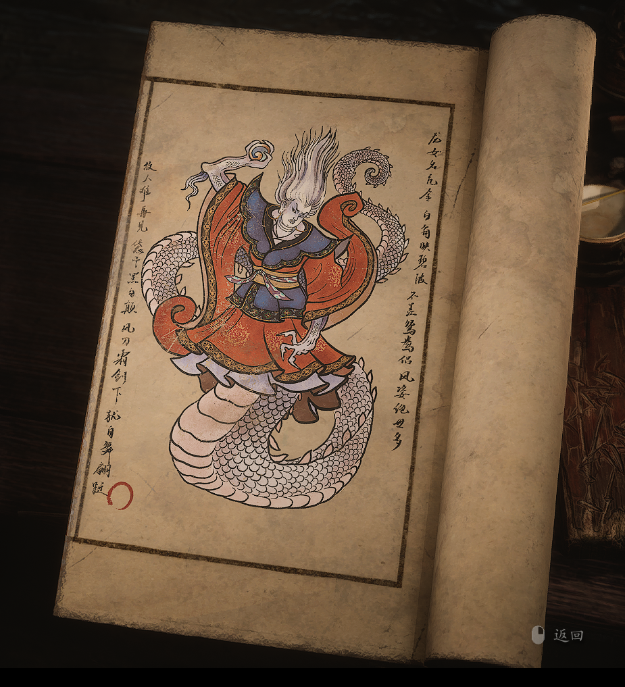

## 3.14 魔将·妙音

> 妙音之声，开化众生。

自恃才高，败走经堂

极乐难思量，照出真我本相

法海波涛，漫我倾我负我

失正念，迷邪障

问天问地问佛

一步踏错，步步皆错

胜负无常势，高低无常理

积了度人心，近魔

愿负此身归净土

金身正果，反将众生愚惑……

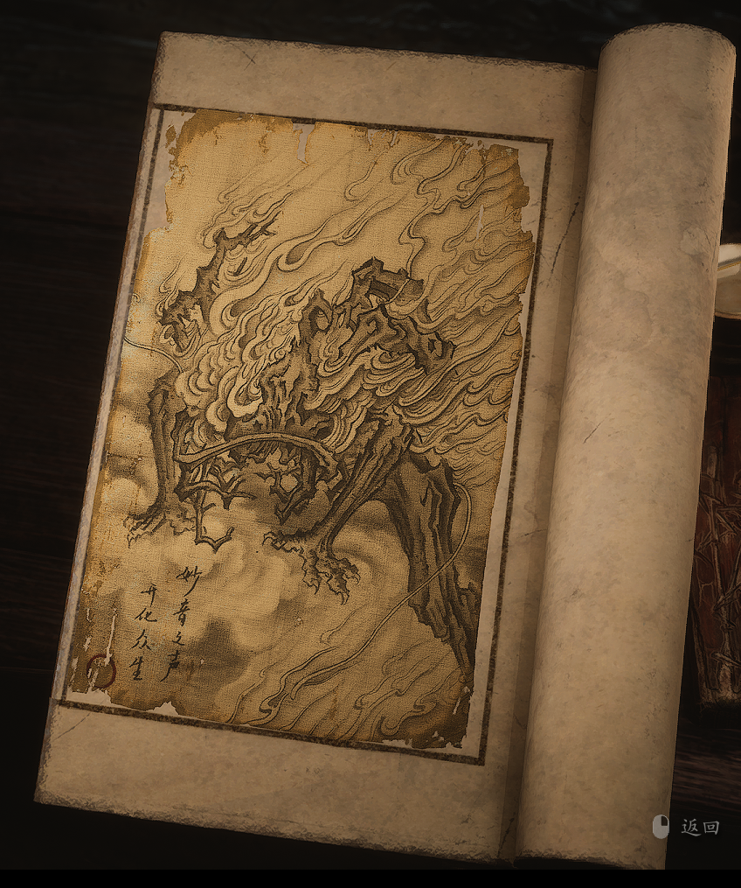

## 3.15 青背龙

> 青锋宝剑唤龙光，独钓寒雪苦海上。
>
> 潜龙犹待飞天去，不堕凡尘英名扬。

青背龙径至小西天时，曾与黄眉有一面之缘。

他素不喜黄眉，深觉极乐法门是歪理。但他也知道，想留在小西天避灾，就绝不可得罪黄眉，是以他说要在苦海上钓鱼，若能钓出活物，便是天意，他就拜黄眉为师。

黄眉知他不过使个缓兵之计，但觉他这说法有些趣味，便和他打了个赌赛。若青背龙自垂下杆去，能五百年不动，就将照鉴湖让与他修炼。若他动了，就是有意吓跑鱼儿，要捉他入袋中修行。

青背龙一口答应，将自己那柄龙光剑，化作一根无钩的钓杆，坐在龟背上，再没挪动过。

小妖们日日来龟背上瞧他，想着又冻又饿，他很快就会输。可每次来，都只瞧见他身上的积雪越来越厚，直至盖满了他的身形。

苦海无边，佛渡有缘。人人都争着上岸，却也有那痴的，愿意在苦中等待。等什么？想必是个不走捷径的心安理得。

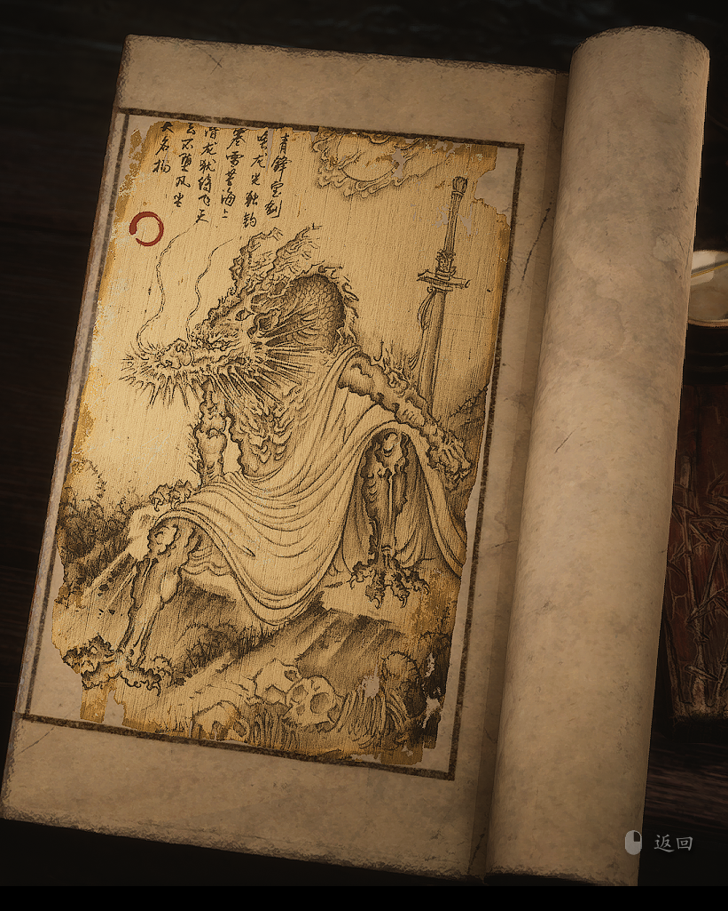

## 3.16 黄眉

> 放情纵欲任优游，也无恐怖也无愁。
>
> 极乐场中笑八戒，自性具足花满楼。

西天，灵山，峰顶。

两人对坐，祥云郁结，气氛肃杀。

青年僧人抬首望向天空，转而对黄眉僧人合手，行了一礼：“师尊皆已列位，师兄可准备好了？”

黄眉僧人微笑，还了一礼：“早已好了。”

盂兰盆会，五百年一度，出师弟子的辩经环节，正式开始。

青年僧人抬手，示意师兄先发问。

黄眉僧人问：“请问师弟，何为生命的意义？”

青年僧人答：“求真。”

黄眉僧人反问：“真是何物？”

青年僧人答：“万物运转之道，宇宙本源之法。”

黄眉僧人不置可否，却从手里拿出一朵花。花瓣起初萎顿，逐渐盛开，娇艳欲滴。

他低头看着花，道：“你看它，只因随了自性，便生出如此神妙变化。”

说罢，黄眉僧人低头轻轻一嗅，道：“每朵花盛开，都会散出独一无二的香。那是它为了自身繁衍，迸发出的生命精华。”

他随手放开，让花飞散开了：“尽情体会这一刻 ，是为极乐。”

青年僧人摇了摇头：“须臾满足，恒久痛苦。永无安宁，循环往复。”

黄眉僧人道：“我这次下山游历，看到有为人父母者，为了生存口欲，易子而食。有富家纨绔者，为了淫心色欲，祸乱人伦。”

青年僧人蹙起眉来，看着对面的师兄。

黄眉僧人道：“有博学多才者，为了青史名欲，诛锄异己；有赫赫战功者，为滔天利欲，屠城灭族。”

青年僧人不为所动，默然道：“师兄，你不见那易子的父母，饱餐一顿，悔恨终身。那淫邪的公子，放浪无拘，顷刻暴毙。那伐异的学士，一朝失势，千夫所指。那好杀的将军，寝不安席，咎由自取。”

黄眉僧人反驳道：“放屁！”

青年僧人微微一诧：“放屁？”

黄眉僧人道：“这挣扎，这欣喜，这决绝，这快意，这苦乐悲欢的无尽循环，永不知足，永不停息！而这，正是三千世界繁荣盎然的源起。自然，也是一切生命的真义。”

青年僧人道：“师兄，你不求解脱彻悟，反而赞美这报应轮回之苦？”

黄眉僧人道：“师弟，无乐无忧，何悟之有？”

青年僧人道：“哪里有悟？分明是苦。”

黄眉僧人道：“苦即是爱，爱即是苦。无爱无苦，亦无救赎。”

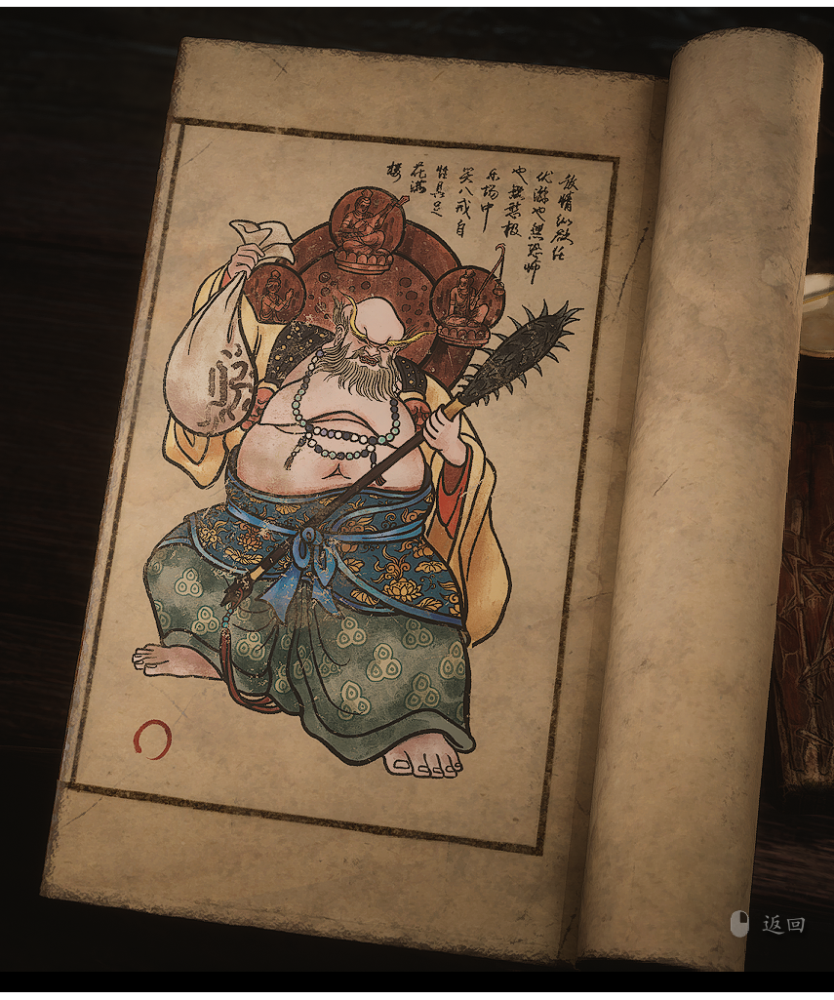

## 3.17 紫蛛儿

> 曾驾云车上高台，今寄幽穴隐山崖。
>
> 小桥风月吹瘦骨，春来嫁衣又新裁。

话表三藏别了朱紫国，整顿鞍马西进。行至一座庵林，三藏意欲去化些斋吃，走至庄前，却见几个女子在亭下踢气球。三藏随她们入屋，便被掼倒在地，将绳子捆了，悬梁吊了个“仙人指路”。

行者跳树攀枝，见有一片光亮，知师父遇了妖精，唤出土地详问，原是盘丝洞中七个妖精占了天上仙姑的浴池。她们每日洗三次澡，行者即变作个饿老鹰，把他那衣架上搭的七套衣服，尽情叼去。

八戒见有这许多衣服，一番打听，得知有七个妖精在洗澡，便欢天喜地，径直闹到那里。那呆子不容说，脱了皂锦直裰，扑的跳下水去，变做一个鲇鱼精。那怪就都摸鱼，赶上拿他不住。他却认出一个，原是旧相识，便滑扢虀的，只在那腿裆里乱钻。在水上盘了一会，又盘在水底，只盘得喘嘘嘘的，精神倦怠。

妖精们跑回洞里，取了几件旧衣裳，唤出七个义子守家，自己往黄花观而去。八戒找回原路，与师兄弟一同退了虫妖，解下师父，却又奔上大路，到了黄花观。那黄花观主原与那七个妖精同堂学艺，得知唐僧乃十世修行的原体，师妹们受辱于他师徒，做了四杯毒药茶，意欲报仇正好吃了唐僧。

岂料行者识出端倪，掀翻茶碗，打退了蜘蛛精。魔君上来缠斗，行者便令八戒去灭那七个蜘蛛精。八戒得了师兄的令，拽着钉耙挨个尽情打作劖肉，独剩那最后一个，想起在水中有过恩欢，竟有些动不下手来。只得一钯筑在地上，教她赶紧逃命去也。

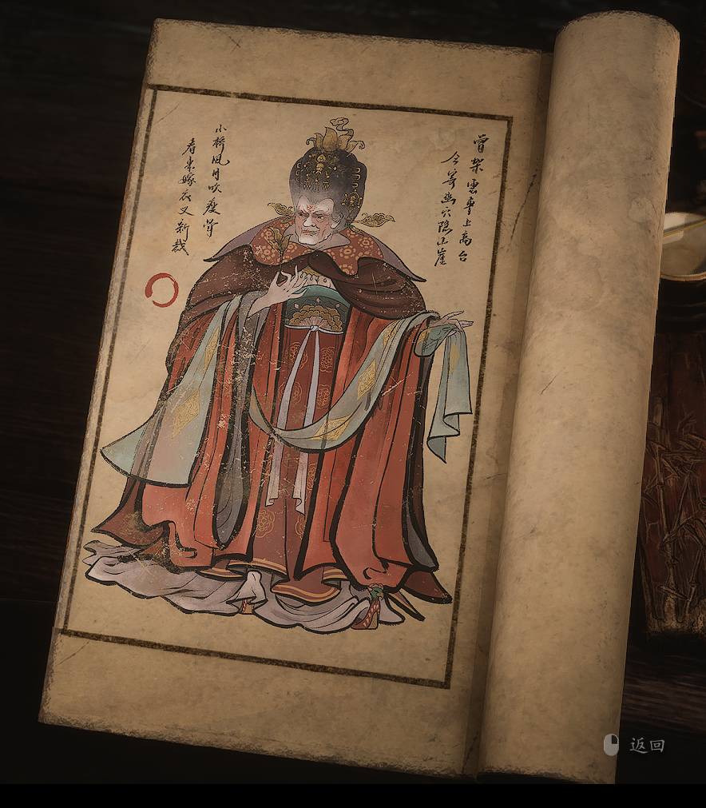

## 3.18 小黄龙

> 袍缕隐卧龙，困游命流中。
>
> 飞扬起金岚，命劫有始终。

他原盘算得十分简单，这老头既能窥测天意，必会凭此趋吉避凶，只要与他同行，定能避开危难。

待兄弟们各自远遁后，他就化作袍服上的一缕龙纹，藏于了袁守诚身上。

其后百年，他跟着老头走遍了大江南北，也见其为旁人卜过吉凶，占过前程。可终究怎么样呢？大多还是自作聪明，走了老路。

每见此景，那老头便会找个地方饮酒，恰巧老头有个能自己酿酒的葫芦，是以经常喝得酩酊大醉。

每次醉酒，老头极爱自言自语，有时心低意沮：“看破棋局，有何用？不入棋局，又有何用？”

有时又激昂爽快：“生死已定，何妨一试！”

有时又语挚情长：“前因既定，后果难改。又有几人能胜过天命？”

有时又反问嗟叹：“若算得到自己死在哪里，偏偏不去，就能逃得了吗？”

他时常疑虑，这些话，许是老头刻意对他所说。但那老头从未点破或驱赶他，他又觉得这老头只是在发酒疯。

时日一久，这些话竟如心魔般，让他踌躇不决，也一直没有下定决心从他身边离去。

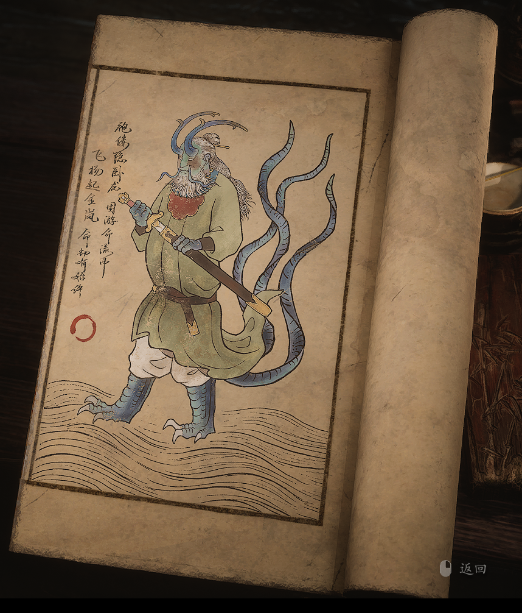

## 3.19 毒敌大王

> 仙居深处醉愁肠，金甲金螯毒难当。
>
> 鸡鸣泣血身将破，情路如月爱如阳。

毒敌山近邻西梁女国，山中自也继了西梁女国的传统，以女为尊。

这山中的魔王乃是个母蝎子精，又唤风月魔，最是生得妖娆貌美。她修的乃是“动”字门中之道，极擅房中术，又会欢好之事，是以有无数同修的道侣。

那道侣之中，恰有只公蝎子，生得金甲金螯非常雄壮，曾是风月魔心头之好。风月魔与这公蝎子还曾诞过一窝小蝎子，岂奈，这一窝仔蝎中，尽无一只母的，她便无心教他们法门，那金甲金螯的公蝎子也连带受了厌弃。

见风月魔不再找自己同修，那公蝎子倒也十分硬气，领着孩儿们搬去山外居住，不再与其往来。

其后，取经人途经西梁女国，风月魔劫走唐僧，被悟空请来的星官一声鸡鸣，震死当场。西梁女国被捉来洞中的国民，便都散了去，走时还将洞中所积财物，一并分了干净。悟空又嫌不够，着意添了把火，连那几间房宇也烧没了。

火起之时，那住在山外的公蝎子有所察觉。待他找去山间，昔日所爱，被人选剥了衣裳，割去了尾巴，捣作一团烂酱，死在坡前。他多方打探，才知是天上昴宿杀了夫人，一心要为她报仇。

所幸，那风月魔昔日曾点拨过他一些修行的门道，他就在那琵琶洞里住下，重整门楣，潜心修行。但他终究不是个女体，功法难有大成，毒敌山的名号也日渐衰微。后来，他听闻黄花观观主，乃是虫妖中首屈一指的高人，亦与昴日星官有深仇，便带着儿子们投那处去了。

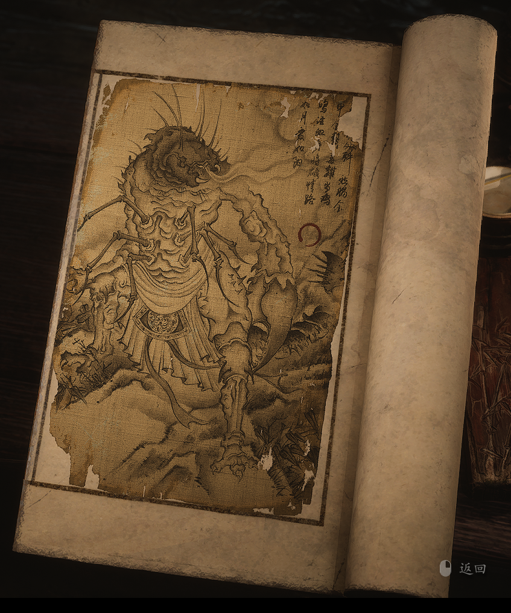

## 3.20 晦月魔君

> 短歌壮心惊，长啼乌夜明。
>
> 踊跃几升落，浮沉似漂萍。

他躺倒在地，尚不知自己是如何败的，原先那不入眼的道袍虫妖，如今站在他跟前，竟然在笑。

见那虫妖手持一支光彩焕烂的金钗，他心下恍然。还待要问，却发不出声来，直觉疼痛难忍，想是那贱虫用金钗，一下就割开了他的喉咙。

他理应快死了，他闭上眼，不想生前最后一眼，是那张丑恶的嘴脸。

未期，有人将他翻过身来，还给他细细抹上了膏药。他又能喘上气了，但这并非好事。

那虫妖啧啧称奇：“师父给的药，果真了得。这一下竟续上了断处。可惜可惜，用在了这里。”

他睁开眼，又想发问，虫妖制止道：“莫急，外伤之药，岂有治好内伤的道理？再者，我也不想把你治好。”

语毕，虫妖招了招手，两个着青杉的假道士抬着一口盖着锦布的玉箱走来。

虫妖取出一枚金茧，道：“我等山野妖怪，配不上此物，还得是用你试试才好。”

他心下惊急，咳出一口血，喷在那金茧上。

那茧遇血而破，钻出条人首金身的虫豸，一下窜入草里不见了。

虫妖毫不慌张，从玉箱里又掏出了一枚金茧：“还是师父思虑周全，备了两枚金茧。”

他还想挣扎，身上却被蛛丝牢牢捆定。那虫妖喝令道：“灌下去。”

几个假道士，真就抬了几桶水，捉住他的头，往他嘴中不知灌了什么汤药。只觉又腥又臭，喉中一哽，似有什么咽了下去。

自吞下那物，他周身如坠云端，连神魂也迷糊起来。

除了对母亲的一点牵挂，他似是再难忆起什么。若乾坤真有机缘，他无声念了最后一咒，还请天地将这绝处逢生的运数，留给母亲罢。

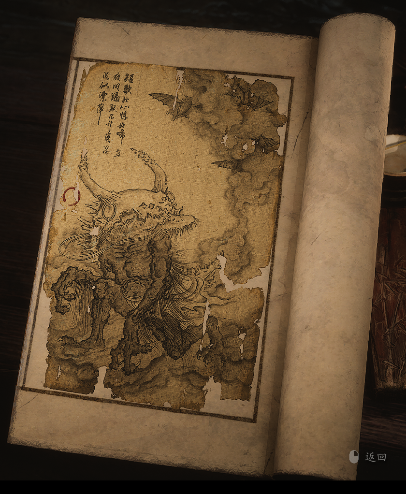

## 3.21 百眼魔君

> 提罐弄炉火，炼丹修道果。
>
> 眼多心也多，心多必算错。

“这……能成吗？师兄。”紫衣老妇低头，不敢直视百眼魔君。

魔君把针递到老妇眼前，软语道：“吞了那猴子留下的东西，再连上这法宝，若还不成，再逃来我处，师兄自会与你撑腰。”

他似又想到了旁的事，道：“若换我先下手，那只猪，你怕是再也见不到了……”

老妇赶紧接过那根针，行了个谢礼，退下了。

待门关上，屏风后，转出来个仙长，是个朱绣顶的白鹤嘴脸，持一柄拂尘，气宇昂昂地看着魔君。

魔君朝他拘着礼，禀告道：“拿捏了那猪头，天命人自然翻不起风浪。”

鹤仙人不置可否，叹道：“你们这点心机，陛下全看在眼里。不曾理会，是给她老人家几分面子。”

魔君干笑着答道：“娘娘的意思，便宜那边占得太多。这回，正好连本带利收回来。”

鹤仙人甩了甩拂尘，宛如赶苍蝇一般，闲闲道：“事成了，你走。她们留下。”

魔君眉头稍展，深深地朝那仙长回了一礼。

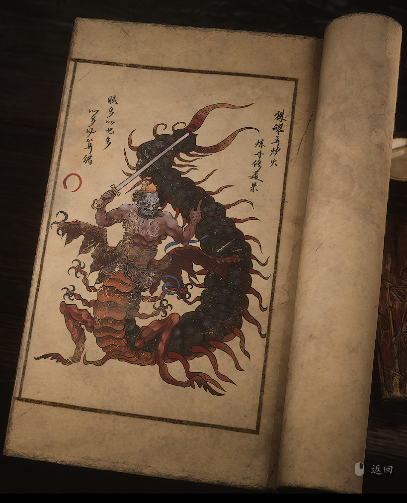

## 3.22 阴阳鱼

> 黑阴鱼，白阳鱼，翻天覆地弄风雨。
>
> 飞腾甩尾无休歇，法力无边住钵里。

南海有一种鱼，它有两丈多长，背上长着像刀一样的脊刺，它既可以变成黑色，也可以变成白色，能飞到空中，刮起巨大的风，掀起山高的浪，每次出现之后，村子里都会发生瘟疫。

一次，有个渔民捕鱼归来，遇到个无钱搭船的老者，他行走不便，却吃力地背着一个破包袱，里头装着许多的画轴。渔民心善，见老者疲乏困顿，便无偿送他过河，还送了他两尾鲜鱼加餐。老者很感激，当场便为他掐指算了一卦，道：“几日后，会有一个头戴斗笠，身穿白袍的年轻男子路过，你切记不要让他到你们渔村去。他来的那日，你不要在河上做买卖，会没命的。”

老者说完这些神叨叨的话，就从船上消失不见了，渔民又惊又吓，却将这话牢牢记在心里。又过了几日，他果然在捕鱼时，看到河岸上有个要搭船的人，穿着正与老者说的一般无二。那人称自己旅途疲累，想去附近的渔村休息，问渔民可否愿意送他。渔民本想拒绝，但转念一想，便将这人送去了河下游的邻村。把人送到后，渔民将船靠岸，不敢再下河了。正是此时，那人从袖中掏出一个黑钵，往河中丢去。

那黑钵一入水，河中便翻出一条通体浑黑的大鱼，霎时间，狂风大作，波浪滔天。渔民头也不敢回地赶紧逃走了。又过了一段时间，他听说邻村发生了大瘟疫，死了好些人，他本有些沾沾自喜，但邻村有人来他们村避难，瘟疫还是蔓延了过来，他们村最后也没能幸免。

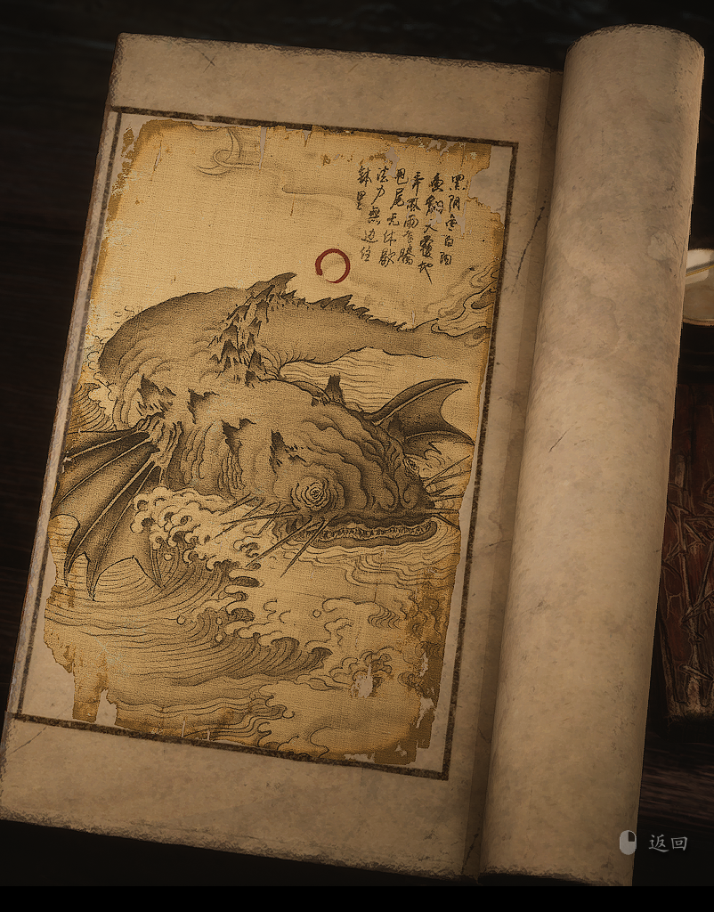

## 3.23 璧水金睛兽

> 形似祥瑞绛紫肤，威威凛凛势如虎。
>
> 冰来火去难敌对，热山寒地凄凉路。

牛魔王坐在山头，精疲力竭，动弹不得。

他眼见璧水金睛兽瘸瘸拐拐跑离了山场，本想唤两声，再想想，算了。

骑得最久的坐骑，被自己无情地撵走，头也不回。使得最久的兵器，被自己儿子夺去，不知扔到了哪里。

牛魔王看了一眼身上的血痕，旧伤未愈，又添新伤，那臭小子的火尖枪又长进了。

起先那孩子知了身世，日日嚷着要报仇，牛魔王怕他闯出杀身之祸，锁了他一阵，派了金睛兽看管。不料红孩儿竟逃了出来，金睛兽发觉后一路追咬，与他缠斗许久。待牛魔王赶到时，红孩儿已被它扑在爪下，奄奄一息。

只怪这畜生不该下那么狠的手，逼他不得不为了救儿子，重重伤了它，这有什么错？

亏得下手时收住了，让这不知轻重的畜生捡回一条命。可谁知那鬼娃儿的伤，却是装的。

好了，现下，换儿子囚了老子。报应原来从不在天，只在人与人的寸心之间。

“想救你的，被你打跑了；想杀你的，你偏偏要救？”

一个熟悉的声音，从深处幽幽传来。

是啊，你救我，我救你，可谁来救我们呢？牛魔王的头，又开始痛了。

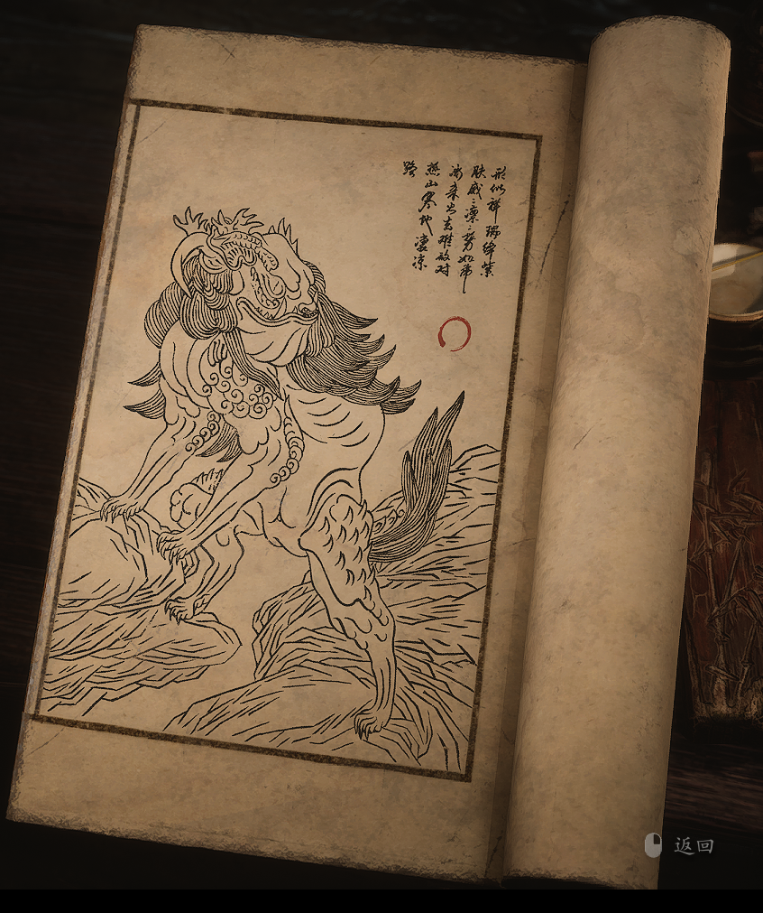

## 3.24 红孩儿

> 身若涂朱或有才，暴眼晃亮甚张乖。
>
> 炼了真火未炼心，灵山只在寸心开。

许多年来，红孩儿一直做着同一个噩梦。小时候，他与母亲分享过这个噩梦。

“母亲，好多人，他们打打杀杀，都是冲着我来！”

“好孩子，等你再睡着，明日便忘了。”

但他很振奋：“可我很厉害，我打败了和山一样高的和尚，会飞的怪鸟，吐火的神像……我一点也不怕他们。”

“我儿真有本事。”

他继续说：“我梦见我长成了大人，头上生出很长的角，手上生出很长的刺，一次能打杀好大一片坏人。但他们太多了，我根本杀不完。后来，又来了一些我没见过的怪人，他们静静地挂在天上，不下来，就在天上默默地看着我。”

母亲将他拦入怀里：“若真有那一日，父亲母亲会与你一道去天上，杀干净他们。”

“我们会死吗？”

“……”

“我梦见我被他们杀死了，变成一朵红莲花，母亲摘下了这朵莲花，我就成了母亲的孩子。”

“……”

他继续滔滔不绝：“我若是死了，母亲还愿意再生养我一次吗？”

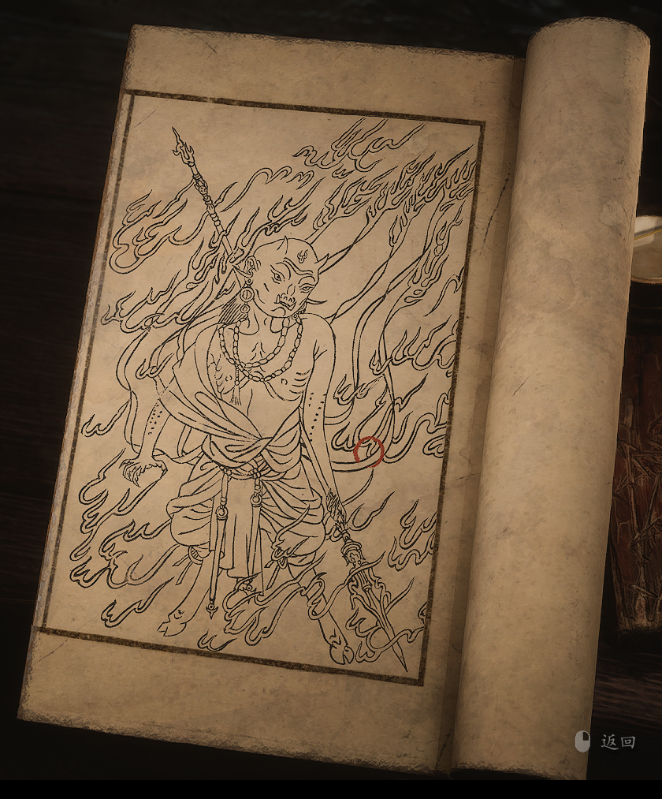

## 3.25 夜叉王

> 牙森列戟目双灯，破阵交锋好杀争。
>
> 轻捷勇健精武艺，飘零流落失果身。

熊熊烈火已烧至金殿上，殿外杀声震天，里面却听不真切。

王身负重伤，坐在一地狼藉间，抱着一个刚刚死去的少年。

来人站在垂幕后，叹道：“生灵涂炭啊……你看看你，当真罪过。”

王默不作声。

“夜叉王族一脉是断是续，全凭你今日一念。”

王不由得放眼望向金殿四周，仍能看出昔日繁华。

“都说夜叉最是果敢，你这做王的，反是迟疑不决。”

王轻轻抚过儿子的脸庞，尸身尚有余温。大好山河，他多么希望这孩子能去看看。

“你只要有一丝不甘，又何妨试试我的法子。你心中的未竟之事，老夫自会替你安排。”

身为一国之主，竟不能战死沙场？王闭上了双眼。

终于，他睁开眼睛，缓道：“既已无救……我与小儿，都留给你们吧。”

“好！好！好！此刻想通，未为晚也。”

来人拍手，身后又走出一个白衣道士。那道士走近夜叉王，先行了一礼，然后盘坐在地，伸出双手放在少年的头颅上方，低声念动口诀。不多时，一朵血红的小巧莲花，从少年额头缓缓生出，晶莹剔透，娇艳欲滴。道士小心取下莲花，放入随身的钵盂之中。

夜叉王紧紧盯着那朵莲花，目不转睛。

来人道：“这红莲，便是你儿的精魂所化。要保它一路不消陨耗散，直至转生成功，却还要借你的性命，连同那子母河的水一用。”

夜叉王再看了一眼那朵血莲，慢慢抬起双手。

“不劳两位，我自己来。”

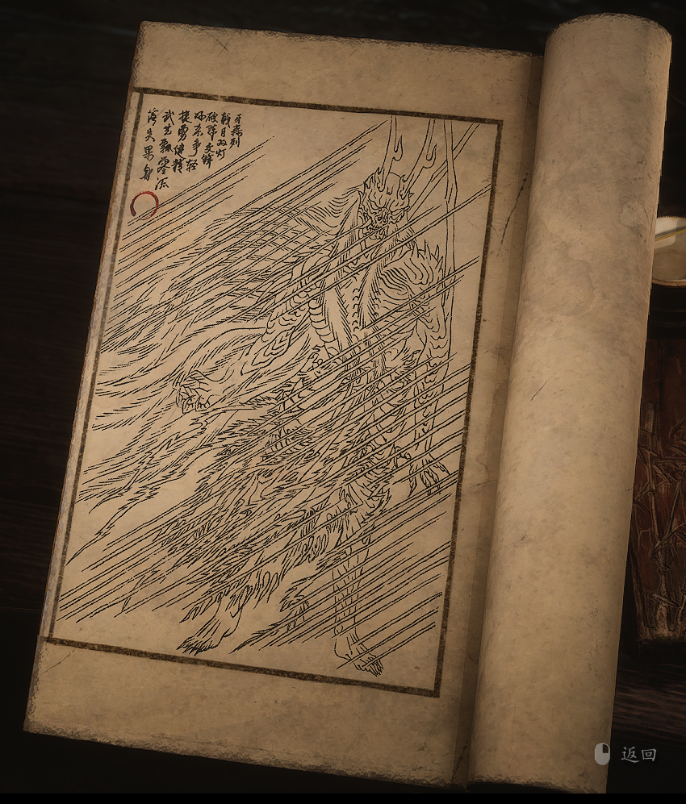

## 3.26 大石敢当

> 巧石山峰化灵胎，二心未剪智难开。
>
> 擎天撼地真容易，机关识破运才来。

却说，那花果山中自灵明石猴诞生之后，所遗仙石又经千年日精月华的滋养，自修自练竟化成个山一般大的精怪。

这仙石原有无限神力，无奈育化未久，不知何人在他身上，种下了一颗肉佛头。自这肉佛头生出，便无时无刻不汲取仙石体内的灵蕴。

仙石神魂倦怠，只得伏入地里，吸存天真地秀来补足自身，时日一久，就将那周遭山间的灵蕴俱吸了个干净，导致花残叶凋，生灵皆不可活。

而那肉佛头自得了滋养，反成了这石身的主人一般，精神饱足，竟在体内孕出识蕴来。若能待它补足其他四蕴，不知会将这仙石精变作个什么怪物哩。

可惜这块天地孕育的仙石，为这不劳而获的肉佛头做了嫁衣。或许这就是世人常说的，时也，命也。

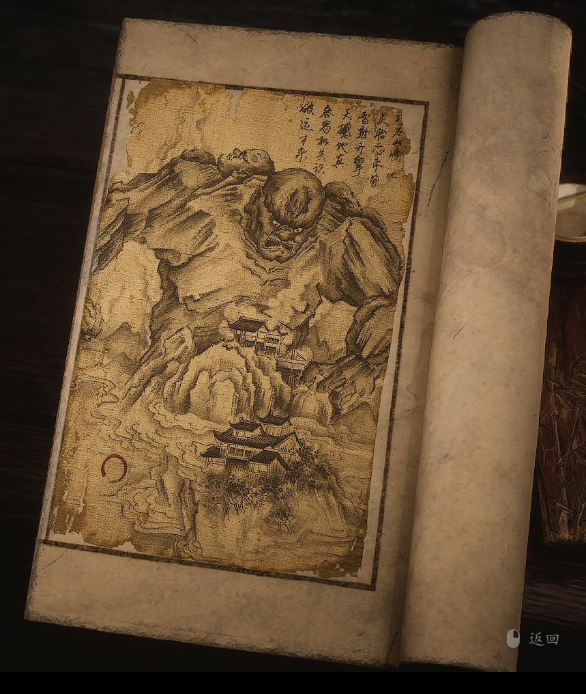

# 四、人物

## 4.1 白衣秀士

> 翩翩恰少年，白衣配怒颜。
>
> 吟诗折扇骨，嗔怒出枪尖。

春日，风和，白雾泽。

一老狼架炉烹茶，看着水中白影喃喃：“你我本不该在此。”

白衣秀士正自舞着一段枪法，闻及此言，倏地将枪掷到炉旁，将身一闪，已握住枪柄，立在老狼身前。

“饮血，还是喝茶？”

“喝茶。坐。”

二人对坐，老狼将一碗茶汤递与秀士。

秀士一饮而尽：“好茶。”

老狼颔首，问：“一个烧过的山场，可值许多把戏？”

秀士答：“我奉大哥之命来此，绝无把戏。”

老狼反问：“那我起死回生，难道不是把戏？”

秀士不语，老狼盯着秀士亦不语，他双目虽浑浊，却难掩焦急之情。

秀士思量片时，终是答道：“这个还真不是把戏。”

“若非把戏，何解？”

“你可听过天上那童子，佛祖菩萨有个术法，拼凑外物，念动起死回生真言，遂救得性命。”

老狼苦笑摇头：“大王绝无这等本事。”

“他没有，他得来的邪物有。”

老狼心急道：“可我如此苟活，寝食难安。”

“必死则生，幸生则死，一息尚存，也算超然……”

老狼不语，秀士垂眼亦不语，他双目虽异瞳，却难掩怜悯之色。

老狼道：“这茶留于你了。还是喝茶好。”

老狼拂袖起身，喟然而叹：“饮他们的血，我于心何忍呐……”

他蹒跚离去，并非来时之路，只向水泽一侧的岔路拐过。

“叫大王，不用再来看我了。”

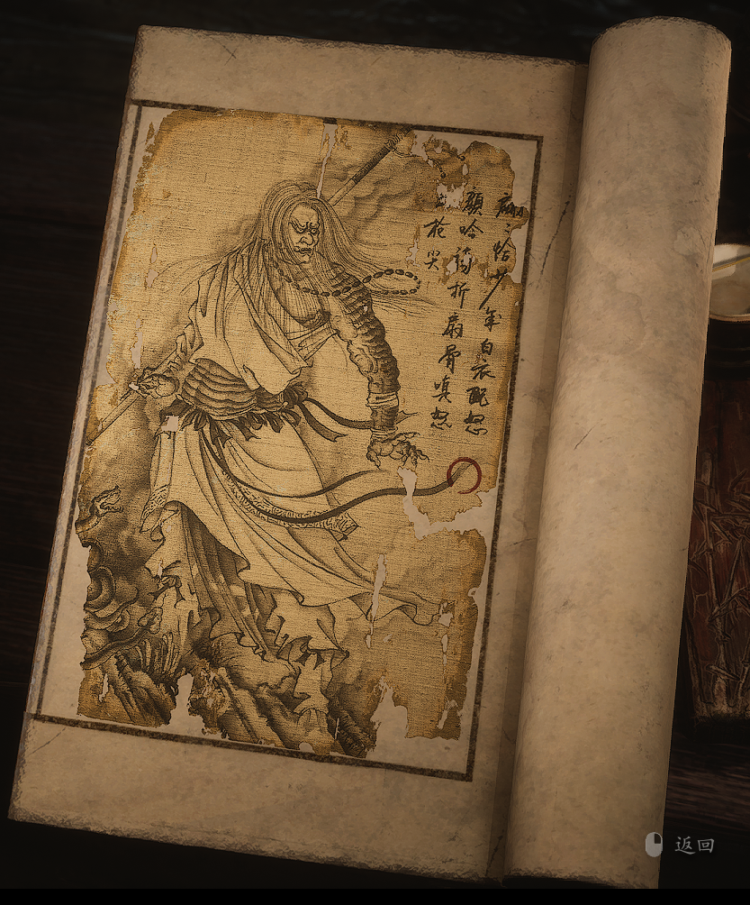

## 4.2 黑风山土地

> 慈眉掩善光，善目遮锋芒。
>
> 妙法助英豪，良心因果长。

天规载，土地公有察点本坊生灵，保育此地水土的职责。

这日，黑风山土地公依例在山中巡视俗务，正见有位老道士自远处而来。他穿一领星辰点就的道袍，挎一个青藤编就的药篮，手里敲着渔鼓，嘴里唱着月高，三两步飘摇到了近前。

土地公仔细打量，认定不曾相识，但凭那鹤发童颜，星目含威的气度，便知不是凡人，赶紧道了个问讯：“老道长，小仙稽首了。”

老道士微微颔首，将自己的药篮递了过去。土地公一瞧，篮中俱是些珍奇事物，灵丹妙药，不由心惊，问道：“小仙如何受得起这般厚礼？”

那道士笑道：“我原是路过此地，但料想此后不久，这山中有场大动荡，想这篮中之物，必能帮你熬上一阵，便来拜访了。”

“道长何出此言？”

“我有个故人，性子不良，如今虽积下些功业，但依着他那倨傲的本心，准是难以安生，总怕他再闯些烧身大祸来……”

土地公细细寻思，诚然道：“小仙能帮些什么？” 老道士见他有些乖觉，招手让他上前，附耳传了他几门保命的法术，并嘱咐道：“若你在山中遇着他，可将此两法相传。我不便出面，只能借你手，教他一二，全了一场情义。”

土地公感激不已，作揖深谢，那老道士还了一礼，就要乘云而去，土地公急急追问：“敢问道长，仙居何处？”

那道士早已踏着祥云远去，天上飘下一片叶子，香味清远，叶尖极细极长。土地公似有所悟，赶紧朝着远处行礼作揖，直至云烟都不见了，方才离去。

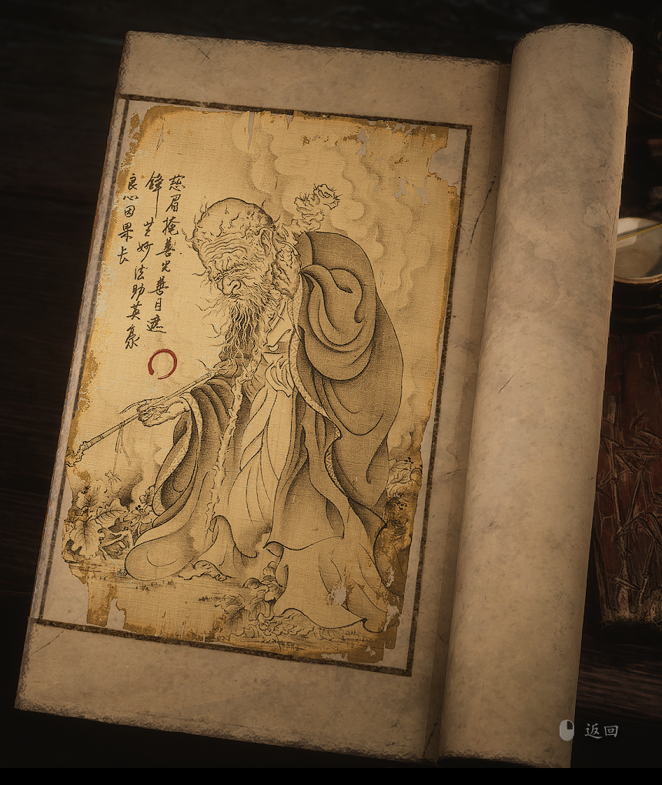

## 4.3 石中人

> 失意莫谈得意事，得意莫忘失意时。
>
> 一念贪私令智昏，步步嗔痴是为执。

依常理，当坊土地与本处山神原是协同处事。但这黄风岭中，绝非如此。

昔年黄风大圣率群妖降伏佛头石怪时，曾求土地一同作战。土地作壁上观，因此分佛头精魄时，山神有，他却无，这令他十分嫉恨。

他知自己本事平平，无甚神通与靠山，自认只要得了那精魄，便能如那山神一般，习得大神通。是以，待石父出走，黄风大圣受降，他便对石母起了歹意。

他在山谷中窥看了好些时日，发现石精们，搬山造石，非常忙碌，而山神坐镇石窟之中，只管调令，便心生一计。

这日，他将自己也变做个石精的模样，假意交差，凑到石母近前。他原要朝那石母腹上，全力撞下一头，裂石取核。岂料，他刚蹦起，就听那石母尖啸起来。近旁竟钻起了几个栖身地底的石精来。

因这一下分了心神，土地用力不当，只在石母胸前撞裂了一道石缝。他见事已败露，索性趴在石母身上，以全力要吸她体内的法力。待石精们将其扑开，他堪堪吸了一半。

石精们暴躁难禁，追着他一路冲撞。土地难以脱身，正要还原本相对敌。岂料，他尝尽术法，却变化不得，想是那石之精魄，已将其变做了个石头。石精们对着土地又撞又敲，只将他砸到地里才罢手。

土地从此没了盼头，索性在山沟当块烂石头，但他又自认只要得了另一半精魄，或能变回来罢。

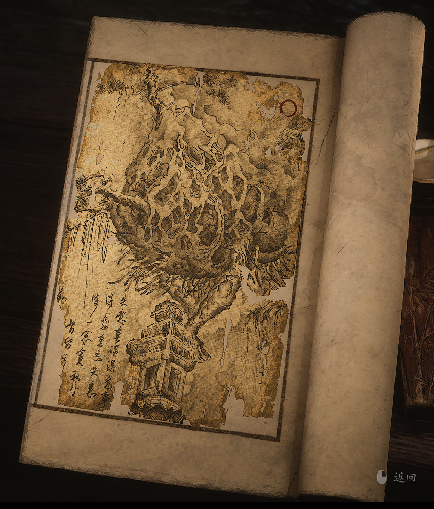

## 4.4 黄袍员外

> 锦袍丝绦飘晃晃，长嘴怪相目有光。
>
> 兴来醉酒卧荒冢，剑甲长，亮欺霜。

风沙，烈日，茫茫荒芜。

一个无头僧人与黄袍员外，同在枯木下歇凉。

僧人弹着手中的三弦，摇摇晃晃。

员外坐起，阻拦道：“别弹了，清静清静。”

僧人手下一顿，坐开三分，抬手又要扫弦。

员外急忙将手中酒囊递过，道：“喝一口？”

“没头，怎么喝？”

“头呢？”

僧人自问自答道：“没了！被人偷了。”

“这种东西，合该收好，是你的错。”

僧人侧了侧，无言以对。

员外从衣襟内，拿出一块金片，摊开给僧人。

僧人虽然无头无眼，却道：“此等贵重之物，示于人前，当心招贼。”

员外挥手道：“无事无事，若被偷了，我就找你。”

“我？”

“我只给你瞧过，若不见了，必是你偷的。”

僧人干笑两声，无法作答。

员外指着远处，笑道：“那边有的是金子，你何须偷我的？”

“我没打算偷。那边哪来的金子？”

“你竟不知？那曾是黄金古国，有许多金身佛像。金子就是那上边剥下来的。”

“佛像上的金子你也剥，不怕沾染因果？”

“呵，铸了那许多金身，也没得菩萨庇佑，可见世上没什么因果。”

僧人顿时无言。

员外一哂，倒过酒囊，发现已然空了，起身道：“我奉大哥之命，在此等人。你若想喝酒，就来此处寻我。”

他别好酒囊，又道：“我再去抠点金子，换了好酒，又能喝个够！”

那僧人想要阻拦，便弹起三弦，唱些什么因果报应。

黄袍员外根本不听，背对着他摆摆手，踏沙离去。

那无头僧人的歌声有些哀怨，但黄袍员外却开心得很，笑声久久也不断绝。

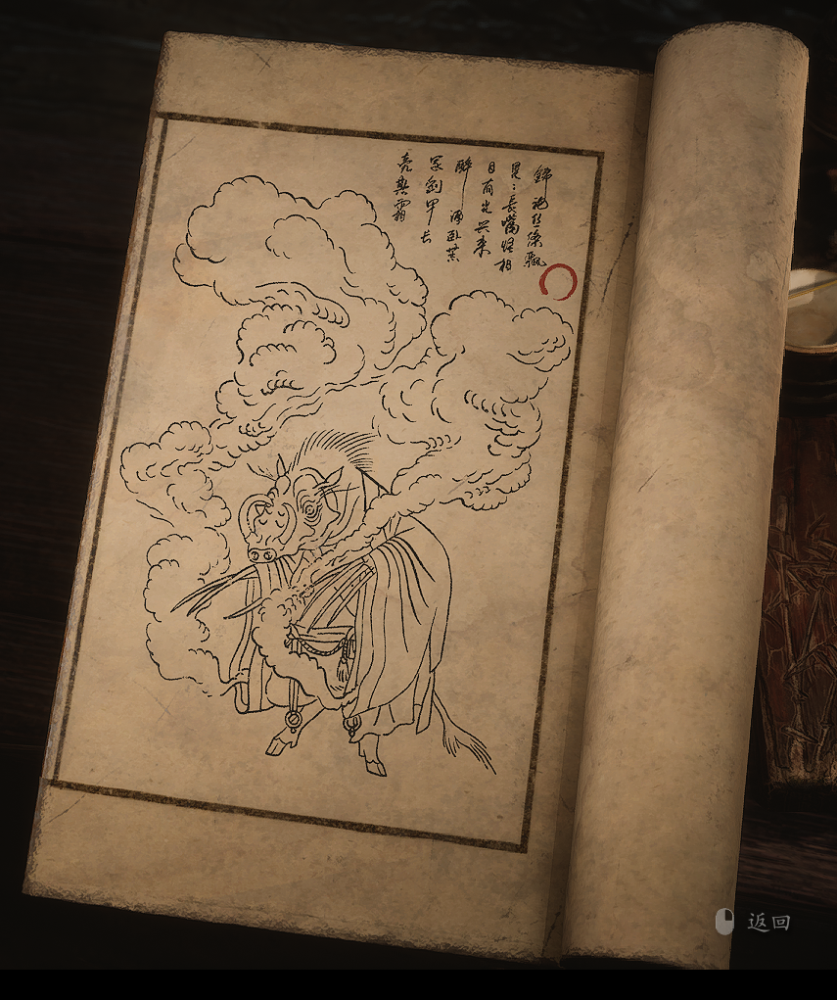

## 4.5 无头僧

> 三弦三弦，郁愤难言。势败奴欺，羞到佛前。
>
> 忧困忧困，仇生于恩。风遮沙掩，真假谁辩。

定风庄的村民曾遇过这样一件事，那是发生在黄风山刚刮起怪风之时。

那日，村里的孩童正聚在村口玩耍，隐隐听得有三弦的琴声传来。他们顺着琴声望去，看见有个身影，正靠在一块大石上弹唱，歌里有什么：“血化风，沙化雨。”孩子们从没听过这首歌，便急急朝那人跑去。直至到了近前，看清掩在山石后的那人，才发现他居然没有头。

孩子们吓得一哄而散，唯独有个叫成大的孩子跌了一跤。他趴在地上，看着伙伴们越跑越远，惊痛之下，不由嚎哭起来。那无头人听见哭声，收了唱腔，从石头后转出身来。他轻拨琴弦，一股看不见的力量，将成大从地上轻轻托起，扶他站好。

成大没有初时那么害怕了，只见那人身上穿着一袭干净的僧袍，脖上挂着念珠，除了无头，和他在庄子里见过的化缘和尚一般无二。

见成大没有跑走，那无头僧又一扫琴弦，觉一阵清凉的气息划过腿上，低头去看，刚刚摔破的伤口也不疼了，再一眨眼，皮肉都也长好了。

成大开心地拍起巴掌，蹦蹦跳跳，嚷嚷道：“好厉害好厉害！”那无头僧许是也高兴起来，又奏响琴弦，光晕从成大的裤腿上抹过，那裤子便就如新的一般了。其后，那无头僧重又弹唱起来：“黄风岭，八百里，曾是关外富饶地……”须臾，化成一阵风沙不见了。

回村的孩童带着成大的父母回来寻他，只见成大指着风沙，兴奋地喊道：“有神仙，有神仙！”大人们却道：“胡说，哪个神仙没有头！你那是见鬼了！”

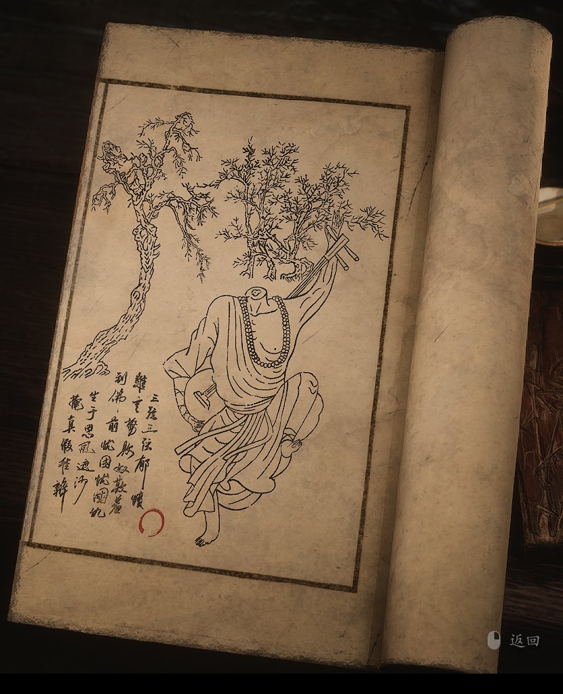

## 4.6 灵吉菩萨

> 因空见色色生灾，因慈生欲欲如海。
>
> 前事快意后事悔，洗心绝念等风来。

灵吉缘何被砍了头，此事众说纷纭。

虎先锋是这般讲的：“大王的师父，岂是我等可议论的？不过，我曾听父亲提起，大王最恨这鸟人。说是拜师，我倒寻思是为求个庇佑。山野妖怪，就得看开。神佛哪有什么垂怜，各取所需罢了。”

沙国王似是知晓更多底细：“昔年，大王替我那小国消灾解难时，我曾见过一眼那大虫子。它背上有个佛头，与大王砍的那脑袋，一模一样哩。哎，后来我那城中，人人都变了老鼠，大王只说是他引来的祸事，就带着手下都走了。我知道，大王其实不想走的，他一直想让妖怪们，过些体面日子……”

沙二郎言简意赅：“大王，不坏。大鸟，活该。”

路经此地的马天霸如此叹道：“偷油的老鼠上高台，定是有人架梯来。”

黄风大圣对此事只有一句话：“灾人者，人必反灾之。不是我，也会有别人。”

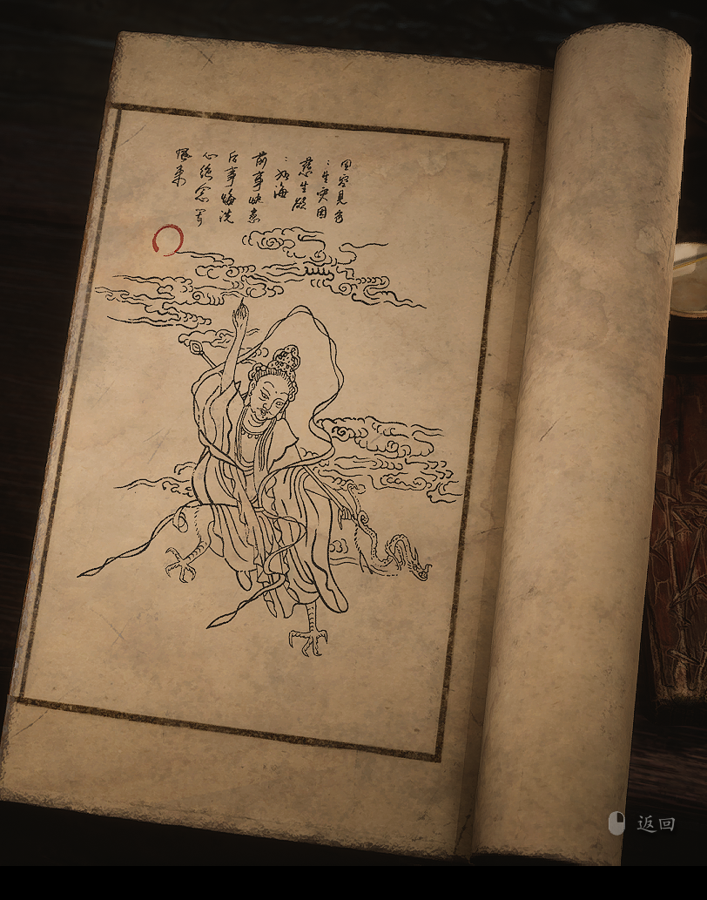

## 4.7 龟将

> 玄虚上应，龟蛇合形。劫终劫始，剪伐魔精。
>
> 冰天冻地，应承天性。同心破败，生不如陨。

小西天，苦海之上。

龟蛇二将现了本相，龟将真如泰山样，落在海河掀巨浪，蛇将更似烛龙形，盘在山岗撼地平。

黄眉丝毫不惧，使一条狼牙棒，强能短软，与那二将往来争战。龟蛇一个喷水，一个吐火，正要占了上风。黄眉却将腰间的搭包儿解开，投入那苦海之中，那物竟是一条摇头摆尾的十尾金鱼，遇水疯长，缠住了龟将。

蛇将本要相助，黄眉又从袋中放出另一只异兽，此物金身佛首，足下生着尖利钩爪，在岸上与蛇将战得难解难分。

他四者乱嚷乱斗，黄眉只情立在崖上，看他们鏖战不休，口中念念有词。忽然间，寒风大雪骤起，千里飘絮，海面成冰。龟蛇遇寒便要蛰伏的，即便成了神仙，也难抵敌天性所限，打斗间逐渐力倦神疲，力不能支，就连眼睛也难以睁开。

又过了不知多少回合，龟将终于抵敌不住，沉入水里。闭上双眼时，他看到的最后一个情景，是漫天的霜锋寒刃让蛇将无处可躲，在岸边被斩成数段……

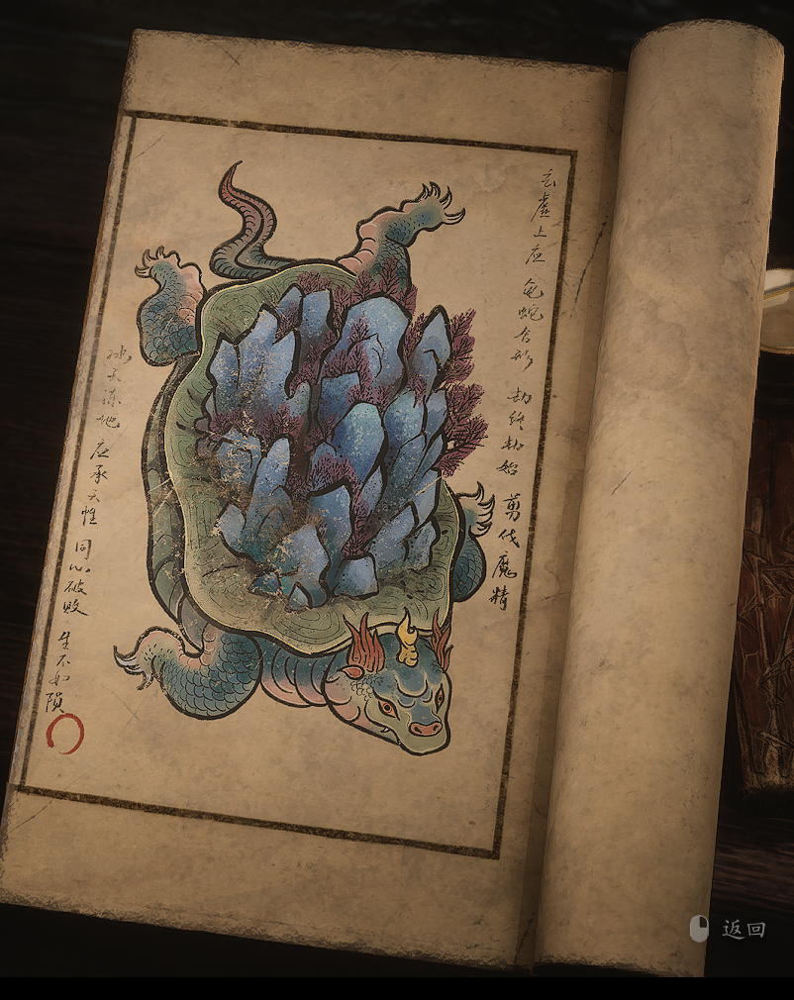

## 4.8 灵狐

> 有狐在山旁，忧心子无裳。
>
> 立志登大道，未卜身先亡。

古籍载，狐百岁能化为人，知千里外事。千岁即与天通，为狐仙。

有只小狐狸，自幼立志成仙，为此勤修苦练不辍。它时常向同族请教，如何才能当上狐仙，一些有道行的狐妖劝道：“想当狐仙是很难的。太山娘娘每岁设考核一次，文理精通者，可以修仙，若考核不过，则只能做野狐，不得修仙矣。”

小狐狸问：“可我如何能文理精通？我连笔墨纸砚都没有。”

狐妖道：“待你能化形了，便可化作美女或丈夫，到凡人市井里，读书习字都可。但有一条需紧记：太山娘娘总管天下狐仙，最不喜魅惑食人的。可吸精食元，是妖怪最快的修炼之途，你若要当狐仙，这条路便是绝了，极难极险。”

小狐狸道：“修仙，自然要修圆满，我定会克己奉行。”

自那以后，小狐狸只靠日月之精修炼，在山中一晃便过了几十年。见自己快有化形的能力，它便经常靠近凡人居住的村庄，观察他们饮食起居，模仿他们读书写字。

一日，它不小心踩中了猎人的陷阱，被个书生救回了家……

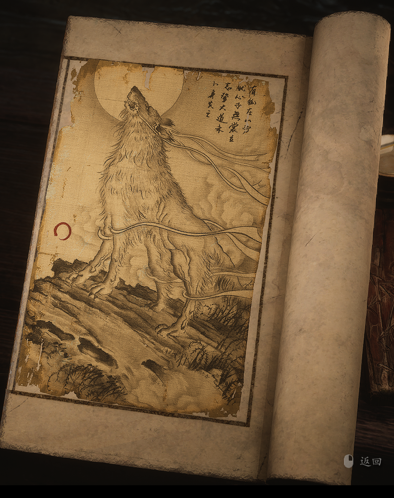

## 4.9 翠笠武师

> 莎衫箬笠烂布衣，金环滚火甚稀奇。
>
> 雪中三度试禅心，非敌非友真顽皮。

青灰，皎白，坚冰与飞雪铺苫了整个山间。

深谷下有个洞天却格外稀奇，有片绿绿葱葱的瓜田，长势极好。一个小沙弥，正在瓜田里挑挑捡捡，左拍拍，右拍拍，还未找到心仪的。

瓜田旁，站着个头戴翠竹斗笠的怪人，正看着小沙弥选瓜，道：“大哥说，若有机缘，可让小生试他一试。”

那小沙弥终是捧起个西瓜，颠了颠，笑呵呵道：“这个好，将熟未熟，最是有味。他，我已替你看过了，很好。”

怪人道：“小生若不亲手与他会会，终是不放心，不知如何与大哥交代。”

小沙弥双手一使劲儿，西瓜掰成了两半：“与其不放心他，我倒是更不放心你那大哥多一点。”

怪人寻思了一下，道：“东西由大哥亲自保管，必然不会有差池。”

小沙弥啃着两边瓜，不置可否：“那东西，十分考验人心。他独自一人承受多年，可莫功亏一篑。”

怪人赶紧道：“所以，若是今次能成，岂不两全其美？”

小沙弥停下，抬头盯着怪人，那怪人赶紧把头垂下，行礼告罪。

小沙弥又呵呵一笑，挥手道：“去罢去罢，先过了我徒儿这关，再说其他。”

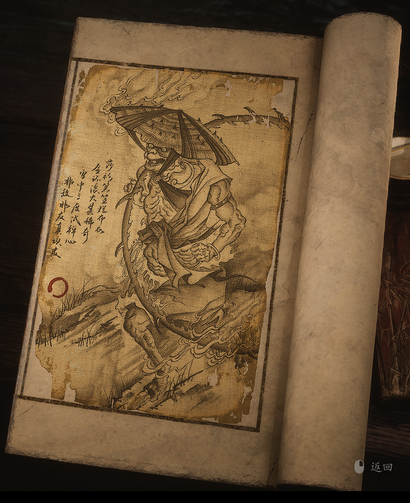

## 4.10 小张太子

> 祖居西土流沙国，其父原为沙国王。
>
> 楮白枪尖能缚怪，大地扬名说小张！

在蠙城久居扬名的小张太子，从很远的地方，投入泗州大圣座下拜师。

泗州大圣又名国师王菩萨，大家都说他十分能降妖伏魔。这正是小张太子想学的手段，他的家乡正有妖魔横行。

一日，他听闻小西天重又办起了法会，便带着四将向师父请了示下，要去小西天看个究竟。岂奈，黄眉此次回来，竟然又偷了那几件法宝，一战之下，悉数败阵。

“师父，全败了。今番乃是第二次战他，如何还是全败了？”

“师父，我知中了幻迷之术，只能用兵刃扎伤自己，保持清醒。”

“师父，那老怪不知何时练就了丈六金身，刀枪不入，你切记小心。”

“师父，一将与黄眉辩法，被黄眉蛊惑，如今口吐魔音，在牢中怂恿我等。”

“师父，二将被黄眉一手扭下头颅，爆为脓血，在寺门前开出了莲花。”

“师父，三将朝黄眉掷出了兵器，被他打断了手足，又接上了旁人的手足。”

“师父，四将受狼牙棒一击，扎穿了身躯，每一个空洞里，都长出根须。”

“师父，是弟子调令他们，找准机会，剿灭黄眉。都是我的错，都是我的错。”

这小太子，刺瞎了眼睛，戳聋了耳朵，疯疯癫癫在牢里不停念叨。他对着墙壁说的话，他的师父真能听见吗？他真的有师父吗？为何他的师父从来不曾救他？

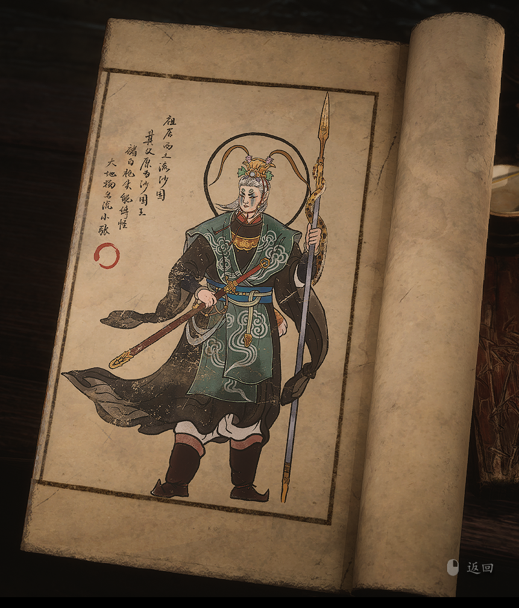

## 4.11 小西天土地

> 卜卦解天意，装相世间行。
>
> 但笑痴愚者，吉凶在人心。

天庭选拔土地，一般都爱挑选草木之精。小西天却是以一位风神土地而闻名。

这土地不守本分，不植五谷，偏爱卜卦问天。他虽出身西天，却不喜诵经念佛，反倒精通揲蓍之术，好算人吉凶。

小西天之地，东有荆棘岭，西有七绝山，皆为险恶之所，行人罕至。土地据守其间，每逢过客，便强拉卜卦，以解卦为名，布下迷局。路人本求趋吉避凶，却不知已入土地局中。

一日，有旅人路过，土地如常强之卜卦，得一凶兆。旅人心惊胆战，求土地解之。土地故作神秘，言有秘法可转祸为福，然需重金。旅人信以为真，尽囊解金，土地乃指一羊肠小道，令其速去。

旅人依言而行，竟安然过岭，越山而去。土地见之，笑曰：“问卜之术，岂在卦象？人心所向，便是吉凶。”

此事传开，人皆奇之。自此，过往之人，都以得土地一卦为荣。

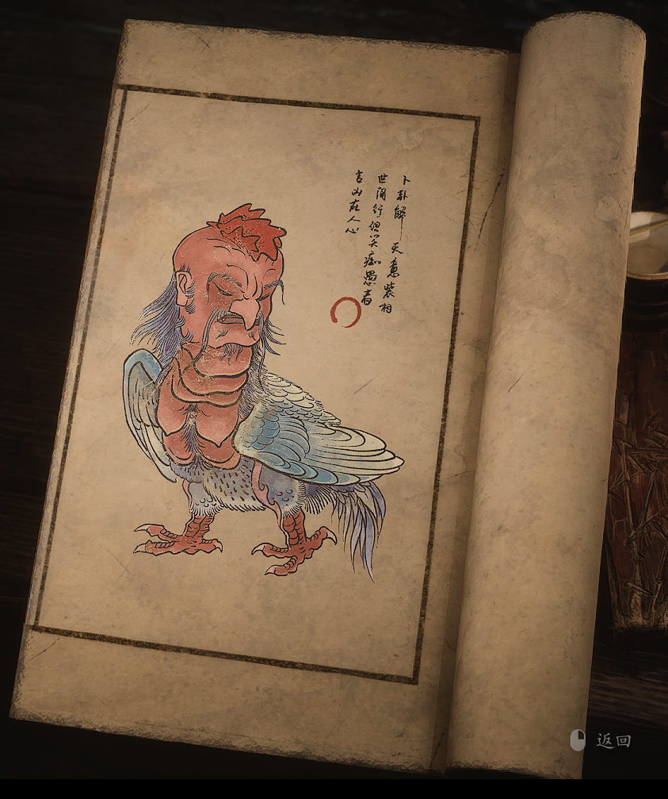

## 4.12 猪八戒

> 生来心性拙，进退不得脱。
>
> 戒空难戒色，随性也随佛。
>
> 钉钯筑机缘，獠牙拱因果。
>
> 滚滚浊世里，管他笑与说。

大罗天，瑶池之上。

仙娥们往来穿梭，原是王母今日开阁，设了个赏荷宴。

天蓬进宫门时，见一壮汉堵在门口，被把门的仙娥拦着。那仙娥不冷不热道：“卷帘将，没有王母亲写的请柬，池边雅座断然进不去的。一旁侧殿有几个空位，你若不嫌，倒可过去吃杯酒。”那壮汉口里应着，眼睛却仍往里瞅。

天蓬摇头轻笑，对另一仙娥展露请柬，昂首走了进去。

酒宴早已开始，众仙卿杯盏往来，觥筹不断。

天蓬总管天河水兵，这样的欢场来得不多，但他逢人都要招呼两声，仿佛人人都很熟络，酒却不敢多喝。

南极仙翁站在王母一侧，捋着胡子，笑道：“今次摆宴排场如此隆重，后面的蟠桃宴还怎么搞？”

一旁星君打趣道：“仙翁多虑了，有那九千年的蟠桃撑场面，哪怕在南天门外随便支几张桌子，三界那些大小尊神，爬也爬过来尝两口。”

又有一赤脸神仙冷笑道：“他们哪里是冲着蟠桃来，多是想来拜拜玉帝三清，见见西天佛老，难得找个由头上来走动走动。”

王母正色道：“蟠桃宴何等大事，今日设宴正是预演，该走的流程，都老老实实走一遍。”

说罢对太阴君使个眼神，太阴君一拍掌，一队身着素练的嫦娥仙子从后面走入场内。

那些仙子在瑶池边分好位置，弹的弹，唱的唱，跳的跳。其中又有一领舞仙子，白裙白发，舞姿曼妙，姿容尤其出众。天蓬从未如近地赏过嫦娥们起舞，不由看得痴了。

一位身着紫纱霓裳的仙娥，奉着酒盏，走到天蓬近前，轻轻唤道：“元帅。”

天蓬下意识地端起酒盏，眼睛却片刻不离台中那缕白虹。

待一众嫦娥舞毕，天蓬醒了醒神，准备上去给王母敬酒。队伍太长，他一路寻到队尾，竟已走到宫门之外。

这时忽听到有人大声叫唤：“鞋！鞋！”

他循声望去，就见两个仙吏，扶着个喝歪了的猴子，匆匆而过。

天蓬想，我何时才能像他这般大醉一场？

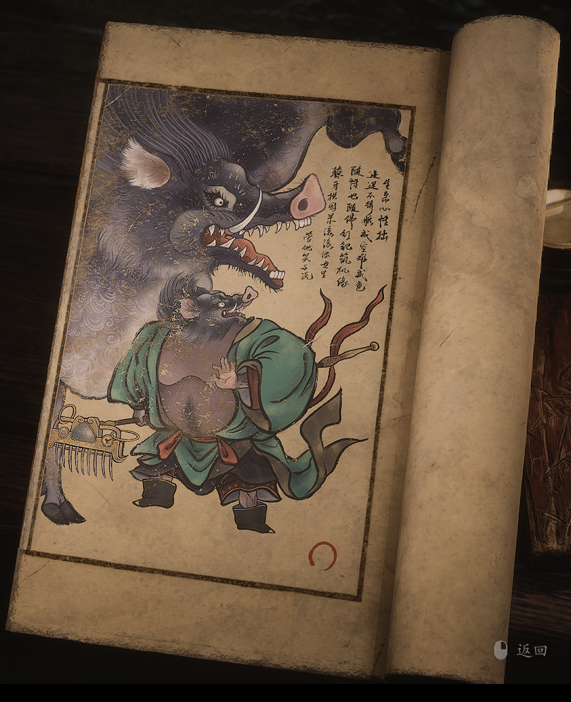

## 4.13 黑手道人

> 机关难算大聪明，鲁直冲动是本性。
>
> 犹谢腰间两面刀，一刃断执一刃明。

山风细细，野花满地，观后石窟内。

绛色面庞的道士，温和问道：“你来这观中多少时日了？”

“弟……弟子不知，只记得天雷过殿，有百余回了。”黑手道人站在一旁，有些戒备。

“那便有百余年了。”

道士说罢，走至光秃秃的石壁前，正要伸手摸摸。

“师父。”黑手道人急急唤道。

“……弟子来了许久，也未曾得师父传个什么法门，不知师父今日可能乘兴教弟子几招。”

“你想学？”

“既来拜师，自是想学的。”

“我看你根基扎实，气脉调和，自己的功法已然大成了。”

黑手道人听罢，心下一紧。

未料那道士又道：“虽无功法可授你，本派却有些练功的奇巧。你若不怕苦磨，我倒能让你试试。

“不知是怎么个奇巧？”

“传丹不传火，你若不试，我如何肯说与你听？”

黑手道人苦思，拿不定主意。

道士循循善诱：“我这观中不少弟子都练过，你来此这也没学，那也不试，岂非白走一遭？”

黑手道人一听，想到郎君临行的嘱托，问道：“此法能有多大作为？”

“精进躯壳，助益神功，登仙不难矣！”

“竟有这般玄妙？”

“觉不玄妙，你随时停下便是了，为师不怪你。”道士满脸自信。

黑手道人心下大动，立时应承：“敬听师父安排。”

“你随我来。”

道士又看看那石壁，带着黑手道人离去了。

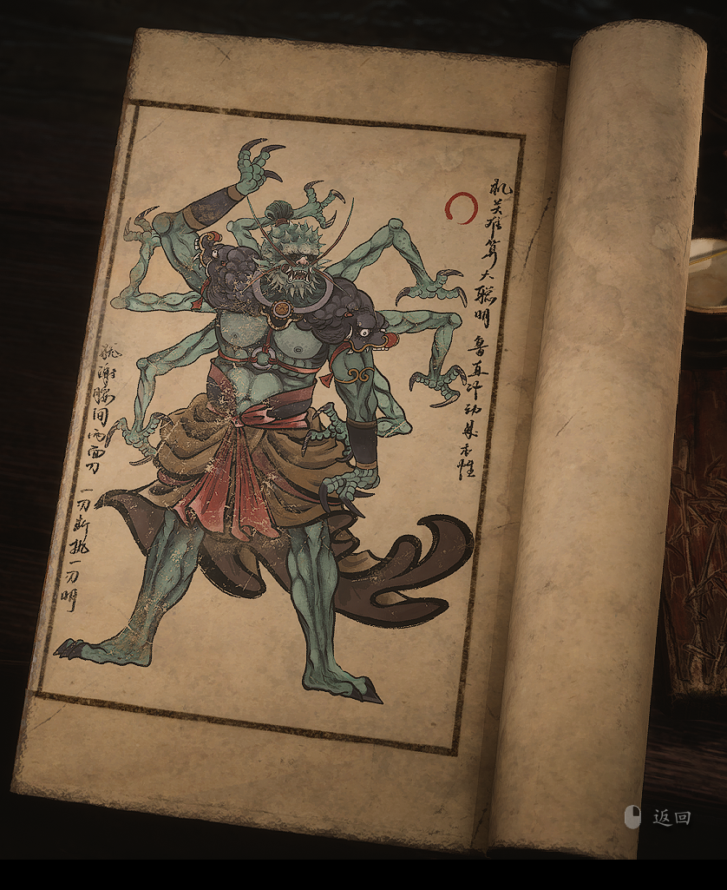

## 4.14 鹤仙人

> 朱绣顶冠素炼身，飘摇直上会仙真。
>
> 九霄万里都称圣，哪个愚夫敢不尊。

新上任的昴日星君原在披香殿供职，如今得了提拔，头次有机缘游览游览天宫。

他刚从灵霄殿出来，就被鹤仙人接着，先是去了天门，让值守的天将和四大天王认了人，其后，又去了三十三天宫，七十二宝殿，一一拜见了众人。

列仙无一不对他们礼遇有加，令新封的星官十分开心。两人游遍宫殿，鹤仙人还要亲将星君送回光明宫。

归途中，星君突然问道：“不知前任星君，是高升了还是被贬了，劳请仙人明示，我日后也好处事交往。”

鹤仙人一笑，道：“他与下界交往过密，许是交了什么山野朋友，如今抛了这天上的羁绊，不知哪里逍遥快活去了。”

星君蹙眉，问：“我闻斗牛宫每日都会点卯，怎地星君走了，岂有不知的？”

鹤仙人抚了抚星君衣上的皱褶，黯然道：“他若不是无声无息地走了，你又怎会在此处？”

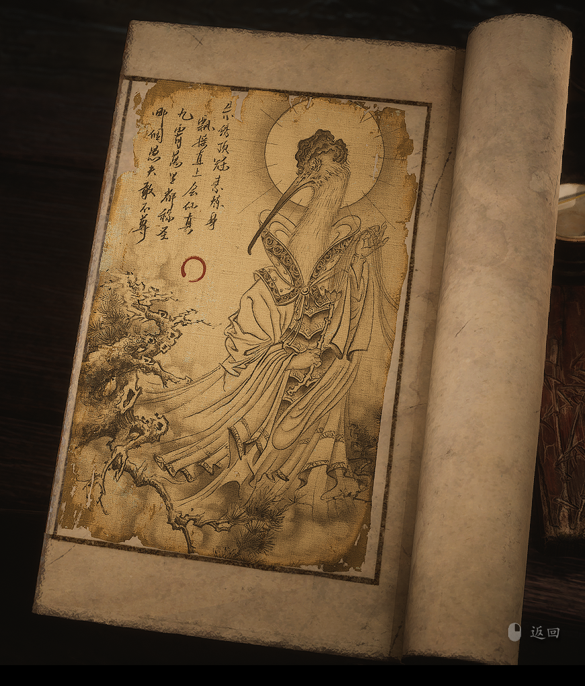

## 4.15 红依

> 泪眼思泪眼，断肠复断肠。
>
> 世有凉薄者，未必蛇蝎样。

玉帝驾座金阙云宫灵霄宝殿，聚集仙卿。

红依站在仙众之中，见太白金星领着一位头戴五岳冠，手执山河笏，身着七星袍服，腰挂八极宝环的仙卿走了进来。

就听他报道：“臣奉诏宣带紫云山毗蓝婆菩萨之子已到。”

玉帝听罢，道：“那仙卿过来。今宣你做个‘昴日星官’，位列二十八星宿，赐居光明宫。切记以后勤谨行事，按时巡札。”那新封的昴日星官谢了恩，玉帝又差鹤仙人与王灵官送他去到任，外赐御酒二瓶，金花十朵。

众仙依礼向那星官贺喜，只有红依站在外围，静静地看了一会。

她比他年长少许，只因长辈们私交深厚，往来密切，便如姐姐般看他长大，如今他得了这般风光，想来必是前途无量。

她又等了片时，只见他在殿前迎来送往，神采飞扬，终究未瞥来过一眼，便转过身，朝殿外姗姗而去了。

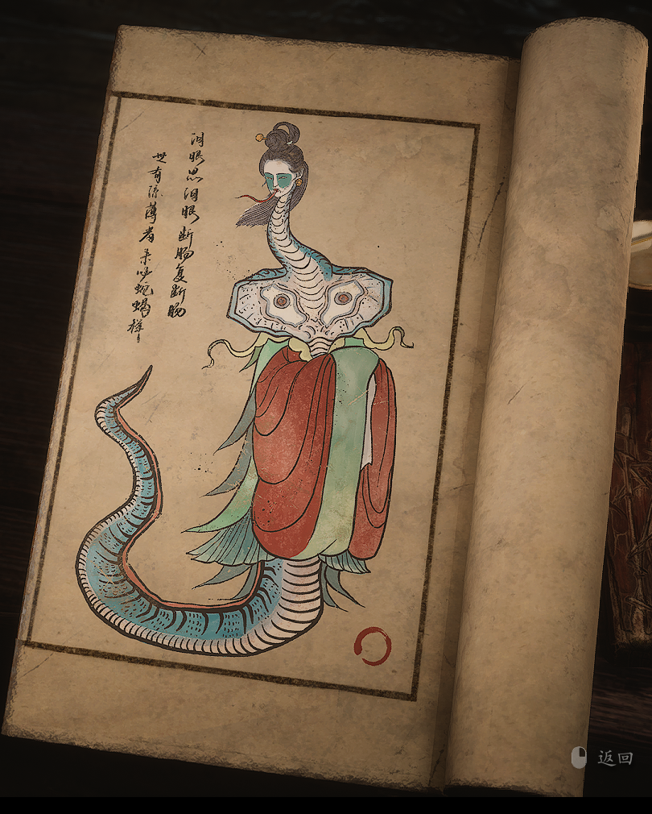

## 4.16 火焰山土地

> 炉倒砖陨遭贬日，却惜红颜难相知。
>
> 一身才学付败子，蓦然回首已成痴。

银河清亮，玉宇无尘。这夜，小道童坐在丹炉前，打着扇，守着火，正是精神不济，要偷偷眠上一眠时，忽听有声轻笑传来。

他一抬头，就见师父领着个姑娘，站在了门首，正看着他打瞌睡。他急忙整衣起身，向师父赔礼告罪。师父一反常态并未责骂，将他招至跟前，向他简单说明了来人，嘱咐他们日后一同看守丹炉。末了，淡淡道：“你可唤她师姐。”

小道童起初听见有人作伴十分高兴，却听到要叫新弟子作师姐，心下不大欢喜，待师父一走，便意欲刁难刁难她。

他将扇子往姑娘手里一交，道：“炉子就归你来看了，没有大的休息，让小的做事之理，对罢？师姐。”那姑娘不反驳，只是笑道：“在理。师弟且去休息。”

次日，师父登坛，姑娘跑至近前，小道童原以为她要告状，没想她却道：“师父，弟子新来，合该由我扇风。只是昨日师弟给我这把扇子，扇面小了些，用着不太趁手。”

师父瞥了小道童一眼，笑道：“既是如此，我再做一把新的，顺便就算赐你当个法器罢。”

小道童未想到师父那般严厉之人，对这姑娘却如此和颜悦色，渐渐刮目相看起来。

此后，二人一道练功修行，他发现这姑娘佛道双修，师父不论讲什么经义，姑娘都能接上几句，反观自己，嘴巴跟不上也罢，心思也落了下乘。

再后来，因丹炉被人踢翻，他被师父重罚，其他同门冷眼旁观，倒是只有这个便宜师姐，自请下凡，帮衬良多。

下界后，他才知道师姐原来还有座洞府，有群誓死效忠的随从，师父还格外开恩，为她请了地仙的名分。

又过了些时日，师父将师姐许给了下界的一位魔王。他虽有些怅然，却也明白自己终究身份不够，不论替师父做了多少脏活，在师父眼里，他始终都配不上她。

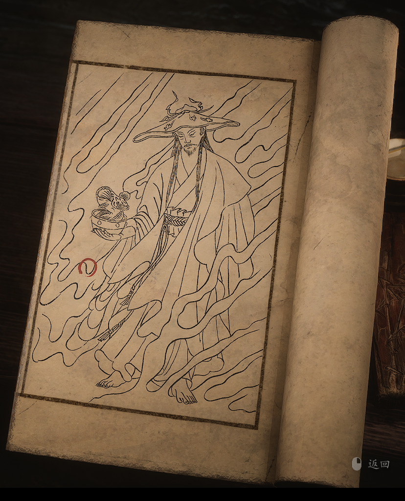

## 4.17 马天霸

> 生前好勇遇明主，忠贞不二做前卒。
>
> 知恩图报走单骑，不解危局誓不服。

马天霸原不叫马天霸，叫马二。

他本是商队养的马，要帮着贪财的商贾们，翻过火焰山去做买卖。未料，商队在山中被妖怪所袭，独剩他一马当先，逃了出来。

他撒蹄狂奔，直跑了六十里，才在一户庄院前力竭倒下。

庄中有位独居的许老汉，见马儿可怜，便收留了他。每日喂水送饭，在老汉细心地照料下，马儿很快就好了起来，日渐茁壮。

他天性有灵，见老汉待他好，就以叫声回应老汉的闲聊。老汉甚觉有趣，对马儿道：“我在家排行老大，你既愿入伙，便是行二，以后就叫马二罢。”

老汉对马二真心实意，哪怕自己吃不饱，也不会少了马二的饭。马二都看在眼里，记在心上。

火焰山本就大旱，只要铁扇仙的扇子不动，这地便没有春秋。更何况，许老汉年事已高。这日，他同往常一样，给马二添水加饭，却一头栽倒在了马厩边。

马二见状，扛起老人，飞驰而出，直奔翠云山芭蕉洞而去。

这一趟，他一刻未停，直直跑了七百三十余里。可惜，待他抵达翠云山时，老人已然咽气了。马二伤心欲绝，不愿再回庄院，自此流浪在山间。

山间有名有姓的小妖们，见马二善，常常欺负他。马二不生气，也不言语，任他们打趣调笑。他无家可归，也无洞府倚靠，原本壮硕的身躯又日渐消瘦下来。

一日，他照例沿着山路寻些小妖们不要的吃食，寻着寻着，瞧见有一老牛，酣睡路边，山间的火团都快烧到那老牛的眉毛了。

马二大惊失色，却怎么也叫不醒他，只得扛起老牛，又奔芭蕉洞而去。

沿途的妖怪，见马二扛着这烧掉了半边毛的老牛，一个个火气冲天，喊打喊杀。马二全不理不睬，闷头猛冲，身上受了不少伤，才抵达了芭蕉洞。

等马二见了铁扇仙，才知这老牛原是牛魔王，他不知又去何处赴宴，跟朋友喝得大醉不醒。

铁扇仙才唤了两声，牛王的酒就吓醒了。回头看看伤痕累累的马二，放声大笑：“你这马儿，够霸道！今后跟着我老牛，叫你个马天霸如何！”

自此，马二就成了马天霸。他跟着牛魔王习武修行，本领日渐高强，后来，还做了牛魔王的麾下大将哩。

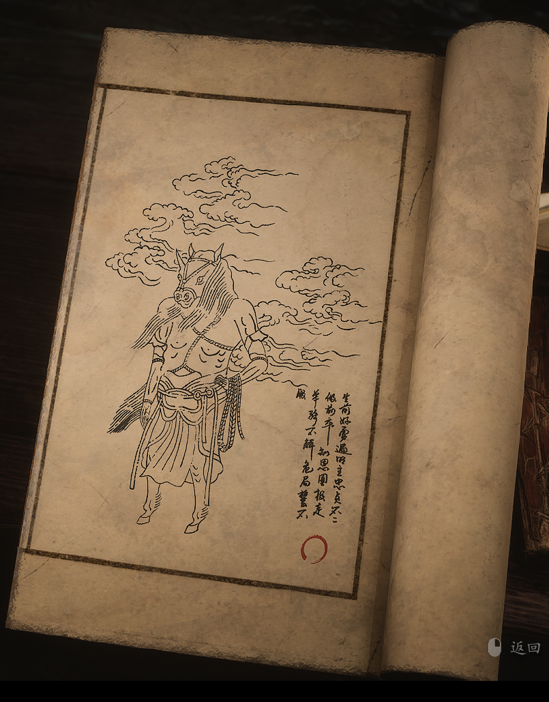

## 4.18 皓斧力士

> 握斧守将好逞强，无畏辛劳并祸殃。
>
> 愿得山中群生好，不辞险阻向残阳。

盛日，午后，春秋寨。

“好！好！好！正要这般气势。”牛魔王坐在崖头的大营里，看着山下的牛妖们操练。

皓斧力士站在下手，回禀道：“大王雄风，定要雄兵才可一配。”

牛魔王点头嘉许：“你这小校，干得不错。”

他看着皓斧力士，和颜道：“你投入我麾下，也无多长时日，已将这群散兵练得这般好，让我始料未及。”

皓斧力士憨憨地答道：“初来此地时，见大王山场治得这般严谨，我也始料未及。”

待他说完，自觉失言，告罪道：“我是想说……”

牛魔王爽朗一笑：“无事。山场治得好，全是夫人的功劳。她规矩大，才管得住这些夯货。”

皓斧力士也笑道：“起先的确被夫人的规矩吓了一跳。”

牛魔王见他不卑不亢，有一说一，便赞许道：“你也算治军有功，就升作我的先锋罢。”

皓斧力士赶紧跪下，道：“谢大王提拔，我必定誓死效忠。”

话音刚落，有个声音传来：“父亲唤孩儿来有何事？”

皓斧力士抬头看去，就见个红皮肤的少年从后走来。

“我叫你来看看，如何点兵调将。这是我新封的先锋，你快来见见。”

那少年一拍皓斧力士的肩头，笑道：“很好，父亲若信你，你必是个好的。来日我做了大王，你便也随我做个大将。”

牛魔王抚掌笑道：“有志气，以后这山场，就要靠你顶住了。”

少年微微思索，道：“父王，你不若把那东西，也一并交给孩儿保管罢。”

牛魔王沉了脸色，并不接话。

少年道：“父王连山场都能托付给孩儿，不过是个身外之物，何须在意？况你自得了它，越发憔悴了，母亲很是担心。”

牛魔王摆手道：“此事休要再提。”

少年心中十分不解，但终究不愿忤逆父亲，悻悻而去。

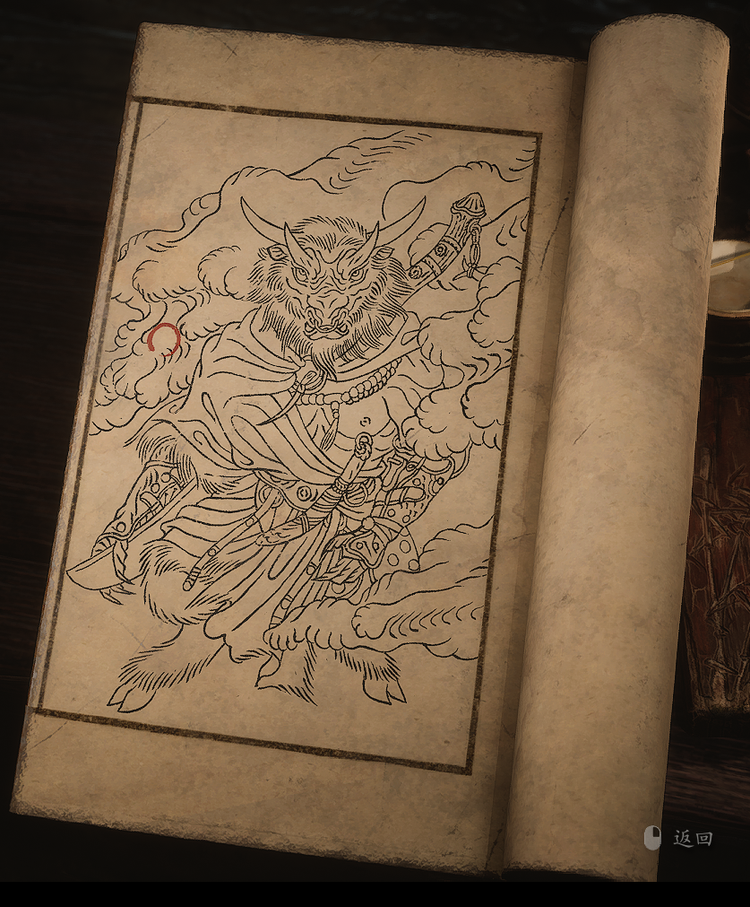

## 4.19 萍萍

> 生来命中多灾愆，聚散分合有谁怜。
>
> 莫如寄身好山水，自在行路自在眠。

萍萍向母亲交明了当日的功课后，来到灰烬台，哥哥今天约她来这里，说要事交代。

待她到时，见红孩儿正插着腰，指使着急如火快如风烧得牛妖们满山跑，笑声豪横。

“哥哥。”萍萍小声唤，自打红孩儿从南海回来，她感觉他有些不同，每次和他说话，自己都有些害怕。

红孩儿见她到了，招手停下演武，道：“今日先与你做个游戏，你逃，我追，看我能不能一炷香的时间捉到你。”

从前萍萍化作一只小狐狸，跳石穿缝，占尽先机。如今，红孩儿一枪便打碎她藏身的岩石，一口火就能烧焦她立身的枯木，化为一团红云就能飞过她跳过的悬崖。 不出半炷香，红孩儿就毫不费力地捉到了她，叹道：“母亲教你，到底还是慈和些。”

萍萍心里不大欢喜，红孩儿又拉着她，去丹灶谷的崖边休息，还把火尖枪甩出来，在空中舞出了许多枪花给她看。

小姑娘连连叫好，红孩儿问道：“我的本事与父亲比，你觉得如何？”

萍萍答不上来，她从未敢做这种比较，只好从兜里将母亲赏的火枣分与红孩儿吃，扯开话头，聊些山中趣事。红孩儿见状，也不再与她较真，跟着敷衍了几句。

萍萍小心道：“哥哥，我和你素日最好的，你有心事，可以说与我听。一家团聚不易，萍萍只想在这山里好好生活，与世无争。”

红孩儿望着天上烧红的云，道：“妹妹，你该多去外面看看。这世上哪有什么与世无争，都是争不过后的自欺欺人！”

萍萍很想问他，争不过是与谁争，为何要争。但话未及开口，后颈就挨了一下，昏死了过去。

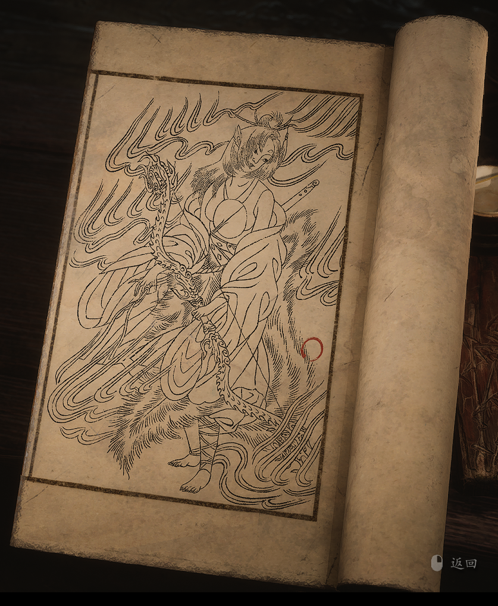

## 4.20 铁扇公主

> 朝夕经营多苦辛，日夜持家无闲情。
>
> 天不怜人人自怜，谁家灯火最难明。

灵山，鹫峰，雷音宝刹前。

铁扇公主捏紧交叠的手，稳住微颤的身，让自己看起来平静又祥和。

她此行去了好些地方，下界交好的妖王，天上结识的神仙，海外的仙岛，幽冥的地府，她都访了个遍。

她还去兜率宫求见了师父。师父只是语重心长地劝道：“叫你养个孩子，不用真就做个母亲。此事尽他去闹，你夫妻只要不管，可保无虞。“

师父的话，让她彻底寒了心。她知道，火焰山请不到救兵。这，是天意。

但她何其了解自己的儿子，肆意狷狂，有仇必报，这些年吃了那么多苦头，除非他能喘平这口气，否则就只能打断他的脊骨，才可解了火焰山之围。

是以，她来了这里——为了报仇。

怎么报？

她毫无头绪，脑中一片虚无。

“公主，师父招你进去。” 阿傩站在殿门前，话语一如既往的温柔。

她挺了挺背，握紧了早已放在手中芭蕉扇，干哑地答道：“有劳尊者。”

一路步入殿中，两旁侍立着八大金刚，五百阿罗，她似有似无地听到了笑声，但余光所及，一众法相庄严。

行至宝莲台下，她昂首跪着，捏紧了手中的扇子。

“罗刹女，汝有何事，求见于我？”

她沉默着，使劲把住扇子，确保随时可一下扇出神风，大殿里一片寂静。

所有的目光朝她望来，她能感到金刚正在睁大怒目，罗汉正在瞪圆嗔眼，一切法相正在幻作忿怒相。

“我……” 她垂下了头：“弟子……”

“弟子代师父，来向您问安。”

洪亮的笑声，振聋发聩。她在这笑声里，听到了婴孩的啼哭，稚童的憨笑，少年的怒吼，听到了千百年的花开花谢，草长莺飞。

听到余烬，熄灭在了火焰山。

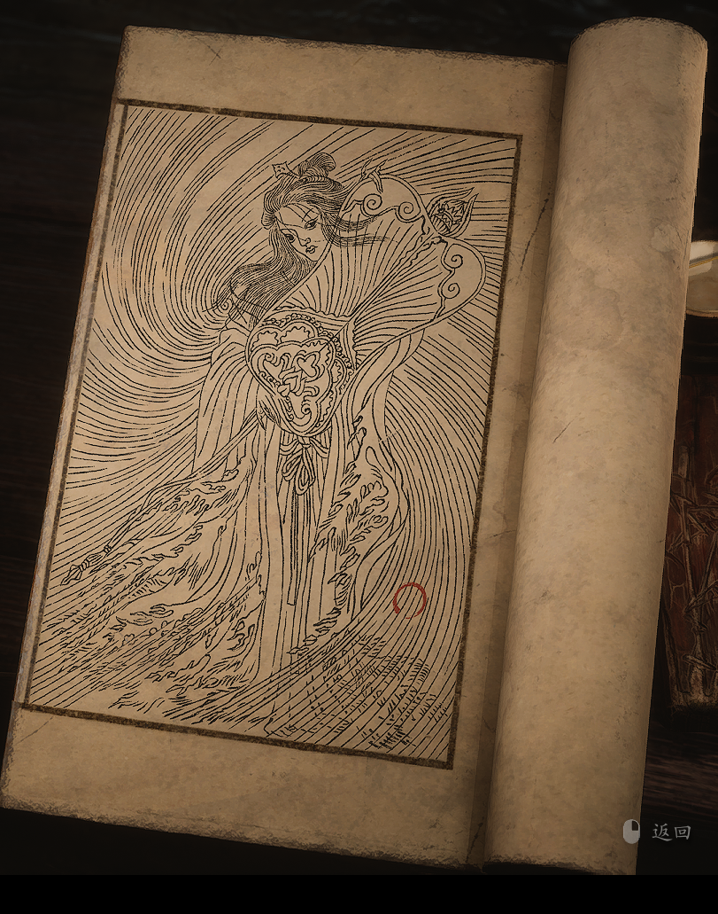

## 4.21 牛魔王

> 人称大力王，一生非平常。
>
> 三界气盖世，四洲威名扬。
>
> 妖中数豪杰，天下尽欢场。
>
> 忽然佛道至，故乡变他乡。
>
> 心魔随身伴，正果腹中藏。

昔日，牛魔王皈依佛门，未及百年，便修行圆满，重返了火焰山。

铁扇仙和萍萍十分开心，大声祝贺牛魔王的回归，并设下了酒席，为牛魔王接风。

席上，火焰山土地问道：“大王何故如此匆匆就归来了？”

牛魔王只道：“有一位旧友，过去有些误会，如今他助我立了功劳，菩萨便向佛祖替我求了恩典，放我回来了。以后我就陪在你们身边，哪里也不去了。”

自那日起，牛魔王的性情大变。昔日的豪放不羁，不复再见。他谢绝了所有的宴请，不再游历四方，反而成日留在火焰山，陪着铁扇公主搭理搭理家事，调教调教牛兵，十分安稳。

又过了数十年，红孩儿得了菩萨示下，回来火焰山侍奉双亲。一家四人，倒也有段融洽的好日子。

后来，铁扇公主渐渐察觉出牛魔王的异状。他日渐消瘦，容颜渐显老态，饮食少了，仿佛有重重的忧思压在心上。更蹊跷的是，牛魔王有时化作原形，遁至山巅，伏在山岗侧干呕。

服侍铁扇公主的毛女说：“大王许是患上了罕见的牛黄之疾。”

服侍萍萍的狐女说：“大王自知往昔罪孽深重，许是在灵山习得了苦行之法，正在修行罢了。”

火焰山土地说：“大王的心神一直困于他与那位旧友的往事里，无法自拔。那些往事，成了一道无形的枷锁，他跑不脱了。”

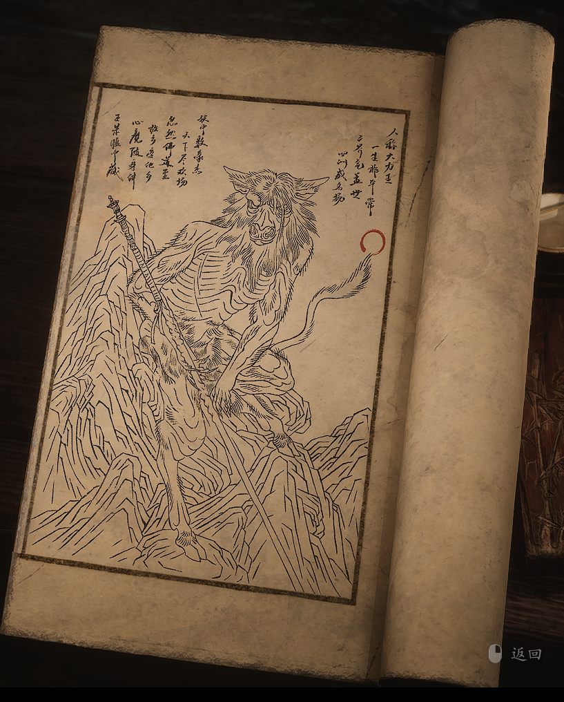

## 4.22 王灵官

> 都天纠察大灵官，擅骑火轮镇天关。
>
> 秉公不阿无言语，钢鞭一动心胆战。

天庭有个神佛共知之事，那便是太乙雷声应化尊，又名王灵官者，乃是玉帝最忠诚的纠察，若被他盯上，定是灭顶之灾。天蓬元帅，就是前车之鉴。那般显耀新贵，经王灵官告上一状，说没就没了。

起初，王灵官并非如今这般怪模样，虽无天蓬那般俊美，但至少有头有脸。后来玉帝嘉许灵官秉公执法，竟将自己的右手化生在了他的头上，以示王灵官至，犹如玉帝亲临。

神仙们若遇见王灵官，都会老实行礼，随即远离。更不敢在灵官前高谈阔论，深恐被捉了什么错处去。

王灵官虽无可结交之人，但那天宫里有个老神仙，辈分极高，除了玉帝，他倒是能跟着这位神仙有些往来。

有些神仙说，王灵官既然乐意承担如此要职，活该忍受这份孤寂，一利必生一弊。

另一些说，王灵官正是不愿与人交往，才领了这份不讨喜的差事，实则如鱼得水，乐在其中。

大家议论纷纷，莫衷一是，至于王灵官究竟怎么想，却无人得知。

## 4.23 通臂猿猴

> 欲学仙猴意蒙蒙，离山远走闯西东。
>
> 寻得五蕴实无获，舍得才是真道通。

《三藏真经》载：通臂猿猴，拿日月，缩千山，辨休咎，乾坤摩弄。

一日，花果山中，通臂猿猴正在山间纵跃，忽见山顶仙石炸裂，产一石卵。因见风，石卵化作一个石猴。通臂猿猴凑近去看，那石猴便就模仿着，学爬学走。其后，那石猴兀自拜了四方，目运两道金光，射冲斗府。这通臂猿猴十分欢喜，便将其带入林中，与群猴相识。这石猴果真了得，在之后的比试中，还做了群猴的大王，名唤美猴王。

美猴王率领群猴在山中共乐天真三五百载，一日忧虑起生死来，通臂猿猴便劝诫猴王外出学道。后猴王归来，论功行赏将其封她做了将军。再后来，见那猴封了大圣，做了天官，闹了凌霄，又落魄压在山下，拜师做了和尚，功成当了佛祖……

几番起起落落，终成又回到山里，再次化为一块顽石。

又有仙人托梦，告诉通臂猿猴，五蕴皆空，能度一切苦厄。若她能访遍天下胜境宝刹，寻得五蕴之精，炼出五蕴之丹，或许可让那顽石感应，再度通灵显圣。 于是她走遍三界四洲，去寻找能够炼制五蕴丹的材料，直到遇到了与猴王容貌一般无二的猴子……

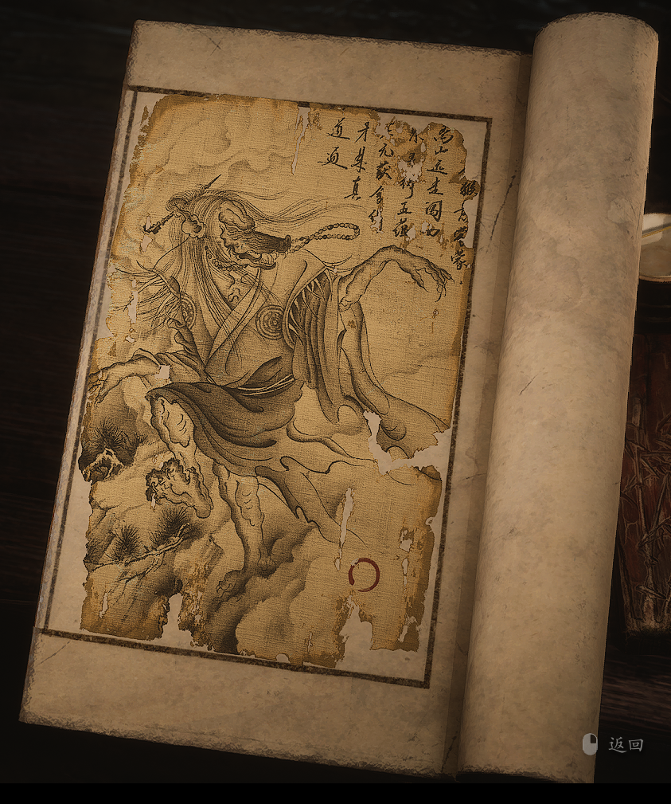

## 4.24 寅虎

> 使风鼓火动钤锤，舞戈弄刀扫尘灰。
>
> 矢志不渝方成器，动静合一大可为。

元辰殿内，寅虎立在砧台前，敲敲打打。几个道童在他周围，鼓风吹火，加柴添炭。忽而，殿门被踢开，守门的童子追着齐天大圣走将进来。寅虎对童子们使个眼色，他们急忙退了出去。

大圣走至砧台旁，将一副盔甲掼在地上，一只脚踏在砧台边，笑道：“寅虎老弟，天上给的这副行头，我着实穿不惯，不如你替我改改，你的手艺我信得过。”

寅虎看了看大圣的步云履，道：“你来求我，这般无礼？脚。”

大圣笑嘻嘻地把脚放下，笑道：“天上的门门道道，我是不理的。我们又不是这一天的交情，还讲这些个？”

寅虎不接话，大圣夺过他那砧台上正在敲敲打打的大刀，把了把，试了试，摇头道：“轻了轻了，配不上你。”

寅虎这才捡起地上的盔甲，翻看了一下，道：“你那金甲极好，何必穿这破铜烂铁。”

大圣一下跳到寅虎的大椅上，笑道：“我正是不愿穿，才放来你这处修，你也不必真动手。若有人来查问，你便说在改了即可。”

寅虎拒绝道：“拿回去，我不陪你唱戏。”

大圣也不恼，解下腰间的宝葫芦：“我其实是来喝酒的，你快去把他们都唤来。记得叫我那同族的好兄弟，也带上些自酿的酒，总不能只亏了我老孙一个。”

其后，大圣在那元辰殿内与众人欢饮醉倒，被仙吏扶了回去。他走后寅虎一瞧，那副盔甲还留在他的砧台旁。只能改日，再给他送回去了。

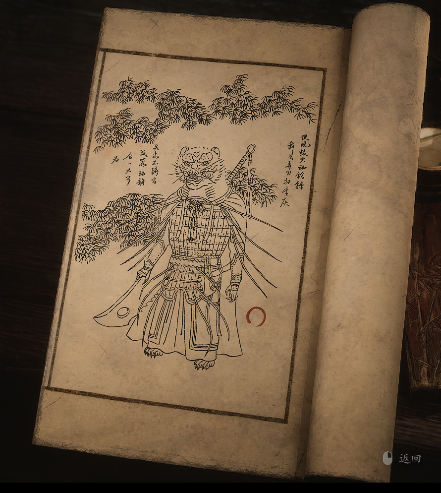

## 4.25 辰龙

> 如意不如意，靠天被天弃。
>
> 捞摸苦海边，耕作画轴里。

一张画轴，铺在书案上，有四众围坐其旁，乃是瘦猴一个，赖狗一只，老龙一条，猛虎一头。

那老龙问道：“真君送来此等宝贝，你们可知其意？”

瘦猴怪笑道：“我不知。许是送来挂在屋内赏玩的。你若不要，我拿去换酒。”

说罢，伸手就去拿那桌上的画轴，老龙将尾巴一甩，要去拍那猴爪。

那瘦猴中途迅速缩手，似要耍那老龙。那老龙将尾巴弯成个钩儿，轻巧弹了回来。

赖狗把着蒲扇，二人各拍了一下：“还有心思胡闹。我等因大圣之事贬下界来，这画轴自是与那一样有关。但……”话到一半，不知该如何说了。

猛虎听他如此，憋得难受，道：“你想说，他意在帮，还是害？”

赖狗扇扇风，嗔道：“此等玄妙之事，岂可说得如此粗俗。”

老龙道：“你们本意如何？”

瘦猴歪在座上，道：“不帮不帮。我个酒鬼能干什么，无非挣些酒钱，其余不归我管。”说罢合上眼，假寐起来，不再言语。

那猛虎一笑，接道：“我只懂打铁，有人来求，我便与人方便，仅此而已。“

那赖狗听完有些着急：“你等怎么如此缩头缩脑？昔日我们秉公行事，落得这般田地，我就帮就帮！”

老龙赶忙劝道：“老弟莫急，我们这不是想个法子，应付应付真君吗？”

“就你们这说法，三岁小儿都唬不住。”

“算了算了。”那老龙索性把画轴一收，“既然一般打算，那就顺其自然。有罪同罚，继续作伴。”

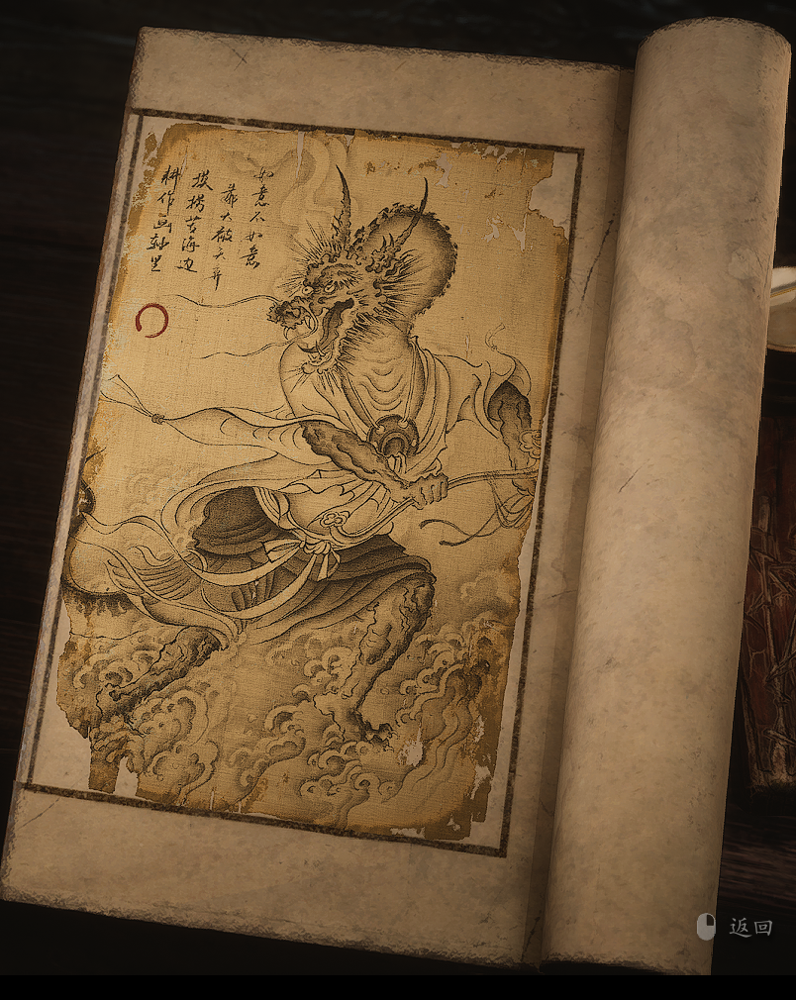

## 4.26 申猴

> 饮尽玉液有琼浆，瓮中粼粼是新酿。
>
> 愿在尘嚣醉一场，莫管故乡与他乡。

长安城中有座雁塔寺，距寺不远处，住着个殷勤的香客，名唤郝得胜。

一日，得胜在家闲坐，朦胧睡去。梦至寺门处，却见走来四众，有瘦猴一个，赖狗一只，老龙一条，猛虎一头，边走边谈。只听那猛虎问道：“你带着此物意欲何往？”

老龙晃着头道：“你放心，听闻他们已经各归洞府，我等只要去那几处，安心候着，必能遇到。”

赖狗道：“不知各位打算去何处何方？”

瘦猴道：“晴雨不出门，寒风会伤身。饮酒自是要去山青水秀的地方。”

老龙伸伸脖子：“我需倚海而居，若你那去处有海，我们倒能做个紧邻。”

瘦猴挥手道：“你那老脸看了千万年，今次还是住远些罢。”

老龙不理他，望向土狗，问道：“老弟可有安排，不若……”

赖狗道：“不了不了，火候未到。这才哪年，我不如先去下界红尘里经历一番。”

猛虎道：“哼，经历就免了，你不过是自个想先去些寻些奇花仙草烧着玩罢了。”

赖狗老脸一红，还未作答，毛猴又问那虎道：“你又如何安排？”

猛虎拍拍胸脯，昂然道：“守村。”

老龙见四众各有打算，便道：“倒也不必同行，就此分手，各寻营生。待我与其相遇，再会齐了就是。”

语毕，四众分头去也。郝得胜忽听一声霹雳，惊叫而醒，已将梦中之事全都忘了。

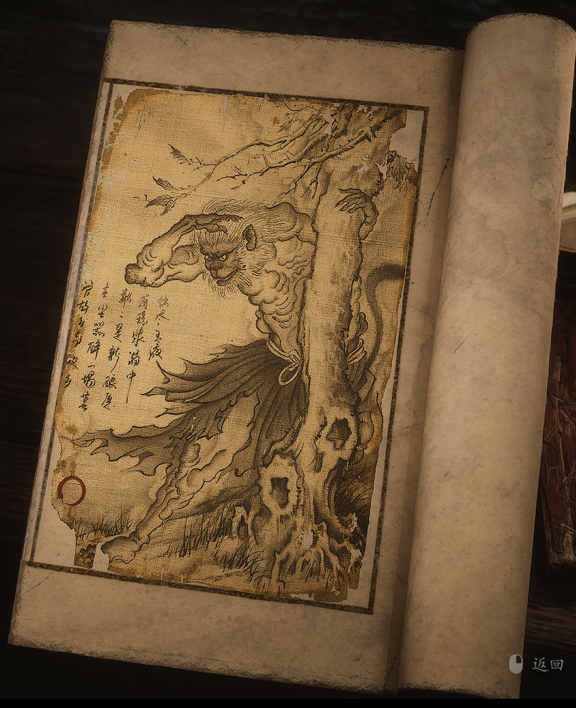

## 4.27 戌狗

> 不练神功不坐禅，手执蒲扇养金丹。
>
> 赤心只记参同契，人间愁闷人间烦。

清虚巷东头的小道观里，住着个道士。他自称得了海上仙方，是个妙手回春的道医。

道士的丹药，生病的人吃了，不见大好，没病的人吃了，只如寻常，不曾出过什么差错。若有人来问，他便道：“世上哪有什么起死回生灵丹妙药，只有体内的精、气、神调和舒畅，才是真的身体康泰。”大家都认为这道士不甚厉害，所以门庭冷落，求医者极少。

却说城中的陈老太爷，富比王侯，如今花甲之年，染了重疾，显出下世的光景来。他的儿子寻至观中，请道士去给老太爷治病。

道士养着条黄狗，不论何事，都将其带在身侧，此次去陈府治病，也是如此。道士为老太爷特制了许多丹药，府中人虽觉得道士不过胡来应付，却也不敢多言，只敢在旁瞧个热闹。

岂料，老太爷自服了那些药丸，渐渐竟能进些饮食，气也顺畅了，似有痊愈之兆。偏巧，道士某次炼丹，炉子却炸了开来，连带着他一起送了命。

府中下人来收拾道士暂住的房屋，不住慨叹天命弄人，却见道士的黄狗，正穿着他的衣服从屋内走了出来，他摇着一把破蒲扇，道：“我原盘算，在凡间学些凡人手段。不想你们这世道，有大才，反是烧身之难哟！”

语毕，他将扇一拍，就不见了。

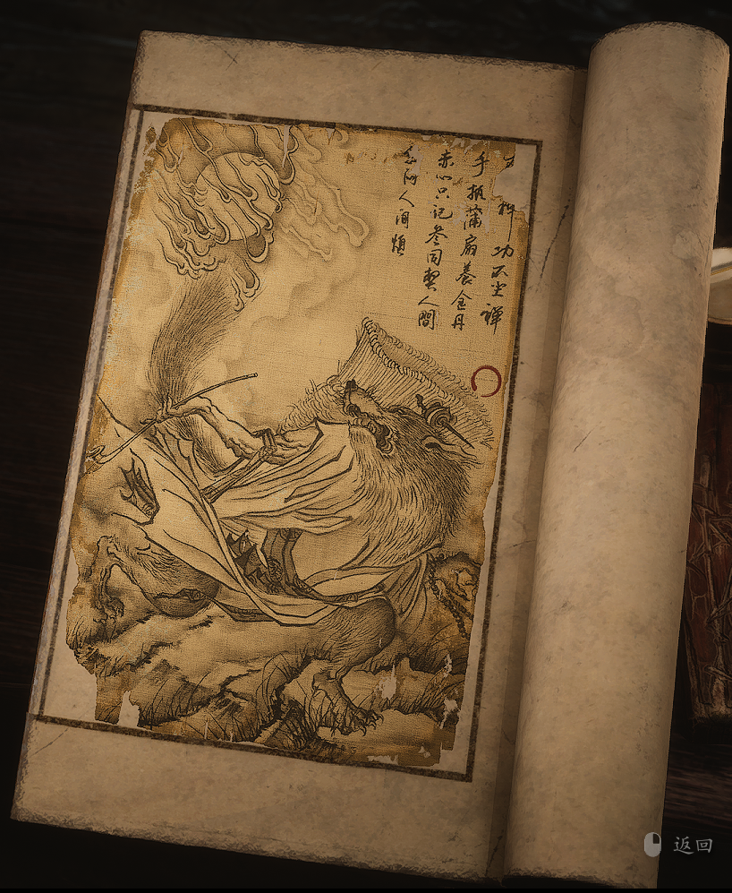

## 4.28 老猴子

> 长生路，人无数。
>
> 求道不求真，渡人难自渡。
>
> 休问功果几时成，虚空相里有还无。

有人说，他是观音菩萨。

有人说，他是菩提祖师。

也有人说，他才是孙悟空。

还有人说，他不过是山中的一只无名老猴。

他总是用一样的姿势，说着一样的开场白。

有时，山顶上空无一人。

有时，山顶上熙熙攘攘。

当天命人上路时，他会亲手为他们打一根柳木棍。

折柳相送，心中竟生出一些不舍。

天庭的神仙说，他在赌。

灵山的佛祖说，赌，就难免会输。

他说，他没有赌，也没有输。

他只是在等天命人回来，和他讲讲路上的故事。

而他从未听过，两个完全相同的故事。

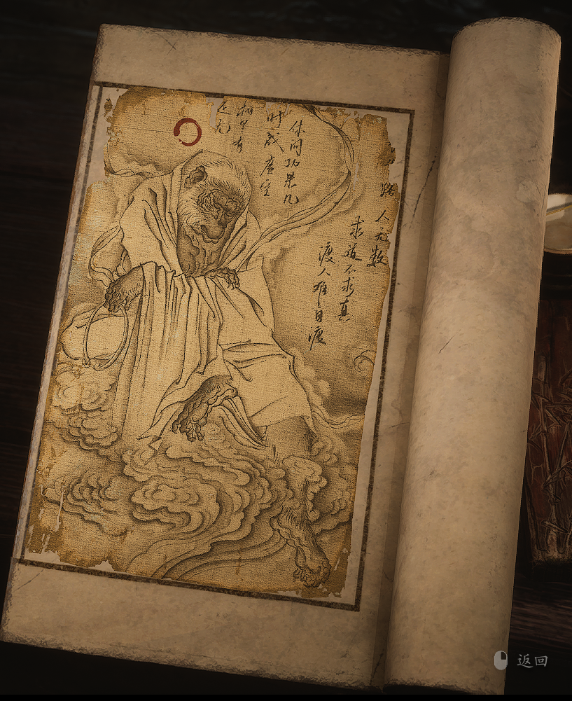

## 4.29 弥勒

> 棋盘为地子为天，色按阴阳造化全。
>
> 下到玄微通变处，笑夸当日烂柯仙。

弥勒在浮屠塔里，不知待了多久。

真君找上门的时候，墙上的画还没画好。

“我知真君一定会来。”弥勒笑道。

真君拱手：“尊者慧眼高明，昔日在花果山，想必已料到今日。还请尊者，解我心中苦闷。”

“解铃还须系铃人，你的疑惑既是由孙悟空而起，那也该由他来答。”

“他，死了。”真君似是不愿开口说出这个字。

“路我已为你打开，那里不会有人来打扰，可以慢慢想。”弥勒让开身子，对面墙壁霎时风雪飞出，连带塔里都冷了几分。

真君依言上前，停在那虚空外，回头又道：“今日踏入这画中梅山，天庭自寻我不着，可是尊者所为，灵山难道不知？”

弥勒笑道：“我们见过吗？我认得的二郎神，比你丑多了。”

真君听罢，不再多言，信步踏入那风雪之中。

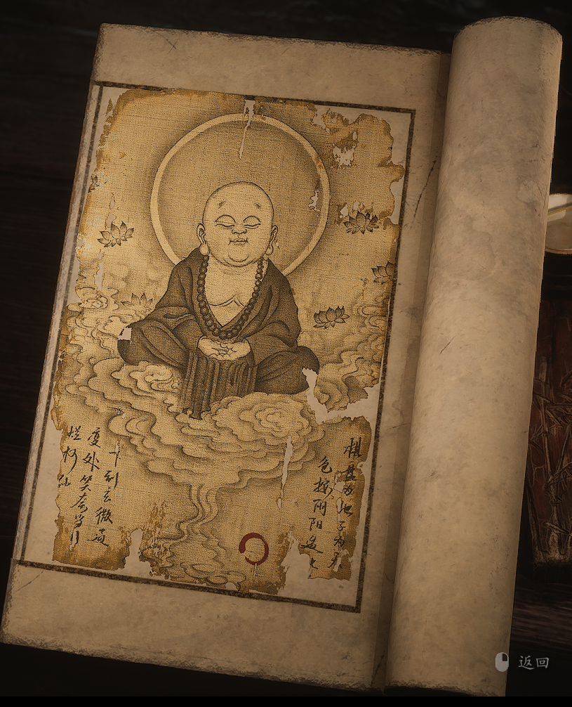

## 4.30 二郎显圣真君

> 诸天显圣称大才，身似梅花欺雪白。
>
> 心高不认天家眷，浩气冲霄浮屠开。

“都是些猴子，一件像样的玩意也无。”

天兵甲用枪挑翻一具尸身，向天兵乙抱怨，他们面前是刚刚结束战斗的花果山，处处是被削平缺角的岩石，被雷劈成焦黑的古树，以及满地的尸骸。

“好的都在水帘洞里，哪轮得到我俩打扫战场的。”天兵乙回道。

“也是。我们只能干些脏活，灭掉那些没断气的。”天兵甲语毕，一枪戳入一具尸体里，又抽了出来。

他们一板一眼地干着，直至走到一块巨石前。

天兵甲敲了敲石头，天兵乙道：“一块石头，你也想榨出油水来？”

天兵甲道：“你竟不知？这便是孙悟空的尸首。”

天兵乙道：“瞎扯！他不是没了？”

“先前他战死，六根被分了去，他生自一块石头，如今没了灵根，死后自然又变回石头了。”

“放屁。”

天兵甲骄傲道：“列阵时我站排头，看得清楚，他们分尸的时候，连真君也拿了一样。”

天兵乙奇道：“我记得你不站排头呀……真的假的？真君也拿了？我看那些下界的妖王都来了，还以为只有妖怪会拿妖怪的东西哩。”

“什么妖怪，他可是封过佛位的。”天兵甲纠正道。

“真君拿那个做什么？也不嫌晦气。”

“这谁知道。孙悟空也算天地生成的灵物，说不定吃了能大补。”两人说罢大笑起来。

“诶，你看这是个什么。”天兵乙发现石头旁摆着一抹素白。

二人拾起一看，原是枝梅花，如玉似雪，朵朵怒放。

天兵甲奇道：“花果山岂会有梅花？”

天兵乙道：“这看着，怎么有几分像……”

话未全完，就见那天兵乙贯胸穿出一枝枪头，金光一射，连盔甲中的魂也散了。

天兵甲大惊，还来不及多说，金光再次闪灼。

白云悠悠，花果山又归于了静默。

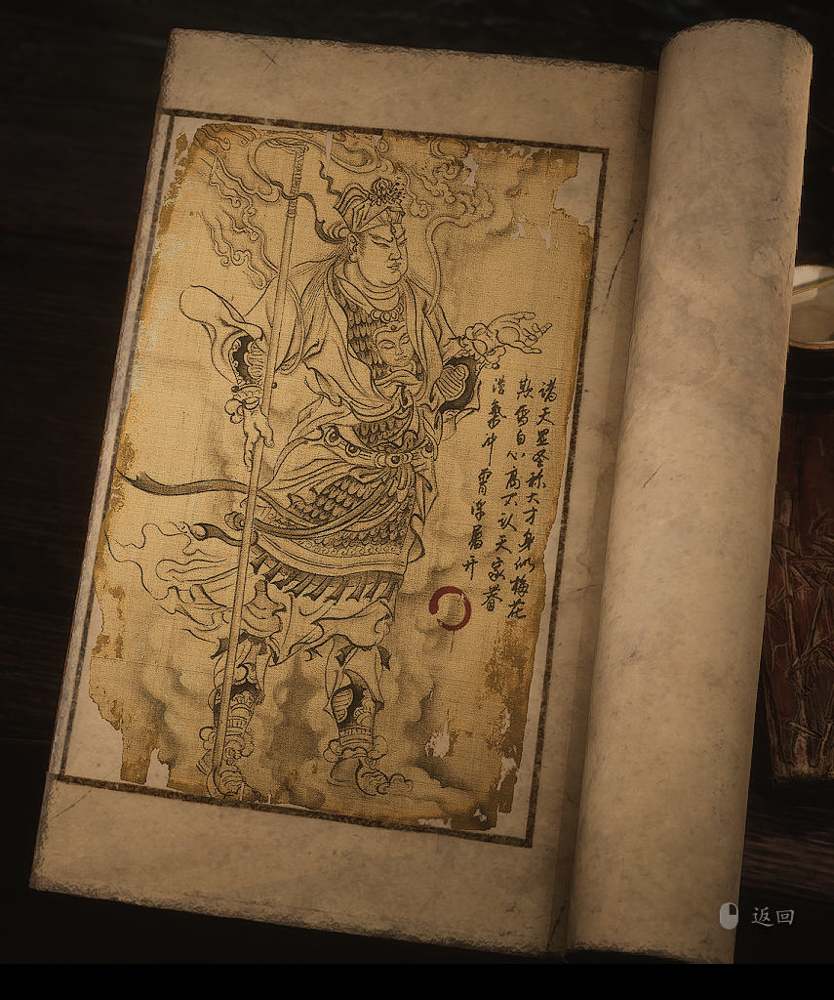

## 4.31 大圣残躯

> 三阳交泰产群生，仙石胞含日月精。
>
> 借卵化猴完大道，假他名姓配丹成。
>
> 内观不识因无相，外合明知作有形。
>
> 历代人人皆属此，称王称圣任纵横。

杯盘狼藉，酒过三巡。对坐的两人，都已大醉。

“八戒，这斗战胜佛我不做了。谁爱当，就给谁当去。”猴子血气上涌，不知是真醉还是假醉。

八戒直肠道：“哥呵，我们如今得了正果，无拘无束，大口喝酒，这般美事，应当高兴才对。”

悟空冷笑了几声，道：“是是是，用个佛位换个箍儿，想来还是赚的。”

“正是正是，头上的箍没了，再也不用怕师父念你，还不得多喝两杯？”八戒迷迷糊糊，却还不忘劝酒。

“八戒，你吃酒高兴，别人要吃你的时候，可还能这般高兴？”

“谁要吃我？我老猪的钉钯，头一个不答应。”八戒一拍桌子。

“难！难！难！”悟空挥挥手，一脸嫌弃：“他们若要吃你，骨头渣都不剩。”

“他们？他们又是哪路神仙？”

“我问你，我们当年一路西行，遇到多少妖？又杀了多少怪？”

“那可太多了！数都数不过来。你每次懒得动手，就支使我去清理这洞那洞的。”

“不算小妖，那些有道行的，我们杀了几个？”

“不记得……统统杀了吧。”

“不算木仙庵的树妖和那七只蜘蛛，我们杀的，不到打过的一半。”

“七……七只蜘蛛？哦，记得记得。”

“那一半，我们没动，你可知为何？”

“为何？”

“杀不得。”

“哼，那是以前，我们现在不也是上天了吗？想杀，现在便去杀！”

悟空叹了口气，道：“八戒，不若我们辞了果位，告老还乡罢。我回花果山，你回高老庄。”

八戒一愣，没想明白为何大师兄突然换了话头。

“要回你自己回，我可不回！回了高老庄还得自己种地收菜，现在啥都不用做，就有吃不完的供品。要多少花样，有多少花样。”

“这供品，本该给那种地收菜的人吃。我们吃了，他们就少吃一点。”

“你傻了吗？咱们上来不就为了这一天吗？难道要和以前一样，跟着师父去到处化缘？”

“算了算了，喝酒喝酒。”

……

八戒不记得，最后这场酒，大师兄是什么时候走的。

只记得他昏睡过去前，师兄说的最后一句话是——“长生不老，长不了。”

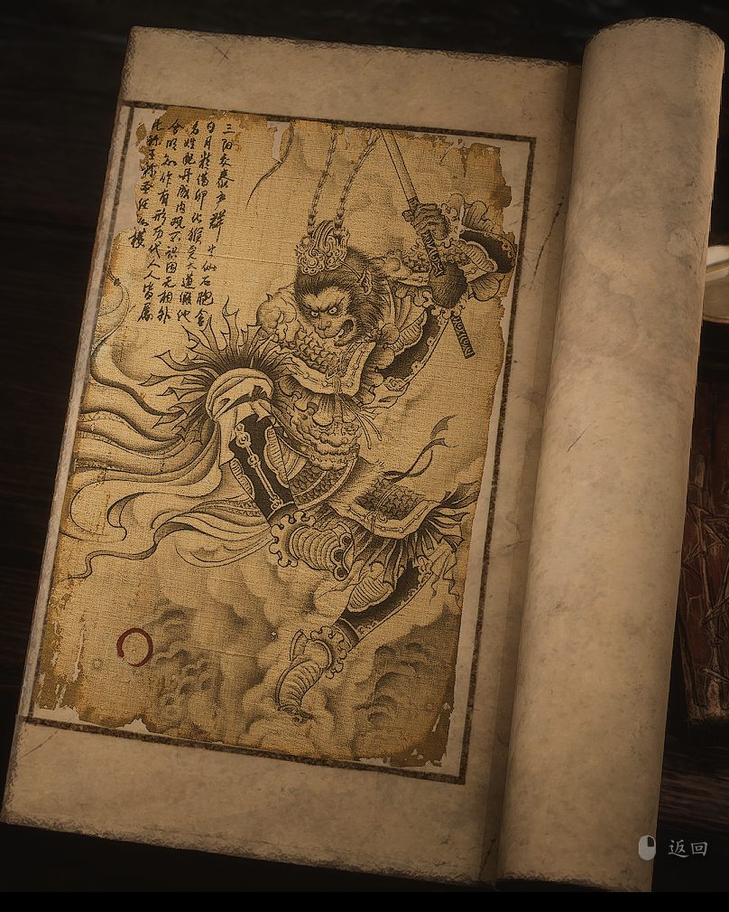

## 4.32 袁守诚

> 该人物没有诗，不过故事是用一段诗描述的

半世虚度半世忙，一朝彻悟一朝忘。

袖课岂知天下计，卦辞怎阻痴心郎。

风波重重世情险，红尘滚滚人欲狂。

聚散离合如朝露，恩怨情仇似电光。

千秋兴废无新意，百年成败有非常。

收因结果循天命，缘起缘落没斜阳。

造作恶语逆其耳，轻慢妄言挑其肠。

潦草拙笔污其眼，有心勾描剖其伤。

妖魔鬼怪皆是我，神仙菩萨一般样。

泪若涌泉莫相问，仰天大笑是荒唐。

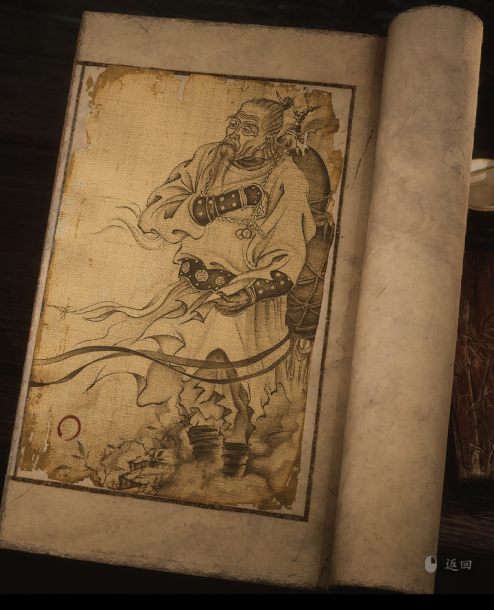

